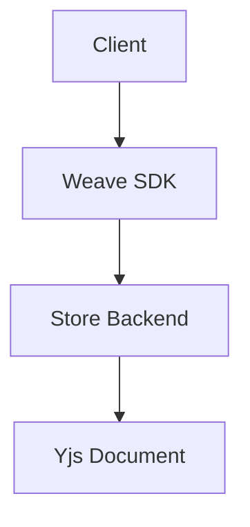

# AGENTS.md — Weave.js Wiki (VitePress)

> The `.github/illuminate/` directory contains the VitePress-powered wiki and documentation site for Weave.js.

---

## Dev Server

```bash
cd .github/illuminate
npm install             # Install VitePress and plugins
npm run dev             # Start local dev server with hot reload
npm run build           # Production build (outputs to .vitepress/dist/)
```

---

## File Structure

```
.github/illuminate/
├── .vitepress/
│   ├── config.mts          # VitePress + Mermaid plugin config
│   ├── theme/              # Custom theme overrides
│   └── public/             # Static assets
├── index.md                # Wiki home page
├── getting-started/        # Getting started guides
├── deep-dive/              # Deep-dive technical articles
└── onboarding/             # Onboarding guides (by audience)
```

---

## Frontmatter Requirements

Every markdown page should include YAML frontmatter:

```yaml
---
title: Page Title
description: Brief description for SEO and sidebar
---
```

The home page (`index.md`) uses VitePress `layout: home` with hero and features sections.

---

## Mermaid Diagrams

This wiki uses `vitepress-plugin-mermaid` for diagram rendering.

### Dark-Mode Conventions

- Use **dark-mode compatible** color schemes in all Mermaid diagrams.
- Avoid hardcoded light colors (`#fff`, `#ffffff`) — use theme variables or neutral tones.
- Wrap diagrams in standard fenced code blocks:

````markdown

````

- Keep diagrams simple and readable; split complex flows into multiple diagrams.
- Test diagrams locally with `npm run dev` before committing.

---

## Writing Guidelines

- Use clear, concise language suitable for developer documentation.
- Organize content hierarchically: folder per topic, `index.md` for section landing pages.
- Link between pages using relative paths (e.g., `../getting-started/installation.md`).
- Include code examples with syntax highlighting (use `ts`, `bash`, `json` language tags).
- Add source code citations where referencing framework internals.

---

## Boundaries

- Follow the root `AGENTS.md` for git workflow and conventional commits.
- Do not modify `.vitepress/config.mts` without reviewing the impact on navigation and plugins.
- Keep image assets in `.vitepress/public/` and reference with absolute paths (`/image.png`).
- All documentation files should be Markdown (`.md`) only.
