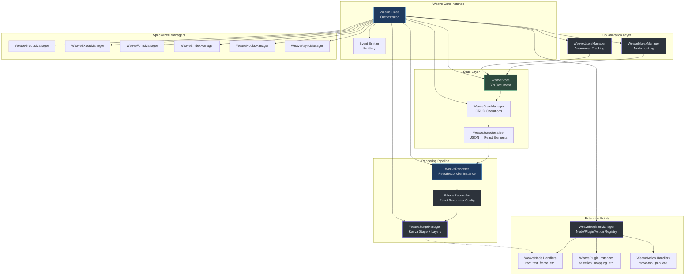
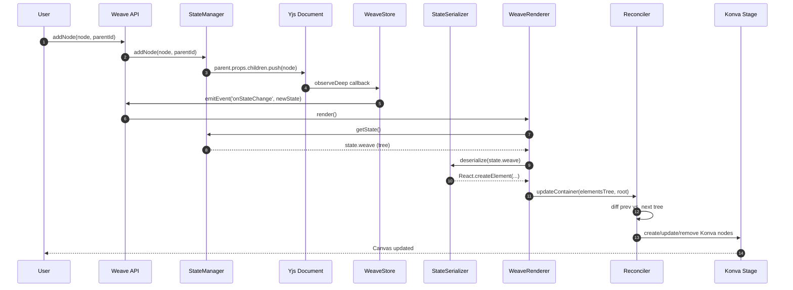
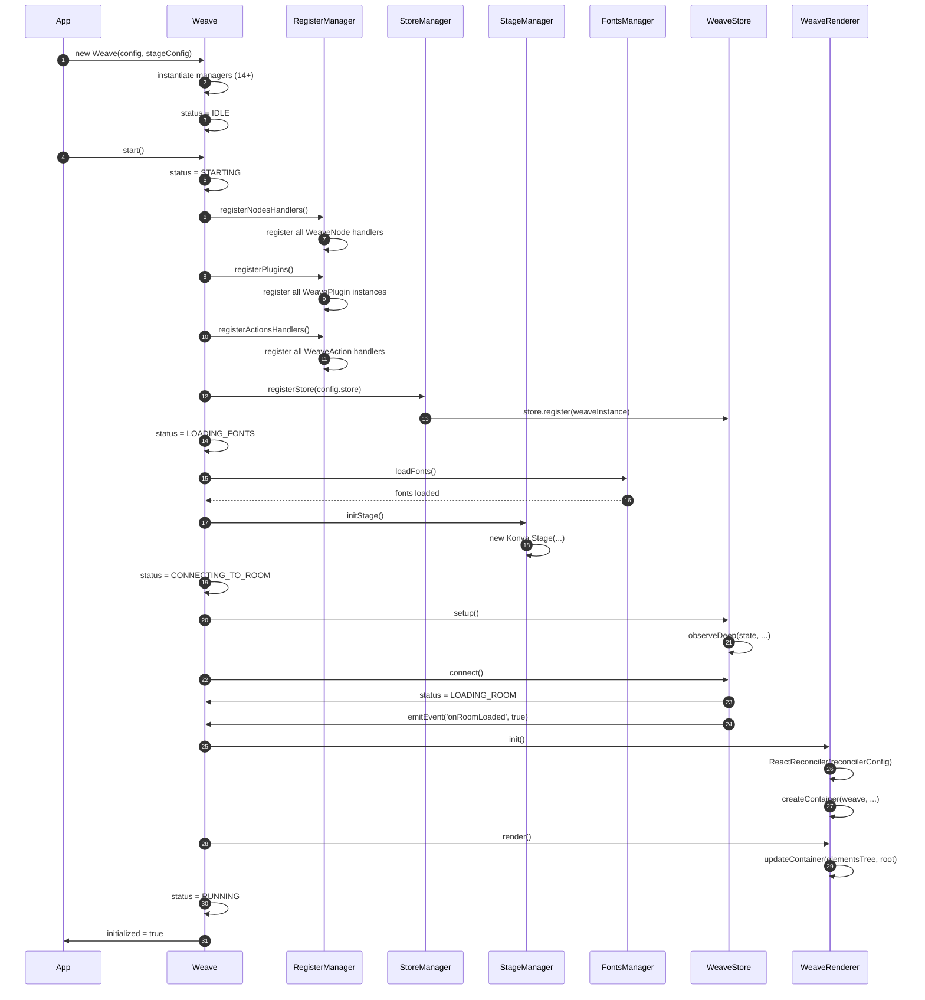
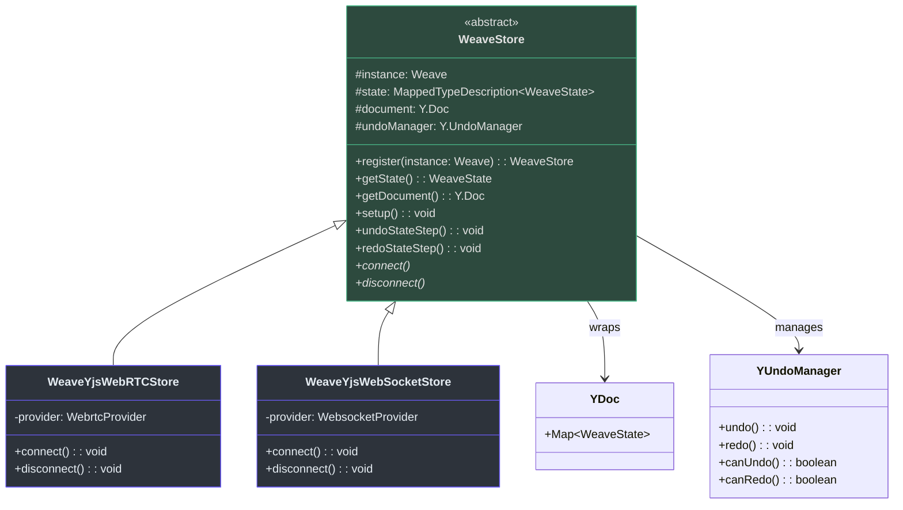
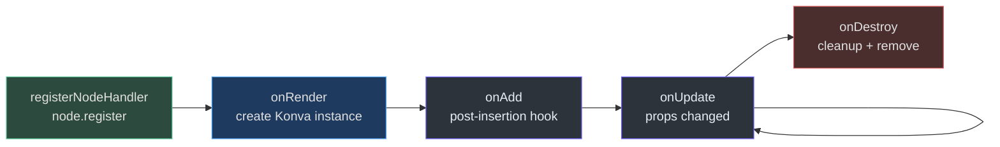
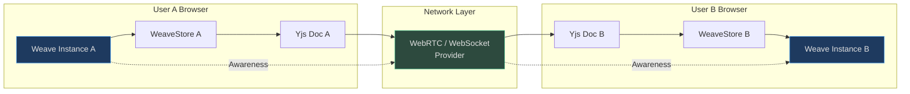

# System Architecture & Design

Weave.js is a collaborative canvas SDK built on a layered architecture that separates concerns: state management (Yjs), rendering (Konva), reconciliation (React-inspired), and extensibility (nodes/plugins/actions). The core orchestrates 14+ specialized managers that handle everything from stage lifecycle to multi-user mutex locks.

## Architecture Overview

The Weave SDK follows a **manager-driven architecture** where a central `Weave` class coordinates specialized managers, each responsible for a distinct domain. The system bridges three key technologies: [**Yjs**](https://docs.yjs.dev/) for CRDT-based state sync, [**Konva**](https://konvajs.org/) for canvas rendering, and [**React Reconciler**](https://github.com/facebook/react/tree/main/packages/react-reconciler) for declarative scene graph updates.

### Core Components At-a-Glance

| Component | Responsibility | Key File | Source |
|-----------|---------------|----------|--------|
| **Weave (Core)** | Orchestrates managers, lifecycle, events | `weave.ts` | [weave.ts:82](https://github.com/thegovind/weavejs/blob/main/code/packages/sdk/src/weave.ts#L82) |
| **WeaveStore** | Abstract Yjs document + undo/redo | `stores/store.ts` | [store.ts:36](https://github.com/thegovind/weavejs/blob/main/code/packages/sdk/src/stores/store.ts#L36) |
| **WeaveReconciler** | React-like diffing + Konva node lifecycle | `reconciler/reconciler.ts` | [reconciler.ts:16](https://github.com/thegovind/weavejs/blob/main/code/packages/sdk/src/reconciler/reconciler.ts#L16) |
| **WeaveRenderer** | Bridges state → React elements → Konva | `renderer/renderer.ts` | [renderer.ts:11](https://github.com/thegovind/weavejs/blob/main/code/packages/sdk/src/renderer/renderer.ts#L11) |
| **WeaveStateManager** | State tree CRUD (add/update/remove nodes) | `managers/state.ts` | [state.ts:18](https://github.com/thegovind/weavejs/blob/main/code/packages/sdk/src/managers/state.ts#L18) |
| **WeaveStageManager** | Konva Stage + layer management | `managers/stage.ts` | [stage.ts:18](https://github.com/thegovind/weavejs/blob/main/code/packages/sdk/src/managers/stage.ts#L18) |
| **WeaveRegisterManager** | Node/plugin/action registration | `managers/register.ts` | [register.ts:11](https://github.com/thegovind/weavejs/blob/main/code/packages/sdk/src/managers/register.ts#L11) |
| **WeaveMutexManager** | Collaborative locking (multi-user) | `managers/mutex/mutex.ts` | [mutex.ts:16](https://github.com/thegovind/weavejs/blob/main/code/packages/sdk/src/managers/mutex/mutex.ts#L16) |
| **WeaveUsersManager** | Awareness tracking (connected users) | `managers/users/users.ts` | [users.ts:14](https://github.com/thegovind/weavejs/blob/main/code/packages/sdk/src/managers/users/users.ts#L14) |
| **WeaveGroupsManager** | Node grouping/ungrouping logic | `managers/groups.ts` | [groups.ts:23](https://github.com/thegovind/weavejs/blob/main/code/packages/sdk/src/managers/groups.ts#L23) |
| **WeaveNode** | Node handler base (render/serialize) | `nodes/node.ts` | [node.ts:73](https://github.com/thegovind/weavejs/blob/main/code/packages/sdk/src/nodes/node.ts#L73) |
| **WeavePlugin** | Plugin base (init/enable/disable) | `plugins/plugin.ts` | [plugin.ts:9](https://github.com/thegovind/weavejs/blob/main/code/packages/sdk/src/plugins/plugin.ts#L9) |
| **WeaveAction** | Action handler base (trigger/lifecycle) | `actions/action.ts` | [action.ts:15](https://github.com/thegovind/weavejs/blob/main/code/packages/sdk/src/actions/action.ts#L15) |

## High-Level Component Diagram



<!-- Sources: code/packages/sdk/src/weave.ts:82-171, code/packages/sdk/src/stores/store.ts:36-60, code/packages/sdk/src/reconciler/reconciler.ts:16-23, code/packages/sdk/src/renderer/renderer.ts:11-36, code/packages/sdk/src/managers/state.ts:18-26, code/packages/sdk/src/managers/stage.ts:18-29, code/packages/sdk/src/managers/register.ts:11-22 -->

## Data Flow: State Changes → Rendering

Weave.js uses a **unidirectional data flow** inspired by React: state changes trigger serialization → reconciliation → Konva DOM updates. The Yjs document acts as the single source of truth, and the reconciler ensures minimal DOM operations.



<!-- Sources: code/packages/sdk/src/managers/state.ts:136-191, code/packages/sdk/src/stores/store.ts:185-224, code/packages/sdk/src/renderer/renderer.ts:59-75, code/packages/sdk/src/state-serializer/state-serializer.ts:29-80, code/packages/sdk/src/reconciler/reconciler.ts:25-84 -->

### Key Data Flow Principles

1. **State-First Updates**: All modifications go through `WeaveStateManager`, which mutates the Yjs document [state.ts:136-191](https://github.com/thegovind/weavejs/blob/main/code/packages/sdk/src/managers/state.ts#L136-L191)
2. **Reactive Observation**: `observeDeep` on the Yjs store triggers automatic re-renders [store.ts:185-224](https://github.com/thegovind/weavejs/blob/main/code/packages/sdk/src/stores/store.ts#L185-L224)
3. **Serialization Bridge**: `WeaveStateSerializer` converts Yjs state → React elements [state-serializer.ts:29-80](https://github.com/thegovind/weavejs/blob/main/code/packages/sdk/src/state-serializer/state-serializer.ts#L29-L80)
4. **Reconciliation**: React Reconciler diffs trees and calls Konva node lifecycle methods [reconciler.ts:25-84](https://github.com/thegovind/weavejs/blob/main/code/packages/sdk/src/reconciler/reconciler.ts#L25-L84)
5. **Minimal Updates**: Only changed nodes trigger `commitUpdate`, preventing unnecessary canvas redraws [reconciler.ts:328-342](https://github.com/thegovind/weavejs/blob/main/code/packages/sdk/src/reconciler/reconciler.ts#L328-L342)

## Initialization Sequence

The Weave instance follows a **phased initialization** with explicit status transitions. Each phase sets up a dependency layer before proceeding.



<!-- Sources: code/packages/sdk/src/weave.ts:112-171, code/packages/sdk/src/weave.ts:230-282, code/packages/sdk/src/managers/register.ts:48-109, code/packages/sdk/src/managers/stage.ts:95-120, code/packages/sdk/src/stores/store.ts:135-224, code/packages/sdk/src/renderer/renderer.ts:38-57 -->

### Status Transitions

| Status | Trigger | Key Operations |
|--------|---------|---------------|
| `IDLE` | Constructor | Managers instantiated, logger setup |
| `STARTING` | `start()` | Node/plugin/action registration begins |
| `LOADING_FONTS` | After registration | Font preloading (async) |
| `CONNECTING_TO_ROOM` | After stage init | Store `connect()` called |
| `LOADING_ROOM` | Store connected | Awaiting initial state sync |
| `RUNNING` | First render complete | SDK fully operational |

## Manager Pattern Deep-Dive

Weave.js decomposes complexity into **14 specialized managers**, each encapsulating a domain and exposing a narrow API. The `Weave` class acts as a thin orchestration layer.

### Manager Responsibilities

| Manager | Core Responsibility | Key Methods | Collaborates With |
|---------|---------------------|-------------|-------------------|
| **WeaveSetupManager** | Initialization logging, plugin/action setup | `welcomeLog`, `setupPlugins`, `setupActions` | RegisterManager |
| **WeaveRegisterManager** | Registry for nodes/plugins/actions | `registerPlugin`, `getPlugin<T>`, `registerNodeHandler` | All extension points |
| **WeaveStateManager** | State tree CRUD + traversal | `addNode`, `updateNode`, `removeNode`, `findNodeById` | WeaveStore |
| **WeaveStoreManager** | Store lifecycle management | `registerStore`, `getStore<T>` | WeaveStore |
| **WeaveStageManager** | Konva Stage + layer hierarchy | `initStage`, `getMainLayer`, `getSelectionLayer` | Konva |
| **WeaveGroupsManager** | Group/ungroup nodes + z-index handling | `group(nodes)`, `unGroup(group)` | StateManager, StageManager |
| **WeaveMutexManager** | Node locking for collaboration | `acquireMutexLock`, `releaseMutexLock` | UsersManager, Store |
| **WeaveUsersManager** | Awareness-based user tracking | `getUsers()`, handles `onAwarenessChange` | Store |
| **WeaveExportManager** | Export canvas to PNG/SVG/PDF | `exportNodes(options)` | StageManager |
| **WeaveFontsManager** | Font preloading + registration | `loadFonts()` | FontFace API |
| **WeaveZIndexManager** | Z-index reordering | `moveToFront`, `moveToBack` | StateManager |
| **WeaveHooksManager** | Lifecycle hooks (before/after actions) | `registerHook`, `runHooks` | All managers |
| **WeaveAsyncManager** | Async operation queue management | `enqueue`, `awaitAll` | All async ops |
| **WeaveActionsManager** | Active action lifecycle | `setActiveAction`, `triggerAction` | RegisterManager |

### Manager Instantiation

All managers are instantiated in the `Weave` constructor and share a reference to the parent instance [weave.ts:150-167](https://github.com/thegovind/weavejs/blob/main/code/packages/sdk/src/weave.ts#L150-L167):

```typescript
this.setupManager = new WeaveSetupManager(this);
this.registerManager = new WeaveRegisterManager(this);
this.stateManager = new WeaveStateManager(this);
this.storeManager = new WeaveStoreManager(this);
this.stageManager = new WeaveStageManager(this, stageConfig);
this.groupsManager = new WeaveGroupsManager(this);
this.targetingManager = new WeaveTargetingManager(this);
this.cloningManager = new WeaveCloningManager(this);
this.fontsManager = new WeaveFontsManager(this);
this.zIndexManager = new WeaveZIndexManager(this);
this.exportManager = new WeaveExportManager(this);
this.actionsManager = new WeaveActionsManager(this);
this.pluginsManager = new WeavePluginsManager(this);
this.usersManager = new WeaveUsersManager(this);
this.mutexManager = new WeaveMutexManager(this);
this.asyncManager = new WeaveAsyncManager(this);
this.hooksManager = new WeaveHooksManager(this);
```

Each manager follows the constructor pattern: `new Manager(weaveInstance)` and uses `this.instance.getChildLogger(name)` for scoped logging.

## Store Abstraction & Yjs Integration

The `WeaveStore` base class abstracts Yjs document management, undo/redo, and network synchronization. Concrete stores (e.g., `WeaveYjsWebRTCStore`, `WeaveYjsWebSocketStore`) implement transport-specific `connect()` and `disconnect()` methods.

### Store Architecture



<!-- Sources: code/packages/sdk/src/stores/store.ts:36-279 -->

### Store Lifecycle

1. **Instantiation**: User creates a concrete store (e.g., `new WeaveYjsWebRTCStore(...)`)
2. **Registration**: `Weave.start()` calls `storeManager.registerStore(store)` [weave.ts:258](https://github.com/thegovind/weavejs/blob/main/code/packages/sdk/src/weave.ts#L258)
3. **Setup**: `store.setup()` initializes Yjs `UndoManager` and `observeDeep` [store.ts:135-224](https://github.com/thegovind/weavejs/blob/main/code/packages/sdk/src/stores/store.ts#L135-L224)
4. **Connection**: `store.connect()` establishes network sync (WebRTC/WebSocket)
5. **State Sync**: Yjs `observeDeep` callback triggers `onStateChange` events [store.ts:185-224](https://github.com/thegovind/weavejs/blob/main/code/packages/sdk/src/stores/store.ts#L185-L224)

## React Reconciler Integration

Weave.js uses [React Reconciler](https://github.com/facebook/react/tree/main/packages/react-reconciler) to manage Konva's scene graph declaratively. The `WeaveReconciler` implements the host config interface, mapping React operations to Konva node lifecycle.

### Reconciler Host Config Highlights

| React Reconciler Hook | Weave Implementation | Source |
|----------------------|---------------------|--------|
| `createInstance` | Calls `nodeHandler.onRender(props)` → returns Konva node | [reconciler.ts:204-235](https://github.com/thegovind/weavejs/blob/main/code/packages/sdk/src/reconciler/reconciler.ts#L204-L235) |
| `appendInitialChild` | Adds child to parent via `parentInstance.add(child)` | [reconciler.ts:243-249](https://github.com/thegovind/weavejs/blob/main/code/packages/sdk/src/reconciler/reconciler.ts#L243-L249) |
| `commitUpdate` | Calls `nodeHandler.onUpdate(instance, nextProps)` | [reconciler.ts:328-342](https://github.com/thegovind/weavejs/blob/main/code/packages/sdk/src/reconciler/reconciler.ts#L328-L342) |
| `removeChild` | Calls `nodeHandler.onDestroy(child)` + removes from Konva | [reconciler.ts:347-360](https://github.com/thegovind/weavejs/blob/main/code/packages/sdk/src/reconciler/reconciler.ts#L347-L360) |

### Reconciler Configuration

The reconciler is instantiated in `WeaveRenderer.init()` [renderer.ts:38-57](https://github.com/thegovind/weavejs/blob/main/code/packages/sdk/src/renderer/renderer.ts#L38-L57):

```typescript
this.renderer = ReactReconciler(this.reconciler.getConfig());
this.root = this.renderer.createContainer(
  this.instance, // root container
  0,             // concurrent mode
  null,
  true,
  null,
  '',
  (error) => console.error(error),
  null
);
```

Each render call triggers `renderer.updateContainer(elementsTree, root)` [renderer.ts:74](https://github.com/thegovind/weavejs/blob/main/code/packages/sdk/src/renderer/renderer.ts#L74), which diffs the virtual tree and applies minimal changes to Konva.

## Extension Model: Nodes, Plugins, Actions

Weave.js provides **three extension points** for customization, all managed by `WeaveRegisterManager`:

### Extension Point Comparison

| Extension Type | Purpose | Lifecycle Hooks | Example |
|---------------|---------|-----------------|---------|
| **WeaveNode** | Define renderable Konva primitives | `onRender`, `onUpdate`, `onDestroy`, `serialize` | `RectNode`, `TextNode`, `ImageNode` |
| **WeavePlugin** | Add non-visual features | `onInit`, `onRender`, `enable`, `disable` | `NodesSelectionPlugin`, `StageGridPlugin` |
| **WeaveAction** | Handle stage interactions | `onInit`, `trigger`, `cleanup` | `MoveToolAction`, `PanAction` |

### WeaveNode Lifecycle



<!-- Sources: code/packages/sdk/src/nodes/node.ts:73-97, code/packages/sdk/src/managers/register.ts:76-86, code/packages/sdk/src/reconciler/reconciler.ts:204-235 -->

**Key Node Methods**:
- `onRender(props)`: Returns a new Konva instance (e.g., `new Konva.Rect(...)`) [node.ts:73+](https://github.com/thegovind/weavejs/blob/main/code/packages/sdk/src/nodes/node.ts#L73)
- `onUpdate(instance, props)`: Applies prop changes to existing Konva node
- `onAdd(instance)`: Called after node is added to stage (optional)
- `onDestroy(instance)`: Cleanup before removal
- `serialize(instance)`: Converts Konva node → `WeaveStateElement` (for state sync)

### WeavePlugin Lifecycle

Plugins extend SDK capabilities without altering the core. Examples: selection transformers, snapping guides, grid overlays.

**Registration Flow**:
1. User provides `plugins: [new NodesSelectionPlugin()]` in `WeaveConfig`
2. `registerManager.registerPlugins()` calls `plugin.register(weaveInstance)` [register.ts:59-62](https://github.com/thegovind/weavejs/blob/main/code/packages/sdk/src/managers/register.ts#L59-L62)
3. `setupManager.setupPlugins()` calls `plugin.onInit()` after first render [managers/setup.ts:61-67](https://github.com/thegovind/weavejs/blob/main/code/packages/sdk/src/managers/setup.ts#L61-L67)

**Key Plugin Methods** [plugin.ts:9-44](https://github.com/thegovind/weavejs/blob/main/code/packages/sdk/src/plugins/plugin.ts#L9-L44):
- `onInit()`: Setup after stage ready (e.g., create transformer layer)
- `onRender()`: Called on each render cycle (optional)
- `enable()` / `disable()`: Toggle plugin functionality

### WeaveAction Lifecycle

Actions handle stage interactions (pan, zoom, draw, move). Only one action can be active at a time.

**Activation Flow**:
1. User calls `weave.setActiveAction('move-tool', props)` [actionsManager]
2. Previous action's `cleanup()` is called
3. New action's `trigger(cancelAction, params)` is called [action.ts:105](https://github.com/thegovind/weavejs/blob/main/code/packages/sdk/src/actions/action.ts#L105)

**Key Action Methods** [action.ts:15-110](https://github.com/thegovind/weavejs/blob/main/code/packages/sdk/src/actions/action.ts#L15-L110):
- `trigger(cancelAction, params)`: Invoked when action becomes active
- `cleanup()`: Called when action is deactivated
- `onPropsChange()`: Reactive prop updates (via Proxy)

## Collaboration Features

Weave.js supports real-time collaboration via **Yjs Awareness** (user presence) and **mutex locks** (node ownership).

### Multi-User Architecture



<!-- Sources: code/packages/sdk/src/managers/users/users.ts:14-76, code/packages/sdk/src/managers/mutex/mutex.ts:16-297 -->

### WeaveUsersManager

Tracks connected users via Yjs Awareness API [users.ts:30-71](https://github.com/thegovind/weavejs/blob/main/code/packages/sdk/src/managers/users/users.ts#L30-L71):

1. Listens to `onAwarenessChange` events
2. Maintains a `Map<userId, WeaveUser>` of connected users
3. Emits `onUsersChange` when users join/leave

### WeaveMutexManager

Prevents concurrent edits to the same nodes via distributed locks [mutex.ts:106-116](https://github.com/thegovind/weavejs/blob/main/code/packages/sdk/src/managers/mutex/mutex.ts#L106-L116):

```typescript
await mutexManager.acquireMutexLock(
  { nodeIds: ['node-1', 'node-2'], operation: 'move' },
  async () => {
    // Only this user can edit these nodes during this callback
    await moveNodes([...]);
  }
);
// Lock automatically released after callback
```

**Lock Propagation**:
1. User A calls `setMutexLock({ nodeIds, operation })` [mutex.ts:166-251](https://github.com/thegovind/weavejs/blob/main/code/packages/sdk/src/managers/mutex/mutex.ts#L166-L251)
2. Lock state is broadcast via Awareness (`userMutexLock` field)
3. User B's `onAwarenessChange` listener sees the lock [mutex.ts:56-103](https://github.com/thegovind/weavejs/blob/main/code/packages/sdk/src/managers/mutex/mutex.ts#L56-L103)
4. User B's `setMutexLockRemote` marks nodes as locked locally [mutex.ts:147-164](https://github.com/thegovind/weavejs/blob/main/code/packages/sdk/src/managers/mutex/mutex.ts#L147-L164)

## Event System

The `Weave` class uses [Emittery](https://github.com/sindresorhus/emittery) for type-safe event emission. All managers and extensions can listen to lifecycle events.

### Core Events

| Event | Payload | Emitted By | Use Case |
|-------|---------|-----------|----------|
| `onStateChange` | `WeaveState` | WeaveStore | Trigger re-renders, sync UI |
| `onNodeAdded` | `WeaveStateElement` | StateManager | Update node lists, analytics |
| `onNodeUpdated` | `WeaveStateElement` | StateManager | React to prop changes |
| `onNodeRemoved` | `WeaveStateElement` | StateManager | Cleanup references |
| `onRoomLoaded` | `boolean` | WeaveStore | Show/hide loading UI |
| `onInstanceStatus` | `WeaveStatus` | Weave | Display connection state |
| `onUsersChange` | `void` | UsersManager | Update presence UI |
| `onMutexLockChange` | `{ locks: string[] }` | MutexManager | Show locked nodes |
| `onAwarenessChange` | `WeaveAwarenessChange[]` | WeaveStore | Custom awareness features |

**Usage Example**:
```typescript
weave.addEventListener<WeaveStateElement>('onNodeAdded', (node) => {
  console.log(`Node added: ${node.key}`);
});
```

## Rendering Pipeline Optimization

Weave.js minimizes canvas redraws via:
1. **React Reconciler diffing**: Only changed nodes are updated [reconciler.ts:86-108](https://github.com/thegovind/weavejs/blob/main/code/packages/sdk/src/reconciler/reconciler.ts#L86-L108)
2. **Yjs transaction batching**: Multiple state changes are grouped [state.ts:270-279](https://github.com/thegovind/weavejs/blob/main/code/packages/sdk/src/managers/state.ts#L270-L279)
3. **Konva layer caching**: Certain layers are cached for performance
4. **Upscaling support**: Optional lower-resolution rendering with CSS scaling [weave.ts:112-116](https://github.com/thegovind/weavejs/blob/main/code/packages/sdk/src/weave.ts#L112-L116)

## Cross-References

- [Getting Started Overview](../getting-started/overview.md) — Installation and first steps
- [SDK Core API](./sdk-core.md) — Weave class public API reference
- [Stores & Synchronization](./stores.md) — Store implementations and Yjs patterns
- [Nodes System](./nodes-system.md) — Creating custom node handlers
- [Plugins & Actions](./plugins-actions.md) — Extending SDK behavior

## Related Pages

| Page | Description |
|------|-------------|
| [SDK Core API](./sdk-core.md) | Public API of the `Weave` class |
| [Stores & Synchronization](./stores.md) | Yjs stores, providers, and CRDT patterns |
| [Nodes System](./nodes-system.md) | Node lifecycle, custom nodes, serialization |
| [Plugins & Actions](./plugins-actions.md) | Plugin development, action handlers |
| [State Management](./state-management.md) | State tree operations, transactions, undo/redo |
| [Reconciliation Deep-Dive](./reconciliation.md) | React Reconciler internals, diffing algorithm |
| [Collaboration Patterns](./collaboration.md) | Awareness, mutex locks, conflict resolution |
