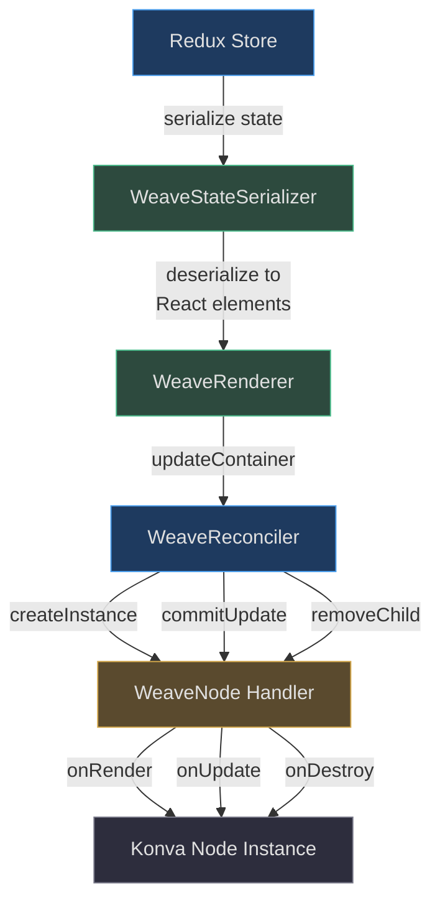
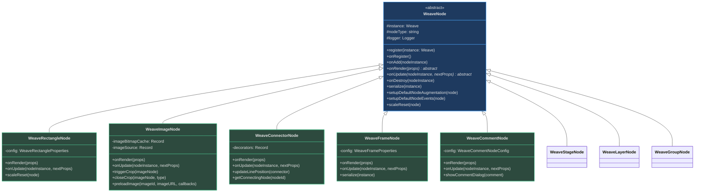
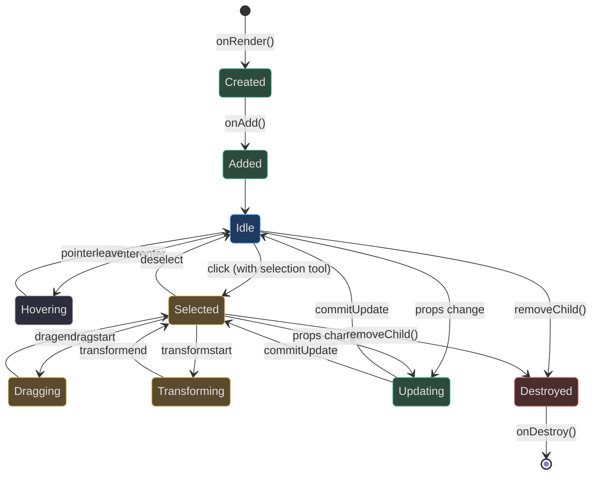

# Node Types & Rendering

The **Node System** is the foundation of Weave.js's canvas architecture. Every visual element on the canvas — from simple rectangles to complex image nodes — is represented by a **Node** that extends a common base class, integrates with Konva.js for rendering, and participates in React-based reconciliation for state updates.

This page explores:
- The WeaveNode base class and its lifecycle
- Built-in node types and their capabilities
- How nodes are rendered through the reconciler
- The integration between React, WeaveReconciler, and Konva

## Architecture Overview

The node system bridges React's declarative component model with Konva's imperative canvas API through a custom reconciler. State changes flow from Redux → React → WeaveReconciler → Konva nodes.



<!-- Sources: code/packages/sdk/src/renderer/renderer.ts:38-74, code/packages/sdk/src/reconciler/reconciler.ts:204-235, code/packages/sdk/src/nodes/node.ts:73-925 -->

The renderer initializes the React reconciler with a custom configuration ([renderer.ts:38-56](https://github.com/thegovind/weavejs/blob/main/code/packages/sdk/src/renderer/renderer.ts#L38-L56)), deserializes state into React elements, and triggers updates. The reconciler then calls lifecycle methods on node handlers to create, update, or destroy Konva instances.

## WeaveNode Base Class

All node types extend the abstract `WeaveNode` class, which provides shared functionality for event handling, selection, transformations, drag-and-drop, container targeting, and lifecycle management.

### Class Hierarchy



<!-- Sources: code/packages/sdk/src/nodes/node.ts:73-950, code/packages/sdk/src/nodes/rectangle/rectangle.ts:18-81, code/packages/sdk/src/nodes/image/image.ts:29-826, code/packages/sdk/src/nodes/connector/connector.ts:50-100, code/packages/sdk/src/nodes/frame/frame.ts:27-80, code/packages/sdk/src/nodes/comment/comment.ts:33-80 -->

The base class defines abstract methods `onRender` and `onUpdate` that all concrete node types must implement ([node.ts:916-921](https://github.com/thegovind/weavejs/blob/main/code/packages/sdk/src/nodes/node.ts#L916-L921)).

### Lifecycle Methods

Every node handler follows a consistent lifecycle managed by the WeaveReconciler:

| Lifecycle Method | When Called | Purpose | Required |
|---|---|---|---|
| `register(instance)` | During Weave initialization | Stores Weave instance, initializes logger | Yes (base) |
| `onRegister()` | After registration | Custom initialization logic | Optional |
| `onRender(props)` | When creating new node instance | Creates Konva node, sets up event handlers | Yes (abstract) |
| `onAdd(nodeInstance)` | After node added to parent | Post-addition operations | Optional |
| `onUpdate(nodeInstance, nextProps)` | When props change | Updates Konva node attributes | Yes (abstract) |
| `onDestroy(nodeInstance)` | When node removed from canvas | Cleanup and destroy Konva instance | Optional |
| `serialize(instance)` | When persisting state | Converts Konva instance to WeaveStateElement | Optional |

<!-- Sources: code/packages/sdk/src/nodes/node.ts:80-89, code/packages/sdk/src/nodes/node.ts:911-925, code/packages/sdk/src/reconciler/reconciler.ts:204-235, code/packages/sdk/src/reconciler/reconciler.ts:86-108 -->

The lifecycle begins when `WeaveReconciler.createInstance()` calls `handler.onRender()` to produce a Konva node ([reconciler.ts:204-235](https://github.com/thegovind/weavejs/blob/main/code/packages/sdk/src/reconciler/reconciler.ts#L204-L235)). Updates flow through `commitUpdate()`, which calls `handler.onUpdate()` ([reconciler.ts:328-343](https://github.com/thegovind/weavejs/blob/main/code/packages/sdk/src/reconciler/reconciler.ts#L328-L343)). Removal triggers `handler.onDestroy()` ([reconciler.ts:347-360](https://github.com/thegovind/weavejs/blob/main/code/packages/sdk/src/reconciler/reconciler.ts#L347-L360)).

## Built-In Node Types

Weave.js provides 16+ built-in node types covering shapes, media, containers, and annotations. Each node type handles specific rendering logic and interactions.

### Node Type Catalog

| Node Type | Description | Key Props | Konva Class | Source |
|---|---|---|---|---|
| **stage** | Root canvas container | `width`, `height`, `container` | `Konva.Stage` | [stage/stage.ts:16-100](https://github.com/thegovind/weavejs/blob/main/code/packages/sdk/src/nodes/stage/stage.ts#L16-L100) |
| **layer** | Organizational layer | Standard transform props | `Konva.Layer` | [layer/layer.ts:14-71](https://github.com/thegovind/weavejs/blob/main/code/packages/sdk/src/nodes/layer/layer.ts#L14-L71) |
| **group** | Container for nodes | `containerId`, children | `Konva.Group` | [group/group.ts](https://github.com/thegovind/weavejs/blob/main/code/packages/sdk/src/nodes/group/group.ts) |
| **rectangle** | Rectangular shape | `width`, `height`, `fill`, `stroke` | `Konva.Rect` | [rectangle/rectangle.ts:18-81](https://github.com/thegovind/weavejs/blob/main/code/packages/sdk/src/nodes/rectangle/rectangle.ts#L18-L81) |
| **ellipse** | Elliptical shape | `radiusX`, `radiusY`, `keepAspectRatio` | `Konva.Ellipse` | [ellipse/ellipse.ts:16-122](https://github.com/thegovind/weavejs/blob/main/code/packages/sdk/src/nodes/ellipse/ellipse.ts#L16-L122) |
| **star** | Star polygon | `numPoints`, `innerRadius`, `outerRadius` | `Konva.Star` | [star/star.ts](https://github.com/thegovind/weavejs/blob/main/code/packages/sdk/src/nodes/star/star.ts) |
| **regular-polygon** | N-sided polygon | `sides`, `radius` | `Konva.RegularPolygon` | [regular-polygon/regular-polygon.ts](https://github.com/thegovind/weavejs/blob/main/code/packages/sdk/src/nodes/regular-polygon/regular-polygon.ts) |
| **line** | Straight line | `points` array | `Konva.Line` | [line/line.ts](https://github.com/thegovind/weavejs/blob/main/code/packages/sdk/src/nodes/line/line.ts) |
| **arrow** | Arrow shape | `points`, `pointerLength`, `pointerWidth` | `Konva.Arrow` | [arrow/arrow.ts](https://github.com/thegovind/weavejs/blob/main/code/packages/sdk/src/nodes/arrow/arrow.ts) |
| **stroke** | Freehand drawing | `points` array, tension | `Konva.Line` | [stroke/stroke.ts](https://github.com/thegovind/weavejs/blob/main/code/packages/sdk/src/nodes/stroke/stroke.ts) |
| **image** | Raster image | `imageURL`, `cropInfo`, caching | `Konva.Group` | [image/image.ts:29-826](https://github.com/thegovind/weavejs/blob/main/code/packages/sdk/src/nodes/image/image.ts#L29-L826) |
| **video** | Video element | `videoURL`, playback controls | `Konva.Group` | [video/video.ts](https://github.com/thegovind/weavejs/blob/main/code/packages/sdk/src/nodes/video/video.ts) |
| **comment** | Annotation/comment | `content`, `userId`, `timestamp` | `Konva.Group` | [comment/comment.ts:33-80](https://github.com/thegovind/weavejs/blob/main/code/packages/sdk/src/nodes/comment/comment.ts#L33-L80) |
| **frame** | Container frame | `title`, `frameWidth`, `frameHeight` | `Konva.Group` | [frame/frame.ts:27-80](https://github.com/thegovind/weavejs/blob/main/code/packages/sdk/src/nodes/frame/frame.ts#L27-L80) |
| **connector** | Node-to-node line | `startNodeId`, `endNodeId`, decorators | `Konva.Group` | [connector/connector.ts:50-100](https://github.com/thegovind/weavejs/blob/main/code/packages/sdk/src/nodes/connector/connector.ts#L50-L100) |
| **measure** | Measurement tool | Dimension display | `Konva.Group` | [measure/measure.ts](https://github.com/thegovind/weavejs/blob/main/code/packages/sdk/src/nodes/measure/measure.ts) |

### Common Features

All shape nodes (rectangle, ellipse, star, etc.) share common capabilities implemented in `WeaveNode`:

- **Transform support**: Drag, scale, rotate via Konva.Transformer ([node.ts:339-446](https://github.com/thegovind/weavejs/blob/main/code/packages/sdk/src/nodes/node.ts#L339-L446))
- **Selection integration**: Automatic hover states, selection feedback, multi-selection ([node.ts:248-307](https://github.com/thegovind/weavejs/blob/main/code/packages/sdk/src/nodes/node.ts#L248-L307))
- **Container targeting**: Drag-and-drop into frames with visual feedback ([node.ts:574-628](https://github.com/thegovind/weavejs/blob/main/code/packages/sdk/src/nodes/node.ts#L574-L628))
- **Mutex locking**: Multi-user collaboration locks ([node.ts:229-245](https://github.com/thegovind/weavejs/blob/main/code/packages/sdk/src/nodes/node.ts#L229-L245))
- **Clone-on-Alt-drag**: Hold Alt to duplicate nodes ([node.ts:529-564](https://github.com/thegovind/weavejs/blob/main/code/packages/sdk/src/nodes/node.ts#L529-L564))

These are set up via `setupDefaultNodeAugmentation()` and `setupDefaultNodeEvents()` ([node.ts:121-246](https://github.com/thegovind/weavejs/blob/main/code/packages/sdk/src/nodes/node.ts#L121-L246), [node.ts:309-804](https://github.com/thegovind/weavejs/blob/main/code/packages/sdk/src/nodes/node.ts#L309-L804)).

## Node Rendering Pipeline

The rendering pipeline orchestrates how state changes propagate to the canvas. It's a React-reconciler-based flow that converts Redux state into Konva node updates.

### Rendering Sequence

```mermaid
sequenceDiagram
    autonumber
    participant Store as Redux Store
    participant Renderer as WeaveRenderer
    participant Serializer as StateSerializer
    participant Reconciler as ReactReconciler
    participant Config as WeaveReconciler
    participant Handler as WeaveNode
    participant Konva as Konva Node
    
    Store->>Renderer: state change trigger
    Renderer->>Renderer: getState()
    Renderer->>Serializer: deserialize(state.weave)
    Serializer-->>Renderer: React element tree
    Renderer->>Reconciler: updateContainer(elementsTree)
    
    alt New Node
        Reconciler->>Config: createInstance(type, props)
        Config->>Handler: getNodeHandler(type)
        Config->>Handler: onRender(props)
        Handler->>Konva: new Konva.Rect(props)
        Handler->>Konva: setupDefaultNodeAugmentation()
        Handler->>Konva: setupDefaultNodeEvents()
        Handler-->>Config: Konva node instance
        Config->>Config: appendInitialChild()
        Config->>Handler: onAdd(nodeInstance)
    end
    
    alt Update Node
        Reconciler->>Config: prepareUpdate(instance, oldProps, newProps)
        Reconciler->>Config: commitUpdate(instance, type, oldProps, newProps)
        Config->>Handler: onUpdate(instance, newProps)
        Handler->>Konva: setAttrs(newProps)
    end
    
    alt Remove Node
        Reconciler->>Config: removeChild(parent, child)
        Config->>Handler: onDestroy(nodeInstance)
        Handler->>Konva: destroy()
    end
    
    Konva-->>Konva: render to canvas
    
    style Store fill:#1e3a5f,stroke:#4a9eed,color:#e0e0e0
    style Renderer fill:#2d4a3e,stroke:#4aba8a,color:#e0e0e0
    style Serializer fill:#2d2d3d,stroke:#7a7a8a,color:#e0e0e0
    style Reconciler fill:#5a4a2e,stroke:#d4a84b,color:#e0e0e0
    style Config fill:#1e3a5f,stroke:#4a9eed,color:#e0e0e0
    style Handler fill:#2d4a3e,stroke:#4aba8a,color:#e0e0e0
    style Konva fill:#2d2d3d,stroke:#7a7a8a,color:#e0e0e0
```

<!-- Sources: code/packages/sdk/src/renderer/renderer.ts:59-75, code/packages/sdk/src/reconciler/reconciler.ts:204-235, code/packages/sdk/src/reconciler/reconciler.ts:244-292, code/packages/sdk/src/reconciler/reconciler.ts:328-360 -->

The flow begins when `WeaveRenderer.render()` deserializes state and calls `updateContainer()` on the React reconciler ([renderer.ts:59-75](https://github.com/thegovind/weavejs/blob/main/code/packages/sdk/src/renderer/renderer.ts#L59-L75)). The reconciler then invokes WeaveReconciler methods like `createInstance()`, `commitUpdate()`, or `removeChild()`, which delegate to the appropriate node handler's lifecycle methods.

### Reconciler Integration

The `WeaveReconciler` class provides the configuration object required by React's `ReactReconciler` ([reconciler.ts:114-362](https://github.com/thegovind/weavejs/blob/main/code/packages/sdk/src/reconciler/reconciler.ts#L114-L362)). Key methods:

| Reconciler Method | Purpose | Delegates To |
|---|---|---|
| `createInstance` | Create new Konva node | `handler.onRender(props)` |
| `appendInitialChild` | Add child to parent | `addNode(parentInstance, child)` |
| `appendChild` | Add child during update | `addNode(parentInstance, child)` |
| `commitUpdate` | Update existing node | `handler.onUpdate(instance, nextProps)` |
| `removeChild` | Remove node from tree | `handler.onDestroy(nodeInstance)` |
| `prepareUpdate` | Check if update needed | Returns diff object |

<!-- Sources: code/packages/sdk/src/reconciler/reconciler.ts:204-235, code/packages/sdk/src/reconciler/reconciler.ts:244-292, code/packages/sdk/src/reconciler/reconciler.ts:328-343, code/packages/sdk/src/reconciler/reconciler.ts:347-360 -->

The reconciler uses `getNodeHandler<WeaveNode>(type)` to retrieve the correct handler for each node type ([reconciler.ts:214](https://github.com/thegovind/weavejs/blob/main/code/packages/sdk/src/reconciler/reconciler.ts#L214)). This allows type-specific rendering logic while maintaining a uniform API.

## Creating Custom Node Types

You can extend Weave.js by creating custom node types that integrate seamlessly with the existing system.

### Step-by-Step Guide

1. **Extend WeaveNode**:

```typescript
// code/packages/sdk/src/nodes/custom/custom-node.ts
import Konva from 'konva';
import { WeaveNode } from '../node';
import type { WeaveElementAttributes, WeaveElementInstance } from '@inditextech/weave-types';

export class CustomNode extends WeaveNode {
  protected nodeType = 'customNode';

  onRender(props: WeaveElementAttributes): WeaveElementInstance {
    const shape = new Konva.Rect({
      ...props,
      name: 'node',
      strokeScaleEnabled: true,
    });

    this.setupDefaultNodeAugmentation(shape);
    this.setupDefaultNodeEvents(shape);

    return shape;
  }

  onUpdate(nodeInstance: WeaveElementInstance, nextProps: WeaveElementAttributes): void {
    nodeInstance.setAttrs(nextProps);
  }
}
```

<!-- Source: code/packages/sdk/src/nodes/rectangle/rectangle.ts:18-81 -->

2. **Register the Handler**:

```typescript
import { CustomNode } from './nodes/custom/custom-node';

const weave = new Weave(config);
weave.registerNode(new CustomNode());
```

3. **Use in State**:

```typescript
{
  key: 'my-custom-node-1',
  type: 'customNode',
  props: {
    id: 'my-custom-node-1',
    nodeType: 'customNode',
    x: 100,
    y: 100,
    width: 200,
    height: 100,
    fill: '#ff6b6b',
  }
}
```

### Advanced Patterns

**Async Loading** (like WeaveImageNode):

```typescript
class AsyncNode extends WeaveNode {
  protected nodeType = 'asyncNode';

  loadAsyncElement(nodeId: string) {
    this.instance.loadAsyncElement(nodeId, this.nodeType);
  }

  resolveAsyncElement(nodeId: string) {
    this.instance.resolveAsyncElement(nodeId, this.nodeType);
  }

  getIsAsync(): boolean {
    return true;
  }

  onRender(props: WeaveElementAttributes): WeaveElementInstance {
    // Create placeholder
    const group = new Konva.Group({ ...props });
    
    // Trigger async load
    this.loadAsyncElement(props.id);
    
    // Load data and resolve
    fetchData().then(() => {
      // Update group
      this.resolveAsyncElement(props.id);
    });

    return group;
  }
}
```

<!-- Source: code/packages/sdk/src/nodes/image/image.ts:162-168, code/packages/sdk/src/nodes/image/image.ts:823-825 -->

**Composite Nodes** (like WeaveFrameNode):

```typescript
class CompositeNode extends WeaveNode {
  onRender(props: WeaveElementAttributes): WeaveElementInstance {
    const container = new Konva.Group({ ...props });

    // Add child shapes
    const background = new Konva.Rect({
      x: 0, y: 0,
      width: props.width,
      height: props.height,
      fill: '#f0f0f0',
    });

    const border = new Konva.Rect({
      x: 0, y: 0,
      width: props.width,
      height: props.height,
      stroke: '#333',
      strokeWidth: 2,
    });

    container.add(background);
    container.add(border);

    this.setupDefaultNodeAugmentation(container);
    this.setupDefaultNodeEvents(container);

    return container;
  }
}
```

<!-- Source: code/packages/sdk/src/nodes/frame/frame.ts:60-80 -->

## Node State Machine

Nodes transition through multiple states during their lifetime, coordinated by the reconciler and event system.



<!-- Sources: code/packages/sdk/src/nodes/node.ts:339-446, code/packages/sdk/src/nodes/node.ts:472-804, code/packages/sdk/src/reconciler/reconciler.ts:328-360 -->

State transitions are triggered by:
- **Lifecycle events**: `onRender`, `onAdd`, `onUpdate`, `onDestroy` from reconciler
- **User interactions**: `pointerenter`, `pointerleave`, `mousedown`, `dragstart`, `transformstart`
- **Selection changes**: Selection plugin manages selected/idle transitions

## Performance Considerations

### Node Caching

Some nodes (e.g., WeaveImageNode) support caching to improve rendering performance:

```typescript
if (this.config.performance.cache.enabled) {
  image.on('transformend', () => {
    this.cacheNode(image);
  });
}

cacheNode(nodeInstance: WeaveElementInstance): void {
  nodeInstance.clearCache();
  nodeInstance.cache({
    pixelRatio: this.config.performance.cache.pixelRatio,
  });
}
```

<!-- Source: code/packages/sdk/src/nodes/image/image.ts:344-384 -->

Caching converts node content to a bitmap, reducing redraws. It's applied after transforms complete.

### Scale Reset Pattern

To maintain precision during transformations, nodes reset their scale after transforms by baking the scale into width/height:

```typescript
scaleReset(node: Konva.Node): void {
  const scale = node.scale();

  node.width(Math.max(5, node.width() * scale.x));
  node.height(Math.max(5, node.height() * scale.y));

  // reset scale to 1
  node.scale({ x: 1, y: 1 });
}
```

<!-- Source: code/packages/sdk/src/nodes/node.ts:264-272 -->

This is called in `transformend` handlers ([node.ts:429](https://github.com/thegovind/weavejs/blob/main/code/packages/sdk/src/nodes/node.ts#L429)) to prevent floating-point accumulation errors.

### Throttled Updates

High-frequency events like `dragmove` and `transform` are throttled to reduce reconciler load:

```typescript
node.on('transform', throttle(handleTransform, DEFAULT_THROTTLE_MS));
node.on('dragmove', throttle(handleDragMove, DEFAULT_THROTTLE_MS));
```

<!-- Source: code/packages/sdk/src/nodes/node.ts:396, code/packages/sdk/src/nodes/node.ts:631 -->

This prevents excessive state updates during continuous interactions.

## Node Event System

Nodes participate in a custom event system layered on top of Konva's built-in events.

### Custom Events

Weave.js defines custom events for node lifecycle:

| Event | When Fired | Payload |
|---|---|---|
| `onNodeRenderedAdded` | After node added to stage | `WeaveElementInstance` |
| `onNodeRenderedUpdated` | After node updated | `WeaveElementInstance` |
| `onNodeRenderedRemoved` | Before node removed | `WeaveElementInstance` |
| `onTransform` | During/after transform | `Konva.Node \| null` |
| `onDrag` | During drag | `Konva.Node` |
| `onNodesChange` | Selection changes | Selection data |

<!-- Sources: code/packages/sdk/src/reconciler/reconciler.ts:82-84, code/packages/sdk/src/reconciler/reconciler.ts:106-107, code/packages/sdk/src/reconciler/reconciler.ts:111-112, code/packages/sdk/src/nodes/node.ts:349, code/packages/sdk/src/nodes/node.ts:498 -->

These events are emitted via `this.instance.emitEvent(eventName, payload)` and consumed by plugins and external integrations.

### Konva Event Delegation

The base class sets up standard Konva events:

- **Transform events**: `transformstart`, `transform`, `transformend` ([node.ts:339-446](https://github.com/thegovind/weavejs/blob/main/code/packages/sdk/src/nodes/node.ts#L339-L446))
- **Drag events**: `dragstart`, `dragmove`, `dragend` ([node.ts:472-804](https://github.com/thegovind/weavejs/blob/main/code/packages/sdk/src/nodes/node.ts#L472-L804))
- **Pointer events**: `pointerenter`, `pointerleave` ([node.ts:774-804](https://github.com/thegovind/weavejs/blob/main/code/packages/sdk/src/nodes/node.ts#L774-L804))

Each handler checks current tool state (selection, move, etc.) and delegates to appropriate logic.

## Related Pages

| Page | Description |
|---|---|
| [Architecture Overview](./architecture.md) | High-level system design and component interactions |
| [SDK Core](./sdk-core.md) | Weave class, initialization, and core APIs |
| [Plugins & Actions](./plugins-actions.md) | Plugin system, action handlers, and extensibility |
| [State Management](./state-management.md) | Redux architecture, serialization, and time travel |
| [Rendering Pipeline](./rendering-pipeline.md) | React reconciler, Konva integration, and performance |
