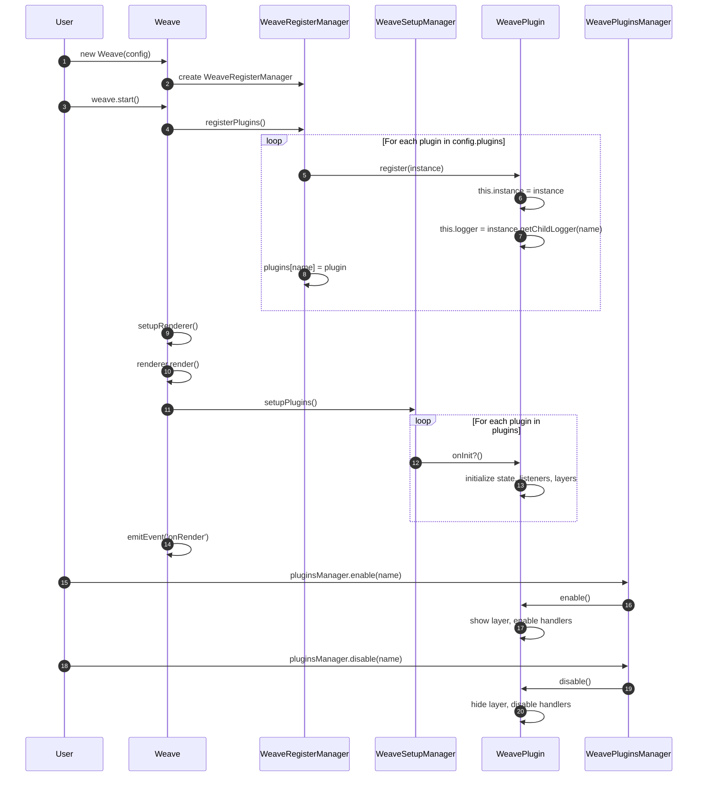
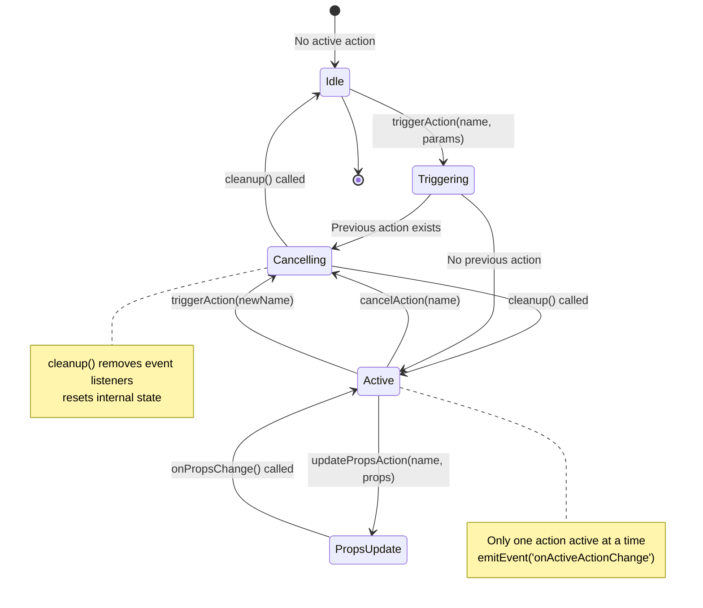
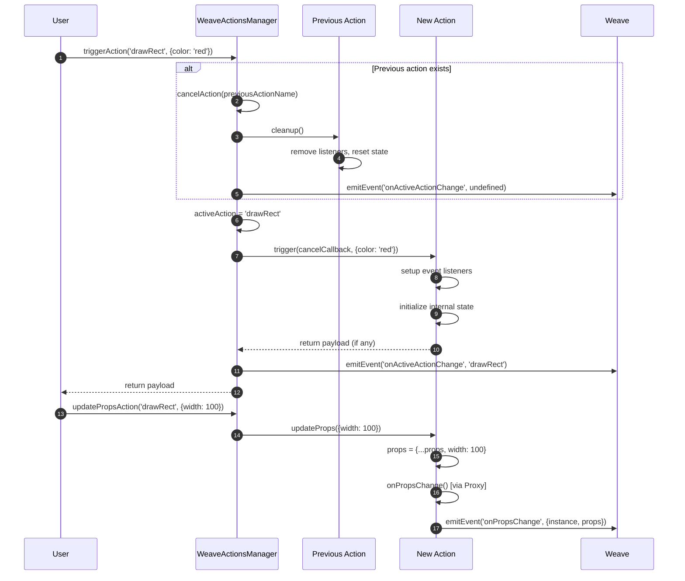
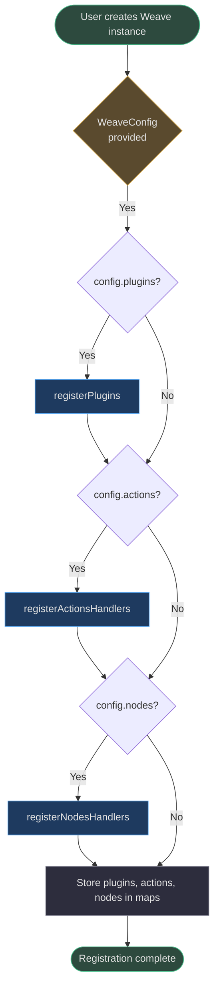

# Plugin & Action System

Weave.js provides a powerful extensibility system through **plugins** and **actions** — two complementary mechanisms for customizing behavior, enhancing functionality, and responding to user interactions. This document explains the architecture, lifecycle, registration process, and how to create custom plugins and actions.

## Overview

The plugin and action system enables developers to:

- **Extend core functionality** without modifying the SDK source code
- **Respond to canvas events** like selection, drag, and pointer interactions
- **Add custom UI behaviors** such as snapping, multi-selection feedback, and context menus
- **Manage application state** through action handlers with props and cleanup logic

| Extensibility Type | Purpose | Lifecycle Hooks | Example Use Cases |
|---|---|---|---|
| **Plugin** | Passive enhancements and UI features | `onInit()`, `onRender()`, `enable()`, `disable()` | Node selection, grid overlay, edge snapping, context menus |
| **Action** | Active user interactions with state | `onInit()`, `trigger()`, `onPropsChange()`, `cleanup()` | Draw tool, pan tool, selection tool, custom input handlers |

<!-- Source: code/packages/types/src/base/plugin.ts:5-15, code/packages/types/src/base/action.ts:5-13 -->

## Architecture

The plugin and action system is built on three layers:

1. **Base Classes** — Abstract classes defining the contract ([WeavePlugin](https://github.com/thegovind/weavejs/blob/main/code/packages/sdk/src/plugins/plugin.ts#L9-L44), [WeaveAction](https://github.com/thegovind/weavejs/blob/main/code/packages/sdk/src/actions/action.ts#L15-L110))
2. **Manager Layer** — Coordinators for registration, lifecycle, and state ([WeavePluginsManager](https://github.com/thegovind/weavejs/blob/main/code/packages/sdk/src/managers/plugins.ts#L8-L43), [WeaveActionsManager](https://github.com/thegovind/weavejs/blob/main/code/packages/sdk/src/managers/actions.ts#L9-L110))
3. **Configuration** — User-provided instances passed into `WeaveConfig` ([types.ts](https://github.com/thegovind/weavejs/blob/main/code/packages/types/src/types.ts#L40-L48))

```mermaid
graph TB
    Config[WeaveConfig]
    RegMgr[WeaveRegisterManager]
    PluginMgr[WeavePluginsManager]
    ActionMgr[WeaveActionsManager]
    PluginBase[WeavePlugin]
    ActionBase[WeaveAction]
    Custom[Custom Implementations]
    NodesSelection[WeaveNodesSelectionPlugin]
    
    Config -->|plugins[]| RegMgr
    Config -->|actions[]| RegMgr
    RegMgr -->|registers| PluginBase
    RegMgr -->|registers| ActionBase
    PluginMgr -->|manages lifecycle| PluginBase
    ActionMgr -->|manages state & triggers| ActionBase
    PluginBase -->|extends| NodesSelection
    PluginBase -->|extends| Custom
    ActionBase -->|extends| Custom
    
    style Config fill:#1e3a5f,stroke:#4a9eed,color:#e0e0e0
    style RegMgr fill:#2d4a3e,stroke:#4aba8a,color:#e0e0e0
    style PluginMgr fill:#2d2d3d,stroke:#7a7a8a,color:#e0e0e0
    style ActionMgr fill:#2d2d3d,stroke:#7a7a8a,color:#e0e0e0
    style PluginBase fill:#5a4a2e,stroke:#d4a84b,color:#e0e0e0
    style ActionBase fill:#5a4a2e,stroke:#d4a84b,color:#e0e0e0
    style NodesSelection fill:#1e3a5f,stroke:#4a9eed,color:#e0e0e0
    style Custom fill:#1e3a5f,stroke:#4a9eed,color:#e0e0e0
```

<!-- Sources: code/packages/sdk/src/managers/register.ts:1-110, code/packages/sdk/src/weave.ts:82-171 -->

---

## Plugin System

### Plugin Base Class

All plugins extend `WeavePlugin`, an abstract class that provides access to the Weave instance, logger, and lifecycle hooks.

| Property/Method | Type | Description | Source |
|---|---|---|---|
| `instance` | `Weave` | Reference to the Weave SDK instance | [plugin.ts:10](https://github.com/thegovind/weavejs/blob/main/code/packages/sdk/src/plugins/plugin.ts#L10) |
| `name` | `string` | Unique identifier for the plugin | [plugin.ts:11](https://github.com/thegovind/weavejs/blob/main/code/packages/sdk/src/plugins/plugin.ts#L11) |
| `enabled` | `boolean` | Current state of the plugin | [plugin.ts:12](https://github.com/thegovind/weavejs/blob/main/code/packages/sdk/src/plugins/plugin.ts#L12) |
| `register(instance)` | `WeavePlugin` | Called to register the plugin with Weave | [plugin.ts:15-23](https://github.com/thegovind/weavejs/blob/main/code/packages/sdk/src/plugins/plugin.ts#L15-L23) |
| `getName()` | `string` | Returns plugin name | [plugin.ts:25-27](https://github.com/thegovind/weavejs/blob/main/code/packages/sdk/src/plugins/plugin.ts#L25-L27) |
| `getLogger()` | `Logger` | Returns scoped logger | [plugin.ts:29-31](https://github.com/thegovind/weavejs/blob/main/code/packages/sdk/src/plugins/plugin.ts#L29-L31) |
| `isEnabled()` | `boolean` | Check if plugin is enabled | [plugin.ts:33-35](https://github.com/thegovind/weavejs/blob/main/code/packages/sdk/src/plugins/plugin.ts#L33-L35) |
| `onInit?()` | `void` | **Optional** — Called after registration | [plugin.ts:37](https://github.com/thegovind/weavejs/blob/main/code/packages/sdk/src/plugins/plugin.ts#L37) |
| `onRender?()` | `void` | **Optional** — Called after first render | [plugin.ts:39](https://github.com/thegovind/weavejs/blob/main/code/packages/sdk/src/plugins/plugin.ts#L39) |
| `enable()` | `void` | **Abstract** — Enable the plugin | [plugin.ts:41](https://github.com/thegovind/weavejs/blob/main/code/packages/sdk/src/plugins/plugin.ts#L41) |
| `disable()` | `void` | **Abstract** — Disable the plugin | [plugin.ts:43](https://github.com/thegovind/weavejs/blob/main/code/packages/sdk/src/plugins/plugin.ts#L43) |

<!-- Source: code/packages/sdk/src/plugins/plugin.ts:9-44 -->

### Plugin Lifecycle

Plugins follow a predictable lifecycle from instantiation to teardown:



<!-- Sources: code/packages/sdk/src/weave.ts:230-257, code/packages/sdk/src/managers/register.ts:48-63, code/packages/sdk/src/managers/setup.ts:61-68 -->

**Key Lifecycle Phases:**

1. **Registration** ([register.ts:59-63](https://github.com/thegovind/weavejs/blob/main/code/packages/sdk/src/managers/register.ts#L59-L63)) — Plugin instance is passed the Weave reference and assigned a scoped logger
2. **Initialization** ([setup.ts:61-68](https://github.com/thegovind/weavejs/blob/main/code/packages/sdk/src/managers/setup.ts#L61-L68)) — `onInit()` called after first render to set up state, listeners, layers
3. **Runtime** ([plugins.ts:18-32](https://github.com/thegovind/weavejs/blob/main/code/packages/sdk/src/managers/plugins.ts#L18-L32)) — `enable()` and `disable()` can be called dynamically via `WeavePluginsManager`

### Built-in Plugin: WeaveNodesSelectionPlugin

The **nodes-selection** plugin is a comprehensive example that handles node selection, transformations, multi-selection, and keyboard interactions.

| Feature | Implementation | Source |
|---|---|---|
| **Transformer Setup** | Creates Konva.Transformer for selected nodes | [nodes-selection.ts:168-283](https://github.com/thegovind/weavejs/blob/main/code/packages/sdk/src/plugins/nodes-selection/nodes-selection.ts#L168-L283) |
| **Selection Layer** | Dedicated layer for selection UI (`WEAVE_NODES_SELECTION_LAYER_ID`) | [nodes-selection.ts:130-135](https://github.com/thegovind/weavejs/blob/main/code/packages/sdk/src/plugins/nodes-selection/nodes-selection.ts#L130-L135) |
| **Multi-Selection** | Rectangle selection with area detection | [nodes-selection.ts:61-86](https://github.com/thegovind/weavejs/blob/main/code/packages/sdk/src/plugins/nodes-selection/nodes-selection.ts#L61-L86) |
| **Keyboard Shortcuts** | Delete, copy, paste, arrow keys for nudging | [nodes-selection.ts:168-283](https://github.com/thegovind/weavejs/blob/main/code/packages/sdk/src/plugins/nodes-selection/nodes-selection.ts#L168-L283) |
| **Enable/Disable** | Shows/hides selection layer | [nodes-selection.ts:1706-1714](https://github.com/thegovind/weavejs/blob/main/code/packages/sdk/src/plugins/nodes-selection/nodes-selection.ts#L1706-L1714) |

<!-- Source: code/packages/sdk/src/plugins/nodes-selection/nodes-selection.ts:61-1714 -->

---

## Action System

### Action Base Class

All actions extend `WeaveAction`, which manages interactive state, props, and provides helper methods for pointer event detection.

| Property/Method | Type | Description | Source |
|---|---|---|---|
| `instance` | `Weave` | Reference to the Weave SDK instance | [action.ts:16](https://github.com/thegovind/weavejs/blob/main/code/packages/sdk/src/actions/action.ts#L16) |
| `name` | `string` | Unique identifier for the action | [action.ts:17](https://github.com/thegovind/weavejs/blob/main/code/packages/sdk/src/actions/action.ts#L17) |
| `props` | `WeaveElementAttributes` | Dynamic properties tracked via Proxy | [action.ts:19](https://github.com/thegovind/weavejs/blob/main/code/packages/sdk/src/actions/action.ts#L19) |
| `register(instance)` | `WeaveAction` | Called to register the action with Weave | [action.ts:50-58](https://github.com/thegovind/weavejs/blob/main/code/packages/sdk/src/actions/action.ts#L50-L58) |
| `getName()` | `string` | Returns action name | [action.ts:42-44](https://github.com/thegovind/weavejs/blob/main/code/packages/sdk/src/actions/action.ts#L42-L44) |
| `updateProps(props)` | `void` | Merge new props into current props | [action.ts:60-65](https://github.com/thegovind/weavejs/blob/main/code/packages/sdk/src/actions/action.ts#L60-L65) |
| `getProps()` | `WeaveElementAttributes` | Get current props | [action.ts:67-69](https://github.com/thegovind/weavejs/blob/main/code/packages/sdk/src/actions/action.ts#L67-L69) |
| `isPressed(e)` | `boolean` | Check if pointer button is pressed | [action.ts:71-73](https://github.com/thegovind/weavejs/blob/main/code/packages/sdk/src/actions/action.ts#L71-L73) |
| `setTapStart(e)` | `void` | Record tap/touch start position and time | [action.ts:75-81](https://github.com/thegovind/weavejs/blob/main/code/packages/sdk/src/actions/action.ts#L75-L81) |
| `isTap(e)` | `boolean` | Detect if interaction was a tap/touch (< 10px, < 300ms) | [action.ts:83-101](https://github.com/thegovind/weavejs/blob/main/code/packages/sdk/src/actions/action.ts#L83-L101) |
| `onInit?()` | `void` | **Optional** — Called after registration | [action.ts:103](https://github.com/thegovind/weavejs/blob/main/code/packages/sdk/src/actions/action.ts#L103) |
| `trigger(cancel, params)` | `unknown` | **Abstract** — Execute action logic, return payload | [action.ts:105](https://github.com/thegovind/weavejs/blob/main/code/packages/sdk/src/actions/action.ts#L105) |
| `onPropsChange?()` | `void` | **Optional** — Called when props are updated | [action.ts:107](https://github.com/thegovind/weavejs/blob/main/code/packages/sdk/src/actions/action.ts#L107) |
| `cleanup?()` | `void` | **Optional** — Called when action is cancelled | [action.ts:109](https://github.com/thegovind/weavejs/blob/main/code/packages/sdk/src/actions/action.ts#L109) |

<!-- Source: code/packages/sdk/src/actions/action.ts:15-110 -->

**Proxy-Based Props Tracking:**

Actions use a JavaScript Proxy to automatically emit events when props change:

```typescript
// Source: code/packages/sdk/src/actions/action.ts:25-39
constructor() {
  return new Proxy<this>(this, {
    set: (target, key, value) => {
      Reflect.set(target, key, value);
      this.onPropsChange?.();
      this.instance?.emitEvent<WeaveActionPropsChangeEvent>('onPropsChange', {
        instance: this,
        props: this.props,
      });
      return true;
    },
  });
}
```

<!-- Source: code/packages/sdk/src/actions/action.ts:25-39 -->

This enables reactive UI updates and makes it easy to synchronize action state with external systems.

### Action Lifecycle & State Machine

Actions follow a strict state machine: only one action can be active at a time. When triggered, the previous active action is automatically cancelled.



<!-- Sources: code/packages/sdk/src/managers/actions.ts:24-103 -->

**Action Manager API:**

| Method | Description | Source |
|---|---|---|
| `triggerAction<T,P>(name, params)` | Activate an action, cancel previous if exists | [actions.ts:24-50](https://github.com/thegovind/weavejs/blob/main/code/packages/sdk/src/managers/actions.ts#L24-L50) |
| `updatePropsAction(name, props)` | Update props for the active action | [actions.ts:52-69](https://github.com/thegovind/weavejs/blob/main/code/packages/sdk/src/managers/actions.ts#L52-L69) |
| `getPropsAction(name)` | Retrieve current props from active action | [actions.ts:71-88](https://github.com/thegovind/weavejs/blob/main/code/packages/sdk/src/managers/actions.ts#L71-L88) |
| `cancelAction(name)` | Cancel active action, call cleanup | [actions.ts:90-103](https://github.com/thegovind/weavejs/blob/main/code/packages/sdk/src/managers/actions.ts#L90-L103) |
| `getActiveAction()` | Get name of currently active action | [actions.ts:20-22](https://github.com/thegovind/weavejs/blob/main/code/packages/sdk/src/managers/actions.ts#L20-L22) |

<!-- Source: code/packages/sdk/src/managers/actions.ts:9-110 -->

### Action Trigger Flow

Here's how an action is triggered and executed:



<!-- Sources: code/packages/sdk/src/managers/actions.ts:24-103, code/packages/sdk/src/actions/action.ts:25-39 -->

---

## Registration System

The `WeaveRegisterManager` is the central registry for all plugins, actions, and node handlers.

### Registration Flow



<!-- Sources: code/packages/sdk/src/managers/register.ts:48-109 -->

### Register Manager API

| Method | Description | Source |
|---|---|---|
| `registerPlugins()` | Register all plugins from config | [register.ts:48-57](https://github.com/thegovind/weavejs/blob/main/code/packages/sdk/src/managers/register.ts#L48-L57) |
| `registerPlugin(plugin)` | Register a single plugin | [register.ts:59-63](https://github.com/thegovind/weavejs/blob/main/code/packages/sdk/src/managers/register.ts#L59-L63) |
| `registerActionsHandlers()` | Register all actions from config | [register.ts:88-97](https://github.com/thegovind/weavejs/blob/main/code/packages/sdk/src/managers/register.ts#L88-L97) |
| `registerActionHandler(action)` | Register a single action | [register.ts:99-109](https://github.com/thegovind/weavejs/blob/main/code/packages/sdk/src/managers/register.ts#L99-L109) |
| `getPlugins()` | Get all registered plugins | [register.ts:24-26](https://github.com/thegovind/weavejs/blob/main/code/packages/sdk/src/managers/register.ts#L24-L26) |
| `getActionsHandlers()` | Get all registered actions | [register.ts:32-34](https://github.com/thegovind/weavejs/blob/main/code/packages/sdk/src/managers/register.ts#L32-L34) |
| `getPlugin<T>(name)` | Get specific plugin by name | [register.ts:36-38](https://github.com/thegovind/weavejs/blob/main/code/packages/sdk/src/managers/register.ts#L36-L38) |
| `getActionHandler<T>(name)` | Get specific action by name | [register.ts:40-42](https://github.com/thegovind/weavejs/blob/main/code/packages/sdk/src/managers/register.ts#L40-L42) |

<!-- Source: code/packages/sdk/src/managers/register.ts:11-110 -->

**Error Handling:**

Both `registerActionHandler` and `registerNodeHandler` throw errors if duplicate names are detected:

```typescript
// Source: code/packages/sdk/src/managers/register.ts:101-105
if (this.actionsHandlers[actionName]) {
  const msg = `Action handler with name [${actionName}] already exists`;
  this.logger.error(msg);
  throw new Error(msg);
}
```

<!-- Source: code/packages/sdk/src/managers/register.ts:101-105 -->

---

## Creating Custom Plugins

To create a custom plugin, extend `WeavePlugin` and implement the required methods:

### Example: Custom Grid Plugin

```typescript
import { WeavePlugin } from '@inditextech/weave-sdk';
import Konva from 'konva';

export class CustomGridPlugin extends WeavePlugin {
  private gridLayer!: Konva.Layer;
  private gridLines: Konva.Line[] = [];
  protected name = 'customGrid';
  
  onInit(): void {
    // Called once after registration, before first render
    this.getLogger().info('Initializing custom grid plugin');
    
    const stage = this.instance.getStage();
    this.gridLayer = new Konva.Layer({ id: 'custom-grid-layer' });
    stage.add(this.gridLayer);
    
    this.drawGrid();
    
    // Subscribe to zoom/pan events to redraw grid
    this.instance.addEventListener('onRender', () => {
      if (this.enabled) {
        this.drawGrid();
      }
    });
  }
  
  drawGrid(): void {
    this.gridLayer.destroyChildren();
    this.gridLines = [];
    
    const stage = this.instance.getStage();
    const gridSpacing = 50;
    
    // Draw vertical lines
    for (let x = 0; x < stage.width(); x += gridSpacing) {
      const line = new Konva.Line({
        points: [x, 0, x, stage.height()],
        stroke: '#444',
        strokeWidth: 1,
      });
      this.gridLayer.add(line);
      this.gridLines.push(line);
    }
    
    // Draw horizontal lines
    for (let y = 0; y < stage.height(); y += gridSpacing) {
      const line = new Konva.Line({
        points: [0, y, stage.width(), y],
        stroke: '#444',
        strokeWidth: 1,
      });
      this.gridLayer.add(line);
      this.gridLines.push(line);
    }
  }
  
  enable(): void {
    this.gridLayer?.show();
    this.enabled = true;
    this.getLogger().debug('Custom grid enabled');
  }
  
  disable(): void {
    this.gridLayer?.hide();
    this.enabled = false;
    this.getLogger().debug('Custom grid disabled');
  }
}
```

**Usage:**

```typescript
import { Weave } from '@inditextech/weave-sdk';
import { CustomGridPlugin } from './custom-grid-plugin';

const weave = new Weave({
  store: myStore,
  plugins: [new CustomGridPlugin()],
}, stageConfig);

await weave.start();

// Toggle grid
weave.getPluginsManager().enable('customGrid');
weave.getPluginsManager().disable('customGrid');
```

---

## Creating Custom Actions

To create a custom action, extend `WeaveAction` and implement the required methods:

### Example: Custom Draw Circle Action

```typescript
import { WeaveAction } from '@inditextech/weave-sdk';
import type Konva from 'konva';
import type { KonvaEventObject } from 'konva/lib/Node';

export class DrawCircleAction extends WeaveAction {
  protected name = 'drawCircle';
  private tempCircle: Konva.Circle | null = null;
  private startPos: { x: number; y: number } | null = null;
  private pointerDownHandler!: (e: KonvaEventObject<PointerEvent>) => void;
  private pointerMoveHandler!: (e: KonvaEventObject<PointerEvent>) => void;
  private pointerUpHandler!: (e: KonvaEventObject<PointerEvent>) => void;
  
  onInit(): void {
    this.getLogger().info('DrawCircle action initialized');
  }
  
  trigger(cancelAction: () => void, params?: { color?: string }): void {
    const stage = this.instance.getStage();
    const layer = this.instance.getMainLayer();
    
    this.props = {
      color: params?.color ?? '#3498db',
      strokeWidth: 2,
    };
    
    this.pointerDownHandler = (e: KonvaEventObject<PointerEvent>) => {
      if (e.target !== stage) return;
      
      const pos = stage.getPointerPosition();
      if (!pos) return;
      
      this.startPos = pos;
      this.tempCircle = new Konva.Circle({
        x: pos.x,
        y: pos.y,
        radius: 0,
        stroke: this.props.color,
        strokeWidth: this.props.strokeWidth,
      });
      layer.add(this.tempCircle);
    };
    
    this.pointerMoveHandler = (e: KonvaEventObject<PointerEvent>) => {
      if (!this.tempCircle || !this.startPos) return;
      
      const pos = stage.getPointerPosition();
      if (!pos) return;
      
      const dx = pos.x - this.startPos.x;
      const dy = pos.y - this.startPos.y;
      const radius = Math.sqrt(dx * dx + dy * dy);
      
      this.tempCircle.radius(radius);
    };
    
    this.pointerUpHandler = () => {
      if (this.tempCircle && this.startPos) {
        // Finalize the circle by adding it to the state
        this.instance.addNode({
          nodeType: 'circle',
          id: `circle-${Date.now()}`,
          x: this.startPos.x,
          y: this.startPos.y,
          radius: this.tempCircle.radius(),
          stroke: this.props.color,
          strokeWidth: this.props.strokeWidth,
        });
      }
      
      cancelAction();
    };
    
    stage.on('pointerdown', this.pointerDownHandler);
    stage.on('pointermove', this.pointerMoveHandler);
    stage.on('pointerup', this.pointerUpHandler);
    
    this.getLogger().debug('DrawCircle action triggered');
  }
  
  onPropsChange(): void {
    // Update temp circle color if props change mid-draw
    if (this.tempCircle) {
      this.tempCircle.stroke(this.props.color);
      this.tempCircle.strokeWidth(this.props.strokeWidth);
    }
  }
  
  cleanup(): void {
    const stage = this.instance.getStage();
    
    stage.off('pointerdown', this.pointerDownHandler);
    stage.off('pointermove', this.pointerMoveHandler);
    stage.off('pointerup', this.pointerUpHandler);
    
    // Remove temp circle if action was cancelled mid-draw
    this.tempCircle?.destroy();
    this.tempCircle = null;
    this.startPos = null;
    
    this.getLogger().debug('DrawCircle action cleaned up');
  }
}
```

**Usage:**

```typescript
import { Weave } from '@inditextech/weave-sdk';
import { DrawCircleAction } from './draw-circle-action';

const weave = new Weave({
  store: myStore,
  actions: [new DrawCircleAction()],
}, stageConfig);

await weave.start();

// Activate the draw circle action
weave.getActionsManager().triggerAction('drawCircle', { color: '#e74c3c' });

// Update props dynamically
weave.getActionsManager().updatePropsAction('drawCircle', {
  color: '#2ecc71',
  strokeWidth: 4,
});

// Cancel the action
weave.getActionsManager().cancelAction('drawCircle');
```

---

## Built-in Plugins Comparison

Weave.js ships with several built-in plugins:

| Plugin Name | Purpose | Key Features | Source |
|---|---|---|---|
| **nodes-selection** | Node selection & transformation | Multi-select, keyboard shortcuts, transformer UI | [nodes-selection.ts](https://github.com/thegovind/weavejs/blob/main/code/packages/sdk/src/plugins/nodes-selection/nodes-selection.ts) |
| **context-menu** | Right-click context menus | Custom menu items, node-specific actions | [context-menu.ts](https://github.com/thegovind/weavejs/blob/main/code/packages/sdk/src/plugins/context-menu/context-menu.ts) |
| **stage-grid** | Visual grid overlay | Snap-to-grid, customizable spacing | [stage-grid.ts](https://github.com/thegovind/weavejs/blob/main/code/packages/sdk/src/plugins/stage-grid/stage-grid.ts) |
| **nodes-edge-snapping** | Edge alignment snapping | Snap to edges of other nodes during drag | [nodes-edge-snapping.ts](https://github.com/thegovind/weavejs/blob/main/code/packages/sdk/src/plugins/nodes-edge-snapping/nodes-edge-snapping.ts) |
| **nodes-distance-snapping** | Distance-based snapping | Maintain equal spacing between nodes | [nodes-distance-snapping.ts](https://github.com/thegovind/weavejs/blob/main/code/packages/sdk/src/plugins/nodes-distance-snapping/nodes-distance-snapping.ts) |
| **users-selection** | Multi-user selection feedback | Show other users' selections in real-time | [users-selection.ts](https://github.com/thegovind/weavejs/blob/main/code/packages/sdk/src/plugins/users-selection/users-selection.ts) |
| **users-presence** | Multi-user presence indicators | Show other users' cursors and names | [users-presence.ts](https://github.com/thegovind/weavejs/blob/main/code/packages/sdk/src/plugins/users-presence/users-presence.ts) |
| **stage-panning** | Canvas panning | Drag canvas with mouse/touch | [stage-panning.ts](https://github.com/thegovind/weavejs/blob/main/code/packages/sdk/src/plugins/stage-panning/stage-panning.ts) |
| **copy-paste-nodes** | Node duplication | Copy/paste selected nodes with keyboard shortcuts | [copy-paste-nodes.ts](https://github.com/thegovind/weavejs/blob/main/code/packages/sdk/src/plugins/copy-paste-nodes/copy-paste-nodes.ts) |

<!-- Source: code/packages/sdk/src/plugins/ (inferred from file structure) -->

---

## Best Practices

### Plugin Development

1. **Use scoped loggers** — Call `this.getLogger()` instead of console.log for debuggable, filterable logs ([plugin.ts:29-31](https://github.com/thegovind/weavejs/blob/main/code/packages/sdk/src/plugins/plugin.ts#L29-L31))
2. **Clean up in disable()** — Remove event listeners, hide layers, and reset state ([nodes-selection.ts:1711-1714](https://github.com/thegovind/weavejs/blob/main/code/packages/sdk/src/plugins/nodes-selection/nodes-selection.ts#L1711-L1714))
3. **Defer expensive setup to onInit()** — Avoid heavy work in the constructor; wait for Weave instance availability ([setup.ts:61-68](https://github.com/thegovind/weavejs/blob/main/code/packages/sdk/src/managers/setup.ts#L61-L68))
4. **Use dedicated layers** — Keep plugin UI separate from content layers for isolation and performance ([nodes-selection.ts:130-135](https://github.com/thegovind/weavejs/blob/main/code/packages/sdk/src/plugins/nodes-selection/nodes-selection.ts#L130-L135))

### Action Development

1. **Always implement cleanup()** — Remove event listeners and destroy temporary Konva nodes to prevent memory leaks ([action.ts:109](https://github.com/thegovind/weavejs/blob/main/code/packages/sdk/src/actions/action.ts#L109))
2. **Use the cancelAction callback** — Provided in `trigger()` to allow the action to self-cancel ([actions.ts:42-45](https://github.com/thegovind/weavejs/blob/main/code/packages/sdk/src/managers/actions.ts#L42-L45))
3. **Leverage isTap() and isPressed()** — Built-in helpers for touch/pen detection ([action.ts:71-101](https://github.com/thegovind/weavejs/blob/main/code/packages/sdk/src/actions/action.ts#L71-L101))
4. **Emit state changes via props** — Use `this.props` to trigger automatic `onPropsChange` events ([action.ts:25-39](https://github.com/thegovind/weavejs/blob/main/code/packages/sdk/src/actions/action.ts#L25-L39))

### Registration

1. **Avoid duplicate names** — Both plugins and actions throw errors if names collide ([register.ts:101-105](https://github.com/thegovind/weavejs/blob/main/code/packages/sdk/src/managers/register.ts#L101-L105))
2. **Pass instances, not classes** — Config expects instantiated objects, not class references ([types.ts:42-44](https://github.com/thegovind/weavejs/blob/main/code/packages/types/src/types.ts#L42-L44))
3. **Check for existing plugins/actions** — Use `getPlugin()` or `getActionHandler()` to detect if a dependency is available ([register.ts:36-42](https://github.com/thegovind/weavejs/blob/main/code/packages/sdk/src/managers/register.ts#L36-L42))

---

## Related Pages

| Page | Description |
|---|---|
| [Architecture Overview](./architecture.md) | High-level system design and component interactions |
| [SDK Core](./sdk-core.md) | Core Weave class, managers, and initialization flow |
| [Nodes System](./nodes-system.md) | Node handlers, lifecycle, and custom node creation |
| [State Management](./state-management.md) | CRDT-based state, Yjs integration, and undo/redo |
| [Rendering Pipeline](./rendering-pipeline.md) | Reconciler, renderer, and Konva integration |
