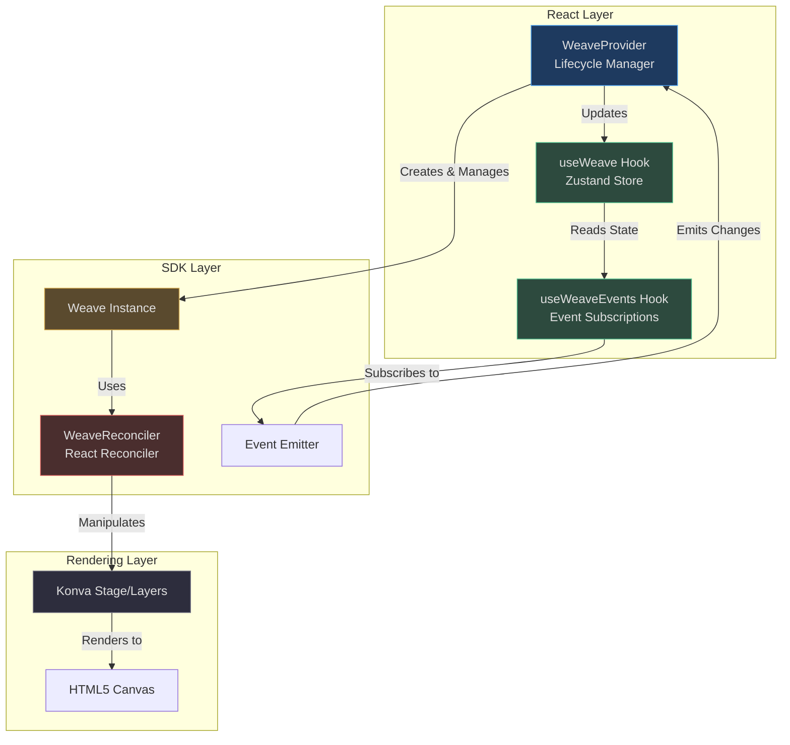
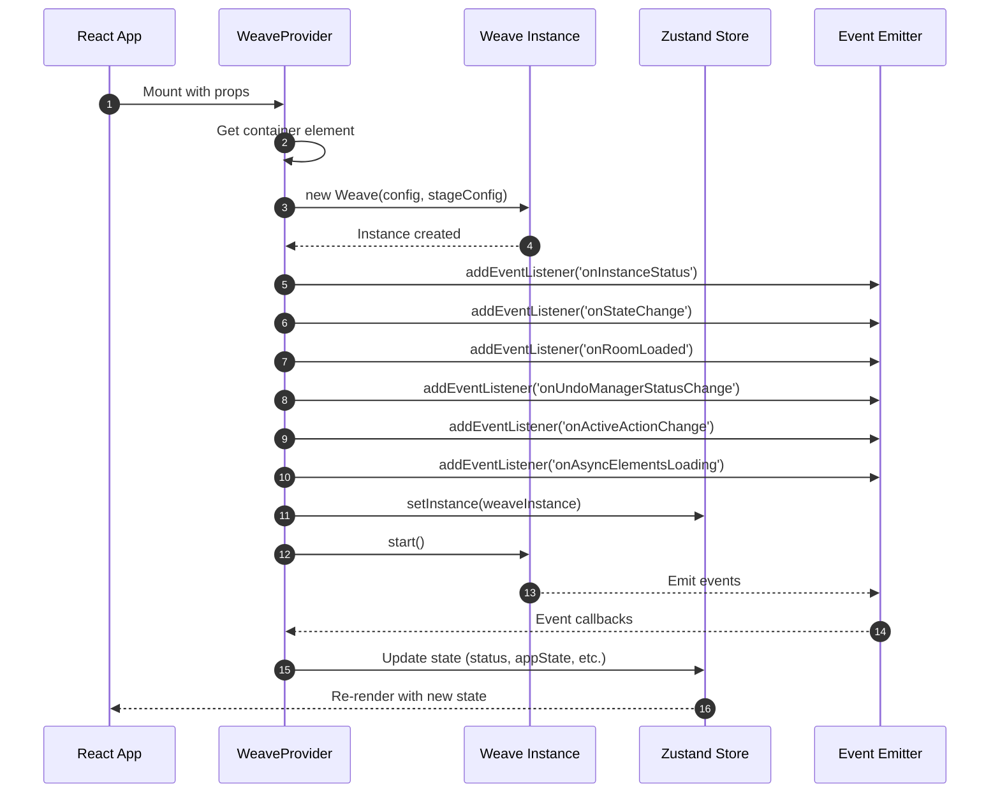
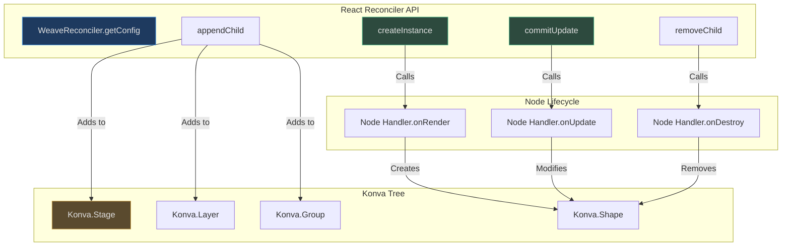
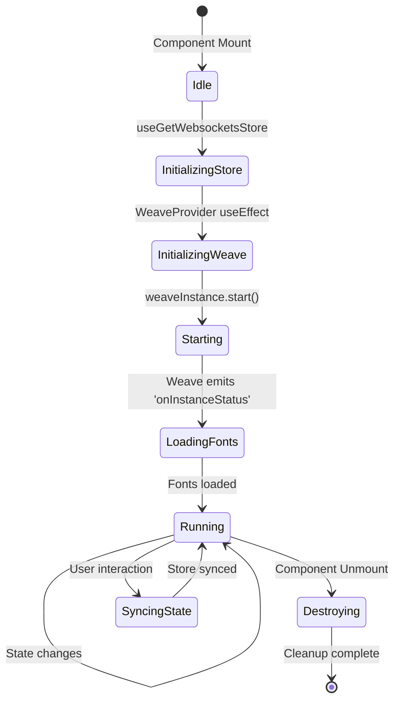

# React Integration

Weave.js provides a first-class React integration through the `@inditextech/weave-react` package, enabling declarative canvas rendering with full TypeScript support. The integration bridges React's virtual DOM with Konva's imperative canvas API using a custom **React Reconciler**, while exposing reactive state through **Zustand-powered hooks**.

## Overview

The React integration solves three core challenges:

1. **Lifecycle Management**: Initializing and tearing down Weave instances in React's declarative environment
2. **State Synchronization**: Bridging Weave SDK events to React's reactive model via hooks
3. **Declarative Rendering**: Enabling JSX-based Konva node definitions through a custom reconciler (future capability)

<!-- Source: [code/packages/react/package.json:1-94](https://github.com/thegovind/weavejs/blob/main/code/packages/react/package.json#L1-L94) -->

## Architecture

The React integration consists of three layers working together:



<!-- Sources: 
- [code/packages/react/src/components/provider.tsx:1-262](https://github.com/thegovind/weavejs/blob/main/code/packages/react/src/components/provider.tsx#L1-L262)
- [code/packages/sdk/src/reconciler/reconciler.ts:1-363](https://github.com/thegovind/weavejs/blob/main/code/packages/sdk/src/reconciler/reconciler.ts#L1-L363)
-->

## Core Components

### WeaveProvider

The `WeaveProvider` is the root component that manages the Weave instance lifecycle and connects it to React's state management.

| Prop | Type | Required | Description | Source |
|------|------|----------|-------------|--------|
| `getContainer` | `() => HTMLElement` | Yes | Returns the DOM element to mount Konva stage | [provider.tsx:26](https://github.com/thegovind/weavejs/blob/main/code/packages/react/src/components/provider.tsx#L26) |
| `store` | `WeaveStore` | Yes | Store instance (WebSockets, Yjs, etc.) for collaboration | [provider.tsx:28](https://github.com/thegovind/weavejs/blob/main/code/packages/react/src/components/provider.tsx#L28) |
| `fonts` | `WeaveFont[]` \| `() => Promise<WeaveFont[]>` | No | Custom fonts to load (static or async) | [provider.tsx:27](https://github.com/thegovind/weavejs/blob/main/code/packages/react/src/components/provider.tsx#L27) |
| `nodes` | `WeaveNode[]` | No | Custom node type handlers | [provider.tsx:29](https://github.com/thegovind/weavejs/blob/main/code/packages/react/src/components/provider.tsx#L29) |
| `actions` | `WeaveAction[]` | No | Custom action handlers | [provider.tsx:30](https://github.com/thegovind/weavejs/blob/main/code/packages/react/src/components/provider.tsx#L30) |
| `plugins` | `WeavePlugin[]` | No | Plugin instances | [provider.tsx:31](https://github.com/thegovind/weavejs/blob/main/code/packages/react/src/components/provider.tsx#L31) |
| `performance` | `WeavePerformanceConfig` | No | Performance tuning options | [provider.tsx:32](https://github.com/thegovind/weavejs/blob/main/code/packages/react/src/components/provider.tsx#L32) |
| `logLevel` | `'debug'` \| `'info'` \| `'warn'` \| `'error'` | No | Logging verbosity (default: `'info'`) | [provider.tsx:34](https://github.com/thegovind/weavejs/blob/main/code/packages/react/src/components/provider.tsx#L34) |
| `logModules` | `WeaveChildLoggerLevel[]` | No | Module-specific log level overrides | [provider.tsx:35](https://github.com/thegovind/weavejs/blob/main/code/packages/react/src/components/provider.tsx#L35) |
| `children` | `React.ReactNode` | Yes | Child components | [provider.tsx:33](https://github.com/thegovind/weavejs/blob/main/code/packages/react/src/components/provider.tsx#L33) |

#### Initialization Sequence



<!-- Sources:
- [code/packages/react/src/components/provider.tsx:132-258](https://github.com/thegovind/weavejs/blob/main/code/packages/react/src/components/provider.tsx#L132-L258)
- [code/packages/sdk/src/weave.ts:1-100](https://github.com/thegovind/weavejs/blob/main/code/packages/sdk/src/weave.ts#L1-L100)
-->

**Key Implementation Details:**

The provider uses `React.useRef` to maintain a stable reference to the Weave instance across renders, preventing unnecessary re-initialization:

<!-- Source: code/packages/react/src/components/provider.tsx:50 -->
```typescript
const weaveInstanceRef = React.useRef<Weave | null>(null);
```

The initialization effect (`React.useEffect`) runs only once (empty dependency array) and sets up event listeners before calling `weaveInstanceRef.current.start()` [provider.tsx:132-258](https://github.com/thegovind/weavejs/blob/main/code/packages/react/src/components/provider.tsx#L132-L258). The cleanup function removes all listeners and calls `destroy()` on unmount [provider.tsx:212-257](https://github.com/thegovind/weavejs/blob/main/code/packages/react/src/components/provider.tsx#L212-L257).

### useWeave Hook

The `useWeave` hook is a **Zustand store** that exposes reactive Weave state to React components. It serves as the single source of truth for all Weave-related state in the React tree.

| State Property | Type | Description | Source |
|----------------|------|-------------|--------|
| `instance` | `Weave \| null` | The Weave SDK instance | [store.tsx:72](https://github.com/thegovind/weavejs/blob/main/code/packages/react/src/components/store.tsx#L72) |
| `appState` | `WeaveState` | Current canvas state (nodes, properties) | [store.tsx:73](https://github.com/thegovind/weavejs/blob/main/code/packages/react/src/components/store.tsx#L73) |
| `status` | `WeaveStatus` | Instance lifecycle status | [store.tsx:74](https://github.com/thegovind/weavejs/blob/main/code/packages/react/src/components/store.tsx#L74) |
| `connection.status` | `string` | Store connection state | [store.tsx:83-85](https://github.com/thegovind/weavejs/blob/main/code/packages/react/src/components/store.tsx#L83-L85) |
| `room.loaded` | `boolean` | Whether collaboration room is loaded | [store.tsx:75-77](https://github.com/thegovind/weavejs/blob/main/code/packages/react/src/components/store.tsx#L75-L77) |
| `asyncElements` | `{ loaded: number, total: number, allLoaded: boolean }` | Async asset loading progress | [store.tsx:78-82](https://github.com/thegovind/weavejs/blob/main/code/packages/react/src/components/store.tsx#L78-L82) |
| `users` | `WeaveConnectedUsers` | Connected collaborators | [store.tsx:86](https://github.com/thegovind/weavejs/blob/main/code/packages/react/src/components/store.tsx#L86) |
| `undoRedo` | `{ canUndo: boolean, canRedo: boolean }` | Undo/redo availability | [store.tsx:87-90](https://github.com/thegovind/weavejs/blob/main/code/packages/react/src/components/store.tsx#L87-L90) |
| `zoom` | `{ value: number, canZoomIn: boolean, canZoomOut: boolean }` | Zoom state | [store.tsx:92-96](https://github.com/thegovind/weavejs/blob/main/code/packages/react/src/components/store.tsx#L92-L96) |
| `selection` | `{ active: boolean, nodes: WeaveSelection[], node?: WeaveStateElement }` | Current node selection | [store.tsx:102-106](https://github.com/thegovind/weavejs/blob/main/code/packages/react/src/components/store.tsx#L102-L106) |
| `actions` | `{ active: boolean, actual?: string }` | Active action state | [store.tsx:107-110](https://github.com/thegovind/weavejs/blob/main/code/packages/react/src/components/store.tsx#L107-L110) |

**Usage Pattern:**

<!-- Source: code/packages/react/src/components/provider.tsx:51-64 -->
```typescript
// Select specific state slices for optimal re-rendering
const selectedNodes = useWeave((state) => state.selection.nodes);
const canUndo = useWeave((state) => state.undoRedo.canUndo);
const status = useWeave((state) => state.status);

// Access the Weave instance for imperative operations
const instance = useWeave((state) => state.instance);
instance?.addNode({ type: 'rectangle', ... });
```

**Why Zustand?** The integration uses Zustand instead of React Context for performance reasons — Zustand's selector-based subscriptions prevent unnecessary re-renders when unrelated state changes [package.json:76](https://github.com/thegovind/weavejs/blob/main/code/packages/react/package.json#L76).

### useWeaveEvents Hook

The `useWeaveEvents` hook subscribes to Weave SDK plugin events and updates the Zustand store. This hook **must be called inside a component rendered within `WeaveProvider`**.

| Event | Handler | Store Update | Source |
|-------|---------|--------------|--------|
| `onSelectionState` | `onSelectionStateHandler` | `setSelectionActive(active)` | [events.tsx:87-90](https://github.com/thegovind/weavejs/blob/main/code/packages/react/src/hooks/events.tsx#L87-L90) |
| `onZoomChange` | `onZoomChangeHandler` | `setZoom()`, `setCanZoomIn()`, `setCanZoomOut()` | [events.tsx:91-94](https://github.com/thegovind/weavejs/blob/main/code/packages/react/src/hooks/events.tsx#L91-L94) |
| `onNodesChange` | `onNodesChangeHandler` | `setSelectedNodes()`, `setNode()` | [events.tsx:95-98](https://github.com/thegovind/weavejs/blob/main/code/packages/react/src/hooks/events.tsx#L95-L98) |
| `onConnectedUsersChange` | `onConnectedUsersChangedHandler` | `setUsers(users)` | [events.tsx:99-102](https://github.com/thegovind/weavejs/blob/main/code/packages/react/src/hooks/events.tsx#L99-L102) |
| `onMutexLockChange` | `onMutexLockChangeHandler` | `setUsersLocks(locks)` | [events.tsx:103-106](https://github.com/thegovind/weavejs/blob/main/code/packages/react/src/hooks/events.tsx#L103-L106) |

**Implementation:**

The hook uses `React.useEffect` to subscribe on mount and unsubscribe on unmount:

<!-- Source: code/packages/react/src/hooks/events.tsx:84-134 -->
```typescript
React.useEffect(() => {
  if (!instance) return;

  instance.addEventListener<WeaveStageZoomPluginOnZoomChangeEvent>(
    'onZoomChange',
    onZoomChangeHandler
  );
  
  // ... more event subscriptions

  return () => {
    instance.removeEventListener<WeaveStageZoomPluginOnZoomChangeEvent>(
      'onZoomChange',
      onZoomChangeHandler
    );
    // ... cleanup
  };
}, [instance]);
```

**Critical:** All event handlers are wrapped in `React.useCallback` with explicit dependencies to prevent memory leaks from stale closures [events.tsx:30-82](https://github.com/thegovind/weavejs/blob/main/code/packages/react/src/hooks/events.tsx#L30-L82).

## React Reconciler Integration

The React integration includes a **custom React Reconciler** that enables JSX-based Konva node definitions. While not yet exposed as a public API, the reconciler powers future declarative rendering capabilities.

### Reconciler Architecture



<!-- Sources:
- [code/packages/sdk/src/reconciler/reconciler.ts:114-363](https://github.com/thegovind/weavejs/blob/main/code/packages/sdk/src/reconciler/reconciler.ts#L114-L363)
-->

### Key Reconciler Methods

#### createInstance

The `createInstance` method is called when React's virtual DOM creates a new element. It delegates to the registered `WeaveNode` handler:

<!-- Source: code/packages/sdk/src/reconciler/reconciler.ts:204-235 -->
```typescript
createInstance(
  type: string,
  props: WeaveElementAttributes,
  rootContainer: Weave,
  hostContext: Weave
): WeaveElementInstance | undefined {
  const handler = rootContainer.getNodeHandler<WeaveNode>(type);
  
  if (!handler) {
    return undefined;
  }
  
  const newProps = { ...props };
  delete newProps.zIndex;
  newProps.initialZIndex = props.zIndex; // Preserve for later application
  
  if (type === 'stage') {
    newProps.container = rootContainer.getStageConfiguration().container;
    newProps.width = rootContainer.getStageConfiguration().width;
    newProps.height = rootContainer.getStageConfiguration().height;
  }
  
  const element = handler.onRender(newProps);
  hostContext.emitEvent('onNodeRenderedAdded', element);
  
  return element;
}
```

**Special handling:**
- `zIndex` is extracted and applied after parent attachment to respect rendering order [reconciler.ts:221-222](https://github.com/thegovind/weavejs/blob/main/code/packages/sdk/src/reconciler/reconciler.ts#L221-L222)
- `stage` nodes receive container dimensions from the Weave configuration [reconciler.ts:224-228](https://github.com/thegovind/weavejs/blob/main/code/packages/sdk/src/reconciler/reconciler.ts#L224-L228)

#### addNode

The `addNode` method handles the imperative Konva API for parent-child relationships:

<!-- Source: code/packages/sdk/src/reconciler/reconciler.ts:25-84 -->
```typescript
addNode(
  parentInstance: WeaveElementInstance | undefined,
  child: WeaveElementInstance | undefined
): void {
  if (!parentInstance || !child) {
    return;
  }

  const parentAttrs = parentInstance.getAttrs();
  const childInitialZIndex = child.getAttrs().initialZIndex;
  const type = child.getAttrs().nodeType;
  const handler = this.instance.getNodeHandler<WeaveNode>(type);

  if (!handler) {
    return;
  }

  let nodeAdded = false;

  // Konva Stage -> Layer
  if (parentInstance instanceof Konva.Stage && child instanceof Konva.Layer) {
    parentInstance.add(child);
    handler.onAdd?.(child);
    nodeAdded = true;
  }
  
  // Layer -> any node
  if (parentInstance instanceof Konva.Layer) {
    parentInstance.add(child);
    handler.onAdd?.(child);
    nodeAdded = true;
  }
  
  // Group with explicit containerId (for complex nesting)
  if (parentInstance instanceof Konva.Group && parentAttrs.containerId) {
    const realParent = parentInstance.findOne(`#${parentAttrs.containerId}`) as Konva.Group;
    realParent?.add(child);
    handler.onAdd?.(child);
    nodeAdded = true;
  }
  
  // Group without containerId (direct child)
  if (parentInstance instanceof Konva.Group && !parentAttrs.containerId) {
    parentInstance.add(child);
    handler.onAdd?.(child);
    nodeAdded = true;
  }

  // Apply zIndex after parent attachment
  if (childInitialZIndex) {
    child.zIndex(childInitialZIndex);
  }

  if (nodeAdded) {
    this.instance.emitEvent('onNodeRenderedAdded', child);
  }
}
```

**Parent-child rules:**
1. Only `Konva.Stage` can be a root container [reconciler.ts:47-51](https://github.com/thegovind/weavejs/blob/main/code/packages/sdk/src/reconciler/reconciler.ts#L47-L51)
2. Layers must be children of Stage [reconciler.ts:47-51](https://github.com/thegovind/weavejs/blob/main/code/packages/sdk/src/reconciler/reconciler.ts#L47-L51)
3. Groups support nested containers via `containerId` attribute for complex compositions [reconciler.ts:57-67](https://github.com/thegovind/weavejs/blob/main/code/packages/sdk/src/reconciler/reconciler.ts#L57-L67)

#### commitUpdate

The `commitUpdate` method is called when React detects prop changes. It uses `lodash.isEqual` for deep comparison to avoid unnecessary updates:

<!-- Source: code/packages/sdk/src/reconciler/reconciler.ts:86-108 -->
```typescript
updateNode(
  instance: WeaveElementInstance,
  type: string,
  prevProps: WeaveElementAttributes,
  nextProps: WeaveElementAttributes
) {
  if (!isEqual(prevProps, nextProps)) {
    const handler = this.instance.getNodeHandler<WeaveNode>(type);

    if (!handler) {
      return;
    }

    handler.onUpdate(instance, nextProps);

    const childZIndex = nextProps.zIndex;
    if (childZIndex) {
      instance.zIndex(childZIndex as number);
    }

    this.instance.emitEvent('onNodeRenderedUpdated', instance);
  }
}
```

**Performance:** The deep equality check prevents unnecessary Konva operations when props haven't actually changed [reconciler.ts:92](https://github.com/thegovind/weavejs/blob/main/code/packages/sdk/src/reconciler/reconciler.ts#L92).

#### removeChild

The `removeChild` method delegates cleanup to the node handler's `onDestroy` lifecycle method:

<!-- Source: code/packages/sdk/src/reconciler/reconciler.ts:347-360 -->
```typescript
removeChild(_: WeaveElementInstance, child: WeaveElementInstance): void {
  const type = child.getAttrs().nodeType;
  const handler = weaveInstance.getNodeHandler<WeaveNode>(type);

  if (!handler) {
    return;
  }

  handler.onDestroy(child);
  removeNode(child);
}
```

This ensures proper cleanup of event listeners, timers, and resources managed by custom nodes [reconciler.ts:358](https://github.com/thegovind/weavejs/blob/main/code/packages/sdk/src/reconciler/reconciler.ts#L358).

### Reconciler Configuration

The reconciler config returned by `getConfig()` implements the React Reconciler host config interface with 40+ methods [reconciler.ts:121-362](https://github.com/thegovind/weavejs/blob/main/code/packages/sdk/src/reconciler/reconciler.ts#L121-L362). Key properties:

| Property | Value | Meaning | Source |
|----------|-------|---------|--------|
| `isPrimaryRenderer` | `true` | Weave owns the rendering output | [reconciler.ts:123](https://github.com/thegovind/weavejs/blob/main/code/packages/sdk/src/reconciler/reconciler.ts#L123) |
| `supportsMutation` | `true` | Nodes can be mutated in place | [reconciler.ts:126](https://github.com/thegovind/weavejs/blob/main/code/packages/sdk/src/reconciler/reconciler.ts#L126) |
| `supportsPersistence` | `false` | No persistent mode (immutable trees) | [reconciler.ts:124](https://github.com/thegovind/weavejs/blob/main/code/packages/sdk/src/reconciler/reconciler.ts#L124) |
| `supportsHydration` | `false` | No server-side rendering support | [reconciler.ts:125](https://github.com/thegovind/weavejs/blob/main/code/packages/sdk/src/reconciler/reconciler.ts#L125) |

## Complete Usage Example

Here's a production-ready implementation from the docs showing all pieces working together:

<!-- Source: docs/manual-installation/components/room/room.tsx:1-95 -->
```typescript
"use client";

import React from "react";
import { useRouter } from "next/navigation";
import { WeaveUser, WEAVE_INSTANCE_STATUS } from "@inditextech/weave-types";
import { useWeave, WeaveProvider } from "@inditextech/weave-react";
import useGetWebsocketsStore from "@/hooks/use-get-websockets-store";
import { FONTS, NODES, ACTIONS, PLUGINS } from "@/components/utils/constants";

export const Room = () => {
  const router = useRouter();
  const status = useWeave((state) => state.status);
  const user = useCollaborationRoom((state) => state.user);
  
  const getUser = React.useCallback(() => {
    return user as WeaveUser;
  }, [user]);

  // Initialize WebSockets store
  const websocketsStore = useGetWebsocketsStore({
    loadedParams: true,
    getUser,
  });

  if (!websocketsStore) {
    return <LoadingScreen />;
  }

  return (
    <WeaveProvider
      getContainer={() => document.getElementById("weave") as HTMLDivElement}
      store={websocketsStore}
      fonts={FONTS}
      nodes={NODES}
      actions={ACTIONS}
      plugins={PLUGINS(getUser)}
      logLevel="info"
    >
      <RoomLayout />
    </WeaveProvider>
  );
};

// Child component using hooks
const RoomLayout = () => {
  useWeaveEvents(); // Subscribe to SDK events
  
  const selectedNodes = useWeave((state) => state.selection.nodes);
  const canUndo = useWeave((state) => state.undoRedo.canUndo);
  const instance = useWeave((state) => state.instance);
  
  const handleUndo = () => {
    instance?.undo();
  };
  
  return (
    <div>
      <button onClick={handleUndo} disabled={!canUndo}>
        Undo
      </button>
      <div id="weave" style={{ width: "100vw", height: "100vh" }} />
      <SelectionPanel nodes={selectedNodes} />
    </div>
  );
};
```

### Store Initialization

The example uses a custom hook to create the store with WebSockets support:

<!-- Source: docs/manual-installation/hooks/use-get-websockets-store.ts:1-67 -->
```typescript
import { WeaveStoreWebsockets } from "@inditextech/weave-store-websockets/client";

function useGetWebsocketsStore({
  getUser,
}: {
  getUser: () => WeaveUser;
}) {
  const [storeProvider, setStoreProvider] =
    React.useState<WeaveStoreWebsockets | null>(null);
  const room = useCollaborationRoom((state) => state.room);

  React.useEffect(() => {
    if (room && !storeProvider) {
      const store = new WeaveStoreWebsockets(
        roomData,
        {
          getUser,
          undoManagerOptions: {
            captureTimeout: 500,
          },
        },
        {
          roomId: room,
          wsOptions: {
            serverUrl: `/rooms/${room}/connect`,
          },
        }
      );

      setStoreProvider(store);
    }
  }, [room, storeProvider]);

  return storeProvider;
}
```

**Key patterns:**
1. Store is created once and memoized in local state [use-get-websockets-store.ts:34-50](https://github.com/thegovind/weavejs/blob/main/docs/manual-installation/hooks/use-get-websockets-store.ts#L34-L50)
2. Provider waits for store initialization before rendering [room.tsx:79-92](https://github.com/thegovind/weavejs/blob/main/docs/manual-installation/components/room/room.tsx#L79-L92)
3. `getUser` callback is stable across renders via `React.useCallback` [room.tsx:42-44](https://github.com/thegovind/weavejs/blob/main/docs/manual-installation/components/room/room.tsx#L42-L44)

## State Flow Diagram

This diagram shows how state changes flow through the React integration:



<!-- Sources:
- [code/packages/react/src/components/provider.tsx:66-131](https://github.com/thegovind/weavejs/blob/main/code/packages/react/src/components/provider.tsx#L66-L131)
- [docs/manual-installation/components/room/room.tsx:15-20](https://github.com/thegovind/weavejs/blob/main/docs/manual-installation/components/room/room.tsx#L15-L20)
-->

## Package Dependencies

The React integration has specific peer dependency requirements:

| Dependency | Version | Purpose | Source |
|------------|---------|---------|--------|
| `react` | `>= 18.2.0 && < 19` | React core | [package.json:81](https://github.com/thegovind/weavejs/blob/main/code/packages/react/package.json#L81) |
| `react-dom` | `>= 18.2.0 && < 19` | React DOM renderer | [package.json:82](https://github.com/thegovind/weavejs/blob/main/code/packages/react/package.json#L82) |
| `konva` | `10.0.2` | Canvas rendering | [package.json:80](https://github.com/thegovind/weavejs/blob/main/code/packages/react/package.json#L80) |
| `yjs` | `13.6.27` | CRDT for collaboration | [package.json:83](https://github.com/thegovind/weavejs/blob/main/code/packages/react/package.json#L83) |
| `zustand` | `5.0.3` | State management (devDependency) | [package.json:75](https://github.com/thegovind/weavejs/blob/main/code/packages/react/package.json#L75) |

**Why these versions?**
- React 18.2+ is required for concurrent rendering features used by the reconciler
- Konva 10.0.2 provides the exact API surface the reconciler expects
- Yjs 13.6.27 matches the version used in `@inditextech/weave-sdk`

## Comparison: React Integration vs. Direct SDK

| Feature | React Integration | Direct SDK | Recommendation |
|---------|------------------|------------|----------------|
| **Lifecycle Management** | Automatic via hooks | Manual setup/teardown | React for apps with existing React codebase |
| **State Updates** | Reactive via Zustand | Manual subscription | React for UI-driven apps |
| **TypeScript Support** | Full | Full | Either |
| **Bundle Size** | +50KB (React + Zustand) | Base SDK only | SDK for lightweight embeds |
| **Learning Curve** | React patterns | Imperative API | React if team knows React |
| **Rendering Model** | Future JSX support | Imperative node creation | Either (currently equivalent) |

## Common Patterns

### Accessing Weave Instance Imperatively

<!-- Source: code/packages/react/src/components/store.tsx:16 -->
```typescript
const instance = useWeave((state) => state.instance);

const addRectangle = () => {
  instance?.addNode({
    type: 'rectangle',
    x: 100,
    y: 100,
    width: 200,
    height: 100,
    fill: 'blue',
  });
};
```

### Optimizing Re-renders with Selectors

```typescript
// ❌ Bad: subscribes to entire state
const state = useWeave();

// ✅ Good: subscribes only to selection
const selectedNodes = useWeave((state) => state.selection.nodes);
```

### Conditional Rendering Based on Status

```typescript
const status = useWeave((state) => state.status);

if (status !== WEAVE_INSTANCE_STATUS.RUNNING) {
  return <LoadingSpinner />;
}

return <Canvas />;
```

### Multi-user Awareness

<!-- Source: code/packages/react/src/hooks/events.tsx:59-65 -->
```typescript
const users = useWeave((state) => state.users);
const usersLocks = useWeave((state) => state.usersLocks);

return (
  <UserAvatars>
    {Object.entries(users).map(([id, user]) => (
      <Avatar key={id} user={user} isLocked={!!usersLocks[id]} />
    ))}
  </UserAvatars>
);
```

## Performance Considerations

### Zustand Selector Optimization

Zustand uses reference equality (`===`) for selectors. For nested object slices, use shallow comparison or memoization:

```typescript
import { shallow } from 'zustand/shallow';

const { canUndo, canRedo } = useWeave(
  (state) => ({ 
    canUndo: state.undoRedo.canUndo, 
    canRedo: state.undoRedo.canRedo 
  }),
  shallow
);
```

### Event Handler Memoization

All event handlers in `useWeaveEvents` use `React.useCallback` to prevent re-subscriptions [events.tsx:30-82](https://github.com/thegovind/weavejs/blob/main/code/packages/react/src/hooks/events.tsx#L30-L82). Follow this pattern in custom hooks:

```typescript
const onCustomEvent = React.useCallback((data) => {
  // handle event
}, []); // stable dependency array
```

### Provider Mounting Order

Mount `WeaveProvider` only after the container element exists in the DOM:

```typescript
const [containerReady, setContainerReady] = React.useState(false);

React.useEffect(() => {
  if (document.getElementById('weave')) {
    setContainerReady(true);
  }
}, []);

if (!containerReady) return null;

return <WeaveProvider getContainer={...} />;
```

## Troubleshooting

### "Container not defined" Error

**Cause:** `getContainer()` returns `null` or `undefined` when `WeaveProvider` mounts.

**Solution:** Ensure the container element is rendered before `WeaveProvider`:

```typescript
<div id="weave" style={{ width: "100vw", height: "100vh" }} />
<WeaveProvider getContainer={() => document.getElementById("weave")} ... />
```

### Stale State in Event Handlers

**Cause:** Event handlers capture stale closures when not properly memoized.

**Solution:** Use `React.useCallback` with correct dependencies:

```typescript
const selectedNodes = useWeave((state) => state.selection.nodes);

const onNodesChange = React.useCallback((nodes) => {
  console.log('Current selection:', selectedNodes);
}, [selectedNodes]); // Include dependency
```

### Memory Leaks from Unsubscribed Events

**Cause:** Calling `useWeaveEvents()` in a component that unmounts while Weave instance persists.

**Solution:** Always call `useWeaveEvents()` in a component that lives as long as `WeaveProvider`:

```typescript
// ✅ Good: Same lifetime as provider
<WeaveProvider>
  <AppLayout /> {/* useWeaveEvents() here */}
</WeaveProvider>

// ❌ Bad: Conditional child
<WeaveProvider>
  {showModal && <Modal />} {/* Don't call useWeaveEvents() here */}
</WeaveProvider>
```

## Related Pages

| Page | Relationship | Description |
|------|--------------|-------------|
| [Getting Started → Quickstart](../getting-started/quickstart.md) | Parent | Installation and setup instructions |
| [Deep Dive → SDK Core](./sdk-core.md) | Sibling | Understanding the underlying Weave class |
| [Deep Dive → Architecture](./architecture.md) | Sibling | High-level system design and components |
| [Deep Dive → Stores](./stores.md) | Prerequisite | Store implementations (WebSockets, Yjs) required by `WeaveProvider` |
| [API Reference → React Hooks](../api/react-hooks.md) | Child | Complete API documentation for all hooks |

## Summary

The React integration provides a batteries-included solution for integrating Weave.js into React applications:

1. **WeaveProvider** manages Weave instance lifecycle with automatic cleanup
2. **useWeave** exposes reactive state via Zustand with selector-based optimization
3. **useWeaveEvents** subscribes to plugin events and updates the store
4. **WeaveReconciler** enables future JSX-based Konva rendering (internal)

The architecture prioritizes developer experience (declarative React patterns) without sacrificing performance (memoization, selective subscriptions, deep equality checks). For React applications, this integration is the recommended approach over direct SDK usage.
