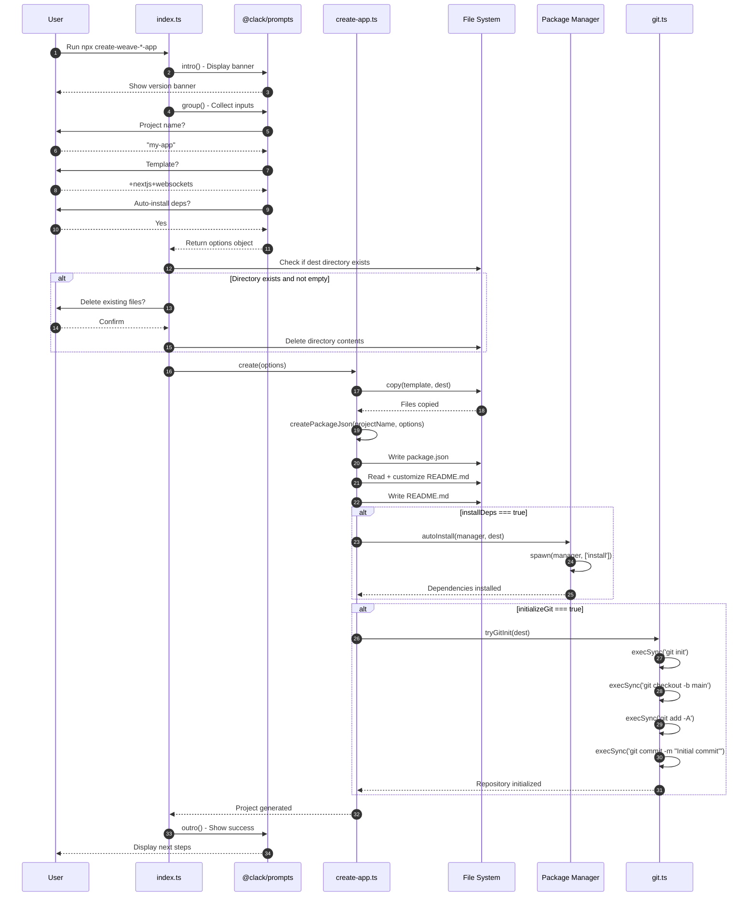
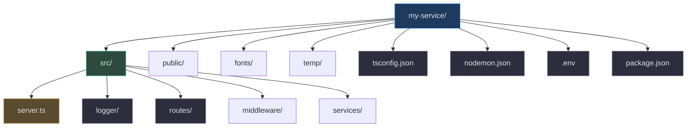

# CLI Scaffolding Tools

The Weave.js project provides two specialized CLI tools — `create-weave-frontend-app` and `create-weave-backend-app` — that automate the process of setting up new frontend (Next.js) and backend (Express.js) projects with Weave.js integration. These tools handle template selection, dependency installation, Git initialization, and project configuration through an interactive command-line interface powered by [@clack/prompts](https://github.com/natemoo-re/clack).

This page traces the internal implementation of both CLI tools, explaining how they orchestrate file copying, package.json generation, dependency management, and repository initialization to produce production-ready projects in seconds.

## Architecture Overview

Both CLI tools share a nearly identical architecture with parallel implementations:

| Component | Responsibility | Frontend Source | Backend Source |
|---|---|---|---|
| **Entry Point** | CLI orchestration, user prompts, workflow coordination | [index.ts:23-120](https://github.com/thegovind/weavejs/blob/main/code/packages/create-frontend-app/src/index.ts#L23-L120) | [index.ts:23-122](https://github.com/thegovind/weavejs/blob/main/code/packages/create-backend-app/src/index.ts#L23-L122) |
| **Scaffolding Engine** | Template copying, package.json generation, README customization | [create-app.ts:21-60](https://github.com/thegovind/weavejs/blob/main/code/packages/create-frontend-app/src/create-app.ts#L21-L60) | [create-app.ts:21-76](https://github.com/thegovind/weavejs/blob/main/code/packages/create-backend-app/src/create-app.ts#L21-L76) |
| **Auto-Install** | Package manager detection, dependency installation | [auto-install.ts:5-46](https://github.com/thegovind/weavejs/blob/main/code/packages/create-frontend-app/src/auto-install.ts#L5-L46) | [auto-install.ts:5-46](https://github.com/thegovind/weavejs/blob/main/code/packages/create-backend-app/src/auto-install.ts#L5-L46) |
| **Git Initialization** | Repository creation, branch setup, initial commit | [git.ts:38-71](https://github.com/thegovind/weavejs/blob/main/code/packages/create-frontend-app/src/git.ts#L38-L71) | [git.ts:38-71](https://github.com/thegovind/weavejs/blob/main/code/packages/create-backend-app/src/git.ts#L38-L71) |
| **Constants** | Source directory and working directory resolution | [constants.ts:1-4](https://github.com/thegovind/weavejs/blob/main/code/packages/create-frontend-app/src/constants.ts#L1-L4) | [constants.ts:1-4](https://github.com/thegovind/weavejs/blob/main/code/packages/create-backend-app/src/constants.ts#L1-L4) |

```mermaid
graph TB
    User[User runs npx command]
    Entry[index.ts<br>Entry Point]
    Prompts[@clack/prompts<br>Interactive CLI]
    Engine[create-app.ts<br>Scaffolding Engine]
    Templates[Template Files<br>+nextjs+websockets<br>+express+azure-web-pubsub]
    PackageMgr[auto-install.ts<br>Package Manager]
    Git[git.ts<br>Git Initialization]
    Output[Generated Project]

    User -->|npx create-weave-frontend-app| Entry
    User -->|npx create-weave-backend-app| Entry
    Entry -->|Collect inputs| Prompts
    Prompts -->|Project name, template, install deps| Entry
    Entry -->|Call create| Engine
    Engine -->|Copy template| Templates
    Engine -->|Generate package.json| Engine
    Engine -->|Customize README| Engine
    Engine -->|Install deps| PackageMgr
    Engine -->|Initialize repo| Git
    Engine -->|Write files| Output
    
    style User fill:#1e3a5f,stroke:#4a9eed,color:#e0e0e0
    style Entry fill:#2d4a3e,stroke:#4aba8a,color:#e0e0e0
    style Engine fill:#2d4a3e,stroke:#4aba8a,color:#e0e0e0
    style Templates fill:#2d2d3d,stroke:#7a7a8a,color:#e0e0e0
    style PackageMgr fill:#2d2d3d,stroke:#7a7a8a,color:#e0e0e0
    style Git fill:#2d2d3d,stroke:#7a7a8a,color:#e0e0e0
    style Output fill:#1e3a5f,stroke:#4a9eed,color:#e0e0e0
    style Prompts fill:#5a4a2e,stroke:#d4a84b,color:#e0e0e0
```

<!-- Sources: code/packages/create-frontend-app/src/index.ts:23-120, code/packages/create-frontend-app/src/create-app.ts:21-60, code/packages/create-backend-app/src/index.ts:23-122, code/packages/create-backend-app/src/create-app.ts:21-76 -->

## Scaffolding Flow

Both CLIs follow the same execution sequence:



<!-- Sources: code/packages/create-frontend-app/src/index.ts:23-120, code/packages/create-frontend-app/src/create-app.ts:21-60, code/packages/create-frontend-app/src/auto-install.ts:23-46, code/packages/create-frontend-app/src/git.ts:38-71 -->

## User Interaction Layer

The CLI tools use [@clack/prompts](https://github.com/natemoo-re/clack) to create an interactive, user-friendly experience with colored output via [picocolors](https://github.com/alexeyraspopov/picocolors).

### Entry Point Flow

Both [frontend](https://github.com/thegovind/weavejs/blob/main/code/packages/create-frontend-app/src/index.ts#L23) and [backend](https://github.com/thegovind/weavejs/blob/main/code/packages/create-backend-app/src/index.ts#L23) entry points follow the same pattern:

1. **Display banner** — Shows the CLI version from `package.json` ([frontend:24-26](https://github.com/thegovind/weavejs/blob/main/code/packages/create-frontend-app/src/index.ts#L24-L26), [backend:24-28](https://github.com/thegovind/weavejs/blob/main/code/packages/create-backend-app/src/index.ts#L24-L28))
2. **Collect inputs** — Prompts for project name, template, and install preference ([frontend:28-63](https://github.com/thegovind/weavejs/blob/main/code/packages/create-frontend-app/src/index.ts#L28-L63))
3. **Handle existing directory** — Asks to delete existing files if directory is not empty ([frontend:68-94](https://github.com/thegovind/weavejs/blob/main/code/packages/create-frontend-app/src/index.ts#L68-L94))
4. **Generate project** — Calls `create()` to scaffold the project ([frontend:96-109](https://github.com/thegovind/weavejs/blob/main/code/packages/create-frontend-app/src/index.ts#L96-L109))
5. **Display next steps** — Shows commands to run the project ([frontend:113-117](https://github.com/thegovind/weavejs/blob/main/code/packages/create-frontend-app/src/index.ts#L113-L117))

<!-- Source: code/packages/create-frontend-app/src/index.ts:23-120 -->

```typescript
const manager = getPackageManager();

async function main(): Promise<void> {
  intro(
    pc.bgCyan(pc.bold(`Create Weave.js Frontend App [${packageJson.version}]`))
  );

  const options = await group(
    {
      name: () =>
        text({
          message: 'Project name',
          placeholder: 'my-app',
          defaultValue: 'my-app',
        }),
      template: () =>
        select({
          message: 'Choose a template',
          initialValue: '+nextjs+websockets' as Template,
          options: [
            {
              value: '+nextjs+websockets',
              label: 'Next.js: Weave.js Websockets Store',
              hint: 'recommended',
            },
            {
              value: '+nextjs+azure-web-pubsub',
              label: 'Next.js: Weave.js Azure Web Pubsub Store',
            },
          ],
        }),
      installDeps: () =>
        confirm({
          message: `Do you want to install packages automatically? (detected as ${manager})`,
        }),
    },
    {
      onCancel: () => {
        cancel('Installation Stopped.');
        process.exit(0);
      },
    }
  );
  
  // ... project generation continues
}
```

### Template Options

The CLI tools offer different store implementations:

| CLI Tool | Template | Store Type | Use Case | Source |
|---|---|---|---|---|
| **Frontend** | `+nextjs+websockets` | WebSockets Store | Real-time bidirectional communication (recommended) | [index.ts:42-45](https://github.com/thegovind/weavejs/blob/main/code/packages/create-frontend-app/src/index.ts#L42-L45) |
| **Frontend** | `+nextjs+azure-web-pubsub` | Azure Web PubSub | Serverless real-time messaging with Azure | [index.ts:46-49](https://github.com/thegovind/weavejs/blob/main/code/packages/create-frontend-app/src/index.ts#L46-L49) |
| **Backend** | `+express+websockets` | WebSockets Store | Standard WebSocket server (recommended) | [index.ts:43-46](https://github.com/thegovind/weavejs/blob/main/code/packages/create-backend-app/src/index.ts#L43-L46) |
| **Backend** | `+express+azure-web-pubsub` | Azure Web PubSub | Azure-managed pub/sub messaging | [index.ts:48-51](https://github.com/thegovind/weavejs/blob/main/code/packages/create-backend-app/src/index.ts#L48-L51) |

See [../concepts/stores.md](../concepts/stores.md) for detailed information about each store implementation.

## Scaffolding Engine

The `create-app.ts` module is the heart of the scaffolding process — it orchestrates template copying, configuration generation, and post-generation steps.

### Core `create()` Function

The [create()](https://github.com/thegovind/weavejs/blob/main/code/packages/create-frontend-app/src/create-app.ts#L21) function signature is identical in both CLI tools:

```typescript
export interface Options {
  outputDir: string;
  template: Template;
  packageManager: PackageManager;
  installDeps?: boolean;
  initializeGit?: boolean;
  log?: (message: string) => void;
}

export async function create(options: Options): Promise<void> {
  const {
    installDeps = true,
    initializeGit = true,
    log = console.log,
  } = options;
  const projectName = path.basename(options.outputDir);
  const dest = path.resolve(cwd, options.outputDir);
  
  // ... scaffolding logic
}
```

<!-- Source: code/packages/create-frontend-app/src/create-app.ts:12-28 -->

The function executes five sequential steps:

1. **Copy template files** — Recursively copies the selected template directory ([frontend:37-41](https://github.com/thegovind/weavejs/blob/main/code/packages/create-frontend-app/src/create-app.ts#L37-L41))
2. **Generate `package.json`** — Constructs project-specific dependencies and scripts ([frontend:43-47](https://github.com/thegovind/weavejs/blob/main/code/packages/create-frontend-app/src/create-app.ts#L43-L47))
3. **Customize `README.md`** — Prepends project name to README content ([frontend:49-50](https://github.com/thegovind/weavejs/blob/main/code/packages/create-frontend-app/src/create-app.ts#L49-L50))
4. **Install dependencies** — Runs package manager if `installDeps` is true ([frontend:52-55](https://github.com/thegovind/weavejs/blob/main/code/packages/create-frontend-app/src/create-app.ts#L52-L55))
5. **Initialize Git** — Creates repository and initial commit if `initializeGit` is true ([frontend:57-59](https://github.com/thegovind/weavejs/blob/main/code/packages/create-frontend-app/src/create-app.ts#L57-L59))

### Template Copying

The [copy()](https://github.com/thegovind/weavejs/blob/main/code/packages/create-frontend-app/src/create-app.ts#L70) function recursively copies template directories and applies file renaming rules:

<!-- Source: code/packages/create-frontend-app/src/create-app.ts:70-89 -->

```typescript
function defaultRename(file: string): string {
  file = file.replace('example.gitignore', '.gitignore');
  file = file.replace('example.env', '.env');
  return file;
}

await copy(
  path.join(sourceDir, `template/${options.template}`),
  dest,
  defaultRename
);

async function copy(
  from: string,
  to: string,
  rename: (s: string) => string = (s) => s
): Promise<void> {
  const stats = await fs.stat(from);

  if (stats.isDirectory()) {
    const files = await fs.readdir(from);
    await Promise.all(
      files.map((file) =>
        copy(path.join(from, file), rename(path.join(to, file)))
      )
    );
  } else {
    await fs.mkdir(path.dirname(to), { recursive: true });
    await fs.copyFile(from, to);
  }
}
```

**Why the rename function?** Templates store `.gitignore` as `example.gitignore` because npm automatically excludes `.gitignore` files when publishing packages. The CLI renames them during scaffolding. Same logic applies to `.env` → `example.env` ([frontend:30-34](https://github.com/thegovind/weavejs/blob/main/code/packages/create-frontend-app/src/create-app.ts#L30-L34)).

### Dynamic `package.json` Generation

The [createPackageJson()](https://github.com/thegovind/weavejs/blob/main/code/packages/create-frontend-app/src/create-app.ts#L91) function constructs the project's `package.json` by selectively picking dependencies from the template's base `package.json` and merging Weave.js package versions.

#### Frontend Package Generation

For frontend projects, the function:

1. **Picks dependencies** from the template's `package.json` ([frontend:92-143](https://github.com/thegovind/weavejs/blob/main/code/packages/create-frontend-app/src/create-app.ts#L92-L143))
2. **Merges Weave.js versions** from `localVersions` ([frontend:144-147](https://github.com/thegovind/weavejs/blob/main/code/packages/create-frontend-app/src/create-app.ts#L144-L147))
3. **Picks devDependencies** ([frontend:150-172](https://github.com/thegovind/weavejs/blob/main/code/packages/create-frontend-app/src/create-app.ts#L150-L172))
4. **Sorts keys alphabetically** for consistent output ([frontend:185-186](https://github.com/thegovind/weavejs/blob/main/code/packages/create-frontend-app/src/create-app.ts#L185-L186))

<!-- Source: code/packages/create-frontend-app/src/create-app.ts:91-285 -->

```typescript
function createPackageJson(projectName: string, options: Options): object {
  if (options.template === '+nextjs+azure-web-pubsub') {
    const dependencies = {
      ...pick(versionPkg.dependencies, [
        '@hookform/resolvers',
        '@radix-ui/react-accordion',
        // ... 35+ dependencies
      ]),
      ...pick(localVersions, [
        '@inditextech/weave-react',
        '@inditextech/weave-store-azure-web-pubsub',
      ]),
    };

    const devDependencies = {
      ...pick(versionPkg.devDependencies, [
        '@eslint/eslintrc',
        '@tailwindcss/postcss',
        // ... 20+ devDependencies
      ]),
    };

    return {
      ...versionPkg,
      name: projectName,
      scripts: {
        build: 'next build',
        dev: 'next dev --experimental-https',
        format: 'prettier --write ./api ./app ./assets ./components ./lib ./store next.config.js',
        lint: 'next lint',
        start: 'next start',
      },
      dependencies: sortObjectKeys(dependencies),
      devDependencies: sortObjectKeys(devDependencies),
    };
  }
  
  // Similar logic for +nextjs+websockets template
}
```

**Why selective dependency picking?** The template's `package.json` contains all possible dependencies across all templates. The CLI only includes dependencies relevant to the selected template, reducing bundle size and installation time.

#### Backend Package Generation

Backend projects follow similar logic but include backend-specific dependencies:

<!-- Source: code/packages/create-backend-app/src/create-app.ts:107-257 -->

```typescript
const dependencies = {
  ...pick(localVersions, [
    '@inditextech/weave-sdk',
    '@inditextech/weave-store-websockets',
    '@inditextech/weave-store-standalone',
  ]),
  ...pick(versionPkg.dependencies, [
    '@dotenvx/dotenvx',
    '@imgly/background-removal-node',
    'archiver',
    'cors',
    'express',
    'helmet',
    'morgan',
    'multer',
    'pino',
    'pino-http',
    'uuid',
    'zod',
  ]),
};
```

The backend CLI also adds a **tsconfig.json modification step** to set up path aliases ([backend:43-57](https://github.com/thegovind/weavejs/blob/main/code/packages/create-backend-app/src/create-app.ts#L43-L57)):

```typescript
const tsconfigPath = path.join(dest, 'tsconfig.json');
const content = (await fs.readFile(tsconfigPath)).toString();
const config = JSON.parse(content);

if (config.compilerOptions?.paths) {
  Object.assign(config.compilerOptions.paths, {
    '@/*': ['./src/*'],
  });
}

await fs.writeFile(tsconfigPath, JSON.stringify(config, null, 2));
```

### Utility Functions

Both CLIs use helper functions to manipulate objects:

| Function | Purpose | Source |
|---|---|---|
| `pick<T, K>(obj, keys)` | Extracts specified keys from object | [create-app.ts:296-309](https://github.com/thegovind/weavejs/blob/main/code/packages/create-frontend-app/src/create-app.ts#L296-L309) |
| `sortObjectKeys<T>(obj)` | Sorts object keys alphabetically | [create-app.ts:288-294](https://github.com/thegovind/weavejs/blob/main/code/packages/create-frontend-app/src/create-app.ts#L288-L294) |

## Package Manager Detection & Installation

The `auto-install.ts` module detects the user's package manager and installs dependencies.

### Package Manager Detection

The [getPackageManager()](https://github.com/thegovind/weavejs/blob/main/code/packages/create-frontend-app/src/auto-install.ts#L5) function inspects the `npm_config_user_agent` environment variable to determine which package manager invoked the CLI:

<!-- Source: code/packages/create-frontend-app/src/auto-install.ts:5-21 -->

```typescript
export type PackageManager = 'npm' | 'pnpm' | 'yarn' | 'bun';

export function getPackageManager(): PackageManager {
  const userAgent = process.env.npm_config_user_agent ?? '';

  if (userAgent.startsWith('yarn')) {
    return 'yarn';
  }

  if (userAgent.startsWith('pnpm')) {
    return 'pnpm';
  }

  if (userAgent.startsWith('bun')) {
    return 'bun';
  }

  return 'npm';
}
```

**How it works:** When you run `pnpm create weave-frontend-app`, pnpm sets `npm_config_user_agent=pnpm/...`. The CLI reads this and automatically uses `pnpm install`.

### Dependency Installation

The [autoInstall()](https://github.com/thegovind/weavejs/blob/main/code/packages/create-frontend-app/src/auto-install.ts#L23) function spawns the detected package manager as a child process:

<!-- Source: code/packages/create-frontend-app/src/auto-install.ts:23-46 -->

```typescript
export function autoInstall(
  manager: PackageManager,
  dest: string
): Promise<void> {
  return new Promise((res, reject) => {
    const installProcess = spawn(manager, ['install'], {
      stdio: 'ignore',
      env: {
        ...process.env,
        NODE_ENV: 'development',
        DISABLE_OPENCOLLECTIVE: '1',
      },
      cwd: dest,
    });

    installProcess.on('close', (code) => {
      if (code !== 0) {
        reject(new Error('Install failed'));
      } else {
        res();
      }
    });
  });
}
```

**Key details:**
- Uses [cross-spawn](https://github.com/moxystudio/node-cross-spawn) for cross-platform compatibility
- Sets `stdio: 'ignore'` to suppress install output (keeps UI clean)
- Forces `NODE_ENV=development` to install devDependencies
- Sets `DISABLE_OPENCOLLECTIVE=1` to skip Open Collective donation prompts

## Git Initialization

The `git.ts` module handles repository creation and initial commit — implementation is identical in both CLI tools.

### Safety Checks

Before initializing, the [tryGitInit()](https://github.com/thegovind/weavejs/blob/main/code/packages/create-frontend-app/src/git.ts#L38) function performs safety checks:

1. **Check if Git is installed** — Runs `git --version` ([git.ts:42](https://github.com/thegovind/weavejs/blob/main/code/packages/create-frontend-app/src/git.ts#L42))
2. **Check if already in a Git repository** — Prevents nested repos ([git.ts:43-45](https://github.com/thegovind/weavejs/blob/main/code/packages/create-frontend-app/src/git.ts#L43-L45))
3. **Check if in a Mercurial repository** — Prevents conflicts ([git.ts:43-45](https://github.com/thegovind/weavejs/blob/main/code/packages/create-frontend-app/src/git.ts#L43-L45))

<!-- Source: code/packages/create-frontend-app/src/git.ts:11-36 -->

```typescript
function isInGitRepository(cwd: string): boolean {
  try {
    execSync('git rev-parse --is-inside-work-tree', { stdio: 'ignore', cwd });
    return true;
  } catch {
    return false;
  }
}

function isInMercurialRepository(cwd: string): boolean {
  try {
    execSync('hg --cwd . root', { stdio: 'ignore', cwd });
    return true;
  } catch {
    return false;
  }
}

function isDefaultBranchSet(cwd: string): boolean {
  try {
    execSync('git config init.defaultBranch', { stdio: 'ignore', cwd });
    return true;
  } catch {
    return false;
  }
}
```

### Repository Initialization

If all checks pass, the function initializes a repository and creates an initial commit:

<!-- Source: code/packages/create-frontend-app/src/git.ts:38-71 -->

```typescript
export function tryGitInit(root: string): boolean {
  let didInit = false;

  try {
    execSync('git --version', { stdio: 'ignore' });
    if (isInGitRepository(root) || isInMercurialRepository(root)) {
      return false;
    }

    execSync('git init', { stdio: 'ignore', cwd: root });
    didInit = true;

    if (!isDefaultBranchSet(root)) {
      execSync('git checkout -b main', { stdio: 'ignore', cwd: root });
    }

    execSync('git add -A', { stdio: 'ignore', cwd: root });
    execSync('git commit -m "Initial commit from Create Fumadocs App"', {
      stdio: 'ignore',
      cwd: root,
    });
    return true;
  } catch {
    if (didInit) {
      try {
        rmSync(join(root, '.git'), { recursive: true, force: true });
      } catch {
        // do nothing
      }
    }

    return false;
  }
}
```

**Key behaviors:**
- If `init.defaultBranch` is not set globally, creates a `main` branch explicitly ([git.ts:50-52](https://github.com/thegovind/weavejs/blob/main/code/packages/create-frontend-app/src/git.ts#L50-L52))
- Stages all files and commits with a fixed message ([git.ts:54-58](https://github.com/thegovind/weavejs/blob/main/code/packages/create-frontend-app/src/git.ts#L54-L58))
- If any step fails, cleans up the `.git` directory to leave no partial state ([git.ts:61-67](https://github.com/thegovind/weavejs/blob/main/code/packages/create-frontend-app/src/git.ts#L61-L67))

## Generated Project Structure

The scaffolded projects have different structures based on their purpose:

### Frontend Project (Next.js)

```mermaid
graph TB
    Root[my-app/]
    
    App[app/]
    Components[components/]
    Store[store/]
    Lib[lib/]
    Assets[assets/]
    API[api/]
    
    Layout[layout.tsx]
    Page[page.tsx]
    Rooms[rooms/[roomId]/page.tsx]
    Providers[providers.tsx]
    
    RoomComp[room-components/]
    UIComp[ui/]
    
    WeaveStore[weave-store.ts]
    
    Config1[next.config.js]
    Config2[tailwind.config.ts]
    Config3[tsconfig.json]
    Config4[.env]
    Config5[package.json]
    
    Root --> App
    Root --> Components
    Root --> Store
    Root --> Lib
    Root --> Assets
    Root --> API
    Root --> Config1
    Root --> Config2
    Root --> Config3
    Root --> Config4
    Root --> Config5
    
    App --> Layout
    App --> Page
    App --> Rooms
    App --> Providers
    
    Components --> RoomComp
    Components --> UIComp
    
    Store --> WeaveStore
    
    style Root fill:#1e3a5f,stroke:#4a9eed,color:#e0e0e0
    style App fill:#2d4a3e,stroke:#4aba8a,color:#e0e0e0
    style Components fill:#2d4a3e,stroke:#4aba8a,color:#e0e0e0
    style Store fill:#2d4a3e,stroke:#4aba8a,color:#e0e0e0
    style Config1 fill:#2d2d3d,stroke:#7a7a8a,color:#e0e0e0
    style Config2 fill:#2d2d3d,stroke:#7a7a8a,color:#e0e0e0
    style Config3 fill:#2d2d3d,stroke:#7a7a8a,color:#e0e0e0
    style Config4 fill:#2d2d3d,stroke:#7a7a8a,color:#e0e0e0
    style Config5 fill:#2d2d3d,stroke:#7a7a8a,color:#e0e0e0
```

<!-- Sources: code/packages/create-frontend-app/template/+nextjs+websockets/ -->

| Directory/File | Purpose | Key Contents |
|---|---|---|
| `app/` | Next.js App Router pages | Layout, routing, error boundaries |
| `components/` | React components | Room UI, Radix UI components, shared components |
| `store/` | Weave.js store configuration | Store initialization, state management |
| `lib/` | Utility functions | Helpers, type utilities |
| `assets/` | Static assets | Images, fonts, icons |
| `api/` | API route handlers | Backend API endpoints |
| `.env` | Environment variables | WebSocket URL, API keys |
| `package.json` | Project configuration | Dependencies, scripts |

### Backend Project (Express.js)



<!-- Sources: code/packages/create-backend-app/template/+express+websockets/ -->

| Directory/File | Purpose | Key Contents |
|---|---|---|
| `src/` | TypeScript source code | Server setup, routes, middleware |
| `src/server.ts` | Express server entry point | App initialization, WebSocket setup |
| `src/logger/` | Logging configuration | Pino logger setup |
| `src/routes/` | Express route handlers | API endpoints |
| `src/middleware/` | Express middleware | CORS, helmet, error handling |
| `src/services/` | Business logic | Background tasks, integrations |
| `public/` | Static file serving | Background removal models |
| `fonts/` | Font assets | TTF fonts for image generation |
| `temp/` | Temporary file storage | Upload processing |
| `.env` | Environment variables | Port, WebSocket config |
| `nodemon.json` | Dev server config | Auto-restart on changes |

## CLI Options & Commands

### Command-Line Arguments

Both CLIs are designed for **interactive use only** — they do not accept command-line flags. Instead, they use `@clack/prompts` to guide users through configuration:

```bash
# Frontend
npx create-weave-frontend-app
# or
pnpm create weave-frontend-app
# or
yarn create weave-frontend-app

# Backend
npx create-weave-backend-app
# or
pnpm create weave-backend-app
# or
yarn create weave-backend-app
```

### Generated npm Scripts

After scaffolding, both projects include standard npm scripts:

| Script | Frontend (Next.js) | Backend (Express.js) | Purpose |
|---|---|---|---|
| `dev` | `next dev --experimental-https` | `nodemon` | Start development server |
| `build` | `next build` | `tsc && tsc-alias && copy assets` | Build for production |
| `start` | `next start` | `node dist/server.js` | Start production server |
| `lint` | `next lint` | `eslint ./src` | Lint code |
| `format` | `prettier --write ./app ...` | `prettier --write "src/**/*.{ts,tsx}"` | Format code |

See [../getting-started/quickstart.md](../getting-started/quickstart.md) for usage examples.

## Frontend vs Backend Comparison

While both CLIs share the same architecture, they differ in implementation details:

| Aspect | Frontend CLI | Backend CLI | Rationale |
|---|---|---|---|
| **Templates** | Next.js with React | Express.js with Node.js | Frontend needs SSR, backend needs API server |
| **Store Packages** | `@inditextech/weave-react` | `@inditextech/weave-sdk` | React bindings vs core SDK |
| **Dependencies** | 40+ UI libraries (Radix, Framer Motion, Three.js) | 15+ backend libraries (Express, Pino, Multer) | Frontend needs rich UI, backend needs server tools |
| **Build Process** | `next build` | `tsc && tsc-alias` | Next.js handles bundling, backend compiles TypeScript |
| **Dev Server** | `next dev --experimental-https` | `nodemon` | Next.js has built-in dev server with HTTPS |
| **TypeScript Config** | No modification needed | Adds `@/*` path alias | Backend needs explicit path mapping |
| **Port** | 3000 (Next.js default) | 3001 (Express default) | Avoids conflicts when running both |

See [./react-integration.md](./react-integration.md) for how the frontend integrates with Weave.js stores.

## Design Decisions

### Why @clack/prompts?

The CLIs use [@clack/prompts](https://github.com/natemoo-re/clack) instead of alternatives like Inquirer or Prompts because:

1. **Modern aesthetics** — Beautiful, colorful terminal UI out of the box
2. **TypeScript-first** — Excellent type inference for prompt responses
3. **Cancellation handling** — Built-in `onCancel` support ([frontend:58-62](https://github.com/thegovind/weavejs/blob/main/code/packages/create-frontend-app/src/index.ts#L58-L62))
4. **Spinner support** — Integrated loading indicators ([frontend:96-109](https://github.com/thegovind/weavejs/blob/main/code/packages/create-frontend-app/src/index.ts#L96-L109))

### Why No CLI Flags?

The CLIs intentionally avoid `--template`, `--install`, etc. flags because:

1. **Discoverability** — Users see all available options without reading docs
2. **Safety** — Confirmation prompts prevent accidental overwrites
3. **Consistency** — Same experience across npm, pnpm, yarn, and bun
4. **Simplicity** — No need to remember flag names

### Why Selective Dependency Picking?

The `createPackageJson()` function uses `pick()` to extract dependencies instead of including the entire template `package.json` because:

1. **Template reuse** — The same base `package.json` supports multiple templates
2. **Smaller bundles** — Only include dependencies for the selected template
3. **Faster installs** — Fewer packages to download
4. **Cleaner diffs** — Generated `package.json` only contains relevant deps

### Why Spawn Instead of Exec?

The `autoInstall()` function uses `spawn()` instead of `exec()` or `execSync()` because:

1. **Async control** — Returns a promise that resolves on completion
2. **Stream handling** — Can suppress or capture output with `stdio: 'ignore'`
3. **Signal handling** — Properly handles process termination
4. **Cross-platform** — Works with `cross-spawn` on Windows

## Extensibility

### Adding a New Template

To add a new template (e.g., `+nextjs+redis-store`):

1. **Create template directory** — Add `code/packages/create-frontend-app/template/+nextjs+redis-store/`
2. **Update TypeScript types** — Add to `Template` union type ([create-app.ts:10](https://github.com/thegovind/weavejs/blob/main/code/packages/create-frontend-app/src/create-app.ts#L10))
3. **Add prompt option** — Include in `select()` options ([index.ts:40-50](https://github.com/thegovind/weavejs/blob/main/code/packages/create-frontend-app/src/index.ts#L40-L50))
4. **Add `createPackageJson()` branch** — Handle dependencies in `if` branch ([create-app.ts:92-188](https://github.com/thegovind/weavejs/blob/main/code/packages/create-frontend-app/src/create-app.ts#L92-L188))

### Supporting a New Package Manager

To support a new package manager (e.g., `bun`):

1. **Update `PackageManager` type** — Add to union ([auto-install.ts:3](https://github.com/thegovind/weavejs/blob/main/code/packages/create-frontend-app/src/auto-install.ts#L3))
2. **Add detection logic** — Check `npm_config_user_agent` ([auto-install.ts:5-21](https://github.com/thegovind/weavejs/blob/main/code/packages/create-frontend-app/src/auto-install.ts#L5-L21))
3. **Test install command** — Ensure `spawn(manager, ['install'])` works

## Error Handling

Both CLIs implement comprehensive error handling:

| Scenario | Behavior | Source |
|---|---|---|
| User cancels prompt | Display "Installation Stopped" and exit cleanly | [index.ts:58-62](https://github.com/thegovind/weavejs/blob/main/code/packages/create-frontend-app/src/index.ts#L58-L62) |
| Directory exists | Ask to delete, cancel if user declines | [index.ts:68-94](https://github.com/thegovind/weavejs/blob/main/code/packages/create-frontend-app/src/index.ts#L68-L94) |
| Install fails | Reject promise with error message | [auto-install.ts:38-42](https://github.com/thegovind/weavejs/blob/main/code/packages/create-frontend-app/src/auto-install.ts#L38-L42) |
| Git init fails | Clean up `.git` directory, return false | [git.ts:60-68](https://github.com/thegovind/weavejs/blob/main/code/packages/create-frontend-app/src/git.ts#L60-L68) |
| Uncaught error | Print error and re-throw | [index.ts:122-125](https://github.com/thegovind/weavejs/blob/main/code/packages/create-frontend-app/src/index.ts#L122-L125) |

## Performance Optimizations

The CLI tools use several techniques to minimize scaffolding time:

1. **Parallel file operations** — Uses `Promise.all()` for concurrent copying ([create-app.ts:80-84](https://github.com/thegovind/weavejs/blob/main/code/packages/create-frontend-app/src/create-app.ts#L80-L84))
2. **Suppressed install output** — `stdio: 'ignore'` reduces terminal rendering overhead ([auto-install.ts:29](https://github.com/thegovind/weavejs/blob/main/code/packages/create-frontend-app/src/auto-install.ts#L29))
3. **Minimal dependencies** — CLI packages only depend on prompts, spawn, and colors ([package.json:44-46](https://github.com/thegovind/weavejs/blob/main/code/packages/create-frontend-app/package.json#L44-L46))
4. **Template bundling** — Templates are pre-built and included in npm package ([package.json:19-22](https://github.com/thegovind/weavejs/blob/main/code/packages/create-frontend-app/package.json#L19-L22))

## Related Pages

| Page | Relevance |
|---|---|
| [Quickstart Guide](../getting-started/quickstart.md) | Usage examples for the CLI tools |
| [Store Architecture](../concepts/stores.md) | Understanding the store types offered by the CLIs |
| [React Integration](./react-integration.md) | How frontend scaffolded projects integrate Weave.js |
| [Backend API Design](./backend-api.md) | How backend scaffolded projects expose Weave.js APIs |
| [Project Structure](../architecture/project-structure.md) | Understanding the generated monorepo layout |
