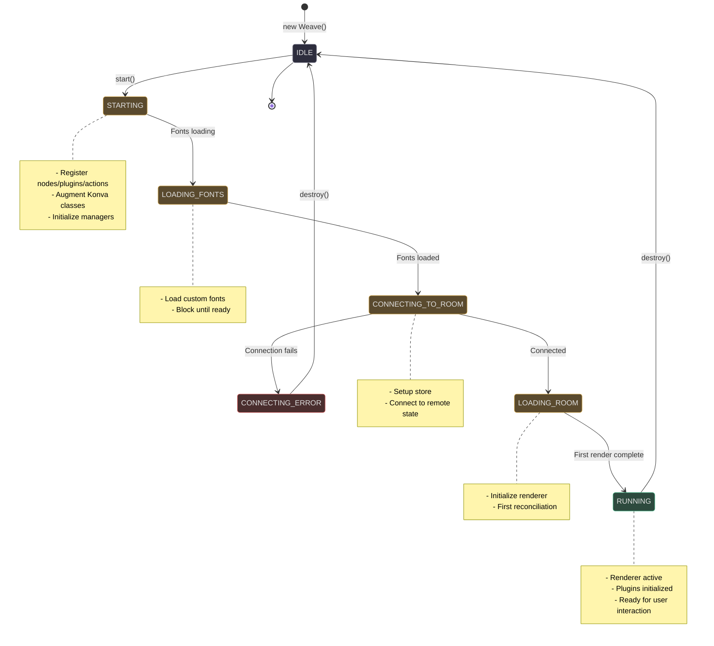
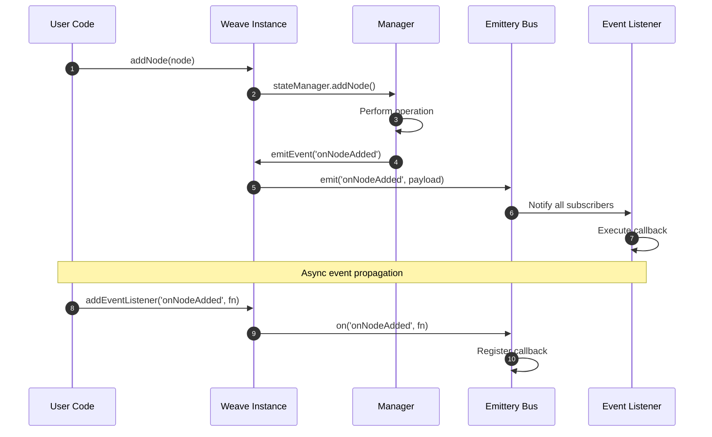
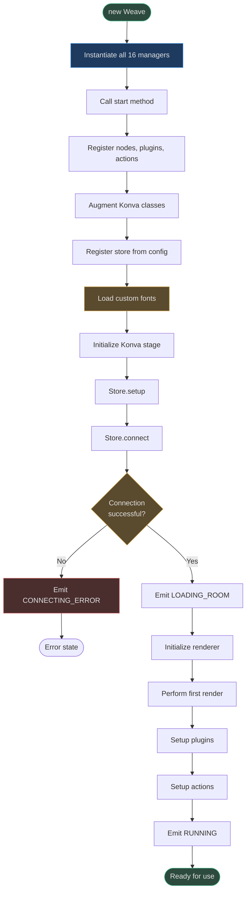

# SDK Core Architecture

The Weave SDK Core is the central orchestrator of the entire framework, coordinating 16 specialized managers, a rendering pipeline, and an event-driven architecture. This page explores the `Weave` class internals, manager responsibilities, lifecycle phases, and how everything connects.

<!-- Source: code/packages/sdk/src/weave.ts:82 -->

## Overview

The Weave class serves as:
- **Dependency injection container** — Instantiates and coordinates all managers
- **Event bus** — Central pub/sub system for inter-component communication
- **Lifecycle coordinator** — Manages initialization, rendering, and teardown
- **Configuration holder** — Stores and provides access to SDK configuration
- **Public API surface** — Exposes all developer-facing functionality

## Manager Architecture

Weave delegates responsibilities to 16 specialized managers, each owning a distinct domain. This separation enables clean boundaries, testability, and modularity.

### Manager Responsibilities

| Manager | Responsibility | Key Operations | Source |
|---------|----------------|----------------|--------|
| **WeaveStateManager** | State tree operations | Add/update/remove nodes, find by ID, z-index management | [state.ts:18](https://github.com/thegovind/weavejs/blob/main/code/packages/sdk/src/managers/state.ts#L18) |
| **WeaveStoreManager** | Store registration & lifecycle | Register store, provide store instance | [store.ts:9](https://github.com/thegovind/weavejs/blob/main/code/packages/sdk/src/managers/store.ts#L9) |
| **WeaveRegisterManager** | Component registry | Register plugins, nodes, actions | [register.ts:11](https://github.com/thegovind/weavejs/blob/main/code/packages/sdk/src/managers/register.ts#L11) |
| **WeaveSetupManager** | Initialization & logging | Setup plugins/actions, welcome logs | [setup.ts:9](https://github.com/thegovind/weavejs/blob/main/code/packages/sdk/src/managers/setup.ts#L9) |
| **WeaveStageManager** | Konva stage & layers | Initialize stage, manage layers (main, selection, comments, grid) | [stage.ts:18](https://github.com/thegovind/weavejs/blob/main/code/packages/sdk/src/managers/stage.ts#L18) |
| **WeaveActionsManager** | Action lifecycle | Trigger, cancel, track active action | [actions.ts:9](https://github.com/thegovind/weavejs/blob/main/code/packages/sdk/src/managers/actions.ts#L9) |
| **WeavePluginsManager** | Plugin enable/disable | Enable, disable, check status | [plugins.ts:8](https://github.com/thegovind/weavejs/blob/main/code/packages/sdk/src/managers/plugins.ts#L8) |
| **WeaveGroupsManager** | Group/ungroup nodes | Group nodes, ungroup, manage composition | [groups.ts:23](https://github.com/thegovind/weavejs/blob/main/code/packages/sdk/src/managers/groups.ts#L23) |
| **WeaveTargetingManager** | Hit detection & intersection | Resolve nodes, check intersections, mouse pointer | [targeting.ts:15](https://github.com/thegovind/weavejs/blob/main/code/packages/sdk/src/managers/targeting.ts#L15) |
| **WeaveCloningManager** | Node duplication | Clone nodes with transformations | [cloning.ts](https://github.com/thegovind/weavejs/blob/main/code/packages/sdk/src/managers/cloning.ts) |
| **WeaveFontsManager** | Font loading | Load fonts, track font availability | [fonts.ts](https://github.com/thegovind/weavejs/blob/main/code/packages/sdk/src/managers/fonts.ts) |
| **WeaveZIndexManager** | Z-order operations | Move up/down, send to back/front | [zindex.ts:14](https://github.com/thegovind/weavejs/blob/main/code/packages/sdk/src/managers/zindex.ts#L14) |
| **WeaveExportManager** | Export operations | Export nodes as images, base64 encoding | [export.ts](https://github.com/thegovind/weavejs/blob/main/code/packages/sdk/src/managers/export/export.ts) |
| **WeaveMutexManager** | Distributed locking | Node-level locks, user-level locks | [mutex.ts](https://github.com/thegovind/weavejs/blob/main/code/packages/sdk/src/managers/mutex/mutex.ts) |
| **WeaveUsersManager** | User tracking | Track users, presence | [users.ts](https://github.com/thegovind/weavejs/blob/main/code/packages/sdk/src/managers/users/users.ts) |
| **WeaveAsyncManager** | Async element loading | Track async loads (images, fonts) | [async.ts](https://github.com/thegovind/weavejs/blob/main/code/packages/sdk/src/managers/async/async.ts) |
| **WeaveHooksManager** | Hook registration & execution | Register hooks, run phase hooks | [hooks.ts:8](https://github.com/thegovind/weavejs/blob/main/code/packages/sdk/src/managers/hooks.ts#L8) |

### Manager Dependency Graph

The managers have clear dependency relationships — some must initialize before others.

```mermaid
graph TB
    Weave[Weave Instance]
    Weave --> Logger[WeaveLogger]
    Weave --> StoreManager[WeaveStoreManager]
    Weave --> RegisterManager[WeaveRegisterManager]
    Weave --> StateManager[WeaveStateManager]
    Weave --> SetupManager[WeaveSetupManager]
    
    StoreManager --> Store[WeaveStore]
    RegisterManager --> Plugins[Plugins]
    RegisterManager --> Nodes[Node Handlers]
    RegisterManager --> Actions[Action Handlers]
    
    Weave --> StageManager[WeaveStageManager]
    StageManager --> KonvaStage[Konva.Stage]
    StageManager --> Layers[Layers:<br/>main, selection,<br/>comments, grid]
    
    Weave --> ActionsManager[WeaveActionsManager]
    Weave --> PluginsManager[WeavePluginsManager]
    Weave --> GroupsManager[WeaveGroupsManager]
    Weave --> TargetingManager[WeaveTargetingManager]
    Weave --> ZIndexManager[WeaveZIndexManager]
    Weave --> CloningManager[WeaveCloningManager]
    Weave --> FontsManager[WeaveFontsManager]
    Weave --> ExportManager[WeaveExportManager]
    Weave --> MutexManager[WeaveMutexManager]
    Weave --> UsersManager[WeaveUsersManager]
    Weave --> AsyncManager[WeaveAsyncManager]
    Weave --> HooksManager[WeaveHooksManager]
    
    StateManager -.-> StoreManager
    ActionsManager -.-> RegisterManager
    PluginsManager -.-> RegisterManager
    GroupsManager -.-> StateManager
    ZIndexManager -.-> StateManager
    
    style Weave fill:#1e3a5f,stroke:#4a9eed,color:#e0e0e0
    style Logger fill:#2d4a3e,stroke:#4aba8a,color:#e0e0e0
    style StoreManager fill:#2d4a3e,stroke:#4aba8a,color:#e0e0e0
    style RegisterManager fill:#2d4a3e,stroke:#4aba8a,color:#e0e0e0
    style StateManager fill:#2d4a3e,stroke:#4aba8a,color:#e0e0e0
    style SetupManager fill:#2d4a3e,stroke:#4aba8a,color:#e0e0e0
    style StageManager fill:#2d4a3e,stroke:#4aba8a,color:#e0e0e0
    style ActionsManager fill:#2d2d3d,stroke:#7a7a8a,color:#e0e0e0
    style PluginsManager fill:#2d2d3d,stroke:#7a7a8a,color:#e0e0e0
    style GroupsManager fill:#2d2d3d,stroke:#7a7a8a,color:#e0e0e0
    style TargetingManager fill:#2d2d3d,stroke:#7a7a8a,color:#e0e0e0
    style ZIndexManager fill:#2d2d3d,stroke:#7a7a8a,color:#e0e0e0
    style CloningManager fill:#2d2d3d,stroke:#7a7a8a,color:#e0e0e0
    style FontsManager fill:#2d2d3d,stroke:#7a7a8a,color:#e0e0e0
    style ExportManager fill:#2d2d3d,stroke:#7a7a8a,color:#e0e0e0
    style MutexManager fill:#2d2d3d,stroke:#7a7a8a,color:#e0e0e0
    style UsersManager fill:#2d2d3d,stroke:#7a7a8a,color:#e0e0e0
    style AsyncManager fill:#2d2d3d,stroke:#7a7a8a,color:#e0e0e0
    style HooksManager fill:#2d2d3d,stroke:#7a7a8a,color:#e0e0e0
```



<!-- Sources: code/packages/sdk/src/weave.ts:109-167 -->

## Lifecycle State Machine

The Weave instance transitions through well-defined states from creation to destruction.



<!-- Sources: code/packages/sdk/src/weave.ts:198-291 -->

### Lifecycle Phases

| Phase | Status | Operations | Events Emitted |
|-------|--------|------------|----------------|
| **Construction** | `IDLE` | Instantiate managers, setup logger | None |
| **Start** | `STARTING` | Register components, augment Konva | `onInstanceStatus` |
| **Font Loading** | `LOADING_FONTS` | Load custom fonts | `onInstanceStatus` |
| **Connection** | `CONNECTING_TO_ROOM` | Connect store, setup listeners | `onInstanceStatus`, `onStoreConnectionStatusChange` |
| **Room Loading** | `LOADING_ROOM` | Initialize renderer | `onInstanceStatus` |
| **Running** | `RUNNING` | Render, setup plugins/actions | `onInstanceStatus`, `onRender` |
| **Destruction** | `IDLE` | Disconnect store, destroy stage, clear listeners | `onInstanceStatus` |

<!-- Source: code/packages/sdk/src/weave.ts:237-291 -->

## Event System

Weave uses [Emittery](https://github.com/sindresorhus/emittery) for its event bus, enabling decoupled communication between components.

### Event Flow Architecture



<!-- Sources: code/packages/sdk/src/weave.ts:337-356 -->

### Core Event Types

| Event | Payload | Trigger | Source |
|-------|---------|---------|--------|
| `onInstanceStatus` | `WeaveStatus` | Lifecycle state change | [weave.ts:198](https://github.com/thegovind/weavejs/blob/main/code/packages/sdk/src/weave.ts#L198) |
| `onRoomLoaded` | `boolean` | Room state loaded | [weave.ts:244](https://github.com/thegovind/weavejs/blob/main/code/packages/sdk/src/weave.ts#L244) |
| `onNodeAdded` | `WeaveStateElement` | Node added to state | [state.ts:190](https://github.com/thegovind/weavejs/blob/main/code/packages/sdk/src/managers/state.ts#L190) |
| `onNodeUpdated` | `WeaveStateElement` | Node props updated | [state.ts:261](https://github.com/thegovind/weavejs/blob/main/code/packages/sdk/src/managers/state.ts#L261) |
| `onNodeRemoved` | `WeaveStateElement` | Node removed from state | [state.ts:319](https://github.com/thegovind/weavejs/blob/main/code/packages/sdk/src/managers/state.ts#L319) |
| `onUserChange` | `WeaveUserChangeEvent` | User-triggered state change | [weave.ts:394](https://github.com/thegovind/weavejs/blob/main/code/packages/sdk/src/weave.ts#L394) |
| `onActiveActionChange` | `string \| undefined` | Action triggered or cancelled | [actions.ts:47](https://github.com/thegovind/weavejs/blob/main/code/packages/sdk/src/managers/actions.ts#L47) |
| `onStoreConnectionStatusChange` | `WeaveStoreConnectionStatus` | Store connection status change | [weave.ts:219](https://github.com/thegovind/weavejs/blob/main/code/packages/sdk/src/weave.ts#L219) |
| `onRender` | `undefined` | Frame rendered | [weave.ts:596](https://github.com/thegovind/weavejs/blob/main/code/packages/sdk/src/weave.ts#L596) |

**Event Methods:**

```typescript
// Register a listener
weave.addEventListener<T>('onNodeAdded', (node: T) => {
  console.log('Node added:', node);
});

// Register a one-time listener
weave.addOnceEventListener<T>('onRender', (payload: T) => {
  console.log('First render complete');
});

// Remove a listener
weave.removeEventListener('onNodeAdded', callback);
```

<!-- Source: code/packages/sdk/src/weave.ts:337-356 -->

## Public API

The Weave class exposes a comprehensive public API organized by domain.

### Configuration & Lifecycle

| Method | Return Type | Purpose | Source |
|--------|-------------|---------|--------|
| `start()` | `Promise<void>` | Initialize SDK, connect store | [weave.ts:237](https://github.com/thegovind/weavejs/blob/main/code/packages/sdk/src/weave.ts#L237) |
| `destroy()` | `void` | Teardown, disconnect, clear memory | [weave.ts:291](https://github.com/thegovind/weavejs/blob/main/code/packages/sdk/src/weave.ts#L291) |
| `getConfiguration()` | `WeaveConfig` | Get SDK configuration | [weave.ts:322](https://github.com/thegovind/weavejs/blob/main/code/packages/sdk/src/weave.ts#L322) |
| `getStatus()` | `WeaveStatus` | Get current lifecycle status | [weave.ts:213](https://github.com/thegovind/weavejs/blob/main/code/packages/sdk/src/weave.ts#L213) |
| `getId()` | `string` | Get unique instance ID | [weave.ts:318](https://github.com/thegovind/weavejs/blob/main/code/packages/sdk/src/weave.ts#L318) |

### Stage & Layers

| Method | Return Type | Purpose | Source |
|--------|-------------|---------|--------|
| `getStage()` | `Konva.Stage` | Get Konva stage | [weave.ts:438](https://github.com/thegovind/weavejs/blob/main/code/packages/sdk/src/weave.ts#L438) |
| `getMainLayer()` | `Konva.Layer` | Get main rendering layer | [weave.ts:442](https://github.com/thegovind/weavejs/blob/main/code/packages/sdk/src/weave.ts#L442) |
| `getSelectionLayer()` | `Konva.Layer` | Get selection overlay layer | [weave.ts:446](https://github.com/thegovind/weavejs/blob/main/code/packages/sdk/src/weave.ts#L446) |
| `getCommentsLayer()` | `Konva.Layer` | Get comments layer | [weave.ts:450](https://github.com/thegovind/weavejs/blob/main/code/packages/sdk/src/weave.ts#L450) |
| `getGridLayer()` | `Konva.Layer` | Get grid layer | [weave.ts:454](https://github.com/thegovind/weavejs/blob/main/code/packages/sdk/src/weave.ts#L454) |

### State Operations

| Method | Return Type | Purpose | Source |
|--------|-------------|---------|--------|
| `addNode(node, parentId?, options?)` | `void` | Add node to state tree | [weave.ts:620+](https://github.com/thegovind/weavejs/blob/main/code/packages/sdk/src/weave.ts#L620) |
| `updateNode(node, options?)` | `void` | Update node props | [weave.ts:700+](https://github.com/thegovind/weavejs/blob/main/code/packages/sdk/src/weave.ts#L700) |
| `removeNode(node, options?)` | `void` | Remove node from state | [weave.ts:800+](https://github.com/thegovind/weavejs/blob/main/code/packages/sdk/src/weave.ts#L800) |
| `getNode(nodeKey)` | `WeaveNodeFound` | Find node by key | [state.ts:122](https://github.com/thegovind/weavejs/blob/main/code/packages/sdk/src/managers/state.ts#L122) |
| `zMoveNode(node, position)` | `void` | Change node z-index | [state.ts:323](https://github.com/thegovind/weavejs/blob/main/code/packages/sdk/src/managers/state.ts#L323) |
| `getElementsTree()` | `WeaveStateElement[]` | Get all nodes in tree | [state.ts:409](https://github.com/thegovind/weavejs/blob/main/code/packages/sdk/src/managers/state.ts#L409) |

### Plugin & Action Management

| Method | Return Type | Purpose | Source |
|--------|-------------|---------|--------|
| `getPlugins()` | `Record<string, WeavePlugin>` | Get all registered plugins | [weave.ts:492](https://github.com/thegovind/weavejs/blob/main/code/packages/sdk/src/weave.ts#L492) |
| `getPlugin<T>(name)` | `T \| undefined` | Get plugin by name | [weave.ts:496](https://github.com/thegovind/weavejs/blob/main/code/packages/sdk/src/weave.ts#L496) |
| `enablePlugin(name)` | `void` | Enable plugin | [plugins.ts:18](https://github.com/thegovind/weavejs/blob/main/code/packages/sdk/src/managers/plugins.ts#L18) |
| `disablePlugin(name)` | `void` | Disable plugin | [plugins.ts:26](https://github.com/thegovind/weavejs/blob/main/code/packages/sdk/src/managers/plugins.ts#L26) |
| `triggerAction<T, P>(name, params?)` | `P` | Trigger an action | [actions.ts:24](https://github.com/thegovind/weavejs/blob/main/code/packages/sdk/src/managers/actions.ts#L24) |
| `getActiveAction()` | `string \| undefined` | Get active action name | [actions.ts:20](https://github.com/thegovind/weavejs/blob/main/code/packages/sdk/src/managers/actions.ts#L20) |

### Lock, Visibility, Export

| Method | Return Type | Purpose | Source |
|--------|-------------|---------|--------|
| `lockNode(node)` | `void` | Lock node (prevent edits) | [weave.ts:1162+](https://github.com/thegovind/weavejs/blob/main/code/packages/sdk/src/weave.ts#L1162) |
| `unlockNode(node)` | `void` | Unlock node | [weave.ts:1188+](https://github.com/thegovind/weavejs/blob/main/code/packages/sdk/src/weave.ts#L1188) |
| `hideNode(node)` | `void` | Hide node | [weave.ts:1252+](https://github.com/thegovind/weavejs/blob/main/code/packages/sdk/src/weave.ts#L1252) |
| `showNode(node)` | `void` | Show node | [weave.ts:1278+](https://github.com/thegovind/weavejs/blob/main/code/packages/sdk/src/weave.ts#L1278) |
| `exportNodes(ids, options)` | `Promise<Blob>` | Export nodes as image | [weave.ts:1080+](https://github.com/thegovind/weavejs/blob/main/code/packages/sdk/src/weave.ts#L1080) |

## Initialization Flow

The startup sequence coordinates multiple async operations and ensures proper dependency order.



<!-- Sources: code/packages/sdk/src/weave.ts:237-291 -->

## State Management Integration

The Weave instance doesn't directly modify state — it delegates to `WeaveStateManager`, which operates on a Yjs-backed store.

### State Operation Pattern

All state modifications follow this pattern:

1. **User calls public API** (e.g., `weave.addNode()`)
2. **Weave delegates to manager** (`stateManager.addNode()`)
3. **Manager validates & updates Yjs state**
4. **Manager emits event** (`emitEvent('onNodeAdded')`)
5. **Event propagates to listeners** (plugins, renderer, user code)

<!-- Source: code/packages/sdk/src/managers/state.ts:136-191 -->

### Transactional Updates

State changes can be wrapped in Yjs transactions for atomicity:

```typescript
stateTransactional(callback: () => void): void {
  const state = this.instance.getStore().getState();
  const doc = getYjsDoc(state);
  const userId = this.instance.getStore().getUser().id;
  
  doc.transact(() => {
    callback();
  }, userId);
}
```

<!-- Source: code/packages/sdk/src/managers/state.ts:270-279 -->

## Utility Functions

The SDK provides a rich set of utility functions in [utils.ts](https://github.com/thegovind/weavejs/blob/main/code/packages/sdk/src/utils.ts) for common operations:

| Function | Purpose | Source |
|----------|---------|--------|
| `resetScale(node)` | Normalize node scale | [utils.ts:18](https://github.com/thegovind/weavejs/blob/main/code/packages/sdk/src/utils.ts#L18) |
| `getBoundingBox(nodes, config?)` | Calculate bounding box | [utils.ts:237](https://github.com/thegovind/weavejs/blob/main/code/packages/sdk/src/utils.ts#L237) |
| `containerOverCursor(instance, ignoreNodes, pos?)` | Find container under cursor | [utils.ts:45](https://github.com/thegovind/weavejs/blob/main/code/packages/sdk/src/utils.ts#L45) |
| `moveNodeToContainer(instance, node, container)` | Move node to different parent | [utils.ts:107](https://github.com/thegovind/weavejs/blob/main/code/packages/sdk/src/utils.ts#L107) |
| `getVisibleNodes(instance, stage, parent, skip, layer)` | Get visible nodes in viewport | [utils.ts:518](https://github.com/thegovind/weavejs/blob/main/code/packages/sdk/src/utils.ts#L518) |

## Logger Architecture

Weave uses [Pino](https://getpino.io/) for structured logging with per-module log levels.

### Logger Configuration

```typescript
const logger = new WeaveLogger(instance, {
  disabled: false,
  level: 'error', // Global level
  modules: [
    'state-manager:debug',  // Override for specific manager
    'actions-manager:info'
  ]
});
```

<!-- Source: code/packages/sdk/src/logger/logger.ts:20-68 -->

### Per-Manager Child Loggers

Each manager creates a child logger with its own namespace:

```typescript
constructor(instance: Weave) {
  this.instance = instance;
  this.logger = this.instance.getChildLogger('state-manager');
  this.logger.debug('State manager created');
}
```

<!-- Source: code/packages/sdk/src/managers/state.ts:22-25 -->

## Constants

The SDK defines several default constants in [constants.ts](https://github.com/thegovind/weavejs/blob/main/code/packages/sdk/src/constants.ts):

| Constant | Value | Purpose | Source |
|----------|-------|---------|--------|
| `DEFAULT_THROTTLE_MS` | `50` | Throttle delay for events | [constants.ts:5](https://github.com/thegovind/weavejs/blob/main/code/packages/sdk/src/constants.ts#L5) |
| `DEFAULT_ADD_NODE_OPTIONS` | `{ emitUserChangeEvent: true }` | Default node add options | [constants.ts:7](https://github.com/thegovind/weavejs/blob/main/code/packages/sdk/src/constants.ts#L7) |
| `DEFAULT_UPDATE_NODE_OPTIONS` | `{ emitUserChangeEvent: true }` | Default node update options | [constants.ts:11](https://github.com/thegovind/weavejs/blob/main/code/packages/sdk/src/constants.ts#L11) |
| `DEFAULT_REMOVE_NODE_OPTIONS` | `{ emitUserChangeEvent: true }` | Default node remove options | [constants.ts:15](https://github.com/thegovind/weavejs/blob/main/code/packages/sdk/src/constants.ts#L15) |

## Related Pages

| Page | Description |
|------|-------------|
| [Architecture Overview](./architecture.md) | High-level architecture and design principles |
| [Nodes System](./nodes-system.md) | Node types, handlers, lifecycle, and serialization |
| [Stores & State](./stores.md) | Yjs-backed state, CRDT synchronization, and store architecture |
| [Plugins & Actions](./plugins-actions.md) | Plugin system, action lifecycle, and extensibility patterns |
