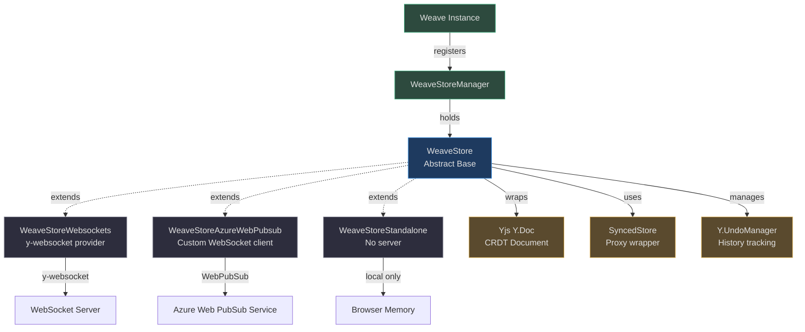
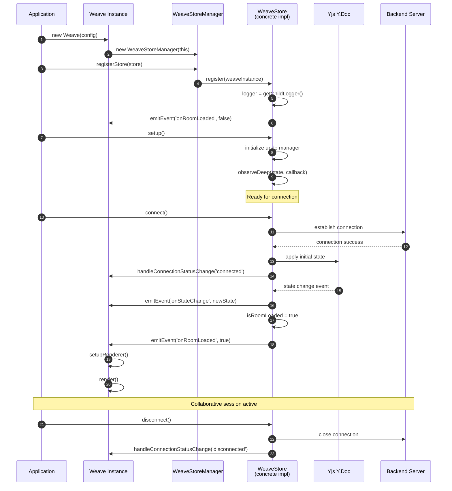
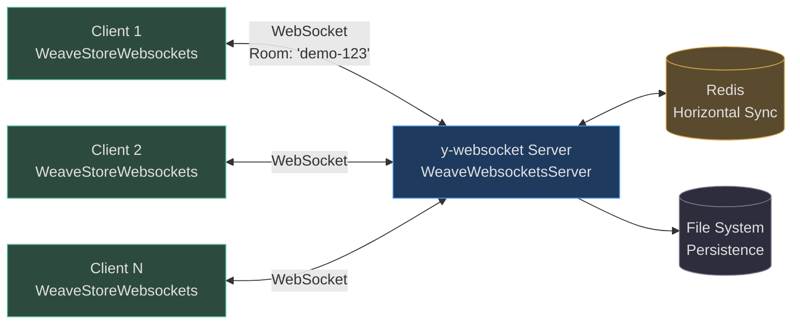
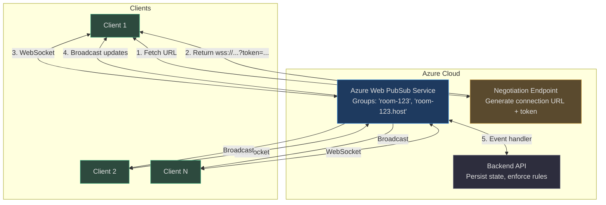
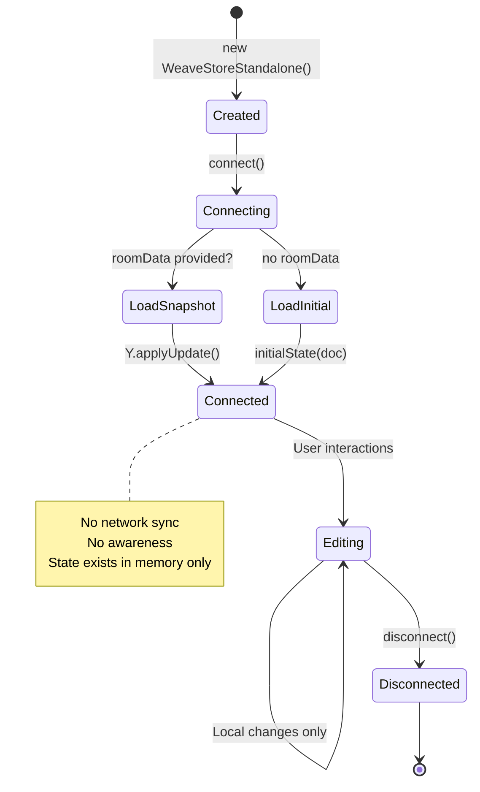
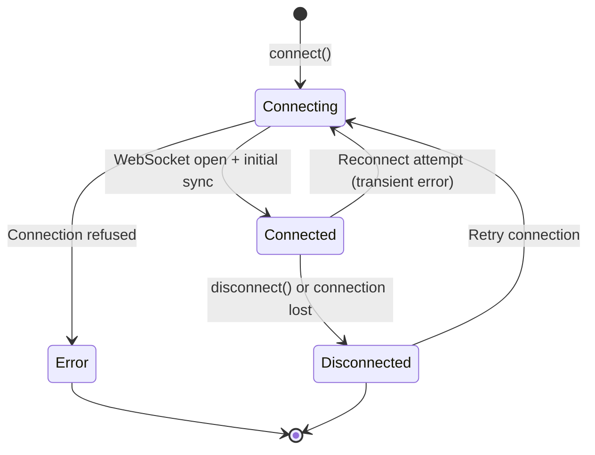

# Store Architecture & Synchronization

Weave.js abstracts real-time collaborative state synchronization through a pluggable **store layer** that wraps [Yjs](https://yjs.dev/) — a battle-tested CRDT (Conflict-free Replicated Data Type) library. The store architecture provides a unified interface for state management while allowing multiple backend implementations (WebSockets, Azure Web PubSub, standalone mode) to coexist without changing application code.

This page traces the complete store lifecycle — from abstract base class to concrete implementations, connection management, awareness propagation, and custom store creation.

## Architecture Overview

At its core, Weave.js state synchronization follows a **three-layer architecture**:

| Layer | Responsibility | Key Files |
|---|---|---|
| **Abstract Store** | Defines the store contract, manages Yjs document lifecycle, undo/redo, awareness | [`store.ts`](https://github.com/thegovind/weavejs/blob/main/code/packages/sdk/src/stores/store.ts) |
| **Store Implementations** | WebSocket, Azure Web PubSub, Standalone — each extends `WeaveStore` | [`store-websockets.ts`](https://github.com/thegovind/weavejs/blob/main/code/packages/store-websockets/src/store-websockets.ts), [`store-azure-web-pubsub.ts`](https://github.com/thegovind/weavejs/blob/main/code/packages/store-azure-web-pubsub/src/store-azure-web-pubsub.ts), [`store-standalone.ts`](https://github.com/thegovind/weavejs/blob/main/code/packages/store-standalone/src/store-standalone.ts) |
| **Store Manager** | Registers and provides access to the active store instance | [`managers/store.ts`](https://github.com/thegovind/weavejs/blob/main/code/packages/sdk/src/managers/store.ts) |


<!-- Sources: code/packages/sdk/src/stores/store.ts:36-61, code/packages/sdk/src/managers/store.ts:9-34, code/packages/store-websockets/src/store-websockets.ts:17-41, code/packages/store-azure-web-pubsub/src/store-azure-web-pubsub.ts:21-54, code/packages/store-standalone/src/store-standalone.ts:14-28 -->

## Store Base Class (WeaveStore)

The [`WeaveStore`](https://github.com/thegovind/weavejs/blob/main/code/packages/sdk/src/stores/store.ts#L36-L279) abstract class defines the contract all store implementations must fulfill. It manages:

1. **Yjs Document Lifecycle** — creation, loading, snapshotting
2. **SyncedStore Integration** — proxy-based reactive state
3. **Undo/Redo Management** — per-user history tracking
4. **Awareness Propagation** — cursor positions, selections, presence
5. **Connection Status** — unified status reporting across backends

### Core Store API

| Method | Purpose | Source |
|---|---|---|
| `register(instance: Weave)` | Attach store to Weave instance, setup logger | [store.ts:70-81](https://github.com/thegovind/weavejs/blob/main/code/packages/sdk/src/stores/store.ts#L70-L81) |
| `setup()` | Initialize undo manager, state observers, room lifecycle | [store.ts:135-225](https://github.com/thegovind/weavejs/blob/main/code/packages/sdk/src/stores/store.ts#L135-L225) |
| `getDocument()` | Access underlying Yjs Y.Doc | [store.ts:99-101](https://github.com/thegovind/weavejs/blob/main/code/packages/sdk/src/stores/store.ts#L99-L101) |
| `getState()` | Retrieve SyncedStore proxy | [store.ts:115-117](https://github.com/thegovind/weavejs/blob/main/code/packages/sdk/src/stores/store.ts#L115-L117) |
| `getStateJson()` | JSON serialization of current state | [store.ts:119-121](https://github.com/thegovind/weavejs/blob/main/code/packages/sdk/src/stores/store.ts#L119-L121) |
| `getStateSnapshot()` | Binary Yjs snapshot (Uint8Array) | [store.ts:123-126](https://github.com/thegovind/weavejs/blob/main/code/packages/sdk/src/stores/store.ts#L123-L126) |
| `loadDocument(data)` | Apply Yjs update from binary snapshot | [store.ts:103-105](https://github.com/thegovind/weavejs/blob/main/code/packages/sdk/src/stores/store.ts#L103-L105) |
| `undoStateStep()` | Undo last change (if undo manager enabled) | [store.ts:243-251](https://github.com/thegovind/weavejs/blob/main/code/packages/sdk/src/stores/store.ts#L243-L251) |
| `redoStateStep()` | Redo previously undone change | [store.ts:253-261](https://github.com/thegovind/weavejs/blob/main/code/packages/sdk/src/stores/store.ts#L253-L261) |
| `connect()` | **Abstract** — establish server connection | [store.ts:272](https://github.com/thegovind/weavejs/blob/main/code/packages/sdk/src/stores/store.ts#L272) |
| `disconnect()` | **Abstract** — tear down connection | [store.ts:274](https://github.com/thegovind/weavejs/blob/main/code/packages/sdk/src/stores/store.ts#L274) |
| `handleAwarenessChange()` | **Abstract** — sync cursor/selection state | [store.ts:276](https://github.com/thegovind/weavejs/blob/main/code/packages/sdk/src/stores/store.ts#L276) |
| `setAwarenessInfo()` | **Abstract** — update local awareness field | [store.ts:278](https://github.com/thegovind/weavejs/blob/main/code/packages/sdk/src/stores/store.ts#L278) |

### Store Initialization & SyncedStore Proxy

The store constructor initializes both the **Yjs document** and a **SyncedStore proxy** — a reactive wrapper that allows plain JavaScript object syntax for CRDT operations:

```typescript
<!-- Source: code/packages/sdk/src/stores/store.ts:50-60 -->
constructor(config: WeaveStoreOptions) {
  this.config = config;
  this.isRoomLoaded = false;
  this.latestState = { weave: {} };
  
  // Create SyncedStore proxy
  this.state = syncedStore<WeaveState>({ weave: {} });
  
  // Extract Yjs document from proxy
  this.document = getYjsDoc(this.state);
}
```

**Why SyncedStore?** Direct Yjs Y.Map/Y.Array manipulation is verbose. SyncedStore provides a transparent proxy that converts:

```javascript
// Instead of:
doc.getMap('weave').set('stage', new Y.Map())

// You write:
state.weave.stage = { id: 'stage', children: [] }
```

Source: [store.ts:56-59](https://github.com/thegovind/weavejs/blob/main/code/packages/sdk/src/stores/store.ts#L56-L59)

### Store Lifecycle Sequence


<!-- Sources: code/packages/sdk/src/stores/store.ts:70-81, code/packages/sdk/src/stores/store.ts:135-225, code/packages/sdk/src/managers/store.ts:24-33 -->

**Key lifecycle events:**

1. **Registration** ([store.ts:70-81](https://github.com/thegovind/weavejs/blob/main/code/packages/sdk/src/stores/store.ts#L70-L81)): Store receives Weave instance reference, sets up logger
2. **Setup** ([store.ts:135-225](https://github.com/thegovind/weavejs/blob/main/code/packages/sdk/src/stores/store.ts#L135-L225)): Undo manager initialized, deep observer attached to state changes
3. **Connection** (implementation-specific): Backend establishes sync channel
4. **Room Loaded** ([store.ts:213-219](https://github.com/thegovind/weavejs/blob/main/code/packages/sdk/src/stores/store.ts#L213-L219)): First non-empty state triggers renderer setup

### Undo/Redo Management

Weave.js provides **per-user undo/redo** via [Y.UndoManager](https://docs.yjs.dev/api/undo-manager):

```typescript
<!-- Source: code/packages/sdk/src/stores/store.ts:140-183 -->
if (this.supportsUndoManager) {
  const weaveStateValues = getYjsValue(this.getState().weave);
  
  this.undoManager = new Y.UndoManager([weaveStateValues], {
    captureTimeout: 250,
    trackedOrigins: new Set([this.config.getUser().id]),
    ...this.config?.undoManagerOptions,
  });
  
  this.undoManager.addTrackedOrigin(this.config.getUser().id);
  
  // Emit stack changes for UI updates
  this.undoManager.on('stack-item-added', () => { /* ... */ });
  this.undoManager.on('stack-item-popped', () => { /* ... */ });
}
```

**Why `trackedOrigins`?** Undo should only revert _your_ changes, not collaborators'. By tracking user ID as origin, Y.UndoManager filters out remote edits.

Source: [store.ts:140-183](https://github.com/thegovind/weavejs/blob/main/code/packages/sdk/src/stores/store.ts#L140-L183)

## Store Implementations Comparison

Weave.js ships with three store implementations tailored to different deployment scenarios:

| Store | Use Case | Server Required | Awareness | Persistence | Package |
|---|---|---|---|---|---|
| **WebSockets** | Development, self-hosted | ✅ Yes (y-websocket) | ✅ Full | Optional (filesystem/Redis) | `@inditextech/weave-store-websockets` |
| **Azure Web PubSub** | Production, cloud-native | ✅ Yes (Azure service) | ✅ Full | External (Azure Storage, DB) | `@inditextech/weave-store-azure-web-pubsub` |
| **Standalone** | Offline, demos, testing | ❌ No | ❌ None | ❌ Client-only | `@inditextech/weave-store-standalone` |

### WebSocket Store

The [`WeaveStoreWebsockets`](https://github.com/thegovind/weavejs/blob/main/code/packages/store-websockets/src/store-websockets.ts#L17-L138) implementation wraps the official **y-websocket** provider, enabling rapid development and self-hosted deployments.

**Architecture:**


<!-- Sources: code/packages/store-websockets/src/store-websockets.ts:17-138, code/packages/store-websockets/dev-server/express-server.ts:47-106 -->

**Key features:**

- **y-websocket provider** ([store-websockets.ts:66-74](https://github.com/thegovind/weavejs/blob/main/code/packages/store-websockets/src/store-websockets.ts#L66-L74)): Zero-config sync via official Yjs adapter
- **Connection status events** ([store-websockets.ts:76-105](https://github.com/thegovind/weavejs/blob/main/code/packages/store-websockets/src/store-websockets.ts#L76-L105)): `connected`, `connecting`, `disconnected`, `error`
- **Optional Redis horizontal scaling** ([express-server.ts:48-57](https://github.com/thegovind/weavejs/blob/main/code/packages/store-websockets/dev-server/express-server.ts#L48-L57)): Sync across multiple server instances
- **Filesystem persistence** ([express-server.ts:69-105](https://github.com/thegovind/weavejs/blob/main/code/packages/store-websockets/dev-server/express-server.ts#L69-L105)): Auto-save room snapshots on change

**Client initialization:**

```typescript
<!-- Source: code/packages/store-websockets/src/store-websockets.ts:26-41 -->
const store = new WeaveStoreWebsockets(
  initialRoomData,       // Uint8Array | setup function | undefined
  {
    getUser: () => ({ id: 'user1', name: 'Alice', email: 'alice@example.com' }),
    undoManagerOptions: { captureTimeout: 250 }
  },
  {
    roomId: 'demo-room-123',
    wsOptions: { serverUrl: 'ws://localhost:1234' }
  }
);
```

**Server setup** (dev server example):

```typescript
<!-- Source: code/packages/store-websockets/dev-server/express-server.ts:47-106 -->
const wss = new WeaveWebsocketsServer({
  horizontalSyncHandlerConfig: {
    type: 'redis',
    config: {
      host: 'localhost',
      port: 6379,
      keyPrefix: 'weavejs:room-sync:'
    }
  },
  performUpgrade: async (req) => /\/sync\/rooms\/(.*)/.test(req.url),
  extractRoomId: (req) => req.url?.match(/\/sync\/rooms\/(.*)/)?.[1],
  fetchRoom: async (docName) => fs.readFile(`./rooms/${docName}`),
  persistRoom: async (docName, state) => fs.writeFile(`./rooms/${docName}`, state)
});
```

### Azure Web PubSub Store

The [`WeaveStoreAzureWebPubsub`](https://github.com/thegovind/weavejs/blob/main/code/packages/store-azure-web-pubsub/src/store-azure-web-pubsub.ts#L21-L160) implementation is designed for **production cloud deployments** using Azure Web PubSub — a fully managed WebSocket service with built-in scaling, authentication, and monitoring.

**Architecture:**


<!-- Sources: code/packages/store-azure-web-pubsub/src/store-azure-web-pubsub.ts:21-160, code/packages/store-azure-web-pubsub/src/client.ts:107-598 -->

**Unique features:**

1. **Dynamic connection URL negotiation** ([client.ts:367-395](https://github.com/thegovind/weavejs/blob/main/code/packages/store-azure-web-pubsub/src/client.ts#L367-L395)): Fetch WebSocket URL with embedded access token
2. **Chunked message handling** ([client.ts:658-702](https://github.com/thegovind/weavejs/blob/main/code/packages/store-azure-web-pubsub/src/client.ts#L658-L702)): Automatic splitting for 64KB message limit
3. **Resync interval** ([client.ts:258-303](https://github.com/thegovind/weavejs/blob/main/code/packages/store-azure-web-pubsub/src/client.ts#L258-L303)): Periodic state refresh + timeout detection
4. **Group-based messaging** ([client.ts:612-623](https://github.com/thegovind/weavejs/blob/main/code/packages/store-azure-web-pubsub/src/client.ts#L612-L623)): Rooms isolated via Azure groups

**Client initialization:**

```typescript
<!-- Source: code/packages/store-azure-web-pubsub/src/store-azure-web-pubsub.ts:32-54 -->
const store = new WeaveStoreAzureWebPubsub(
  initialRoomData,
  {
    getUser: () => ({ id: 'user1', name: 'Alice', email: 'alice@example.com' }),
  },
  {
    roomId: 'demo-room-123',
    url: '/api/negotiate',           // Negotiation endpoint
    resyncIntervalMs: 15000,         // Resync every 15s
    fetchClient: window.fetch        // Custom fetch (optional)
  }
);

await store.connect({ tenantId: 'acme-corp' });  // Extra params for URL
```

**Resync mechanism** (ensures eventual consistency even with dropped messages):

```typescript
<!-- Source: code/packages/store-azure-web-pubsub/src/client.ts:258-303 -->
setupResyncInterval(): void {
  this._resyncInterval = setInterval(() => {
    if (this._ws && this._wsConnected) {
      const encoder = encoding.createEncoder();
      encoding.writeVarUint(encoder, messageSyncStep1);
      syncProtocol.writeSyncStep1(encoder, this.doc);
      sendToControlGroup(this, this.topic, MessageDataType.Sync, encoding.toUint8Array(encoder));
    }
  }, this._options.resyncInterval);
  
  this._resyncCheckInterval = setInterval(() => {
    const now = Date.now();
    const diffInSeconds = (now - this._lastReceivedSyncResponse) / 1000;
    
    if (diffInSeconds > resyncWindowLimitInSeconds && this._ws?.readyState === WebSocket.OPEN) {
      // Force reconnect if no response received
      this._ws.dispatchEvent(new CustomEvent('error', { detail: new Error('No sync response') }));
      this._ws._ws.close();
    }
  }, this._options.resyncInterval + 5000);
}
```

### Standalone Store

The [`WeaveStoreStandalone`](https://github.com/thegovind/weavejs/blob/main/code/packages/store-standalone/src/store-standalone.ts#L14-L50) implementation runs entirely **client-side** with no server connection — ideal for demos, testing, or offline editing.

**Architecture:**


<!-- Sources: code/packages/store-standalone/src/store-standalone.ts:14-50 -->

**Usage:**

```typescript
<!-- Source: code/packages/store-standalone/src/store-standalone.ts:20-28 -->
const store = new WeaveStoreStandalone(
  {
    roomData: 'base64-encoded-snapshot',  // Optional
    initialState: (doc) => {
      // Custom initialization
      const state = doc.getMap('weave');
      state.set('stage', { id: 'stage', children: [] });
    }
  },
  { getUser: () => ({ id: 'local', name: 'Local User', email: 'local@example.com' }) }
);

await store.connect();  // No actual network call
```

**No-op awareness methods** ([store-standalone.ts:47-49](https://github.com/thegovind/weavejs/blob/main/code/packages/store-standalone/src/store-standalone.ts#L47-L49)):

```typescript
handleAwarenessChange(): void {}
setAwarenessInfo(): void {}
```

## Connection Status Management

All stores emit a unified **connection status** via the `onStoreConnectionStatusChange` event. Applications listen to this to display connection indicators.

### Connection Status States

| Status | Meaning | Emitted By | Source |
|---|---|---|---|
| `'connecting'` | Connection attempt in progress | WebSockets, Azure Web PubSub | [store-websockets.ts:88](https://github.com/thegovind/weavejs/blob/main/code/packages/store-websockets/src/store-websockets.ts#L88), [client.ts:445](https://github.com/thegovind/weavejs/blob/main/code/packages/store-azure-web-pubsub/src/client.ts#L445) |
| `'connected'` | Successfully synced with server | All implementations | [store-websockets.ts:79](https://github.com/thegovind/weavejs/blob/main/code/packages/store-websockets/src/store-websockets.ts#L79), [client.ts:529](https://github.com/thegovind/weavejs/blob/main/code/packages/store-azure-web-pubsub/src/client.ts#L529), [store-standalone.ts:38](https://github.com/thegovind/weavejs/blob/main/code/packages/store-standalone/src/store-standalone.ts#L38) |
| `'disconnected'` | Connection closed (intentional or error) | All implementations | [store-websockets.ts:93](https://github.com/thegovind/weavejs/blob/main/code/packages/store-websockets/src/store-websockets.ts#L93), [client.ts:509](https://github.com/thegovind/weavejs/blob/main/code/packages/store-azure-web-pubsub/src/client.ts#L509), [store-standalone.ts:43](https://github.com/thegovind/weavejs/blob/main/code/packages/store-standalone/src/store-standalone.ts#L43) |
| `'error'` | Fatal error during initial connection | WebSockets, Azure Web PubSub | [store-websockets.ts:104](https://github.com/thegovind/weavejs/blob/main/code/packages/store-websockets/src/store-websockets.ts#L104), [client.ts:450](https://github.com/thegovind/weavejs/blob/main/code/packages/store-azure-web-pubsub/src/client.ts#L450) |

Constants defined in [`types/constants.ts:82-87`](https://github.com/thegovind/weavejs/blob/main/code/packages/types/src/constants.ts#L82-L87):

```typescript
export const WEAVE_STORE_CONNECTION_STATUS = {
  ['ERROR']: 'error',
  ['CONNECTING']: 'connecting',
  ['CONNECTED']: 'connected',
  ['DISCONNECTED']: 'disconnected',
} as const;
```

**Status change flow:**


<!-- Sources: code/packages/types/src/constants.ts:82-87, code/packages/sdk/src/stores/store.ts:264-269 -->

**Listening for status changes:**

```typescript
weave.addEventListener('onStoreConnectionStatusChange', (status) => {
  console.log('Store status:', status);  // 'connecting' | 'connected' | 'disconnected' | 'error'
});
```

Source: [store.ts:264-269](https://github.com/thegovind/weavejs/blob/main/code/packages/sdk/src/stores/store.ts#L264-L269)

## Awareness & Presence

**Awareness** is Yjs's mechanism for ephemeral, non-persistent data like cursor positions, selections, and user presence. Unlike document state, awareness data:

- **Does not persist** — disappears on disconnect
- **Is not conflict-free** — last write wins
- **Requires manual cleanup** — clients must broadcast "null" on disconnect

### Awareness in WebSocket Store

```typescript
<!-- Source: code/packages/store-websockets/src/store-websockets.ts:108-137 -->
connect(): void {
  const awareness = this.provider.awareness;
  awareness.on('update', this.handleAwarenessChange.bind(this));
  awareness.on('change', this.handleAwarenessChange.bind(this));
  this.provider.connect();
}

handleAwarenessChange(emit: boolean = true): void {
  const awareness = this.provider.awareness;
  const values = Array.from(awareness.getStates().values());
  values.splice(awareness.clientID, 1);  // Exclude self
  if (emit) {
    this.instance.emitEvent('onAwarenessChange', values);
  }
}

setAwarenessInfo<T>(field: string, value: T): void {
  const awareness = this.provider.awareness;
  awareness.setLocalStateField(field, value);
}
```

Source: [store-websockets.ts:108-137](https://github.com/thegovind/weavejs/blob/main/code/packages/store-websockets/src/store-websockets.ts#L108-L137)

### Awareness in Azure Web PubSub Store

Azure implementation manually encodes awareness updates into the JSON protocol:

```typescript
<!-- Source: code/packages/store-azure-web-pubsub/src/client.ts:202-220 -->
this._awarenessUpdateHandler = ({ added, updated, removed }) => {
  const changedClients = added.concat(updated).concat(removed);
  const encoder = encoding.createEncoder();
  encoding.writeVarUint(encoder, messageAwareness);
  encoding.writeVarUint8Array(
    encoder,
    awarenessProtocol.encodeAwarenessUpdate(this.awareness, changedClients)
  );
  
  sendToControlGroup(
    this,
    topic,
    MessageDataType.Awareness,
    encoding.toUint8Array(encoder)
  );
};

this._awareness.on('update', this._awarenessUpdateHandler);
```

Source: [client.ts:202-220](https://github.com/thegovind/weavejs/blob/main/code/packages/store-azure-web-pubsub/src/client.ts#L202-L220)

## Creating a Custom Store

To implement a custom store (e.g., for Socket.IO, MQTT, or Firestore):

### Step 1: Extend WeaveStore

```typescript
import { WeaveStore } from '@inditextech/weave-sdk';
import { WEAVE_STORE_CONNECTION_STATUS, type WeaveStoreOptions } from '@inditextech/weave-types';

export class WeaveStoreCustom extends WeaveStore {
  protected name = 'custom-store';
  protected supportsUndoManager = true;  // Enable undo/redo
  
  private client: CustomSyncClient;

  constructor(config: WeaveStoreOptions, customOptions: CustomOptions) {
    super(config);
    this.client = new CustomSyncClient(customOptions);
  }
  
  // ...implement abstract methods
}
```

### Step 2: Implement Abstract Methods

```typescript
async connect(): Promise<void> {
  // Establish connection
  await this.client.connect();
  
  // Setup sync handlers
  this.client.on('update', (update: Uint8Array) => {
    Y.applyUpdate(this.getDocument(), update);
  });
  
  // Notify Weave of connection
  this.handleConnectionStatusChange(WEAVE_STORE_CONNECTION_STATUS.CONNECTED);
  
  // Setup awareness
  const awareness = new awarenessProtocol.Awareness(this.getDocument());
  awareness.on('update', ({ added, updated, removed }) => {
    this.client.sendAwareness(added.concat(updated).concat(removed));
  });
}

disconnect(): void {
  this.client.disconnect();
  this.handleConnectionStatusChange(WEAVE_STORE_CONNECTION_STATUS.DISCONNECTED);
}

handleAwarenessChange(emit: boolean = true): void {
  const values = Array.from(this.awareness.getStates().values());
  if (emit) {
    this.instance.emitEvent('onAwarenessChange', values);
  }
}

setAwarenessInfo<T>(field: string, value: T): void {
  this.awareness.setLocalStateField(field, value);
}
```

### Step 3: Register with Weave

```typescript
const store = new WeaveStoreCustom(
  { getUser: () => currentUser },
  { endpoint: 'https://sync.example.com' }
);

const weave = new Weave({
  store,
  nodes: [...],
  actions: [...]
});

await store.connect();
```

**Key integration points:**

1. **Document sync**: Forward Yjs updates to/from your backend ([store.ts:103-105](https://github.com/thegovind/weavejs/blob/main/code/packages/sdk/src/stores/store.ts#L103-L105))
2. **Connection status**: Call `handleConnectionStatusChange()` on state transitions ([store.ts:264-269](https://github.com/thegovind/weavejs/blob/main/code/packages/sdk/src/stores/store.ts#L264-L269))
3. **Awareness**: Integrate with Yjs's `awarenessProtocol` (see [client.ts:179-220](https://github.com/thegovind/weavejs/blob/main/code/packages/store-azure-web-pubsub/src/client.ts#L179-L220) for reference)
4. **Room loading**: Emit `onRoomLoaded` when first state arrives ([store.ts:213-219](https://github.com/thegovind/weavejs/blob/main/code/packages/sdk/src/stores/store.ts#L213-L219))

## State Serialization

The [`WeaveStateSerializer`](https://github.com/thegovind/weavejs/blob/main/code/packages/sdk/src/state-serializer/state-serializer.ts#L9-L81) converts between React elements and JSON — necessary for persisting and transmitting Weave's declarative node tree.

**Serialization** ([state-serializer.ts:10-26](https://github.com/thegovind/weavejs/blob/main/code/packages/sdk/src/state-serializer/state-serializer.ts#L10-L26)):

```typescript
serialize(element: React.ReactNode): string {
  const replacer = (key: string, value: any) => {
    switch (key) {
      case '_owner':
      case '_store':
      case 'ref':
        return;  // Strip React internals
      default:
        return value;
    }
  };
  return JSON.stringify(element, replacer);
}
```

**Deserialization** ([state-serializer.ts:41-80](https://github.com/thegovind/weavejs/blob/main/code/packages/sdk/src/state-serializer/state-serializer.ts#L41-L80)):

```typescript
deserializeElement(element: WeaveStateElement): any {
  const { key, type, props } = element;
  
  let restProps: Record<string, unknown> = {};
  let childrenNodes: React.ReactNode[] = [];
  
  if (props.children) {
    const { children, ...actRestProps } = props;
    restProps = actRestProps;
    childrenNodes = this.deserializeElement(children);
  } else {
    restProps = props;
  }
  
  return React.createElement(
    type.toLowerCase(),
    { ...restProps, key: key as string },
    childrenNodes
  );
}
```

**Why needed?** Yjs stores JSON-serializable data. React elements include non-serializable references (`_owner`, `_store`, `ref`). The serializer strips these while preserving the element tree structure.

## Related Pages

| Page | Relevance |
|---|---|
| [Architecture Overview](./architecture.md) | High-level system design — how stores fit into the overall architecture |
| [SDK Core](./sdk-core.md) | Weave instance lifecycle, plugin system, event handling |
| [Quickstart Guide](../getting-started/quickstart.md) | Practical examples of initializing stores in a new project |

---

**Next steps:**

- Explore [Nodes & Actions](./nodes-actions.md) to understand how UI components interact with store state
- Review [Plugins Architecture](./plugins.md) for extending store behavior (e.g., persistence, conflict resolution)
- Check [Server Setup Guide](../guides/server-setup.md) for WebSocket and Azure Web PubSub deployment
