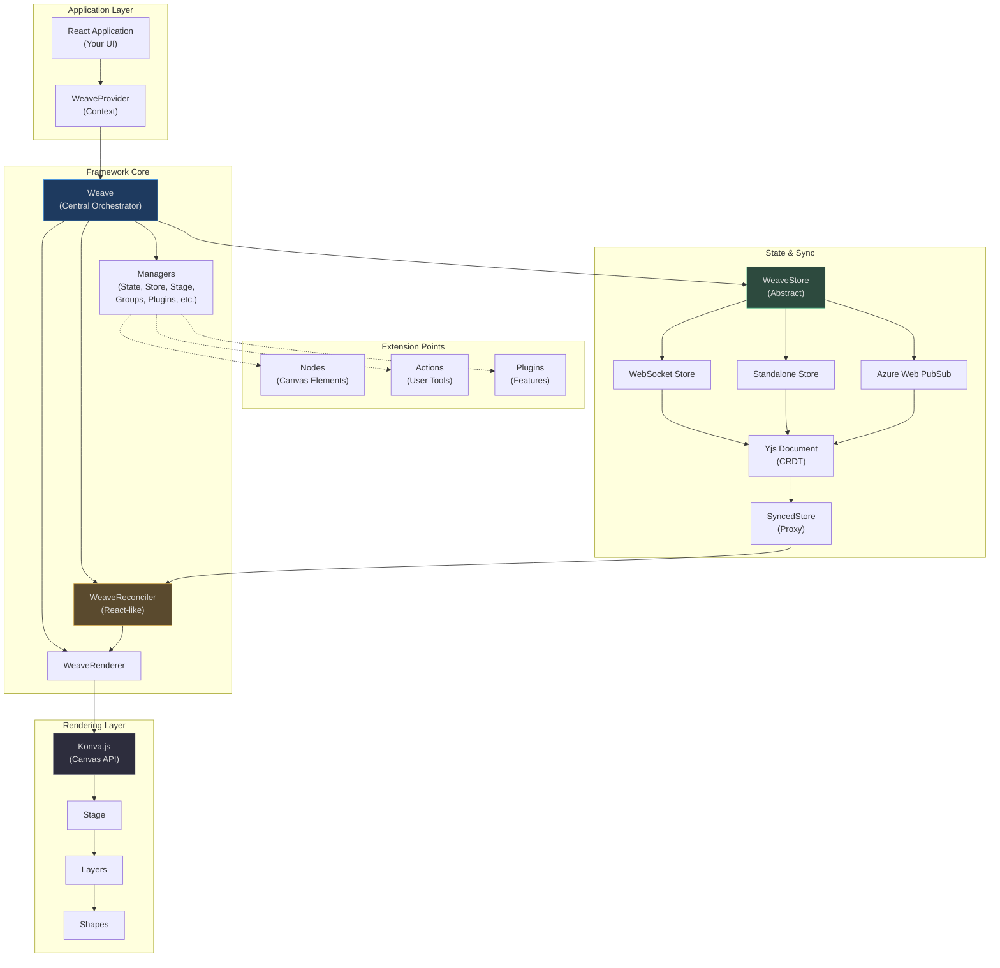
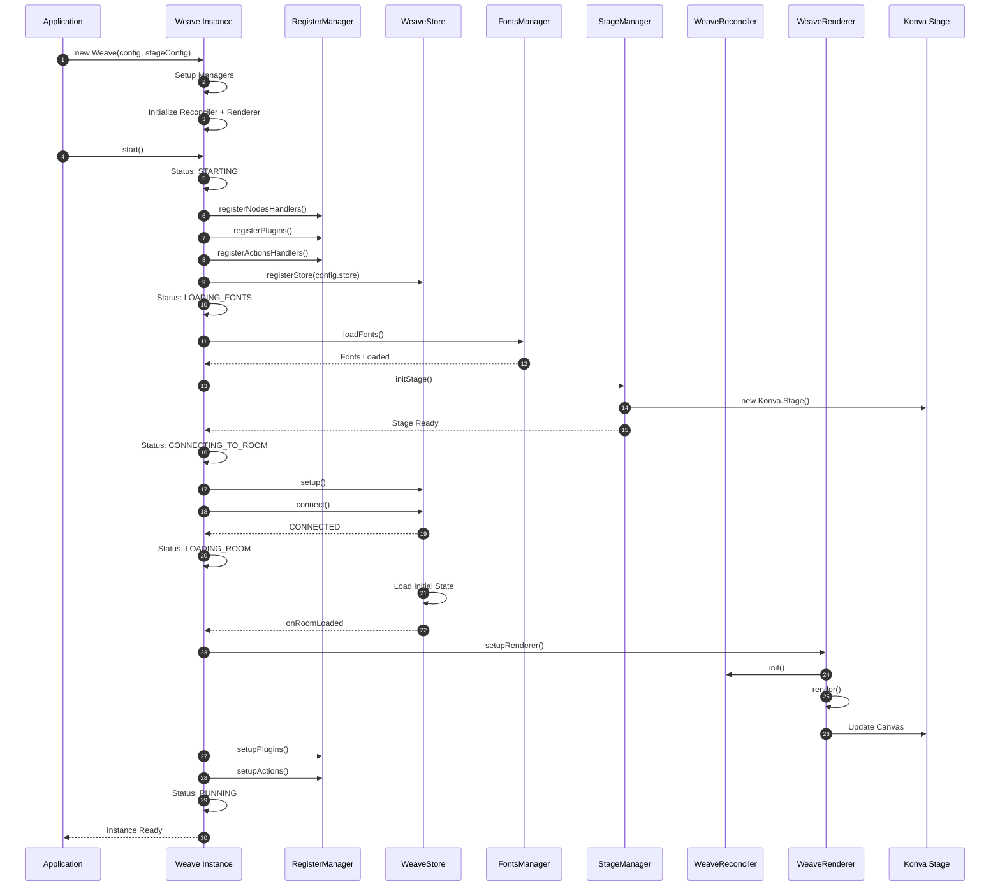
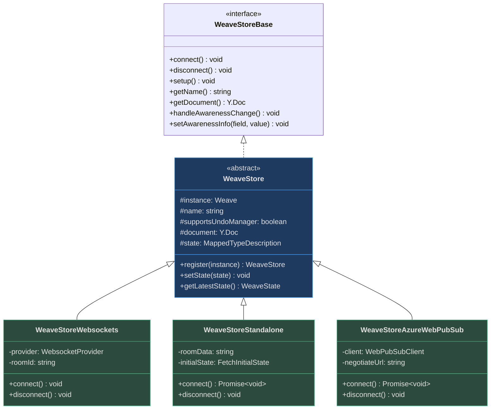
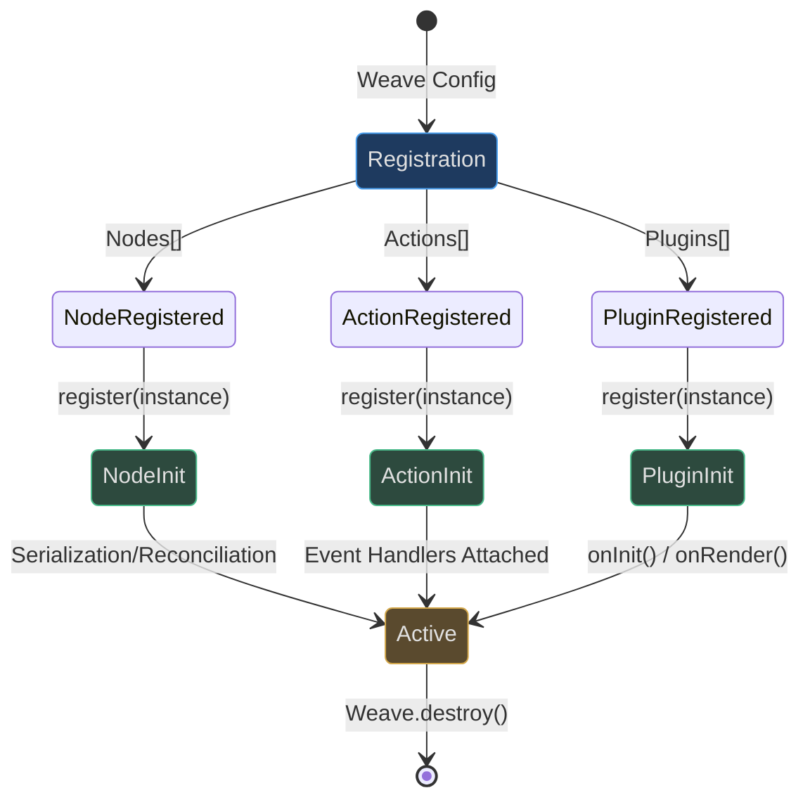
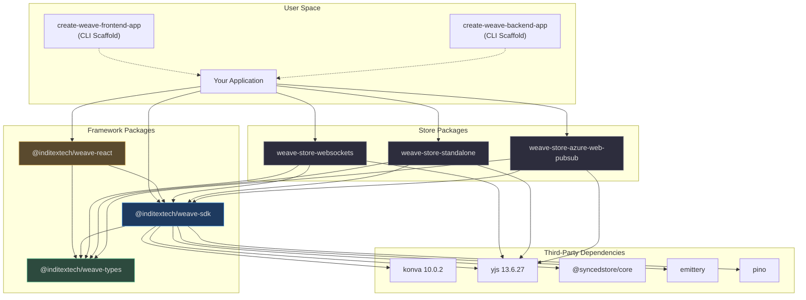

# Weave.js Overview

Weave.js is a **headless framework for building real-time collaborative canvas applications** like whiteboards, diagram editors, and visual design tools. It solves the complex problem of synchronizing interactive visual state across multiple users while providing developers full control over the UI layer.

## Why Weave.js Exists

Building collaborative canvas applications from scratch requires solving several hard problems simultaneously:

1. **Real-time state synchronization** — ensuring all users see consistent state without conflicts
2. **Canvas rendering and interactions** — handling complex shape manipulation, transformations, and selections
3. **Plugin architecture** — extending functionality without coupling core logic
4. **Store abstraction** — supporting different backend infrastructures (WebSockets, Azure Web PubSub, standalone)
5. **Undo/redo with CRDT** — implementing operation history that works correctly in collaborative scenarios

Weave.js addresses these challenges with a **CRDT-based synchronization engine** ([Yjs](https://github.com/yjs/yjs)), a **declarative React-like rendering model** powered by a custom reconciler, and an **extensible plugin system** — all while remaining UI-agnostic.

## At-a-Glance

| Aspect | Description | Key Files |
|--------|-------------|-----------|
| **Core SDK** | Central orchestrator managing lifecycle, state, and coordination | [sdk/src/weave.ts:82-171](https://github.com/thegovind/weavejs/blob/main/code/packages/sdk/src/weave.ts#L82-L171) |
| **Canvas Rendering** | Konva.js-based rendering with custom React Reconciler | [sdk/src/reconciler/](https://github.com/thegovind/weavejs/blob/main/code/packages/sdk/src/reconciler/) |
| **State Sync** | CRDT synchronization via Yjs + SyncedStore | [sdk/src/stores/store.ts:36-100](https://github.com/thegovind/weavejs/blob/main/code/packages/sdk/src/stores/store.ts#L36-L100) |
| **Store Abstraction** | Pluggable backends (WebSocket, Azure, Standalone) | [store-websockets](https://github.com/thegovind/weavejs/blob/main/code/packages/store-websockets/src/store-websockets.ts), [store-standalone](https://github.com/thegovind/weavejs/blob/main/code/packages/store-standalone/src/store-standalone.ts) |
| **Extension Model** | Nodes (canvas elements), Actions (tools), Plugins (features) | [sdk/src/nodes/node.ts:73-90](https://github.com/thegovind/weavejs/blob/main/code/packages/sdk/src/nodes/node.ts#L73-L90), [sdk/src/actions/action.ts:15-58](https://github.com/thegovind/weavejs/blob/main/code/packages/sdk/src/actions/action.ts#L15-L58), [sdk/src/plugins/plugin.ts:9-44](https://github.com/thegovind/weavejs/blob/main/code/packages/sdk/src/plugins/plugin.ts#L9-L44) |
| **React Bindings** | Hooks and providers for React integration | [react/src/index.ts](https://github.com/thegovind/weavejs/blob/main/code/packages/react/src/index.ts) |
| **Type Safety** | Comprehensive TypeScript definitions | [types/src/types.ts](https://github.com/thegovind/weavejs/blob/main/code/packages/types/src/types.ts), [types/src/constants.ts](https://github.com/thegovind/weavejs/blob/main/code/packages/types/src/constants.ts) |
| **Quickstart** | CLI tools to scaffold frontend/backend apps | [create-frontend-app](https://github.com/thegovind/weavejs/tree/main/code/packages/create-frontend-app), [create-backend-app](https://github.com/thegovind/weavejs/tree/main/code/packages/create-backend-app) |

## Core Architecture

Weave.js follows a layered architecture separating concerns between state management, rendering, and extensibility:



<!-- Sources: code/packages/sdk/src/weave.ts:82-171, code/packages/sdk/src/stores/store.ts:36-100, code/packages/sdk/src/reconciler/reconciler.ts, code/packages/sdk/src/renderer/renderer.ts -->

### Lifecycle Flow

Understanding how a Weave.js instance initializes and renders helps clarify the framework's operation:



<!-- Sources: code/packages/sdk/src/weave.ts:230-282, code/packages/sdk/src/managers/register.ts, code/packages/sdk/src/managers/fonts.ts, code/packages/sdk/src/stores/store.ts:36-100 -->

## Core Concepts

### 1. Headless Framework

Weave.js is **UI-agnostic** — it doesn't dictate how you build your UI. You provide the HTML container, and Weave.js manages the canvas. All UI controls (toolbars, panels, dialogs) are your responsibility, giving you complete design freedom.

The framework emits events for state changes, selections, and user actions, which you consume to update your UI reactively.

```typescript
// Example: You control the UI, Weave handles canvas
const weave = new Weave(config, { container: canvasDiv });
weave.addEventListener('onSelectionChange', (selection) => {
  updatePropertiesPanel(selection); // Your UI code
});
```

### 2. CRDT-Based Synchronization

Weave.js uses [Yjs](https://github.com/yjs/yjs) as its CRDT (Conflict-free Replicated Data Type) engine, wrapped by [SyncedStore](https://github.com/yousefed/SyncedStore) for a friendlier API. This means:

- **No server-side conflict resolution** — CRDTs mathematically guarantee consistency
- **Offline-first** — changes merge correctly when reconnected
- **Efficient delta sync** — only changed data is transmitted
- **Built-in undo/redo** — works correctly in collaborative contexts

The shared state is a Yjs document synchronized through your chosen store backend.

**Key Implementation:**

| Component | Responsibility | Source |
|-----------|---------------|--------|
| `WeaveStore` | Abstract base managing Yjs doc and SyncedStore proxy | [store.ts:36-100](https://github.com/thegovind/weavejs/blob/main/code/packages/sdk/src/stores/store.ts#L36-L100) |
| `WeaveStoreWebsockets` | WebSocket provider using `y-websocket` | [store-websockets.ts:17-138](https://github.com/thegovind/weavejs/blob/main/code/packages/store-websockets/src/store-websockets.ts#L17-L138) |
| `WeaveStoreStandalone` | Local-only store (no network sync) | [store-standalone.ts:14-50](https://github.com/thegovind/weavejs/blob/main/code/packages/store-standalone/src/store-standalone.ts#L14-L50) |
| `WeaveStoreAzureWebPubSub` | Azure-backed store for enterprise scenarios | [store-azure-web-pubsub](https://github.com/thegovind/weavejs/tree/main/code/packages/store-azure-web-pubsub) |

### 3. Store Abstraction

The store layer decouples synchronization strategy from core logic. All stores implement the `WeaveStoreBase` interface:



<!-- Sources: code/packages/sdk/src/stores/store.ts:36-100, code/packages/store-websockets/src/store-websockets.ts:17-138, code/packages/store-standalone/src/store-standalone.ts:14-50 -->

You choose your store at instantiation:

```typescript
// WebSocket backend
const store = new WeaveStoreWebsockets(
  initialData, 
  storeOptions, 
  { roomId: 'room-123', wsOptions: { serverUrl: 'ws://localhost:8080' } }
);

// Standalone (local-only)
const store = new WeaveStoreStandalone(
  { initialState: defaultInitialState },
  storeOptions
);

const weave = new Weave({ store, nodes, actions, plugins }, stageConfig);
```

### 4. Node, Action, Plugin System

Weave.js extensibility is built on three primitives:

| Type | Purpose | Examples | Base Class | Source |
|------|---------|----------|------------|--------|
| **Node** | Renderable canvas element (shape, group, etc.) | Rectangle, Text, Image, Group | `WeaveNode` | [node.ts:73-90](https://github.com/thegovind/weavejs/blob/main/code/packages/sdk/src/nodes/node.ts#L73-L90) |
| **Action** | User interaction tool that manipulates nodes | Selection Tool, Move Tool, Draw Tool | `WeaveAction` | [action.ts:15-58](https://github.com/thegovind/weavejs/blob/main/code/packages/sdk/src/actions/action.ts#L15-L58) |
| **Plugin** | Cross-cutting feature that enhances behavior | Snapping, Awareness Cursors, Copy/Paste | `WeavePlugin` | [plugin.ts:9-44](https://github.com/thegovind/weavejs/blob/main/code/packages/sdk/src/plugins/plugin.ts#L9-L44) |

**Extension Flow:**



<!-- Sources: code/packages/sdk/src/weave.ts:250-256, code/packages/sdk/src/managers/register.ts, code/packages/sdk/src/nodes/node.ts:80-89, code/packages/sdk/src/actions/action.ts:50-58, code/packages/sdk/src/plugins/plugin.ts:15-23 -->

**Nodes** define how canvas elements are serialized/deserialized and rendered. Each node type implements:

- `serialize(instance)` — Convert Konva instance to state element
- `deserialize(props)` — Create Konva instance from state
- Event handlers (`onClick`, `onDragMove`, etc.)

**Actions** handle user interactions with the stage (not individual nodes):

- `onPointerDown`, `onPointerMove`, `onPointerUp` — Mouse/touch events
- `onKeyDown`, `onKeyUp` — Keyboard interactions
- `onStart`, `onEnd` — Lifecycle hooks

**Plugins** add orthogonal features:

- `onInit()` — Setup logic after first render
- `onRender()` — Logic to run on each render
- `enable()` / `disable()` — Toggle functionality

### 5. React-like Rendering with Custom Reconciler

Weave.js uses a **custom React Reconciler** to map state changes to Konva canvas operations. This provides:

- **Declarative rendering** — describe canvas state, don't manually manipulate it
- **Efficient updates** — only changed nodes are re-rendered
- **Familiar mental model** — like React components, but for canvas

The reconciler compares the previous and current `WeaveState` (a tree of `WeaveStateElement` objects) and applies minimal changes to the Konva stage.

**Key Components:**

| Component | Responsibility | Source |
|-----------|---------------|--------|
| `WeaveReconciler` | Compares state trees and computes diffs | [reconciler.ts](https://github.com/thegovind/weavejs/blob/main/code/packages/sdk/src/reconciler/reconciler.ts) |
| `WeaveRenderer` | Orchestrates rendering and manages render queue | [renderer.ts](https://github.com/thegovind/weavejs/blob/main/code/packages/sdk/src/renderer/renderer.ts) |
| `WeaveStateSerializer` | Converts between Konva instances and state elements | [state-serializer.ts](https://github.com/thegovind/weavejs/blob/main/code/packages/sdk/src/state-serializer/state-serializer.ts) |

### 6. State Structure

Weave's shared state follows a specific schema:

```typescript
type WeaveState = {
  weave: {
    key: 'stage';
    type: 'stage';
    props: {
      id: 'stage';
      children: WeaveStateElement[];  // Top-level nodes
    };
  } | Record<string, WeaveStateElement>;
};

type WeaveStateElement = {
  key: string;         // Unique ID
  type: string;        // Node type (e.g., 'rect', 'text')
  props: {
    id?: string;
    nodeType?: string;
    children?: WeaveStateElement[];  // Nested nodes (groups)
    // ...Konva properties (x, y, width, height, etc.)
  };
};
```

The state is stored in a Yjs document and observed for changes. When a remote user modifies state, Yjs emits deltas, and the reconciler updates the local Konva stage.

## Package Ecosystem

Weave.js is distributed as a **monorepo** using Nx and npm workspaces. Each package serves a distinct purpose:

| Package | Purpose | Key Exports | Source | Published As |
|---------|---------|-------------|--------|--------------|
| `@inditextech/weave-sdk` | Core framework with Weave class, managers, reconciler | `Weave`, `WeaveNode`, `WeaveAction`, `WeavePlugin`, `WeaveStore` | [code/packages/sdk](https://github.com/thegovind/weavejs/tree/main/code/packages/sdk) | `@inditextech/weave-sdk` |
| `@inditextech/weave-types` | TypeScript definitions, interfaces, constants | `WeaveConfig`, `WeaveState`, `WeaveStatus`, constants | [code/packages/types](https://github.com/thegovind/weavejs/tree/main/code/packages/types) | `@inditextech/weave-types` |
| `@inditextech/weave-react` | React bindings (provider, hooks) | `WeaveProvider`, `useWeave`, `useWeaveEvents` | [code/packages/react](https://github.com/thegovind/weavejs/tree/main/code/packages/react) | `@inditextech/weave-react` |
| `@inditextech/weave-store-websockets` | WebSocket-based store using `y-websocket` | `WeaveStoreWebsockets` | [code/packages/store-websockets](https://github.com/thegovind/weavejs/tree/main/code/packages/store-websockets) | `@inditextech/weave-store-websockets` |
| `@inditextech/weave-store-standalone` | Standalone store (no network) | `WeaveStoreStandalone` | [code/packages/store-standalone](https://github.com/thegovind/weavejs/tree/main/code/packages/store-standalone) | `@inditextech/weave-store-standalone` |
| `@inditextech/weave-store-azure-web-pubsub` | Azure Web PubSub store for enterprise | `WeaveStoreAzureWebPubSub` | [code/packages/store-azure-web-pubsub](https://github.com/thegovind/weavejs/tree/main/code/packages/store-azure-web-pubsub) | `@inditextech/weave-store-azure-web-pubsub` |
| `create-weave-frontend-app` | CLI to scaffold React frontend | Interactive CLI | [code/packages/create-frontend-app](https://github.com/thegovind/weavejs/tree/main/code/packages/create-frontend-app) | `create-weave-frontend-app` |
| `create-weave-backend-app` | CLI to scaffold Express.js WebSocket backend | Interactive CLI | [code/packages/create-backend-app](https://github.com/thegovind/weavejs/tree/main/code/packages/create-backend-app) | `create-weave-backend-app` |

### Package Dependencies



<!-- Sources: code/package.json:6-8, code/packages/sdk/package.json, code/packages/react/package.json, code/packages/store-websockets/package.json -->

## Configuration and Status

### Instance Configuration

The `Weave` class accepts two configuration objects:

1. **WeaveConfig** — Framework configuration
2. **Konva.StageConfig** — Canvas configuration

```typescript
type WeaveConfig = {
  store: WeaveStoreBase;               // Required: synchronization backend
  nodes?: WeaveNodeBase[];             // Custom node types
  actions?: WeaveActionBase[];         // Custom interaction tools
  plugins?: WeavePluginBase[];         // Feature extensions
  fonts?: WeaveFont[] | WeaveFontsPreloadFunction;  // Font preloading
  logger?: WeaveLoggerConfig;          // Logging configuration
  performance?: WeavePerformanceConfig; // Performance tuning
};
```

**Source:** [types/src/types.ts:40-48](https://github.com/thegovind/weavejs/blob/main/code/packages/types/src/types.ts#L40-L48)

### Lifecycle Status

Weave instances progress through distinct lifecycle states tracked by `WeaveStatus`:

| Status | Description | Constant | Source |
|--------|-------------|----------|--------|
| `idle` | Initial state, not started | `WEAVE_INSTANCE_STATUS.IDLE` | [constants.ts:18-19](https://github.com/thegovind/weavejs/blob/main/code/packages/types/src/constants.ts#L18-L19) |
| `starting` | Registering nodes/actions/plugins | `WEAVE_INSTANCE_STATUS.STARTING` | [constants.ts:20](https://github.com/thegovind/weavejs/blob/main/code/packages/types/src/constants.ts#L20) |
| `loadingFonts` | Preloading custom fonts | `WEAVE_INSTANCE_STATUS.LOADING_FONTS` | [constants.ts:21](https://github.com/thegovind/weavejs/blob/main/code/packages/types/src/constants.ts#L21) |
| `connectingToRoom` | Establishing store connection | `WEAVE_INSTANCE_STATUS.CONNECTING_TO_ROOM` | [constants.ts:22](https://github.com/thegovind/weavejs/blob/main/code/packages/types/src/constants.ts#L22) |
| `connectingError` | Store connection failed | `WEAVE_INSTANCE_STATUS.CONNECTING_ERROR` | [constants.ts:23](https://github.com/thegovind/weavejs/blob/main/code/packages/types/src/constants.ts#L23) |
| `loadingRoom` | Loading initial state from store | `WEAVE_INSTANCE_STATUS.LOADING_ROOM` | [constants.ts:24](https://github.com/thegovind/weavejs/blob/main/code/packages/types/src/constants.ts#L24) |
| `running` | Fully initialized and ready | `WEAVE_INSTANCE_STATUS.RUNNING` | [constants.ts:25](https://github.com/thegovind/weavejs/blob/main/code/packages/types/src/constants.ts#L25) |

**Example: Listening to status changes:**

```typescript
weave.addEventListener('onInstanceStatus', (status: WeaveStatus) => {
  if (status === WEAVE_INSTANCE_STATUS.RUNNING) {
    console.log('Weave is ready!');
  }
});
```

## Technology Stack

Weave.js integrates several best-in-class libraries:

| Technology | Purpose | Version | Why This Choice | Link |
|------------|---------|---------|-----------------|------|
| **Konva.js** | Canvas rendering and manipulation | 10.0.2 | High-performance, battle-tested 2D canvas library with comprehensive shape APIs | [GitHub](https://github.com/konvajs/konva) |
| **Yjs** | CRDT synchronization engine | 13.6.27 | Industry-leading CRDT implementation with efficient delta encoding | [GitHub](https://github.com/yjs/yjs) |
| **SyncedStore** | Proxy-based Yjs wrapper | Latest | Simplifies Yjs API with familiar object/array operations | [GitHub](https://github.com/yousefed/SyncedStore) |
| **React Reconciler** | Declarative rendering abstraction | React 18.x | Enables React-like mental model for canvas updates | [Docs](https://github.com/facebook/react/tree/main/packages/react-reconciler) |
| **Emittery** | Type-safe event emitter | Latest | Better DX than Node EventEmitter with async support | [GitHub](https://github.com/sindresorhus/emittery) |
| **Pino** | Structured logging | Latest | Extremely fast JSON logger with child logger support | [GitHub](https://github.com/pinojs/pino) |
| **Nx** | Monorepo tooling | 19.x | Efficient build system with caching and task orchestration | [Website](https://nx.dev/) |

**Source:** [code/package.json:63-66](https://github.com/thegovind/weavejs/blob/main/code/package.json#L63-L66)

## Key Design Decisions

1. **Headless by Design** — No UI lock-in. You control all visual elements outside the canvas.
2. **CRDT-First** — Yjs guarantees consistency without custom conflict resolution logic.
3. **Store Abstraction** — Swap backends without changing application code.
4. **React Reconciler** — Declarative canvas updates prevent manual DOM/canvas management bugs.
5. **TypeScript-Native** — Full type safety across the entire API surface.
6. **Monorepo Structure** — Independent versioning of core, stores, and bindings.

## Typical Usage Pattern

1. **Backend:** Run a WebSocket server with Yjs support (or use Azure Web PubSub)
2. **Frontend:** 
   - Instantiate a store (`WeaveStoreWebsockets`, `WeaveStoreStandalone`, etc.)
   - Create a `Weave` instance with your store, nodes, actions, plugins
   - Call `weave.start()` to initialize
   - Use `WeaveProvider` (React) or raw event listeners to sync UI with canvas state
3. **Extend:** Add custom nodes for your shapes, actions for your tools, plugins for features

## Event System

Weave.js is event-driven. Key events include:

| Event | Payload | When Fired | Source |
|-------|---------|------------|--------|
| `onInstanceStatus` | `WeaveStatus` | Instance lifecycle state changes | [weave.ts:198](https://github.com/thegovind/weavejs/blob/main/code/packages/sdk/src/weave.ts#L198) |
| `onStoreConnectionStatusChange` | `WeaveStoreConnectionStatus` | Store connection state changes | [weave.ts:214-228](https://github.com/thegovind/weavejs/blob/main/code/packages/sdk/src/weave.ts#L214-L228) |
| `onRoomLoaded` | `boolean` | Initial state loaded from store | [weave.ts:244](https://github.com/thegovind/weavejs/blob/main/code/packages/sdk/src/weave.ts#L244) |
| `onAwarenessChange` | `any[]` | User presence data updated | [store-websockets.ts:130](https://github.com/thegovind/weavejs/blob/main/code/packages/store-websockets/src/store-websockets.ts#L130) |
| `onUserChange` | `WeaveUserChangeEvent` | User creates/updates/deletes node | [weave.ts:394-399](https://github.com/thegovind/weavejs/blob/main/code/packages/sdk/src/weave.ts#L394-L399) |
| `onSelectionChange` | `WeaveSelection[]` | Selected nodes change | Built-in selection plugin |
| `onPropsChange` | `WeaveActionPropsChangeEvent` | Action properties change | [action.ts:33-36](https://github.com/thegovind/weavejs/blob/main/code/packages/sdk/src/actions/action.ts#L33-L36) |

Subscribe with:

```typescript
weave.addEventListener('onInstanceStatus', (status) => { /* ... */ });
weave.addOnceEventListener('onRoomLoaded', () => { /* ... */ });
weave.removeEventListener('onInstanceStatus', handler);
```

## Manager Architecture

The `Weave` instance delegates responsibilities to specialized managers:

| Manager | Responsibility | Source |
|---------|----------------|--------|
| `WeaveSetupManager` | Initialization, logging, welcome messages | [managers/setup.ts](https://github.com/thegovind/weavejs/blob/main/code/packages/sdk/src/managers/setup.ts) |
| `WeaveRegisterManager` | Register nodes, actions, plugins | [managers/register.ts](https://github.com/thegovind/weavejs/blob/main/code/packages/sdk/src/managers/register.ts) |
| `WeaveStoreManager` | Manage store lifecycle and events | [managers/store.ts](https://github.com/thegovind/weavejs/blob/main/code/packages/sdk/src/managers/store.ts) |
| `WeaveStateManager` | Read/write shared state | [managers/state.ts](https://github.com/thegovind/weavejs/blob/main/code/packages/sdk/src/managers/state.ts) |
| `WeaveStageManager` | Konva Stage initialization and config | [managers/stage.ts](https://github.com/thegovind/weavejs/blob/main/code/packages/sdk/src/managers/stage.ts) |
| `WeaveGroupsManager` | Group/ungroup node operations | [managers/groups.ts](https://github.com/thegovind/weavejs/blob/main/code/packages/sdk/src/managers/groups.ts) |
| `WeaveFontsManager` | Font preloading | [managers/fonts.ts](https://github.com/thegovind/weavejs/blob/main/code/packages/sdk/src/managers/fonts.ts) |
| `WeaveZIndexManager` | Z-order manipulation (bring to front, etc.) | [managers/zindex.ts](https://github.com/thegovind/weavejs/blob/main/code/packages/sdk/src/managers/zindex.ts) |
| `WeaveExportManager` | Export canvas to PNG/JPEG | [managers/export/export.ts](https://github.com/thegovind/weavejs/blob/main/code/packages/sdk/src/managers/export/export.ts) |
| `WeavePluginsManager` | Manage plugin lifecycle | [managers/plugins.ts](https://github.com/thegovind/weavejs/blob/main/code/packages/sdk/src/managers/plugins.ts) |
| `WeaveActionsManager` | Manage action lifecycle and activation | [managers/actions.ts](https://github.com/thegovind/weavejs/blob/main/code/packages/sdk/src/managers/actions.ts) |
| `WeaveUsersManager` | Track user metadata | [managers/users/users.ts](https://github.com/thegovind/weavejs/blob/main/code/packages/sdk/src/managers/users/users.ts) |
| `WeaveMutexManager` | Distributed locking for node edits | [managers/mutex/mutex.ts](https://github.com/thegovind/weavejs/blob/main/code/packages/sdk/src/managers/mutex/mutex.ts) |
| `WeaveAsyncManager` | Handle async element states (loading images, etc.) | [managers/async/async.ts](https://github.com/thegovind/weavejs/blob/main/code/packages/sdk/src/managers/async/async.ts) |
| `WeaveHooksManager` | Lifecycle hooks for extensions | [managers/hooks.ts](https://github.com/thegovind/weavejs/blob/main/code/packages/sdk/src/managers/hooks.ts) |

**Source:** [weave.ts:94-110](https://github.com/thegovind/weavejs/blob/main/code/packages/sdk/src/weave.ts#L94-L110)

This separation ensures each concern is isolated and testable.

## Getting Started

To quickly scaffold a Weave.js project:

```bash
# Backend (WebSocket server)
pnpm create weave-backend-app
cd my-service
pnpm run dev  # Runs on http://localhost:8080

# Frontend (React app)
pnpm create weave-frontend-app
cd my-app
pnpm run dev  # Runs on http://localhost:3030
```

This generates:
- An Express.js server with `y-websocket` provider
- A React app with `WeaveProvider`, basic canvas, and example nodes

From there, customize nodes, add tools (actions), and enable plugins.

## Related Pages

| Page | Description |
|------|-------------|
| [Getting Started: Setup](./setup.md) | Installation, prerequisites, and environment setup |
| [Getting Started: Quickstart](./quickstart.md) | Step-by-step guide to your first Weave.js app |
| [Deep Dive: Architecture](../deep-dive/architecture.md) | Detailed architectural patterns and design principles |
| [Deep Dive: SDK Core](../deep-dive/sdk-core.md) | In-depth look at the `Weave` class and manager system |
| [Deep Dive: State Management](../deep-dive/state-management.md) | How state synchronization and reconciliation work |
| [Deep Dive: Stores](../deep-dive/stores.md) | Store implementations and custom store development |
| [Deep Dive: Extension Model](../deep-dive/extension-model.md) | Building custom nodes, actions, and plugins |
| [API Reference: Weave Class](../api-reference/weave-class.md) | Complete API documentation for the Weave instance |
