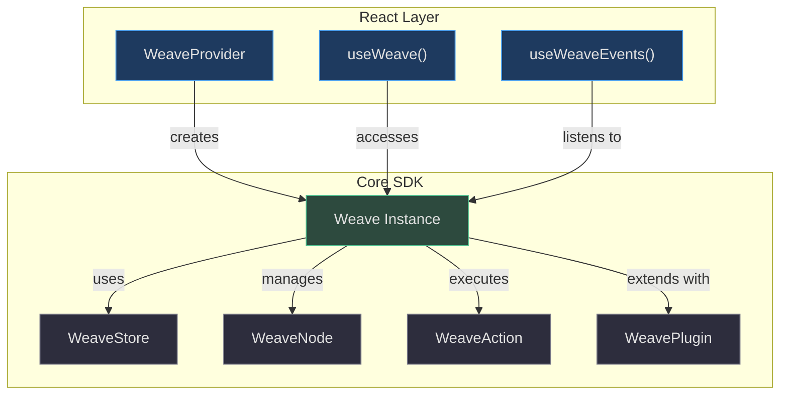

# API Quick Reference

Concise reference for core Weave.js APIs, types, hooks, and configuration options — organized for quick lookup.

<!-- Source repository: https://github.com/thegovind/weavejs, branch: main -->

## Overview

Weave.js exposes a layered API surface designed for collaborative canvas applications:

- **Weave Core SDK** — Main instance managing nodes, state, and lifecycle
- **React Integration** — Provider, hooks, and event utilities
- **Node System** — Base classes for custom node types
- **Action System** — Base classes for custom interactions
- **Plugin System** — Extension points for features
- **Store System** — Abstract persistence layer with undo/redo



<!-- Sources: code/packages/sdk/src/weave.ts:82-111, code/packages/react/src/components/provider.tsx:38-49, code/packages/react/src/components/store.tsx:70-71 -->

---

## Weave Core API

### Instance Lifecycle

| Method | Return Type | Description | Source |
|--------|------------|-------------|---------|
| `async start()` | `Promise<void>` | Initialize and connect to store, load fonts, setup stage | [weave.ts:230-282](https://github.com/thegovind/weavejs/blob/main/code/packages/sdk/src/weave.ts#L230-L282) |
| `destroy()` | `void` | Tear down instance, disconnect store, clear listeners | [weave.ts:284-315](https://github.com/thegovind/weavejs/blob/main/code/packages/sdk/src/weave.ts#L284-L315) |
| `getStatus()` | `WeaveStatus` | Get current instance status (idle, starting, running, etc.) | [weave.ts:206-208](https://github.com/thegovind/weavejs/blob/main/code/packages/sdk/src/weave.ts#L206-L208) |
| `getId()` | `string` | Get unique instance identifier (UUID) | [weave.ts:317-320](https://github.com/thegovind/weavejs/blob/main/code/packages/sdk/src/weave.ts#L317-L320) |
| `render()` | `void` | Force re-render of canvas from current state | [weave.ts:600-603](https://github.com/thegovind/weavejs/blob/main/code/packages/sdk/src/weave.ts#L600-L603) |

### Node Management

Core methods for adding, updating, and removing nodes from the canvas state:

| Method | Parameters | Description | Source |
|--------|-----------|-------------|---------|
| `addNode()` | `node: WeaveStateElement`<br>`options?: { emitUserChangeEvent?: boolean }` | Add node with transaction wrapper | [weave.ts:630-643](https://github.com/thegovind/weavejs/blob/main/code/packages/sdk/src/weave.ts#L630-L643) |
| `addNodeNT()` | `node: WeaveStateElement`<br>`options?: { emitUserChangeEvent?: boolean }` | Add node without transaction (NT = No Transaction) | [weave.ts:644-677](https://github.com/thegovind/weavejs/blob/main/code/packages/sdk/src/weave.ts#L644-L677) |
| `updateNode()` | `node: WeaveStateElement`<br>`options?: { emitUserChangeEvent?: boolean }` | Update node with transaction wrapper | [weave.ts:678-686](https://github.com/thegovind/weavejs/blob/main/code/packages/sdk/src/weave.ts#L678-L686) |
| `updateNodeNT()` | `node: WeaveStateElement`<br>`options?: { emitUserChangeEvent?: boolean }` | Update node without transaction | [weave.ts:687-717](https://github.com/thegovind/weavejs/blob/main/code/packages/sdk/src/weave.ts#L687-L717) |
| `updateNodes()` | `nodes: WeaveStateElement[]`<br>`options?: { emitUserChangeEvent?: boolean }` | Batch update with transaction wrapper | [weave.ts:718-726](https://github.com/thegovind/weavejs/blob/main/code/packages/sdk/src/weave.ts#L718-L726) |
| `removeNode()` | `node: WeaveStateElement`<br>`options?: { emitUserChangeEvent?: boolean }` | Remove node with transaction wrapper | [weave.ts:775-783](https://github.com/thegovind/weavejs/blob/main/code/packages/sdk/src/weave.ts#L775-L783) |
| `removeNodeNT()` | `node: WeaveStateElement`<br>`options?: { emitUserChangeEvent?: boolean }` | Remove node without transaction | [weave.ts:784-817](https://github.com/thegovind/weavejs/blob/main/code/packages/sdk/src/weave.ts#L784-L817) |
| `removeNodes()` | `nodes: WeaveStateElement[]`<br>`options?: { emitUserChangeEvent?: boolean }` | Batch remove with transaction wrapper | [weave.ts:836-844](https://github.com/thegovind/weavejs/blob/main/code/packages/sdk/src/weave.ts#L836-L844) |
| `getNode()` | `nodeKey: string` | Get node by ID with parent info | [weave.ts:622-629](https://github.com/thegovind/weavejs/blob/main/code/packages/sdk/src/weave.ts#L622-L629) |
| `findNodeById()` | `id: string`<br>`instance?: Konva.Container` | Find node instance in Konva tree | [weave.ts:606-613](https://github.com/thegovind/weavejs/blob/main/code/packages/sdk/src/weave.ts#L606-L613) |
| `findNodesByType()` | `nodeType: string`<br>`instance?: Konva.Container` | Find all nodes of specific type | [weave.ts:615-621](https://github.com/thegovind/weavejs/blob/main/code/packages/sdk/src/weave.ts#L615-L621) |

**Transaction Pattern**: Methods suffixed with `NT` (No Transaction) execute immediately without wrapping in a state transaction. Use these for batch operations where you manage transactions manually via `stateTransactional()`.

### Z-Index & Grouping

| Method | Parameters | Description | Source |
|--------|-----------|-------------|---------|
| `zMoveNode()` | `node: WeaveStateElement`<br>`position: WeavePosition`<br>`options?: { emitUserChangeEvent?: boolean }` | Move node to specific z-index position (up, down, front, back) | [weave.ts:860-868](https://github.com/thegovind/weavejs/blob/main/code/packages/sdk/src/weave.ts#L860-L868) |
| `moveUp()` | `node: WeaveElementInstance` | Move one layer up in z-order | [weave.ts:981-983](https://github.com/thegovind/weavejs/blob/main/code/packages/sdk/src/weave.ts#L981-L983) |
| `moveDown()` | `node: WeaveElementInstance` | Move one layer down in z-order | [weave.ts:985-987](https://github.com/thegovind/weavejs/blob/main/code/packages/sdk/src/weave.ts#L985-L987) |
| `bringToFront()` | `nodes: WeaveElementInstance \| WeaveElementInstance[]` | Move to top of z-order | [weave.ts:993-995](https://github.com/thegovind/weavejs/blob/main/code/packages/sdk/src/weave.ts#L993-L995) |
| `sendToBack()` | `nodes: WeaveElementInstance \| WeaveElementInstance[]` | Move to bottom of z-order | [weave.ts:989-991](https://github.com/thegovind/weavejs/blob/main/code/packages/sdk/src/weave.ts#L989-L991) |
| `group()` | `nodes: WeaveStateElement[]` | Create group from nodes | [weave.ts:999-1001](https://github.com/thegovind/weavejs/blob/main/code/packages/sdk/src/weave.ts#L999-L1001) |
| `unGroup()` | `group: WeaveStateElement` | Ungroup nodes back to parent | [weave.ts:1003-1005](https://github.com/thegovind/weavejs/blob/main/code/packages/sdk/src/weave.ts#L1003-L1005) |

### State & Store

| Method | Parameters | Description | Source |
|--------|-----------|-------------|---------|
| `update()` | `newState: WeaveState` | Replace entire state (used by store) | [weave.ts:593-598](https://github.com/thegovind/weavejs/blob/main/code/packages/sdk/src/weave.ts#L593-L598) |
| `stateTransactional()` | `callback: () => void` | Wrap state mutations in transaction | [weave.ts:975-977](https://github.com/thegovind/weavejs/blob/main/code/packages/sdk/src/weave.ts#L975-L977) |
| `getElementsTree()` | — | Get flattened array of all nodes | [weave.ts:903-905](https://github.com/thegovind/weavejs/blob/main/code/packages/sdk/src/weave.ts#L903-L905) |
| `isEmpty()` | — | Check if canvas has any nodes | [weave.ts:907-909](https://github.com/thegovind/weavejs/blob/main/code/packages/sdk/src/weave.ts#L907-L909) |

**Note**: Undo/redo is managed via the store. Call `store.undoStateStep()` and `store.redoStateStep()` — see [Store System](#store-system-base-class) below.

### Event System

| Method | Parameters | Description | Source |
|--------|-----------|-------------|---------|
| `addEventListener<T>()` | `event: string`<br>`callback: (payload: T) => void` | Register event listener with typed payload | [weave.ts:342-351](https://github.com/thegovind/weavejs/blob/main/code/packages/sdk/src/weave.ts#L342-L351) |
| `removeEventListener<T>()` | `event: string`<br>`callback: (payload: T) => void` | Unregister event listener | [weave.ts:352-355](https://github.com/thegovind/weavejs/blob/main/code/packages/sdk/src/weave.ts#L352-L355) |
| `emitEvent<T>()` | `event: string`<br>`payload?: T` | Emit event to listeners (internal use) | [weave.ts:337-340](https://github.com/thegovind/weavejs/blob/main/code/packages/sdk/src/weave.ts#L337-L340) |

**Key Events**:
- `onInstanceStatus` → `WeaveStatus` — Lifecycle state changes (idle → starting → running)
- `onStateChange` → `WeaveState` — Any state mutation
- `onRoomLoaded` → `boolean` — Store connection established
- `onUndoManagerStatusChange` → `WeaveUndoRedoChange` — Undo/redo stack changes
- `onNodeChange` → Selection change details
- `onZoomChange` → Zoom level changed
- `onSelectionState` → Selection active/inactive
- `onNodesChange` → Selected nodes changed

### Plugins & Extensions

| Method | Parameters | Description | Source |
|--------|-----------|-------------|---------|
| `getPlugin<T>()` | `pluginName: string` | Get plugin instance by name (typed) | [weave.ts:516-518](https://github.com/thegovind/weavejs/blob/main/code/packages/sdk/src/weave.ts#L516-L518) |
| `isPluginEnabled()` | `pluginName: string` | Check if plugin is active | [weave.ts:557-559](https://github.com/thegovind/weavejs/blob/main/code/packages/sdk/src/weave.ts#L557-L559) |
| `enablePlugin()` | `pluginName: string` | Enable plugin at runtime | [weave.ts:561-563](https://github.com/thegovind/weavejs/blob/main/code/packages/sdk/src/weave.ts#L561-L563) |
| `disablePlugin()` | `pluginName: string` | Disable plugin at runtime | [weave.ts:565-569](https://github.com/thegovind/weavejs/blob/main/code/packages/sdk/src/weave.ts#L565-L569) |

### Lock & Visibility

| Method | Parameters | Description | Source |
|--------|-----------|-------------|---------|
| `lockNode()` | `node: Konva.Node` | Lock node (prevent editing) | [weave.ts:1162-1172](https://github.com/thegovind/weavejs/blob/main/code/packages/sdk/src/weave.ts#L1162-L1172) |
| `unlockNode()` | `node: Konva.Node` | Unlock node | [weave.ts:1188-1198](https://github.com/thegovind/weavejs/blob/main/code/packages/sdk/src/weave.ts#L1188-L1198) |
| `allNodesLocked()` | `nodes: Konva.Node[]` | Check if all nodes locked | [weave.ts:1138-1160](https://github.com/thegovind/weavejs/blob/main/code/packages/sdk/src/weave.ts#L1138-L1160) |
| `allNodesVisible()` | `nodes: Konva.Node[]` | Check if all nodes visible | [weave.ts:1216-1232](https://github.com/thegovind/weavejs/blob/main/code/packages/sdk/src/weave.ts#L1216-L1232) |
| `allNodesHidden()` | `nodes: Konva.Node[]` | Check if all nodes hidden | [weave.ts:1234-1250](https://github.com/thegovind/weavejs/blob/main/code/packages/sdk/src/weave.ts#L1234-L1250) |

### Export

| Method | Parameters | Description | Source |
|--------|-----------|-------------|---------|
| `exportNodes()` | `nodes: WeaveElementInstance[]`<br>`boundingNodes: (nodes: Konva.Node[]) => Konva.Node[]`<br>`options: WeaveExportNodesOptions` | Export nodes as image (client-side) | [weave.ts:1080-1090](https://github.com/thegovind/weavejs/blob/main/code/packages/sdk/src/weave.ts#L1080-L1090) |
| `imageToBase64()` | `img: HTMLImageElement`<br>`mimeType: string` | Convert HTMLImage to base64 string | [weave.ts:1076-1078](https://github.com/thegovind/weavejs/blob/main/code/packages/sdk/src/weave.ts#L1076-L1078) |

---

## React Integration

### WeaveProvider Props

| Prop | Type | Required | Default | Description | Source |
|------|------|----------|---------|-------------|---------|
| `getContainer` | `() => HTMLElement` | ✅ | — | Function returning canvas container element | [provider.tsx:26](https://github.com/thegovind/weavejs/blob/main/code/packages/react/src/components/provider.tsx#L26) |
| `store` | `WeaveStore` | ✅ | — | Store instance for state persistence | [provider.tsx:28](https://github.com/thegovind/weavejs/blob/main/code/packages/react/src/components/provider.tsx#L28) |
| `nodes` | `WeaveNode[]` | — | `[]` | Node handlers for custom node types | [provider.tsx:29](https://github.com/thegovind/weavejs/blob/main/code/packages/react/src/components/provider.tsx#L29) |
| `actions` | `WeaveAction[]` | — | `[]` | Action handlers for custom interactions | [provider.tsx:30](https://github.com/thegovind/weavejs/blob/main/code/packages/react/src/components/provider.tsx#L30) |
| `plugins` | `WeavePlugin[]` | — | `[]` | Plugin instances for extensions | [provider.tsx:31](https://github.com/thegovind/weavejs/blob/main/code/packages/react/src/components/provider.tsx#L31) |
| `fonts` | `WeaveFont[] \| (() => Promise<WeaveFont[]>)` | — | `[]` | Fonts array or async loader | [provider.tsx:27](https://github.com/thegovind/weavejs/blob/main/code/packages/react/src/components/provider.tsx#L27) |
| `performance` | `WeavePerformanceConfig` | — | — | Performance tuning (upscale config) | [provider.tsx:32](https://github.com/thegovind/weavejs/blob/main/code/packages/react/src/components/provider.tsx#L32) |
| `logLevel` | `'debug' \| 'info' \| 'warn' \| 'error'` | — | `'info'` | Logging verbosity | [provider.tsx:34](https://github.com/thegovind/weavejs/blob/main/code/packages/react/src/components/provider.tsx#L34) |
| `logModules` | `WeaveChildLoggerLevel[]` | — | `[]` | Per-module log overrides (`module:level` format) | [provider.tsx:35](https://github.com/thegovind/weavejs/blob/main/code/packages/react/src/components/provider.tsx#L35) |

**Example**:
```tsx
<WeaveProvider
  getContainer={() => document.getElementById('canvas')!}
  store={myStore}
  nodes={[MyCustomNode]}
  actions={[DrawAction]}
  logLevel="debug"
>
  <App />
</WeaveProvider>
```

### useWeave Hook

Access Weave runtime state via Zustand-powered hook:

| State Path | Type | Description | Source |
|-----------|------|-------------|---------|
| `instance` | `Weave \| null` | Weave instance reference | [store.tsx:16](https://github.com/thegovind/weavejs/blob/main/code/packages/react/src/components/store.tsx#L16) |
| `appState` | `WeaveState` | Current canvas state | [store.tsx:17](https://github.com/thegovind/weavejs/blob/main/code/packages/react/src/components/store.tsx#L17) |
| `status` | `WeaveStatus` | Instance lifecycle status | [store.tsx:18](https://github.com/thegovind/weavejs/blob/main/code/packages/react/src/components/store.tsx#L18) |
| `room.loaded` | `boolean` | Store connection established | [store.tsx:23-25](https://github.com/thegovind/weavejs/blob/main/code/packages/react/src/components/store.tsx#L23-L25) |
| `asyncElements.loaded` | `number` | Count of loaded async elements | [store.tsx:26-30](https://github.com/thegovind/weavejs/blob/main/code/packages/react/src/components/store.tsx#L26-L30) |
| `asyncElements.total` | `number` | Total async elements | [store.tsx:26-30](https://github.com/thegovind/weavejs/blob/main/code/packages/react/src/components/store.tsx#L26-L30) |
| `asyncElements.allLoaded` | `boolean` | All async elements loaded | [store.tsx:26-30](https://github.com/thegovind/weavejs/blob/main/code/packages/react/src/components/store.tsx#L26-L30) |
| `undoRedo.canUndo` | `boolean` | Undo available | [store.tsx:31-34](https://github.com/thegovind/weavejs/blob/main/code/packages/react/src/components/store.tsx#L31-L34) |
| `undoRedo.canRedo` | `boolean` | Redo available | [store.tsx:31-34](https://github.com/thegovind/weavejs/blob/main/code/packages/react/src/components/store.tsx#L31-L34) |
| `selection.active` | `boolean` | Selection mode active | [store.tsx:42-46](https://github.com/thegovind/weavejs/blob/main/code/packages/react/src/components/store.tsx#L42-L46) |
| `selection.nodes` | `WeaveSelection[]` | Currently selected nodes | [store.tsx:42-46](https://github.com/thegovind/weavejs/blob/main/code/packages/react/src/components/store.tsx#L42-L46) |
| `zoom.value` | `number` | Current zoom level | [store.tsx:36-40](https://github.com/thegovind/weavejs/blob/main/code/packages/react/src/components/store.tsx#L36-L40) |
| `zoom.canZoomIn` | `boolean` | Can zoom in further | [store.tsx:36-40](https://github.com/thegovind/weavejs/blob/main/code/packages/react/src/components/store.tsx#L36-L40) |
| `zoom.canZoomOut` | `boolean` | Can zoom out further | [store.tsx:36-40](https://github.com/thegovind/weavejs/blob/main/code/packages/react/src/components/store.tsx#L36-L40) |

**Example**:
```tsx
const instance = useWeave(state => state.instance);
const canUndo = useWeave(state => state.undoRedo.canUndo);
const selectedNodes = useWeave(state => state.selection.nodes);
```

### useWeaveEvents Hook

Registers event listeners on the Weave instance — call once per component:

| Event | Payload Type | Handler Registered | Source |
|-------|-------------|-------------------|---------|
| `onSelectionState` | `boolean` | Sets selection active/inactive | [events.tsx:87-90](https://github.com/thegovind/weavejs/blob/main/code/packages/react/src/hooks/events.tsx#L87-L90) |
| `onZoomChange` | `WeaveStageZoomChanged` | Updates zoom value, canZoomIn, canZoomOut | [events.tsx:91-94](https://github.com/thegovind/weavejs/blob/main/code/packages/react/src/hooks/events.tsx#L91-L94) |
| `onNodesChange` | `WeaveSelection[]` | Updates selected nodes state | [events.tsx:95-98](https://github.com/thegovind/weavejs/blob/main/code/packages/react/src/hooks/events.tsx#L95-L98) |
| `onConnectedUsersChange` | `WeaveConnectedUsers` | Updates users state | [events.tsx:99-102](https://github.com/thegovind/weavejs/blob/main/code/packages/react/src/hooks/events.tsx#L99-L102) |
| `onMutexLockChange` | `{ locks: string[] }` | Updates mutex lock details | [events.tsx:103-106](https://github.com/thegovind/weavejs/blob/main/code/packages/react/src/hooks/events.tsx#L103-L106) |

**Usage**:
```tsx
function MyComponent() {
  useWeaveEvents(); // Auto-registers all listeners
  return <div>...</div>;
}
```

---

## Core Types

### WeaveConfig

Configuration object passed to Weave constructor:

| Field | Type | Required | Description | Source |
|-------|------|----------|-------------|---------|
| `store` | `WeaveStoreBase` | ✅ | Store instance for state persistence | [types.ts:41](https://github.com/thegovind/weavejs/blob/main/code/packages/types/src/types.ts#L41) |
| `nodes` | `WeaveNodeBase[]` | — | Node handlers for custom node types | [types.ts:42](https://github.com/thegovind/weavejs/blob/main/code/packages/types/src/types.ts#L42) |
| `actions` | `WeaveActionBase[]` | — | Action handlers for custom interactions | [types.ts:43](https://github.com/thegovind/weavejs/blob/main/code/packages/types/src/types.ts#L43) |
| `plugins` | `WeavePluginBase[]` | — | Plugin instances for extensions | [types.ts:44](https://github.com/thegovind/weavejs/blob/main/code/packages/types/src/types.ts#L44) |
| `fonts` | `WeaveFont[] \| WeaveFontsPreloadFunction` | — | Fonts array or async loader | [types.ts:45](https://github.com/thegovind/weavejs/blob/main/code/packages/types/src/types.ts#L45) |
| `logger` | `WeaveLoggerConfig` | — | Logging configuration | [types.ts:46](https://github.com/thegovind/weavejs/blob/main/code/packages/types/src/types.ts#L46) |
| `performance` | `WeavePerformanceConfig` | — | Performance tuning options | [types.ts:47](https://github.com/thegovind/weavejs/blob/main/code/packages/types/src/types.ts#L47) |

### WeaveState

Hierarchical state structure managed by the store:

```typescript
type WeaveState = {
  weave: {
    key: 'stage';
    type: 'stage';
    props: {
      id: 'stage';
      children: WeaveStateElement[]; // All nodes live here
    };
  };
};
```

[types.ts:93-105](https://github.com/thegovind/weavejs/blob/main/code/packages/types/src/types.ts#L93-L105)

### WeaveStateElement

Individual node representation in state tree:

| Field | Type | Description | Source |
|-------|------|-------------|---------|
| `key` | `string` | Unique node identifier | [types.ts:88](https://github.com/thegovind/weavejs/blob/main/code/packages/types/src/types.ts#L88) |
| `type` | `string` | Node type (maps to handler) | [types.ts:89](https://github.com/thegovind/weavejs/blob/main/code/packages/types/src/types.ts#L89) |
| `props` | `WeaveElementAttributes` | Node properties (see below) | [types.ts:90](https://github.com/thegovind/weavejs/blob/main/code/packages/types/src/types.ts#L90) |

### WeaveElementAttributes

Dynamic property bag for node configuration — includes Konva properties plus Weave metadata:

| Field | Type | Description | Source |
|-------|------|-------------|---------|
| `id` | `string` | Node unique ID | [types.ts:82](https://github.com/thegovind/weavejs/blob/main/code/packages/types/src/types.ts#L82) |
| `nodeType` | `string` | Node handler name | [types.ts:83](https://github.com/thegovind/weavejs/blob/main/code/packages/types/src/types.ts#L83) |
| `children` | `WeaveStateElement[]` | Nested child nodes | [types.ts:84](https://github.com/thegovind/weavejs/blob/main/code/packages/types/src/types.ts#L84) |
| `[key: string]` | `any` | Arbitrary props (Konva config, custom data) | [types.ts:80](https://github.com/thegovind/weavejs/blob/main/code/packages/types/src/types.ts#L80) |

### WeaveStatus (Enum)

Instance lifecycle states:

| Value | Description | Source |
|-------|-------------|---------|
| `'idle'` | Not yet started | [constants.ts:19](https://github.com/thegovind/weavejs/blob/main/code/packages/types/src/constants.ts#L19) |
| `'starting'` | Initializing | [constants.ts:20](https://github.com/thegovind/weavejs/blob/main/code/packages/types/src/constants.ts#L20) |
| `'loadingFonts'` | Loading font resources | [constants.ts:21](https://github.com/thegovind/weavejs/blob/main/code/packages/types/src/constants.ts#L21) |
| `'connectingToRoom'` | Connecting to store | [constants.ts:22](https://github.com/thegovind/weavejs/blob/main/code/packages/types/src/constants.ts#L22) |
| `'connectingError'` | Store connection failed | [constants.ts:23](https://github.com/thegovind/weavejs/blob/main/code/packages/types/src/constants.ts#L23) |
| `'loadingRoom'` | Loading room state | [constants.ts:24](https://github.com/thegovind/weavejs/blob/main/code/packages/types/src/constants.ts#L24) |
| `'running'` | Fully operational | [constants.ts:25](https://github.com/thegovind/weavejs/blob/main/code/packages/types/src/constants.ts#L25) |

### WeavePosition (Enum)

Z-index movement directions:

| Value | Description | Source |
|-------|-------------|---------|
| `'up'` | Move one layer up | [constants.ts:29](https://github.com/thegovind/weavejs/blob/main/code/packages/types/src/constants.ts#L29) |
| `'down'` | Move one layer down | [constants.ts:30](https://github.com/thegovind/weavejs/blob/main/code/packages/types/src/constants.ts#L30) |
| `'front'` | Move to top | [constants.ts:31](https://github.com/thegovind/weavejs/blob/main/code/packages/types/src/constants.ts#L31) |
| `'back'` | Move to bottom | [constants.ts:32](https://github.com/thegovind/weavejs/blob/main/code/packages/types/src/constants.ts#L32) |

### WeaveExportNodesOptions

Options for exporting canvas regions:

| Field | Type | Default | Description | Source |
|-------|------|---------|-------------|---------|
| `format` | `'image/png' \| 'image/jpeg'` | `'image/png'` | Export format | [types.ts:175](https://github.com/thegovind/weavejs/blob/main/code/packages/types/src/types.ts#L175) |
| `padding` | `number` | — | Padding around exported region | [types.ts:176](https://github.com/thegovind/weavejs/blob/main/code/packages/types/src/types.ts#L176) |
| `pixelRatio` | `number` | — | DPI scaling factor | [types.ts:177](https://github.com/thegovind/weavejs/blob/main/code/packages/types/src/types.ts#L177) |
| `backgroundColor` | `string` | — | Background color for export | [types.ts:178](https://github.com/thegovind/weavejs/blob/main/code/packages/types/src/types.ts#L178) |
| `quality` | `number` | — | JPEG quality (0-1) | [types.ts:179](https://github.com/thegovind/weavejs/blob/main/code/packages/types/src/types.ts#L179) |

---

## Extension System

### Node System (Base Class)

Extend `WeaveNode` to implement custom node types:

| Method | Purpose | Source |
|--------|---------|---------|
| `abstract create()` | Render logic for new node instances | [node.ts:*](https://github.com/thegovind/weavejs/blob/main/code/packages/sdk/src/nodes/node.ts) |
| `abstract update()` | Update existing node instances | [node.ts:*](https://github.com/thegovind/weavejs/blob/main/code/packages/sdk/src/nodes/node.ts) |
| `abstract remove()` | Cleanup when node removed | [node.ts:*](https://github.com/thegovind/weavejs/blob/main/code/packages/sdk/src/nodes/node.ts) |
| `getName()` | Return node type identifier | [node.ts:*](https://github.com/thegovind/weavejs/blob/main/code/packages/sdk/src/nodes/node.ts) |
| `register()` | Called when registered to Weave instance | [node.ts:*](https://github.com/thegovind/weavejs/blob/main/code/packages/sdk/src/nodes/node.ts) |

**Usage**: See [Nodes System](../deep-dive/nodes-system.md) for full patterns.

### Action System (Base Class)

Extend `WeaveAction` to implement custom interactions:

| Method / Property | Purpose | Source |
|-------------------|---------|---------|
| `abstract trigger()` | Execute action logic | [action.ts:105](https://github.com/thegovind/weavejs/blob/main/code/packages/sdk/src/actions/action.ts#L105) |
| `props` | Action configuration state | [action.ts:19](https://github.com/thegovind/weavejs/blob/main/code/packages/sdk/src/actions/action.ts#L19) |
| `updateProps()` | Merge new props | [action.ts:60-65](https://github.com/thegovind/weavejs/blob/main/code/packages/sdk/src/actions/action.ts#L60-L65) |
| `getProps()` | Get current props | [action.ts:67-69](https://github.com/thegovind/weavejs/blob/main/code/packages/sdk/src/actions/action.ts#L67-L69) |
| `getName()` | Return action identifier | [action.ts:42-44](https://github.com/thegovind/weavejs/blob/main/code/packages/sdk/src/actions/action.ts#L42-L44) |
| `onInit?()` | Optional initialization hook | [action.ts:103](https://github.com/thegovind/weavejs/blob/main/code/packages/sdk/src/actions/action.ts#L103) |
| `cleanup?()` | Optional cleanup hook | [action.ts:109](https://github.com/thegovind/weavejs/blob/main/code/packages/sdk/src/actions/action.ts#L109) |

### Plugin System (Base Class)

Extend `WeavePlugin` to add features:

| Method / Property | Purpose | Source |
|-------------------|---------|---------|
| `abstract enable()` | Activate plugin | [plugin.ts:41](https://github.com/thegovind/weavejs/blob/main/code/packages/sdk/src/plugins/plugin.ts#L41) |
| `abstract disable()` | Deactivate plugin | [plugin.ts:43](https://github.com/thegovind/weavejs/blob/main/code/packages/sdk/src/plugins/plugin.ts#L43) |
| `onInit?()` | Optional initialization hook | [plugin.ts:37](https://github.com/thegovind/weavejs/blob/main/code/packages/sdk/src/plugins/plugin.ts#L37) |
| `onRender?()` | Optional per-render hook | [plugin.ts:39](https://github.com/thegovind/weavejs/blob/main/code/packages/sdk/src/plugins/plugin.ts#L39) |
| `getName()` | Return plugin identifier | [plugin.ts:25-27](https://github.com/thegovind/weavejs/blob/main/code/packages/sdk/src/plugins/plugin.ts#L25-L27) |
| `isEnabled()` | Check if active | [plugin.ts:33-35](https://github.com/thegovind/weavejs/blob/main/code/packages/sdk/src/plugins/plugin.ts#L33-L35) |

### Store System (Base Class)

Extend `WeaveStore` to implement persistence backends:

| Method | Purpose | Source |
|--------|---------|---------|
| `abstract connect()` | Establish store connection | [store.ts:272](https://github.com/thegovind/weavejs/blob/main/code/packages/sdk/src/stores/store.ts#L272) |
| `abstract disconnect()` | Close store connection | [store.ts:274](https://github.com/thegovind/weavejs/blob/main/code/packages/sdk/src/stores/store.ts#L274) |
| `setup()` | Initialize state observation | [store.ts:135-225](https://github.com/thegovind/weavejs/blob/main/code/packages/sdk/src/stores/store.ts#L135-L225) |
| `getName()` | Return store identifier | [store.ts:62-64](https://github.com/thegovind/weavejs/blob/main/code/packages/sdk/src/stores/store.ts#L62-L64) |
| `getState()` | Get reactive state proxy | [store.ts:115-117](https://github.com/thegovind/weavejs/blob/main/code/packages/sdk/src/stores/store.ts#L115-L117) |
| `getStateJson()` | Get JSON snapshot | [store.ts:119-121](https://github.com/thegovind/weavejs/blob/main/code/packages/sdk/src/stores/store.ts#L119-L121) |
| `undoStateStep()` | Undo last change | [store.ts:243-250](https://github.com/thegovind/weavejs/blob/main/code/packages/sdk/src/stores/store.ts#L243-L250) |
| `redoStateStep()` | Redo last undone change | [store.ts:253-260](https://github.com/thegovind/weavejs/blob/main/code/packages/sdk/src/stores/store.ts#L253-L260) |
| `canUndoStateStep()` | Check undo availability | [store.ts:227-233](https://github.com/thegovind/weavejs/blob/main/code/packages/sdk/src/stores/store.ts#L227-L233) |
| `canRedoStateStep()` | Check redo availability | [store.ts:235-241](https://github.com/thegovind/weavejs/blob/main/code/packages/sdk/src/stores/store.ts#L235-L241) |

**Note**: Undo/redo requires `supportsUndoManager = true` in your store implementation.

---

## Common Patterns

### Initialization Flow

```mermaid
sequenceDiagram
    autonumber
    participant App
    participant Provider as WeaveProvider
    participant Weave as Weave Instance
    participant Store as WeaveStore
    participant Canvas as Konva Stage

    App->>Provider: Mount with config
    Provider->>Weave: new Weave(config, stageConfig)
    Provider->>Weave: start()
    Weave->>Weave: Register nodes/actions/plugins
    Weave->>Weave: Load fonts
    Weave->>Store: connect()
    Store-->>Weave: onStoreConnectionStatusChange('connected')
    Weave->>Store: setup() (observe state)
    Store-->>Weave: onRoomLoaded(true)
    Weave->>Canvas: Initialize Konva Stage
    Weave->>Weave: setupRenderer()
    Weave-->>Provider: onInstanceStatus('running')
    Provider->>App: children render with context

    style Weave fill:#2d4a3e,stroke:#4aba8a,color:#e0e0e0
    style Store fill:#1e3a5f,stroke:#4a9eed,color:#e0e0e0
```

<!-- Sources: code/packages/react/src/components/provider.tsx:132-206, code/packages/sdk/src/weave.ts:230-282 -->

### Node Mutation Pattern

```mermaid
sequenceDiagram
    autonumber
    participant User
    participant App
    participant Weave
    participant Store as WeaveStore (YJS)
    participant Reconciler
    participant Canvas as Konva

    User->>App: Modify node (e.g., drag)
    App->>Weave: updateNode(node, { emitUserChangeEvent: true })
    Weave->>Weave: stateTransactional(callback)
    Weave->>Store: Mutate YJS doc via state proxy
    Store->>Store: observeDeep() triggers
    Store-->>Weave: onStateChange(newState)
    Weave->>Reconciler: render(newState)
    Reconciler->>Canvas: Update Konva node properties
    Canvas-->>User: Visual update
    Weave-->>App: onNodeRenderedUpdated(nodeInstance)
    
    Note over Store: If emitUserChangeEvent=true:<br/>Broadcasts to remote peers

    style Weave fill:#2d4a3e,stroke:#4aba8a,color:#e0e0e0
    style Store fill:#1e3a5f,stroke:#4a9eed,color:#e0e0e0
```

<!-- Sources: code/packages/sdk/src/weave.ts:678-717, code/packages/sdk/src/stores/store.ts:185-224 -->

---

## Related Pages

| Page | Description |
|------|-------------|
| [Overview](./overview.md) | High-level introduction to Weave.js architecture and concepts |
| [SDK Core](../deep-dive/sdk-core.md) | Deep dive into the Weave instance, managers, and lifecycle |
| [Nodes System](../deep-dive/nodes-system.md) | Node handlers, reconciliation, and custom node implementation |
| [State Management](../deep-dive/state-management.md) | Store architecture, YJS integration, and undo/redo |
| [React Integration](../deep-dive/react-integration.md) | Provider, hooks, and event handling patterns |
