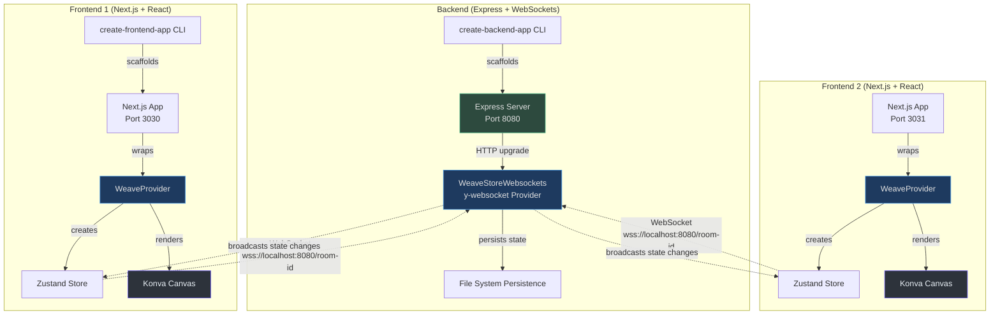
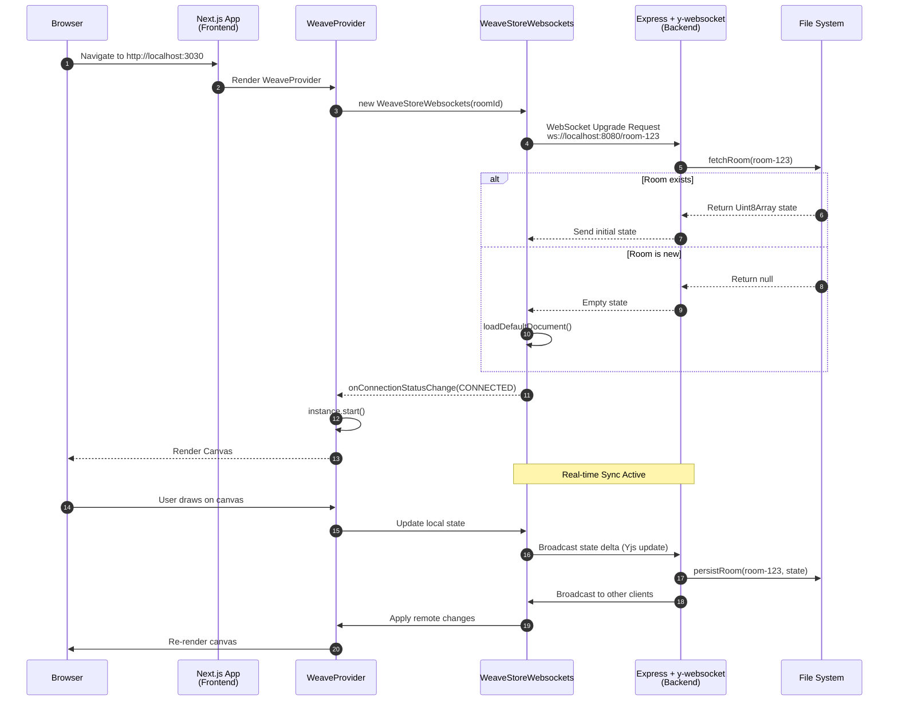
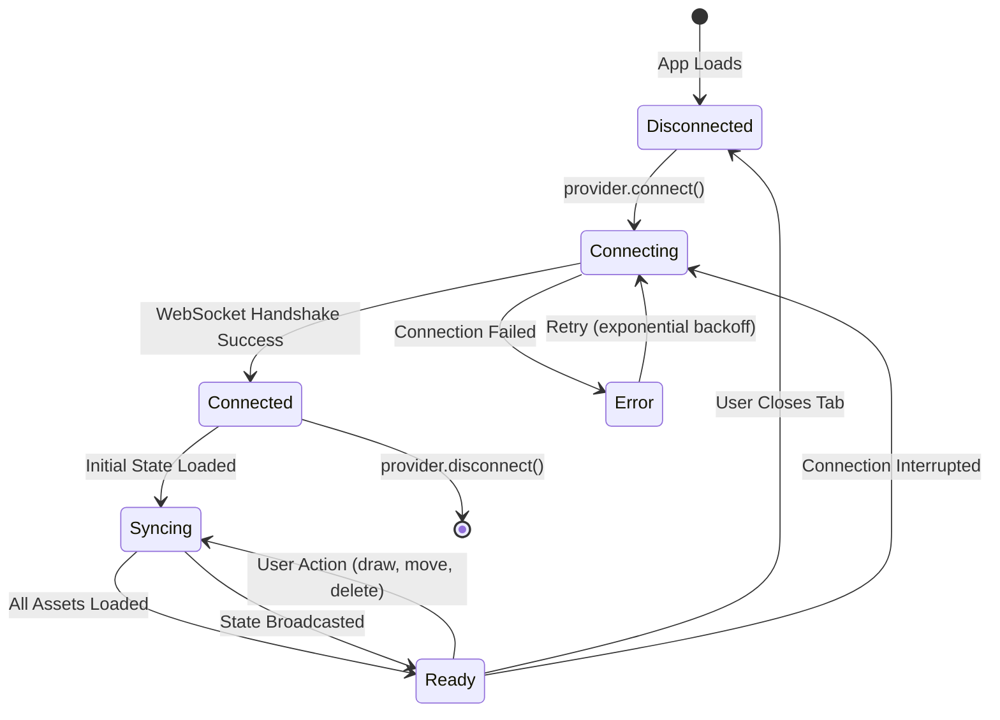

# Quickstart Guide

This guide walks you through creating a complete Weave.js application from scratch. You'll set up both the backend server (with real-time state synchronization) and the frontend (with React integration) to build a collaborative canvas application.

## Overview

Weave.js uses a client-server architecture where the backend manages state synchronization via WebSockets, and the frontend renders collaborative canvases using React and Konva.js. The framework is built on Yjs for CRDT-based state management and provides a headless API for building custom collaborative experiences.

| Component | Technology | Purpose | Source Package |
|-----------|-----------|---------|----------------|
| **Backend CLI** | Node.js, Express | Scaffolds backend service with WebSocket store | [`create-backend-app`](https://github.com/thegovind/weavejs/blob/main/code/packages/create-backend-app/src/index.ts#L23-L28) |
| **Frontend CLI** | Next.js, React 18 | Scaffolds frontend app with React bindings | [`create-frontend-app`](https://github.com/thegovind/weavejs/blob/main/code/packages/create-frontend-app/src/index.ts#L23-L26) |
| **State Store** | Yjs, y-websocket | Real-time CRDT-based state synchronization | [`store-websockets`](https://github.com/thegovind/weavejs/blob/main/code/packages/store-websockets/src/store-websockets.ts#L17-L24) |
| **React Provider** | Zustand, React Context | State management and Weave instance lifecycle | [`react/provider`](https://github.com/thegovind/weavejs/blob/main/code/packages/react/src/components/provider.tsx#L38-L49) |
| **Canvas Renderer** | Konva.js, React Reconciler | Renders collaborative canvas elements | `weave-sdk` |

## Prerequisites

Before starting, ensure you have:

- **Node.js:** `18.18.0` or later
- **Package Manager:** `pnpm` (recommended), `npm`, or `yarn`
- **React:** `18.2.0` (or `<19.0.0`) as a peer dependency

For complete requirements, see the [Setup Guide](./setup.md).

---

## Architecture Overview

Weave.js follows a hub-and-spoke architecture where the backend server acts as the central synchronization hub for all connected clients.



<!-- Sources:
- code/packages/create-backend-app/src/create-app.ts:21-76 (Backend scaffolding flow)
- code/packages/create-frontend-app/src/create-app.ts:21-60 (Frontend scaffolding flow)
- code/packages/store-websockets/src/store-websockets.ts:61-106 (WebSocket provider initialization)
- code/packages/react/src/components/provider.tsx:132-206 (React provider lifecycle)
-->

---

## Step 1: Set Up the Backend

The backend server handles real-time state synchronization using WebSockets and Yjs CRDT. The CLI scaffolds an Express.js server with the `@inditextech/weave-store-websockets` package pre-configured.

### 1.1 Create the Backend Service

Run the backend CLI to generate a new service:

```bash
pnpm create weave-backend-app
```

The CLI will prompt you for:

| Prompt | Default Value | Description | Source |
|--------|---------------|-------------|--------|
| **Project name** | `my-service` | Name of the backend directory | [index.ts:32-37](https://github.com/thegovind/weavejs/blob/main/code/packages/create-backend-app/src/index.ts#L32-L37) |
| **Template** | `+express+websockets` | Backend template (Express + WebSockets or Azure Web PubSub) | [index.ts:38-52](https://github.com/thegovind/weavejs/blob/main/code/packages/create-backend-app/src/index.ts#L38-L52) |
| **Install deps** | `true` (auto-detected) | Whether to run package installation automatically | [index.ts:54-57](https://github.com/thegovind/weavejs/blob/main/code/packages/create-backend-app/src/index.ts#L54-L57) |

```bash
# Example interaction:
? Project name: my-collab-backend
? Choose a template: Express.js: Weave.js Websockets Store (recommended)
? Do you want to install packages automatically? (detected as pnpm): Yes
```

**What Happens:**

1. **Template Copying:** The CLI copies files from the selected template directory to your output folder ([create-app.ts:37-41](https://github.com/thegovind/weavejs/blob/main/code/packages/create-backend-app/src/create-app.ts#L37-L41))
2. **Package.json Generation:** Creates a `package.json` with Weave.js SDK dependencies ([create-app.ts:183-209](https://github.com/thegovind/weavejs/blob/main/code/packages/create-backend-app/src/create-app.ts#L183-209))
3. **TypeScript Config:** Updates `tsconfig.json` with path aliases for `@/*` ([create-app.ts:43-56](https://github.com/thegovind/weavejs/blob/main/code/packages/create-backend-app/src/create-app.ts#L43-L56))
4. **Git Initialization:** Optionally initializes a Git repository ([create-app.ts:73-75](https://github.com/thegovind/weavejs/blob/main/code/packages/create-backend-app/src/create-app.ts#L73-L75))

### 1.2 Navigate to the Backend Directory

```bash
cd my-collab-backend
```

### 1.3 Start the Development Server

```bash
pnpm run dev
```

The backend server will start on **`http://localhost:8080`** and listen for WebSocket connections at `ws://localhost:8080/<room-id>`.

**Server Output:**

```
✓ Weave.js Backend Service started on http://localhost:8080
✓ WebSocket server ready for connections
```

---

## Step 2: Set Up the Frontend

The frontend uses React 18 and Next.js to render the collaborative canvas. The CLI scaffolds a Next.js application with the `@inditextech/weave-react` package and a pre-configured `WeaveProvider`.

### 2.1 Create the Frontend Application

In a **new terminal window**, navigate to the same parent directory as your backend project and run:

```bash
pnpm create weave-frontend-app
```

The CLI will prompt you for:

| Prompt | Default Value | Description | Source |
|--------|---------------|-------------|--------|
| **Project name** | `my-app` | Name of the frontend directory | [index.ts:30-35](https://github.com/thegovind/weavejs/blob/main/code/packages/create-frontend-app/src/index.ts#L30-L35) |
| **Template** | `+nextjs+websockets` | Frontend template (Next.js + WebSockets or Azure Web PubSub) | [index.ts:36-51](https://github.com/thegovind/weavejs/blob/main/code/packages/create-frontend-app/src/index.ts#L36-L51) |
| **Install deps** | `true` (auto-detected) | Whether to run package installation automatically | [index.ts:52-55](https://github.com/thegovind/weavejs/blob/main/code/packages/create-frontend-app/src/index.ts#L52-L55) |

```bash
# Example interaction:
? Project name: my-collab-app
? Choose a template: Next.js: Weave.js Websockets Store (recommended)
? Do you want to install packages automatically? (detected as pnpm): Yes
```

**What Happens:**

1. **Template Copying:** Copies Next.js template files to your output folder ([create-app.ts:37-41](https://github.com/thegovind/weavejs/blob/main/code/packages/create-frontend-app/src/create-app.ts#L37-L41))
2. **Package.json Generation:** Creates a `package.json` with React and Weave.js React bindings ([create-app.ts:190-245](https://github.com/thegovind/weavejs/blob/main/code/packages/create-frontend-app/src/create-app.ts#L190-L245))
3. **Git Initialization:** Optionally initializes a Git repository ([create-app.ts:57-59](https://github.com/thegovind/weavejs/blob/main/code/packages/create-frontend-app/src/create-app.ts#L57-L59))

### 2.2 Navigate to the Frontend Directory

```bash
cd my-collab-app
```

### 2.3 Start the Development Server

```bash
pnpm run dev
```

The frontend application will start on **`http://localhost:3030`**.

**Dev Server Output:**

```
✓ Ready on http://localhost:3030
✓ WebSocket connection to ws://localhost:8080 established
```

### 2.4 Open in Browser

Navigate to **`http://localhost:3030`** in your browser. You should see the default Weave.js canvas application running.

---

## Step 3: Understanding the Connection Flow

When the frontend connects to the backend, the following sequence occurs:



<!-- Sources:
- code/packages/store-websockets/src/store-websockets.ts:61-106 (WebSocket provider setup)
- code/packages/store-websockets/src/store-websockets.ts:108-114 (connect method)
- code/packages/store-websockets/src/store-websockets.ts:47-59 (loadRoomInitialData)
- code/packages/react/src/components/provider.tsx:132-206 (WeaveProvider initialization)
- code/packages/react/src/components/provider.tsx:163-177 (Event listener setup)
-->

### Key Connection Events

| Event | Triggered By | Handler Location | Purpose |
|-------|--------------|------------------|---------|
| **`onInstanceStatus`** | `instance.start()` | [provider.tsx:163-166](https://github.com/thegovind/weavejs/blob/main/code/packages/react/src/components/provider.tsx#L163-L166) | Updates Weave instance status (IDLE → STARTED → READY) |
| **`onStoreConnectionStatusChange`** | WebSocket status changes | [provider.tsx:168-171](https://github.com/thegovind/weavejs/blob/main/code/packages/react/src/components/provider.tsx#L168-L171) | Tracks connection state (CONNECTING → CONNECTED → DISCONNECTED) |
| **`onRoomLoaded`** | Initial state loaded | [provider.tsx:173-176](https://github.com/thegovind/weavejs/blob/main/code/packages/react/src/components/provider.tsx#L173-L176) | Indicates room data is ready |
| **`onStateChange`** | Canvas updates | [provider.tsx:178-181](https://github.com/thegovind/weavejs/blob/main/code/packages/react/src/components/provider.tsx#L178-L181) | Broadcasts state changes to all components via Zustand store |

---

## Step 4: Verify Collaboration

To test real-time collaboration, open the same URL in **two browser windows** side-by-side:

1. Open `http://localhost:3030` in Chrome
2. Open `http://localhost:3030` in Firefox (or a new Chrome incognito window)
3. Draw on the canvas in one window
4. Observe the changes **instantly appear** in the other window

### State Synchronization Flow



<!-- Sources:
- code/packages/store-websockets/src/store-websockets.ts:76-106 (Connection status handlers)
- code/packages/react/src/components/store.tsx:70-192 (Zustand store state machine)
-->

---

## Step 5: Explore the Generated Code

### Backend Structure

```
my-collab-backend/
├── src/
│   ├── server.ts          # Express server + WebSocket setup
│   ├── persistence.ts     # File-based state persistence handlers
│   └── routes/            # REST API endpoints
├── public/                # Static assets
├── .env                   # Environment variables (PORT, etc.)
├── tsconfig.json          # TypeScript configuration
└── package.json           # Dependencies (weave-sdk, weave-store-websockets)
```

**Key Files:**

| File | Purpose | Source Reference |
|------|---------|------------------|
| `src/server.ts` | Initializes Express server and WebSocket provider | Template scaffolded by [create-app.ts:37-41](https://github.com/thegovind/weavejs/blob/main/code/packages/create-backend-app/src/create-app.ts#L37-L41) |
| `src/persistence.ts` | Handles saving/loading room state to file system | Generated from backend template |
| `.env` | Environment variables (`PORT=8080`, `NODE_ENV=development`) | Renamed from `example.env` ([create-app.ts:30-35](https://github.com/thegovind/weavejs/blob/main/code/packages/create-backend-app/src/create-app.ts#L30-L35)) |

### Frontend Structure

```
my-collab-app/
├── app/
│   ├── layout.tsx         # Root layout with WeaveProvider
│   ├── page.tsx           # Main canvas page
│   └── api/               # Next.js API routes
├── components/
│   ├── canvas.tsx         # Weave canvas component
│   └── toolbar.tsx        # Drawing tools UI
├── lib/
│   └── store.ts           # Zustand store (useWeave hook)
├── weave/
│   └── config.ts          # Weave.js configuration
├── .env.local             # Frontend env vars (NEXT_PUBLIC_WS_URL)
└── package.json           # Dependencies (weave-react, next, react)
```

**Key Files:**

| File | Purpose | Source Reference |
|------|---------|------------------|
| `app/layout.tsx` | Wraps app with `WeaveProvider` | Template scaffolded by [create-app.ts:37-41](https://github.com/thegovind/weavejs/blob/main/code/packages/create-frontend-app/src/create-app.ts#L37-L41) |
| `lib/store.ts` | Exposes `useWeave` hook for accessing Weave state | Uses Zustand as shown in [store.tsx:70-192](https://github.com/thegovind/weavejs/blob/main/code/packages/react/src/components/store.tsx#L70-L192) |
| `components/canvas.tsx` | Renders Konva canvas with Weave nodes | Uses `useWeave` hook from [store.tsx:70](https://github.com/thegovind/weavejs/blob/main/code/packages/react/src/components/store.tsx#L70) |

---

## Step 6: Customize Your Application

### Using the `useWeave` Hook

The `useWeave` hook provides access to the Weave instance and state:

```tsx
import { useWeave } from '@/lib/store';

function MyCanvasComponent() {
  const instance = useWeave((state) => state.instance);
  const appState = useWeave((state) => state.appState);
  const selectedNodes = useWeave((state) => state.selection.nodes);
  const canUndo = useWeave((state) => state.undoRedo.canUndo);
  
  const handleUndo = () => {
    instance?.undo();
  };
  
  return (
    <div>
      <p>Selected: {selectedNodes.length} nodes</p>
      <button onClick={handleUndo} disabled={!canUndo}>Undo</button>
    </div>
  );
}
```

<!-- Source: code/packages/react/src/components/store.tsx:70-192 -->

**Available State:**

| State Property | Type | Description | Source |
|----------------|------|-------------|--------|
| `instance` | `Weave \| null` | Weave SDK instance | [store.tsx:72](https://github.com/thegovind/weavejs/blob/main/code/packages/react/src/components/store.tsx#L72) |
| `appState` | `WeaveState` | Current canvas state (nodes, layers) | [store.tsx:73](https://github.com/thegovind/weavejs/blob/main/code/packages/react/src/components/store.tsx#L73) |
| `status` | `WeaveStatus` | Instance status (IDLE, STARTED, READY) | [store.tsx:74](https://github.com/thegovind/weavejs/blob/main/code/packages/react/src/components/store.tsx#L74) |
| `connection.status` | `string` | WebSocket connection status | [store.tsx:75-77](https://github.com/thegovind/weavejs/blob/main/code/packages/react/src/components/store.tsx#L75-L77) |
| `selection.nodes` | `WeaveSelection[]` | Currently selected canvas nodes | [store.tsx:102-106](https://github.com/thegovind/weavejs/blob/main/code/packages/react/src/components/store.tsx#L102-L106) |
| `undoRedo.canUndo` | `boolean` | Whether undo is available | [store.tsx:87-90](https://github.com/thegovind/weavejs/blob/main/code/packages/react/src/components/store.tsx#L87-L90) |

### Adding Custom Nodes

To add custom drawable nodes (e.g., a `StarNode`):

1. **Define the Node Class:**

```typescript
// weave/nodes/star-node.ts
import { WeaveNode } from '@inditextech/weave-sdk';

export class StarNode extends WeaveNode {
  static nodeName = 'star';
  
  // Define rendering logic
  render() {
    return (
      <Star
        x={this.attrs.x}
        y={this.attrs.y}
        numPoints={5}
        innerRadius={20}
        outerRadius={40}
        fill={this.attrs.fill}
      />
    );
  }
}
```

2. **Register with WeaveProvider:**

```tsx
// app/layout.tsx
import { StarNode } from '@/weave/nodes/star-node';

<WeaveProvider
  store={store}
  nodes={[StarNode]} // Register custom node
  getContainer={() => document.getElementById('weave-canvas')!}
>
  {children}
</WeaveProvider>
```

<!-- Source: code/packages/react/src/components/provider.tsx:38-49 (nodes prop) -->

---

## Troubleshooting

### Backend Won't Start

**Issue:** `Error: Port 8080 is already in use`

**Solution:**

```bash
# Kill process on port 8080 (macOS/Linux)
lsof -ti:8080 | xargs kill -9

# Change port in .env
echo "PORT=8081" > .env
pnpm run dev
```

### Frontend Can't Connect to Backend

**Issue:** `WebSocket connection failed: ws://localhost:8080`

**Solution:**

1. Verify backend is running: `curl http://localhost:8080`
2. Check `.env.local` in frontend:

```env
NEXT_PUBLIC_WS_URL=ws://localhost:8080
```

3. Restart frontend: `pnpm run dev`

### State Not Syncing Between Clients

**Issue:** Changes in one browser don't appear in another

**Checklist:**

- [ ] Both clients connected to the **same room ID** (check WebSocket URL in Network tab)
- [ ] Backend logs show `Room [room-id] synced` messages
- [ ] No CORS errors in browser console
- [ ] WebSocket connection status is `CONNECTED` in both clients

---

## What You Built

By completing this quickstart, you've created:

| Component | Technology Stack | Capabilities |
|-----------|------------------|--------------|
| **Backend Service** | Express.js + y-websocket + Node.js | Real-time state sync, WebSocket management, file-based persistence |
| **Frontend App** | Next.js + React 18 + Konva.js | Collaborative canvas rendering, real-time updates, undo/redo |
| **State Store** | Yjs CRDT + SyncedStore | Conflict-free state merging, offline support, awareness (cursors, selections) |
| **React Integration** | Zustand + React Context | Global state management, event handling, lifecycle management |

---

## Next Steps

Explore these topics to deepen your understanding:

- **[Architecture Deep Dive](../deep-dive/architecture.md)** — Learn how Weave.js orchestrates state, rendering, and collaboration
- **[Store Options](../deep-dive/stores.md)** — Compare WebSockets, Azure Web PubSub, and custom store implementations
- **[React Integration](../deep-dive/react-integration.md)** — Understand the `WeaveProvider` lifecycle and event system
- **[Custom Nodes](../guides/custom-nodes.md)** — Build domain-specific drawable elements (sticky notes, flowchart shapes, etc.)
- **[Production Deployment](../guides/deployment.md)** — Best practices for deploying to AWS, Azure, or Vercel

---

## Related Pages

| Page | Description |
|------|-------------|
| [Overview](./overview.md) | High-level introduction to Weave.js architecture and concepts |
| [Setup Guide](./setup.md) | Detailed prerequisites, environment setup, and troubleshooting |
| [Stores Deep Dive](../deep-dive/stores.md) | How stores manage state synchronization and persistence |
| [React Integration](../deep-dive/react-integration.md) | Deep dive into `WeaveProvider`, hooks, and event lifecycle |
