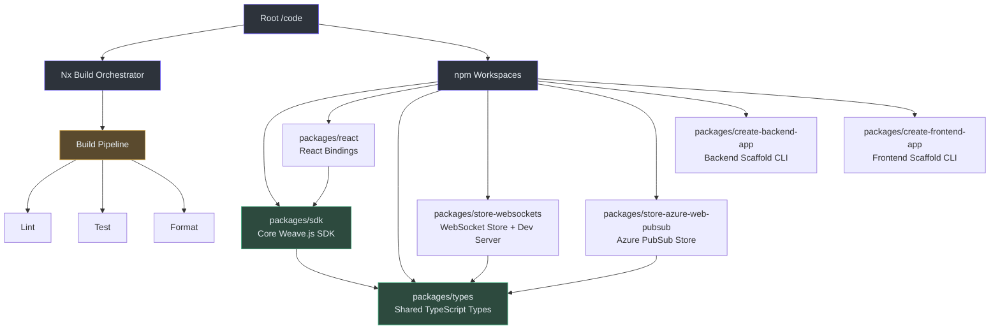
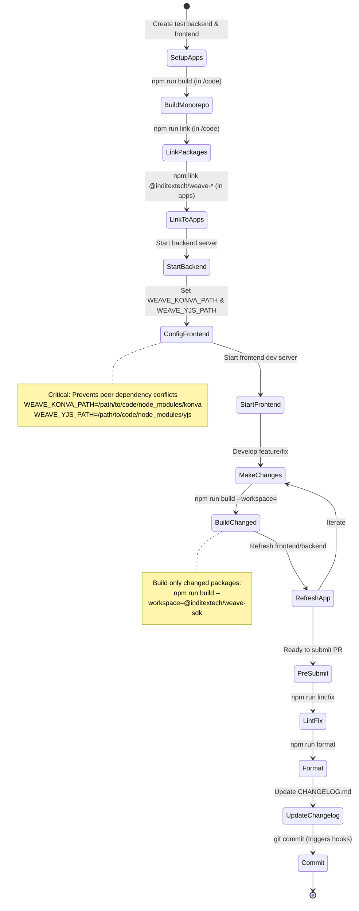

# Development Environment Setup

This guide walks you through setting up the Weave.js TypeScript monorepo for local development. Weave.js uses **Nx** for orchestration and **npm workspaces** for package management, with all code located in the [`/code`](https://github.com/thegovind/weavejs/blob/main/code) folder. The monorepo contains seven packages: SDK, React bindings, WebSocket/Azure PubSub stores, and CLI scaffolding tools.

## Prerequisites at a Glance

Before you begin, ensure your development environment meets these requirements:

| Requirement | Version | How to Verify | Source |
|-------------|---------|---------------|--------|
| **Node.js** | `>= 22.11.x` | `node --version` | [code/package.json:81](https://github.com/thegovind/weavejs/blob/main/code/package.json#L81) |
| **npm** | `>= 10.9.x` | `npm --version` | [code/package.json:82](https://github.com/thegovind/weavejs/blob/main/code/package.json#L82) |
| **Git** | Any recent | `git --version` | [CONTRIBUTING.md:22](https://github.com/thegovind/weavejs/blob/main/CONTRIBUTING.md#L22) |
| **CLA Signed** | Required for PRs | See [CONTRIBUTING.md](https://github.com/InditexTech/foss/blob/main/CLA.md) | [CONTRIBUTING.md:16](https://github.com/thegovind/weavejs/blob/main/CONTRIBUTING.md#L16) |

**Recommended tools:**
- [asdf](https://asdf-vm.com/) — Version manager used in CI ([code/.tool-versions:1](https://github.com/thegovind/weavejs/blob/main/code/.tool-versions#L1) specifies `nodejs 22.11.0`)
- **IDE:** VS Code, WebStorm, or any TypeScript-aware editor
- **Optional:** Docker (if running Redis for horizontal sync in dev server)

---

## Architecture Overview

The monorepo follows a multi-package structure orchestrated by Nx, with npm workspaces managing inter-package dependencies. Understanding this architecture is crucial for effective development:



<!-- Sources: code/package.json:6-8, code/packages/sdk/package.json:58, CONTRIBUTING.md:44-54 -->

**Why this structure matters:**
- **Nx manages task dependencies**: Building `sdk` automatically builds `types` first ([nx.json:4-5](https://github.com/thegovind/weavejs/blob/main/code/nx.json#L4-L5) defines `dependsOn: ["^build"]`)
- **Workspaces enable local linking**: Packages reference each other via workspace protocol, no need for manual `npm link` during monorepo development
- **Shared tooling**: Commitlint, Prettier, ESLint, and Vitest configurations are shared across all packages

---

## Installation Workflow

Follow this sequence to set up the monorepo for the first time:

```mermaid
sequenceDiagram
    autonumber
    participant Dev as Developer
    participant Git as Git Repository
    participant Code as /code Directory
    participant Npm as npm
    participant Nx as Nx Executor
    participant Husky as Git Hooks
    
    Dev->>Git: git clone https://github.com/thegovind/weavejs.git
    Dev->>Code: cd weavejs/code
    Dev->>Npm: npm install
    Note over Npm: Installs all workspace dependencies<br/>including Nx, Husky, commitlint
    Npm->>Husky: npm run prepare (auto-triggered)
    Husky-->>Code: Install git hooks (.husky/*)
    Dev->>Nx: npm run build
    Note over Nx: Builds all packages in dependency order<br/>types → sdk → react/stores
    Nx-->>Code: Packages built to dist/ folders
    Dev->>Nx: npm run test
    Note over Nx: Runs Vitest across all packages<br/>with test scripts
    Nx-->>Dev: Test results + coverage
    
    style Dev fill:#2d333b,stroke:#6d5dfc,color:#e6edf3
    style Code fill:#2d333b,stroke:#6d5dfc,color:#e6edf3
    style Npm fill:#2d4a3e,stroke:#4aba8a,color:#e6edf3
    style Nx fill:#2d4a3e,stroke:#4aba8a,color:#e6edf3
    style Husky fill:#5a4a2e,stroke:#d4a84b,color:#e6edf3
```

<!-- Sources: CONTRIBUTING.md:56-62, code/package.json:27, code/package.json:12, code/package.json:33 -->

### Step 1: Clone and Navigate

```bash
git clone https://github.com/thegovind/weavejs.git
cd weavejs/code
```

All subsequent commands run from the `/code` directory unless otherwise specified ([CONTRIBUTING.md:96](https://github.com/thegovind/weavejs/blob/main/CONTRIBUTING.md#L96)).

### Step 2: Install Dependencies

```bash
npm install
```

This single command ([CONTRIBUTING.md:61](https://github.com/thegovind/weavejs/blob/main/CONTRIBUTING.md#L61)):
- Installs all root-level dependencies: Nx, Husky, commitlint, Prettier, TypeScript ([code/package.json:67-78](https://github.com/thegovind/weavejs/blob/main/code/package.json#L67-L78))
- Installs all workspace package dependencies via npm workspaces ([code/package.json:6-8](https://github.com/thegovind/weavejs/blob/main/code/package.json#L6-L8))
- Triggers `prepare` script → installs Husky git hooks ([code/package.json:27](https://github.com/thegovind/weavejs/blob/main/code/package.json#L27))

**What gets installed:**
- **Root devDependencies**: `nx@19.5.7`, `husky@9.1.4`, `@commitlint/cli@19.4.0`, `typescript@5.7.3`, `prettier@2.8.8`
- **Workspace packages**: Each package's dependencies are symlinked via workspaces
- **Git hooks**: Commit-msg validation, pre-commit linting, pre-push builds ([code/.husky/](https://github.com/thegovind/weavejs/tree/main/code/.husky))

### Step 3: Build All Packages

```bash
npm run build
```

Executes `nx run-many -t build` ([code/package.json:12](https://github.com/thegovind/weavejs/blob/main/code/package.json#L12)), which:
1. Builds packages in topological order respecting dependencies ([nx.json:4-6](https://github.com/thegovind/weavejs/blob/main/code/nx.json#L4-L6))
2. Uses `tsdown` bundler for most packages ([code/packages/sdk/package.json:35](https://github.com/thegovind/weavejs/blob/main/code/packages/sdk/package.json#L35))
3. Outputs to each package's `dist/` folder

**Build order example:**
```
types → sdk → react
         ↓
    store-websockets
         ↓
    store-azure-web-pubsub
```

### Step 4: Run Tests

```bash
npm run test
```

Runs `nx run-many -t test` ([code/package.json:33](https://github.com/thegovind/weavejs/blob/main/code/package.json#L33)) across packages with test scripts:
- Uses **Vitest** with coverage enabled ([code/packages/sdk/vitest.config.ts:8-38](https://github.com/thegovind/weavejs/blob/main/code/packages/sdk/vitest.config.ts#L8-L38))
- Test files: `**/*.test.ts` ([code/packages/sdk/vitest.config.ts:23](https://github.com/thegovind/weavejs/blob/main/code/packages/sdk/vitest.config.ts#L23))
- Coverage provider: `v8` ([code/packages/sdk/vitest.config.ts:32](https://github.com/thegovind/weavejs/blob/main/code/packages/sdk/vitest.config.ts#L32))
- Reports: JSON + HTML in `reports/test-report/` ([code/packages/sdk/vitest.config.ts:26-29](https://github.com/thegovind/weavejs/blob/main/code/packages/sdk/vitest.config.ts#L26-L29))

---

## Development Workflows

### Local Development with Test Applications

The recommended workflow for developing Weave.js features involves creating linked test applications. Here's the complete flow:



<!-- Sources: CONTRIBUTING.md:98-127, CONTRIBUTING.md:64-66, code/package.json:23-25 -->

#### Setting Up Test Applications

Follow the [Quickstart Guide](https://inditextech.github.io/weavejs/docs/main/quickstart) to scaffold backend and frontend test apps using the CLI tools ([CONTRIBUTING.md:66](https://github.com/thegovind/weavejs/blob/main/CONTRIBUTING.md#L66)).

#### Linking Workflow (First Time)

From the `/code` directory:

```bash
# 1. Build all packages
npm run build

# 2. Link all packages (makes them globally available)
npm run link  # Executes: nx run-many -t link
```

From your test backend/frontend projects:

```bash
# 3. Link specific packages you're developing
npm link @inditextech/weave-sdk @inditextech/weave-store-websockets
```

#### Critical Environment Variables

Before starting your frontend, set these environment variables ([CONTRIBUTING.md:116-118](https://github.com/thegovind/weavejs/blob/main/CONTRIBUTING.md#L116-L118)):

```bash
export WEAVE_KONVA_PATH=/absolute/path/to/weavejs/code/node_modules/konva
export WEAVE_YJS_PATH=/absolute/path/to/weavejs/code/node_modules/yjs
```

**Why this matters:** Weave.js has peer dependencies on `konva` and `yjs`. Without these variables, your frontend might load multiple instances of these libraries, causing runtime errors. These variables ensure a single shared instance ([code/package.json:64-65](https://github.com/thegovind/weavejs/blob/main/code/package.json#L64-L65) lists `konva@10.0.2` and `yjs@13.6.27` as root dependencies).

#### Iterative Development Cycle

```bash
# 1. Make changes to a package (e.g., sdk)
vim packages/sdk/src/core/WeaveCanvas.ts

# 2. Build only that package
npm run build --workspace=@inditextech/weave-sdk

# 3. Refresh your backend/frontend to test
# (Frontend: browser refresh; Backend: restart server)

# 4. Repeat steps 1-3 as needed
```

**Per-package operations** ([CONTRIBUTING.md:82-88](https://github.com/thegovind/weavejs/blob/main/CONTRIBUTING.md#L82-L88)):

| Operation | Command | Description |
|-----------|---------|-------------|
| **Build** | `npm run build --workspace=<pkg>` | Build single package |
| **Lint** | `npm run lint --workspace=<pkg>` | Lint single package |
| **Test** | `npm run test --workspace=<pkg>` | Test single package |
| **Format** | `npm run format --workspace=<pkg>` | Format with Prettier |
| **Link** | `npm run link --workspace=<pkg>` | Link single package |

Replace `<pkg>` with package name from its `package.json` (e.g., `@inditextech/weave-sdk`).

---

## Running the Dev Server

The `store-websockets` package includes a standalone Express development server for testing real-time sync:

```bash
# From /code directory
npm run dev --workspace=@inditextech/weave-store-websockets

# Server starts at http://localhost:1234 (default)
```

**Server configuration** ([code/packages/store-websockets/dev-server/express-server.ts:22-36](https://github.com/thegovind/weavejs/blob/main/code/packages/store-websockets/dev-server/express-server.ts#L22-L36)):

| Environment Variable | Default | Purpose | Line Reference |
|---------------------|---------|---------|----------------|
| `HOST` | `localhost` | Server bind address | [express-server.ts:22](https://github.com/thegovind/weavejs/blob/main/code/packages/store-websockets/dev-server/express-server.ts#L22) |
| `PORT` | `1234` | Server port | [express-server.ts:23](https://github.com/thegovind/weavejs/blob/main/code/packages/store-websockets/dev-server/express-server.ts#L23) |
| `WEAVE_REDIS_ENABLED` | `false` | Enable Redis horizontal sync | [express-server.ts:25](https://github.com/thegovind/weavejs/blob/main/code/packages/store-websockets/dev-server/express-server.ts#L25) |
| `WEAVE_REDIS_HOST` | `localhost` | Redis host | [express-server.ts:26](https://github.com/thegovind/weavejs/blob/main/code/packages/store-websockets/dev-server/express-server.ts#L26) |
| `WEAVE_REDIS_PORT` | `6379` | Redis port | [express-server.ts:27-32](https://github.com/thegovind/weavejs/blob/main/code/packages/store-websockets/dev-server/express-server.ts#L27-L32) |
| `WEAVE_REDIS_PASSWORD` | (none) | Redis password | [express-server.ts:34](https://github.com/thegovind/weavejs/blob/main/code/packages/store-websockets/dev-server/express-server.ts#L34) |
| `WEAVE_REDIS_KEY_PREFIX` | `weavejs:room-sync:` | Redis key prefix | [express-server.ts:35-36](https://github.com/thegovind/weavejs/blob/main/code/packages/store-websockets/dev-server/express-server.ts#L35-L36) |

**How it works:**
- Accepts WebSocket connections at `/sync/rooms/{roomId}` ([express-server.ts:20](https://github.com/thegovind/weavejs/blob/main/code/packages/store-websockets/dev-server/express-server.ts#L20))
- Persists room state to `dev-server/rooms/{roomId}` files ([express-server.ts:71-100](https://github.com/thegovind/weavejs/blob/main/code/packages/store-websockets/dev-server/express-server.ts#L71-L100))
- Optionally syncs across multiple server instances via Redis pub/sub ([express-server.ts:47-58](https://github.com/thegovind/weavejs/blob/main/code/packages/store-websockets/dev-server/express-server.ts#L47-L58))

---

## Git Workflow & Commit Conventions

Weave.js enforces strict commit conventions and automated quality checks via Husky git hooks.

### Git Hooks Enforcement

```mermaid
sequenceDiagram
    autonumber
    participant Dev as Developer
    participant Git as Git
    participant PreCommit as Pre-commit Hook
    participant CommitMsg as Commit-msg Hook
    participant PrePush as Pre-push Hook
    participant CI as GitHub Actions
    
    Dev->>Git: git add .
    Dev->>Git: git commit -m "feat: add feature"
    Git->>PreCommit: Trigger .husky/pre-commit
    PreCommit->>PreCommit: npm run git:pre-commit (lint)
    PreCommit-->>Git: ✓ Lint passed
    Git->>CommitMsg: Trigger .husky/commit-msg
    CommitMsg->>CommitMsg: commitlint -e (validate message)
    CommitMsg-->>Git: ✓ Message valid
    Git-->>Dev: Commit created
    
    Dev->>Git: git push origin feature-branch
    Git->>PrePush: Trigger .husky/pre-push
    PrePush->>PrePush: npm run build && npm run test
    PrePush-->>Git: ✓ Build & tests passed
    Git-->>Dev: Push complete
    
    Dev->>CI: Open Pull Request
    CI->>CI: npm run verify (ci + build + test)
    CI-->>Dev: ✓ CI passed
    
    style Dev fill:#2d333b,stroke:#6d5dfc,color:#e6edf3
    style PreCommit fill:#5a4a2e,stroke:#d4a84b,color:#e6edf3
    style CommitMsg fill:#5a4a2e,stroke:#d4a84b,color:#e6edf3
    style PrePush fill:#4a2e2e,stroke:#d45b5b,color:#e6edf3
    style CI fill:#2d4a3e,stroke:#4aba8a,color:#e6edf3
```

<!-- Sources: code/.husky/pre-commit:1-5, code/.husky/commit-msg:1-6, code/.husky/pre-push:1-6, code/package.json:20-22 -->

### Commit Message Format

Follows [Conventional Commits](https://www.conventionalcommits.org/) enforced by `@commitlint/config-conventional` ([code/commitlint.config.ts:6](https://github.com/thegovind/weavejs/blob/main/code/commitlint.config.ts#L6), [CONTRIBUTING.md:132](https://github.com/thegovind/weavejs/blob/main/CONTRIBUTING.md#L132)):

```
<type>(<scope>): <subject>

<body>

<footer>
```

**Valid types:**
- `feat`: New feature
- `fix`: Bug fix
- `docs`: Documentation changes
- `style`: Code style changes (formatting, no logic change)
- `refactor`: Code refactoring
- `perf`: Performance improvements
- `test`: Adding/updating tests
- `build`: Build system changes
- `ci`: CI configuration changes
- `chore`: Maintenance tasks

**Example:**
```
feat(sdk): add real-time cursor tracking

Implement cursor position synchronization using Yjs awareness.
Adds CursorManager class and updates WeaveCanvas to broadcast
cursor events.

Closes #123
```

### Hook Details

| Hook | Script | Purpose | Source |
|------|--------|---------|--------|
| **Pre-commit** | `npm run git:pre-commit` → `npm run lint` | Lint all packages with ESLint | [code/.husky/pre-commit:3](https://github.com/thegovind/weavejs/blob/main/code/.husky/pre-commit#L3), [code/package.json:21](https://github.com/thegovind/weavejs/blob/main/code/package.json#L21) |
| **Commit-msg** | `npm run git:commit-msg` → `commitlint -e` | Validate commit message format | [code/.husky/commit-msg:5](https://github.com/thegovind/weavejs/blob/main/code/.husky/commit-msg#L5), [code/package.json:20](https://github.com/thegovind/weavejs/blob/main/code/package.json#L20) |
| **Pre-push** | `npm run git:pre-push` → `npm run build && npm run test` | Full build + test suite | [code/.husky/pre-push:3](https://github.com/thegovind/weavejs/blob/main/code/.husky/pre-push#L3), [code/package.json:22](https://github.com/thegovind/weavejs/blob/main/code/package.json#L22) |

**Bypassing hooks** (use sparingly): Set `SKIP_HOOKS=true` environment variable ([code/.husky/commit-msg:3](https://github.com/thegovind/weavejs/blob/main/code/.husky/commit-msg#L3)).

---

## CI Pipeline (GitHub Actions)

Pull requests trigger the `code-npm-PR-verify` workflow ([.github/workflows/code-npm_node-PR_verify.yml](https://github.com/thegovind/weavejs/blob/main/.github/workflows/code-npm_node-PR_verify.yml)):

**CI Steps:**
1. Checkout branch head ([code-npm_node-PR_verify.yml:22-26](https://github.com/thegovind/weavejs/blob/main/.github/workflows/code-npm_node-PR_verify.yml#L22-L26))
2. Cache npm dependencies using `package-lock.json` hash ([code-npm_node-PR_verify.yml:28-34](https://github.com/thegovind/weavejs/blob/main/.github/workflows/code-npm_node-PR_verify.yml#L28-L34))
3. Cache asdf environment using `.tool-versions` hash ([code-npm_node-PR_verify.yml:36-42](https://github.com/thegovind/weavejs/blob/main/.github/workflows/code-npm_node-PR_verify.yml#L36-L42))
4. Install asdf-managed Node.js ([code-npm_node-PR_verify.yml:51-57](https://github.com/thegovind/weavejs/blob/main/.github/workflows/code-npm_node-PR_verify.yml#L51-L57))
5. Run `npm run verify` → `npm ci && nx run-many -t verify` ([code-npm_node-PR_verify.yml:63-66](https://github.com/thegovind/weavejs/blob/main/.github/workflows/code-npm_node-PR_verify.yml#L63-L66), [code/package.json:36](https://github.com/thegovind/weavejs/blob/main/code/package.json#L36))

**What `verify` does:**
Each package's `verify` script typically chains `lint → test → build` ([code/packages/sdk/package.json:53](https://github.com/thegovind/weavejs/blob/main/code/packages/sdk/package.json#L53)).

**CI environment:**
- OS: `ubuntu-24.04` ([code-npm_node-PR_verify.yml:18](https://github.com/thegovind/weavejs/blob/main/.github/workflows/code-npm_node-PR_verify.yml#L18))
- Timeout: 60 minutes ([code-npm_node-PR_verify.yml:17](https://github.com/thegovind/weavejs/blob/main/.github/workflows/code-npm_node-PR_verify.yml#L17))
- Concurrency: One run per PR (auto-cancel old runs) ([code-npm_node-PR_verify.yml:4-6](https://github.com/thegovind/weavejs/blob/main/.github/workflows/code-npm_node-PR_verify.yml#L4-L6))

---

## Common Development Tasks

Quick reference for everyday operations:

| Task | Command | Description | Source |
|------|---------|-------------|--------|
| **Install dependencies** | `npm install` | Install all monorepo deps | [CONTRIBUTING.md:61](https://github.com/thegovind/weavejs/blob/main/CONTRIBUTING.md#L61) |
| **Build all packages** | `npm run build` | Build entire monorepo | [code/package.json:12](https://github.com/thegovind/weavejs/blob/main/code/package.json#L12) |
| **Build single package** | `npm run build --workspace=<pkg>` | Build one package | [CONTRIBUTING.md:85](https://github.com/thegovind/weavejs/blob/main/CONTRIBUTING.md#L85) |
| **Lint all** | `npm run lint` | ESLint all packages | [code/package.json:24](https://github.com/thegovind/weavejs/blob/main/code/package.json#L24) |
| **Lint + fix** | `npm run lint:fix` | Auto-fix linting issues | [code/package.json:25](https://github.com/thegovind/weavejs/blob/main/code/package.json#L25) |
| **Format all** | `npm run format` | Prettier format all | [code/package.json:18](https://github.com/thegovind/weavejs/blob/main/code/package.json#L18) |
| **Test all** | `npm run test` | Run all test suites | [code/package.json:33](https://github.com/thegovind/weavejs/blob/main/code/package.json#L33) |
| **Full verify** | `npm run verify` | CI-equivalent check | [code/package.json:36](https://github.com/thegovind/weavejs/blob/main/code/package.json#L36) |
| **Link all packages** | `npm run link` | Make all packages globally linkable | [code/package.json:23](https://github.com/thegovind/weavejs/blob/main/code/package.json#L23) |
| **Clean Nx cache** | `npm run reset` | Clear Nx cache | [code/package.json:32](https://github.com/thegovind/weavejs/blob/main/code/package.json#L32) |
| **Clean everything** | `npm run cleanup` | Remove lock file + node_modules | [code/package.json:15](https://github.com/thegovind/weavejs/blob/main/code/package.json#L15) |
| **Dev mode (watch)** | `npm run dev --workspace=<pkg>` | Watch + rebuild on change | [code/packages/sdk/package.json:39](https://github.com/thegovind/weavejs/blob/main/code/packages/sdk/package.json#L39) |

---

## Troubleshooting Common Issues

### Issue: `npm install` fails with peer dependency errors

**Cause:** npm version mismatch or corrupted lock file.

**Solution:**
```bash
# 1. Verify npm version >= 10.9
npm --version

# 2. Clear npm cache
npm cache clean --force

# 3. Remove lock file and reinstall
rm package-lock.json
npm install
```

### Issue: Build fails with TypeScript errors

**Cause:** Outdated build artifacts or missing dependencies.

**Solution:**
```bash
# 1. Clean Nx cache
npm run reset

# 2. Clean and reinstall
npm run cleanup
cd ../  # Navigate to root
cd code
npm install

# 3. Rebuild from scratch
npm run build
```

### Issue: Git hooks not running

**Cause:** Husky not installed or hooks not executable.

**Solution:**
```bash
# 1. Manually trigger Husky install
npm run prepare

# 2. Verify hooks exist
ls -la .husky/

# 3. Ensure hooks are executable
chmod +x .husky/commit-msg .husky/pre-commit .husky/pre-push
```

### Issue: Test application shows "multiple Konva instances" error

**Cause:** Environment variables not set ([CONTRIBUTING.md:116-118](https://github.com/thegovind/weavejs/blob/main/CONTRIBUTING.md#L116-L118)).

**Solution:**
```bash
# Set before starting frontend
export WEAVE_KONVA_PATH=$(pwd)/code/node_modules/konva
export WEAVE_YJS_PATH=$(pwd)/code/node_modules/yjs

# Add to shell profile for persistence
echo "export WEAVE_KONVA_PATH=/absolute/path/to/weavejs/code/node_modules/konva" >> ~/.bashrc
echo "export WEAVE_YJS_PATH=/absolute/path/to/weavejs/code/node_modules/yjs" >> ~/.bashrc
```

### Issue: Changes not reflected after rebuild

**Cause:** npm link cache or browser cache.

**Solution:**
```bash
# 1. Rebuild package
npm run build --workspace=<pkg>

# 2. Re-link in test app
cd /path/to/test-app
npm unlink @inditextech/<pkg>
npm link @inditextech/<pkg>

# 3. Hard refresh browser (Cmd+Shift+R / Ctrl+Shift+R)
# 4. For backend: restart server process
```

---

## Before Submitting a Pull Request

Complete this checklist before opening a PR ([CONTRIBUTING.md:128-141](https://github.com/thegovind/weavejs/blob/main/CONTRIBUTING.md#L128-L141)):

1. **Lint and format:**
   ```bash
   npm run lint:fix
   npm run format
   ```

2. **Update CHANGELOG.md:** Add entry following [Conventional Commits](https://www.conventionalcommits.org/) format

3. **Add release label** to PR (one of):
   - `skip-release`: No release on merge
   - `release-type/major`: Major version bump
   - `release-type/minor`: Minor version bump
   - `release-type/patch`: Patch version bump
   - `release-type/hotfix`: Hotfix release

4. **Update documentation:** If changing public API, update `/docs` MDX files

5. **Verify CI passes:** Ensure `npm run verify` succeeds locally
   ```bash
   npm run verify  # Runs: npm ci && nx run-many -t verify
   ```

6. **Sign CLA:** First-time contributors must sign the [Contributor License Agreement](https://github.com/InditexTech/foss/blob/main/CLA.md) ([CONTRIBUTING.md:16](https://github.com/thegovind/weavejs/blob/main/CONTRIBUTING.md#L16))

---

## Related Pages

| Page | Description |
|------|-------------|
| [Overview](./overview.md) | High-level introduction to Weave.js and its ecosystem |
| [Quickstart](./quickstart.md) | 5-minute guide to creating your first Weave.js app |
| [Architecture Deep Dive](../deep-dive/architecture.md) | Detailed exploration of Weave.js internal architecture |
| [Contributing Guide](https://github.com/thegovind/weavejs/blob/main/CONTRIBUTING.md) | Full contribution guidelines and process |
| [Package Structure](../deep-dive/packages.md) | Detailed breakdown of each monorepo package |
