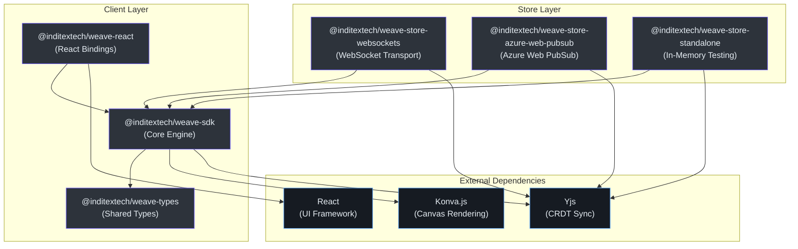

# Weave.js Documentation

Weave.js is a headless TypeScript framework for building real-time collaborative canvas applications like whiteboards, diagram editors, and visual design tools. Developed by **InditexTech**, it provides end-to-end building blocks for multi-user canvas collaboration while giving developers complete control over UI implementation. Under the hood, Weave.js orchestrates [Konva.js](https://konvajs.org/) for high-performance 2D canvas rendering, [Yjs](https://github.com/yjs/yjs) for conflict-free replicated data type (CRDT) synchronization, and a custom React reconciler for declarative canvas element management.

## Quick Start

Get a Weave.js project running in under 2 minutes with the following commands. You'll be prompted to enter project names during scaffolding.

### 1. Set up the Backend

The backend provides WebSocket-based synchronization using Yjs and Express.js ([code/packages/store-websockets](https://github.com/thegovind/weavejs/blob/main/code/packages/store-websockets)):

```bash
pnpm create weave-backend-app
cd my-service
pnpm install
pnpm run dev
```

The server starts at `http://localhost:8080` by default ([template/src/index.ts:18-24](https://github.com/thegovind/weavejs/blob/main/code/packages/create-backend-app/template/src/index.ts#L18-L24)).

### 2. Set up the Frontend

In a new terminal, scaffold a React frontend application with pre-configured Weave.js bindings:

```bash
pnpm create weave-frontend-app
cd my-app
pnpm install
pnpm run dev
```

Open `http://localhost:3030` in multiple browser tabs to see real-time collaboration in action ([template/src/main.tsx:8-15](https://github.com/thegovind/weavejs/blob/main/code/packages/create-frontend-app/template/src/main.tsx#L8-L15)).

## Architecture Overview

Weave.js follows a **layered architecture** that separates concerns between synchronization, state management, rendering, and user interaction. The framework is distributed across multiple npm packages, each handling a distinct responsibility.



<!-- Sources: 
- code/packages/sdk/package.json:1-105
- code/packages/react/package.json:1-94
- code/packages/types/package.json:1-69
- code/packages/store-websockets/package.json:1-105
- code/packages/store-azure-web-pubsub/package.json:1-115
- code/packages/store-standalone/package.json:1-91
-->

**Key Design Principles:**

- **Headless:** No built-in UI components — bring your own design system
- **Store-agnostic:** Swap WebSocket, Azure PubSub, or standalone stores without changing app code
- **Type-safe:** Full TypeScript coverage with shared types across client and server
- **Extensible:** Plugin and action APIs for custom behaviors ([code/packages/sdk/src/plugins/plugin.ts](https://github.com/thegovind/weavejs/blob/main/code/packages/sdk/src/plugins/plugin.ts), [code/packages/sdk/src/actions/action.ts](https://github.com/thegovind/weavejs/blob/main/code/packages/sdk/src/actions/action.ts))

## Documentation Map

Navigate the wiki by topic area:

| Section | Description | Link |
|---------|-------------|------|
| **Getting Started** | Installation, prerequisites, quick start guide, and first steps | [Overview](./getting-started/overview.md) |
| **Core Concepts** | Weave instance lifecycle, nodes, actions, plugins, and state management | [Core Concepts](./core-concepts/index.md) |
| **Architecture** | Deep dive into package structure, rendering pipeline, CRDT sync, and reconciler internals | [Architecture](./architecture/index.md) |
| **API Reference** | Full API documentation for `Weave`, `WeaveNode`, `WeaveAction`, `WeavePlugin` classes | [API Reference](./api/index.md) |
| **Store Providers** | Comparison of WebSocket, Azure Web PubSub, and standalone stores; setup guides | [Store Providers](./stores/index.md) |
| **React Integration** | Using `WeaveProvider`, `useWeave`, `useWeaveEvents` hooks; React-specific patterns | [React Guide](./react/index.md) |
| **Recipes & Examples** | Common use cases: selection, grouping, undo/redo, persistence, custom shapes | [Recipes](./recipes/index.md) |
| **Contributing** | Development setup, testing, release process, and contribution guidelines | [Contributing](./contributing/index.md) |
| **Roadmap** | Planned features, quarterly goals, and long-term vision | [Roadmap](./roadmap.md) |

## Key Files Reference

Understanding where to look when navigating the codebase:

| File | Purpose | Source |
|------|---------|--------|
| `code/packages/sdk/src/weave.ts` | Main `Weave` class — entry point for SDK; orchestrates managers, lifecycle, events | [View](https://github.com/thegovind/weavejs/blob/main/code/packages/sdk/src/weave.ts) |
| `code/packages/sdk/src/index.common.ts` | Public SDK exports — all classes, types, nodes, and utilities exposed to consumers | [View](https://github.com/thegovind/weavejs/blob/main/code/packages/sdk/src/index.common.ts) |
| `code/packages/sdk/src/stores/store.ts` | Abstract `WeaveStore` base class — defines sync contract for all store implementations | [View](https://github.com/thegovind/weavejs/blob/main/code/packages/sdk/src/stores/store.ts) |
| `code/packages/sdk/src/nodes/node.ts` | `WeaveNode` base class — parent for all canvas elements (Rectangle, Ellipse, Text, etc.) | [View](https://github.com/thegovind/weavejs/blob/main/code/packages/sdk/src/nodes/node.ts) |
| `code/packages/sdk/src/reconciler/reconciler.ts` | React reconciler implementation — bridges React components to Konva canvas nodes | [View](https://github.com/thegovind/weavejs/blob/main/code/packages/sdk/src/reconciler/reconciler.ts) |
| `code/packages/sdk/src/renderer/renderer.ts` | `WeaveRenderer` — manages Konva stage, layer hierarchy, and rendering loop | [View](https://github.com/thegovind/weavejs/blob/main/code/packages/sdk/src/renderer/renderer.ts) |
| `code/packages/react/src/index.ts` | React package exports — `WeaveProvider`, `useWeave`, `useWeaveEvents` hooks | [View](https://github.com/thegovind/weavejs/blob/main/code/packages/react/src/index.ts) |
| `code/packages/react/src/components/provider.tsx` | `WeaveProvider` component — context provider for Weave instance in React tree | [View](https://github.com/thegovind/weavejs/blob/main/code/packages/react/src/components/provider.tsx) |
| `code/packages/types/src/index.ts` | Shared TypeScript types and interfaces — used across SDK, stores, and React bindings | [View](https://github.com/thegovind/weavejs/blob/main/code/packages/types/src/index.ts) |
| `code/packages/store-websockets/src/server.ts` | WebSocket store server implementation — handles room management and message relay | [View](https://github.com/thegovind/weavejs/blob/main/code/packages/store-websockets/src/server.ts) |

## Tech Stack

The framework is built on a foundation of modern, battle-tested libraries:

| Technology | Role | Version | Source |
|------------|------|---------|--------|
| **TypeScript** | Language — strict typing for SDK, stores, and React bindings | `5.7.3` | [code/package.json](https://github.com/thegovind/weavejs/blob/main/code/package.json) |
| **Konva.js** | Canvas rendering — 2D scene graph for shapes, layers, and interactions | `10.0.2` | [code/packages/sdk/package.json:91](https://github.com/thegovind/weavejs/blob/main/code/packages/sdk/package.json#L91) |
| **Yjs** | CRDT sync — conflict-free replicated data types for real-time collaboration | `13.6.27` | [code/packages/sdk/package.json:94](https://github.com/thegovind/weavejs/blob/main/code/packages/sdk/package.json#L94) |
| **React** | UI framework — peer dependency for `@inditextech/weave-react` bindings | `18.2.0 - 19.0.0` | [code/packages/react/package.json:81](https://github.com/thegovind/weavejs/blob/main/code/packages/react/package.json#L81) |
| **react-reconciler** | React internals — custom reconciler for declarative Konva canvas elements | `0.28.0` | [code/packages/sdk/package.json:62](https://github.com/thegovind/weavejs/blob/main/code/packages/sdk/package.json#L62) |
| **@syncedstore/core** | Yjs abstraction — simplified API for CRDT state management | `0.6.0` | [code/packages/sdk/package.json:59](https://github.com/thegovind/weavejs/blob/main/code/packages/sdk/package.json#L59) |
| **ws** | WebSocket library — Node.js WebSocket server implementation for stores | `8.18.1` | [code/packages/store-websockets/package.json:62](https://github.com/thegovind/weavejs/blob/main/code/packages/store-websockets/package.json#L62) |
| **y-websocket** | Yjs WebSocket provider — connects Yjs document to WebSocket server | `3.0.0` | [code/packages/store-websockets/package.json:63](https://github.com/thegovind/weavejs/blob/main/code/packages/store-websockets/package.json#L63) |
| **pino** | Logging — structured logging for SDK and stores | `9.6.0` | [code/packages/sdk/package.json:60](https://github.com/thegovind/weavejs/blob/main/code/packages/sdk/package.json#L60) |
| **Vitest** | Testing — unit and integration tests across all packages | `1.6.1` | [code/packages/sdk/package.json:84](https://github.com/thegovind/weavejs/blob/main/code/packages/sdk/package.json#L84) |

## Onboarding Guides

New to Weave.js? Start with one of these audience-specific guides:

- **[Contributor Guide](./onboarding/contributor.md)** — For developers contributing to Weave.js core; covers monorepo setup, testing, and PR workflow
- **[Staff Engineer Guide](./onboarding/staff-engineer.md)** — Deep technical dive into architecture, design decisions, and extending the framework
- **[Executive Overview](./onboarding/executive.md)** — High-level summary of capabilities, roadmap, and business value
- **[Product Manager Guide](./onboarding/product-manager.md)** — Feature overview, use cases, and how to evaluate Weave.js for your product

## Repository Information

- **GitHub:** [https://github.com/thegovind/weavejs](https://github.com/thegovind/weavejs)
- **Official Documentation:** [https://inditextech.github.io/weavejs](https://inditextech.github.io/weavejs)
- **Live Demo:** [https://weavejs.cloud.inditex.com/](https://weavejs.cloud.inditex.com/)
- **License:** Apache-2.0 © 2025 INDUSTRIA DE DISEÑO TEXTIL S.A. (INDITEX S.A.)
- **Maintainers:** Jesus Manuel Piñeiro Cid ([code/packages/sdk/package.json:11-16](https://github.com/thegovind/weavejs/blob/main/code/packages/sdk/package.json#L11-L16))

## Related Pages

| Section | Link |
|---------|------|
| Project README | [README.md](../../README.md) |
| Contributing Guidelines | [CONTRIBUTING.md](../../CONTRIBUTING.md) |
| Code of Conduct | [CODE_OF_CONDUCT.md](../../CODE_OF_CONDUCT.md) |
| Security Policy | [SECURITY.md](../../SECURITY.md) |
