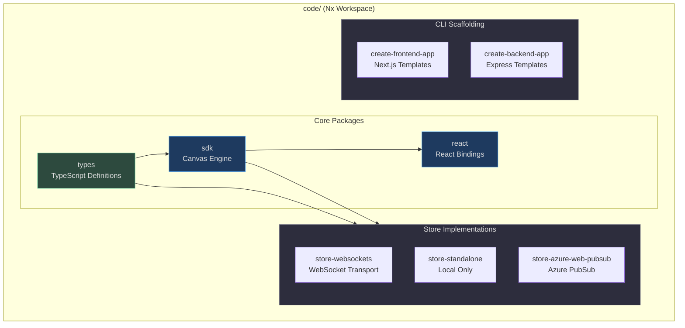
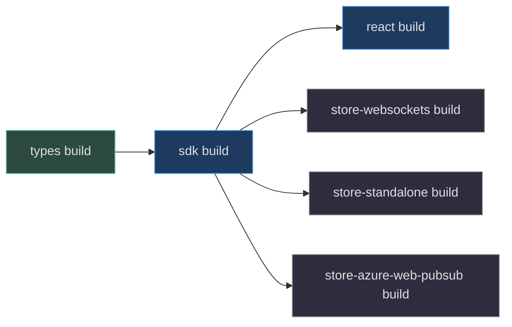
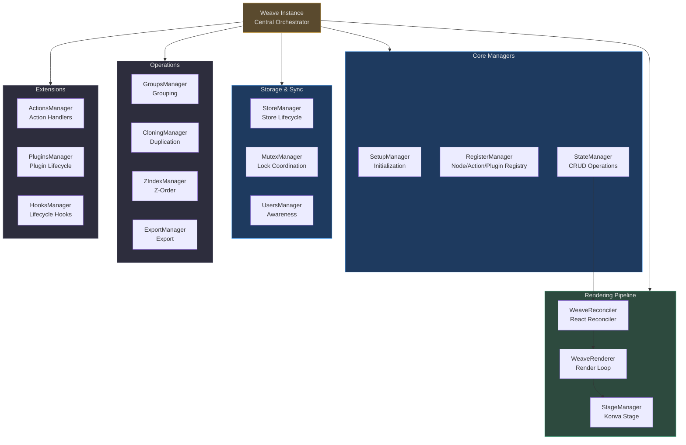
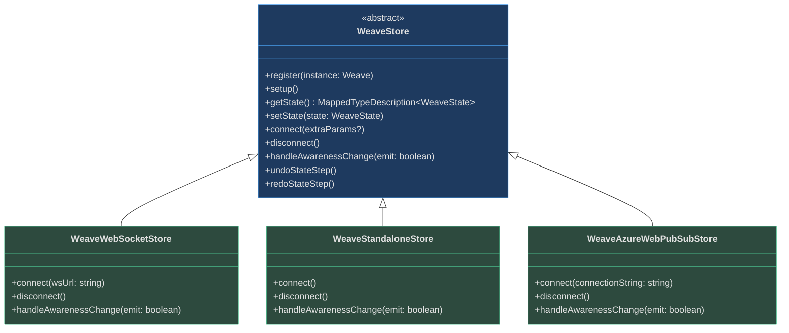
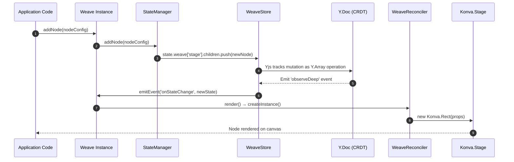
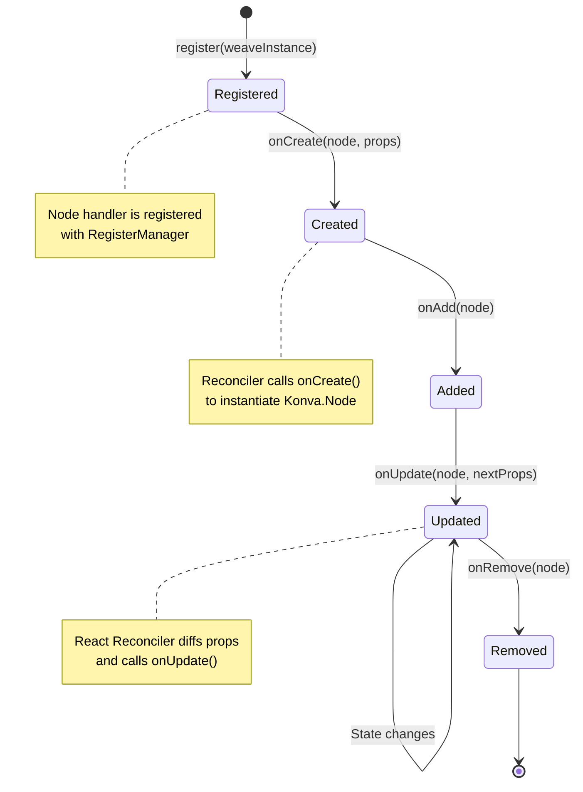
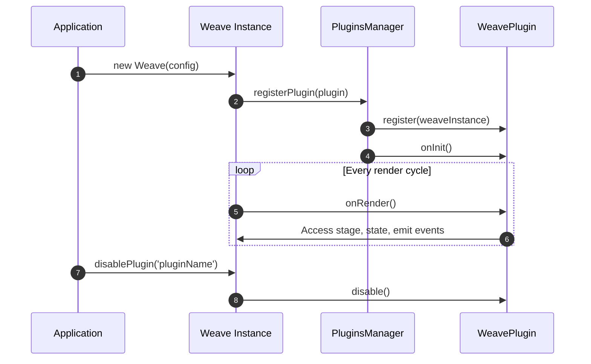
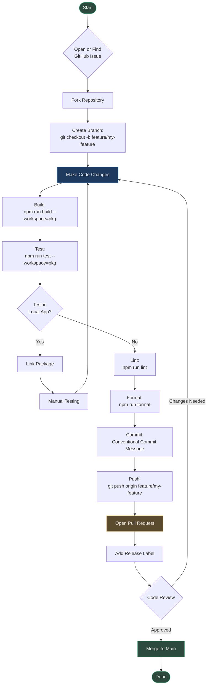

# Contributor Guide

Welcome to the Weave.js contributor community! This guide will help you understand the TypeScript monorepo architecture, core design patterns, and development workflows so you can confidently contribute to this real-time collaborative canvas framework.

**What is Weave.js?** A TypeScript SDK for building real-time collaborative canvas applications powered by [Konva.js](https://konvajs.org/) (rendering), [Yjs](https://yjs.dev/) (CRDT synchronization), React Reconciler (declarative updates), and event-driven architecture ([Emittery](https://github.com/sindresorhus/emittery)).

**Repository:** [https://github.com/thegovind/weavejs](https://github.com/thegovind/weavejs) (branch: `main`)

---

## Table of Contents

- [Part I — TypeScript & Monorepo Foundations](#part-i--typescript--monorepo-foundations)
- [Part II — Architecture Deep-Dive](#part-ii--architecture-deep-dive)
- [Part III — Setup & Your First PR](#part-iii--setup--your-first-pr)
- [Glossary](#glossary)
- [Key File Reference](#key-file-reference)
- [Related Pages](#related-pages)

---

## Part I — TypeScript & Monorepo Foundations

Weave.js uses a modern TypeScript monorepo stack optimized for multi-package development with shared tooling and incremental builds.

### Monorepo Architecture

The repository is structured as an **Nx + npm workspaces** monorepo containing 8 packages under `code/packages/`:

| Package | Purpose | Key Exports | Source |
|---------|---------|-------------|--------|
| **sdk** | Core Weave SDK — main canvas engine | `Weave`, `WeaveStore`, `WeaveNode`, `WeaveAction`, `WeavePlugin` | [code/packages/sdk/package.json:2](https://github.com/thegovind/weavejs/blob/main/code/packages/sdk/package.json#L2) |
| **react** | React bindings for Weave | `useWeave`, `WeaveProvider`, React Reconciler integration | [code/packages/react/package.json:2](https://github.com/thegovind/weavejs/blob/main/code/packages/react/package.json#L2) |
| **types** | Shared TypeScript types | `WeaveConfig`, `WeaveState`, `WeaveElementInstance` | [code/packages/types/package.json:2](https://github.com/thegovind/weavejs/blob/main/code/packages/types/package.json#L2) |
| **store-websockets** | WebSocket-based Store implementation | `WeaveWebSocketStoreClient`, `WeaveWebSocketStoreServer` | [CONTRIBUTING.md:52](https://github.com/thegovind/weavejs/blob/main/CONTRIBUTING.md#L52) |
| **store-standalone** | Local-only Store (no network) | `WeaveStandaloneStore` | [CONTRIBUTING.md:52](https://github.com/thegovind/weavejs/blob/main/CONTRIBUTING.md#L52) |
| **store-azure-web-pubsub** | Azure Web PubSub Store | `WeaveAzureWebPubSubStoreClient`, `WeaveAzureWebPubSubStoreServer` | [CONTRIBUTING.md:52](https://github.com/thegovind/weavejs/blob/main/CONTRIBUTING.md#L52) |
| **create-frontend-app** | Frontend app scaffolding CLI | CLI for Next.js template generation | [CONTRIBUTING.md:48](https://github.com/thegovind/weavejs/blob/main/CONTRIBUTING.md#L48) |
| **create-backend-app** | Backend app scaffolding CLI | CLI for Express backend template generation | [CONTRIBUTING.md:48](https://github.com/thegovind/weavejs/blob/main/CONTRIBUTING.md#L48) |



<!-- Sources: code/package.json:6-7, CONTRIBUTING.md:46-54 -->

### Build System & Tooling

Weave.js uses **Nx** for task orchestration and **tsdown** (esbuild-based) for fast bundling.

#### Key Scripts (Monorepo Root)

From `code/package.json`, run these commands from the `/code` folder:

| Script | Command | Purpose | Source |
|--------|---------|---------|--------|
| `build` | `npm run build` | Build all packages using Nx | [code/package.json:12](https://github.com/thegovind/weavejs/blob/main/code/package.json#L12) |
| `test` | `npm run test` | Run vitest tests across all packages | [code/package.json:33](https://github.com/thegovind/weavejs/blob/main/code/package.json#L33) |
| `lint` | `npm run lint` | Lint all packages with ESLint | [code/package.json:24](https://github.com/thegovind/weavejs/blob/main/code/package.json#L24) |
| `format` | `npm run format` | Format code with Prettier | [code/package.json:18](https://github.com/thegovind/weavejs/blob/main/code/package.json#L18) |
| `verify` | `npm run verify` | `npm ci` + build + test (CI pipeline) | [code/package.json:36](https://github.com/thegovind/weavejs/blob/main/code/package.json#L36) |

Nx automatically resolves package dependencies and builds in the correct order. The build graph looks like:



<!-- Sources: code/package.json:12, code/packages/sdk/package.json:100-103, code/packages/react/package.json:89-92 -->

#### Per-Package Scripts

Each package has its own `package.json` with these common targets:

```bash
# From /code folder
npm run <operation> --workspace=@inditextech/weave-sdk

# Available operations:
# - build: Compile TypeScript with tsdown
# - lint: ESLint checks
# - format: Prettier formatting
# - test: Run vitest tests
# - dev: Watch mode for live rebuilds
```

**Example:** Build only the SDK package:

```bash
cd code
npm run build --workspace=@inditextech/weave-sdk
```

### TypeScript Configuration

Weave.js uses **TypeScript 5.7** with strict mode enabled. All packages share a base `tsconfig.json` but can override settings.

**Key TypeScript features used:**
- ESM modules (`"type": "module"` in all package.json files)
- Path aliases (`@/` → `src/` for imports)
- Strict null checks, strict property initialization
- Peer dependencies for `konva` and `yjs` (singleton instances required)

**Example import pattern** ([code/packages/sdk/src/weave.ts:34-41](https://github.com/thegovind/weavejs/blob/main/code/packages/sdk/src/weave.ts#L34-L41)):

```typescript
import { WeaveStore } from './stores/store';
import { augmentKonvaNodeClass, WeaveNode } from './nodes/node';
import { WeaveAction } from './actions/action';
import { WeavePlugin } from './plugins/plugin';
import { WeaveReconciler } from './reconciler/reconciler';
```

### Testing with Vitest

Tests use **vitest** with coverage reporting. Test files are co-located with source files (e.g., `types.ts` + `types.test.ts`).

**Running tests:**

```bash
cd code
npm run test                           # All packages
npm run test --workspace=@inditextech/weave-sdk  # Specific package
```

**Coverage is tracked** via `@vitest/coverage-v8` ([code/packages/sdk/package.json:72](https://github.com/thegovind/weavejs/blob/main/code/packages/sdk/package.json#L72)).

### ESM Modules

All packages are **pure ESM** — no CommonJS. This requires:
- `"type": "module"` in package.json
- `.js` extensions in import paths (TypeScript doesn't auto-add them)
- Explicit exports in package.json for dual CJS/ESM builds

**Example exports** ([code/packages/sdk/package.json:19-28](https://github.com/thegovind/weavejs/blob/main/code/packages/sdk/package.json#L19-L28)):

```json
{
  "exports": {
    ".": {
      "import": "./dist/sdk.js",
      "require": "./dist/sdk.cjs"
    },
    "./server": {
      "import": "./dist/sdk.node.js",
      "require": "./dist/sdk.node.cjs"
    }
  }
}
```

---

## Part II — Architecture Deep-Dive

Weave.js is built around **three core abstractions**: the **Weave Manager Hub**, the **Store Abstraction** (Yjs + SyncedStore), and the **Node System** (Konva rendering).

### The Weave Class — Manager Hub Pattern

The `Weave` class ([code/packages/sdk/src/weave.ts:82](https://github.com/thegovind/weavejs/blob/main/code/packages/sdk/src/weave.ts#L82)) is the central orchestrator. It instantiates and coordinates **18+ managers**, each responsible for a specific domain:

| Manager | Responsibility | Key Methods | Source |
|---------|----------------|-------------|--------|
| **SetupManager** | Initialization, welcome logs | `welcomeLog()`, `setupPlugins()`, `setupActions()` | [code/packages/sdk/src/weave.ts:94,151](https://github.com/thegovind/weavejs/blob/main/code/packages/sdk/src/weave.ts#L94) |
| **RegisterManager** | Register nodes, actions, plugins | `registerNode()`, `registerAction()`, `registerPlugin()` | [code/packages/sdk/src/weave.ts:95,152](https://github.com/thegovind/weavejs/blob/main/code/packages/sdk/src/weave.ts#L95) |
| **StateManager** | State CRUD operations | `addNode()`, `updateNode()`, `removeNode()`, `getNode()` | [code/packages/sdk/src/weave.ts:96,154](https://github.com/thegovind/weavejs/blob/main/code/packages/sdk/src/weave.ts#L96) |
| **StoreManager** | Store lifecycle | `connectStore()`, `disconnectStore()` | [code/packages/sdk/src/weave.ts:97,153](https://github.com/thegovind/weavejs/blob/main/code/packages/sdk/src/weave.ts#L97) |
| **StageManager** | Konva Stage setup | `getStage()`, `getLayer()` | [code/packages/sdk/src/weave.ts:98,155](https://github.com/thegovind/weavejs/blob/main/code/packages/sdk/src/weave.ts#L98) |
| **GroupsManager** | Node grouping/ungrouping | `groupNodes()`, `ungroupNodes()` | [code/packages/sdk/src/weave.ts:99,156](https://github.com/thegovind/weavejs/blob/main/code/packages/sdk/src/weave.ts#L99) |
| **TargetingManager** | Mouse targeting, hit detection | `getTargetAt()` | [code/packages/sdk/src/weave.ts:100,157](https://github.com/thegovind/weavejs/blob/main/code/packages/sdk/src/weave.ts#L100) |
| **CloningManager** | Node duplication | `cloneNode()`, `cloneNodes()` | [code/packages/sdk/src/weave.ts:101,158](https://github.com/thegovind/weavejs/blob/main/code/packages/sdk/src/weave.ts#L101) |
| **FontsManager** | Font preloading | `preloadFonts()` | [code/packages/sdk/src/weave.ts:102,159](https://github.com/thegovind/weavejs/blob/main/code/packages/sdk/src/weave.ts#L102) |
| **ZIndexManager** | Z-order manipulation | `bringToFront()`, `sendToBack()` | [code/packages/sdk/src/weave.ts:103,160](https://github.com/thegovind/weavejs/blob/main/code/packages/sdk/src/weave.ts#L103) |
| **ExportManager** | Canvas export (PNG, JSON) | `exportNodes()`, `exportAsImage()` | [code/packages/sdk/src/weave.ts:106,161](https://github.com/thegovind/weavejs/blob/main/code/packages/sdk/src/weave.ts#L106) |
| **ActionsManager** | Action registration & triggering | `triggerAction()`, `getActiveAction()` | [code/packages/sdk/src/weave.ts:105,162](https://github.com/thegovind/weavejs/blob/main/code/packages/sdk/src/weave.ts#L105) |
| **PluginsManager** | Plugin lifecycle | `enablePlugin()`, `disablePlugin()` | [code/packages/sdk/src/weave.ts:104,163](https://github.com/thegovind/weavejs/blob/main/code/packages/sdk/src/weave.ts#L104) |
| **UsersManager** | Multi-user awareness | `getUsers()`, `getUser()` | [code/packages/sdk/src/weave.ts:107,164](https://github.com/thegovind/weavejs/blob/main/code/packages/sdk/src/weave.ts#L107) |
| **MutexManager** | Lock coordination (mutex) | `acquireLock()`, `releaseLock()` | [code/packages/sdk/src/weave.ts:108,165](https://github.com/thegovind/weavejs/blob/main/code/packages/sdk/src/weave.ts#L108) |
| **AsyncManager** | Async task queue | `runAsync()` | [code/packages/sdk/src/weave.ts:109,166](https://github.com/thegovind/weavejs/blob/main/code/packages/sdk/src/weave.ts#L109) |
| **HooksManager** | Lifecycle hooks | `registerHook()`, `executeHook()` | [code/packages/sdk/src/weave.ts:110,167](https://github.com/thegovind/weavejs/blob/main/code/packages/sdk/src/weave.ts#L110) |

**Why the Manager pattern?** Instead of a monolithic `Weave` class with thousands of lines, responsibilities are **decomposed into single-purpose managers**. This improves testability, readability, and maintainability.



<!-- Sources: code/packages/sdk/src/weave.ts:82-167 -->

### Store Abstraction — WeaveStore → Yjs → SyncedStore

The **Store** is Weave's persistence and sync layer. All state mutations flow through the Store, which uses **Yjs** (a CRDT library) for conflict-free multi-user synchronization.

#### Store Hierarchy



<!-- Sources: code/packages/sdk/src/stores/store.ts:36-279, CONTRIBUTING.md:52 -->

#### How State Flows Through the Store

The Store wraps state in **SyncedStore** ([code/packages/sdk/src/stores/store.ts:56-59](https://github.com/thegovind/weavejs/blob/main/code/packages/sdk/src/stores/store.ts#L56-L59)), which creates observable Yjs data structures:

```typescript
this.state = syncedStore<WeaveState>({
  weave: {},
});
this.document = getYjsDoc(this.state);
```

When you call `addNode()`, the flow is:



<!-- Sources: code/packages/sdk/src/stores/store.ts:185-224, code/packages/sdk/src/reconciler/reconciler.ts:26-84 -->

**Key insight:** Yjs CRDTs enable **conflict-free merges** when multiple users edit simultaneously. Changes are synced via the Store's transport layer (WebSocket, Azure PubSub, etc.).

#### Undo/Redo with Y.UndoManager

The Store optionally instantiates a **Y.UndoManager** ([code/packages/sdk/src/stores/store.ts:140-183](https://github.com/thegovind/weavejs/blob/main/code/packages/sdk/src/stores/store.ts#L140-L183)) to track state changes per user:

```typescript
this.undoManager = new Y.UndoManager([weaveStateValues], {
  captureTimeout: 250,
  trackedOrigins: new Set([this.config.getUser().id]),
});
```

**Undo/redo operations** ([code/packages/sdk/src/stores/store.ts:243-261](https://github.com/thegovind/weavejs/blob/main/code/packages/sdk/src/stores/store.ts#L243-L261)) reverse Yjs operations atomically:

```typescript
undoStateStep(): void {
  this.undoManager.undo();
  this.instance.emitEvent('onUndoChange');
}

redoStateStep(): void {
  this.undoManager.redo();
  this.instance.emitEvent('onRedoChange');
}
```

### Node System — WeaveNode → Konva

**Nodes** are the visual primitives rendered on the canvas (rectangles, circles, images, text, etc.). Each node type extends the `WeaveNode` base class.

#### WeaveNode Base Class

The `WeaveNode` abstract class ([code/packages/sdk/src/nodes/node.ts:73](https://github.com/thegovind/weavejs/blob/main/code/packages/sdk/src/nodes/node.ts#L73)) defines the lifecycle hooks for node creation, updates, and removal:

```typescript
export abstract class WeaveNode implements WeaveNodeBase {
  protected instance!: Weave;
  protected nodeType!: string;
  protected logger!: Logger;

  abstract onRegister?(): void;
  abstract onCreate(node: Konva.Node, props: WeaveElementAttributes): void;
  abstract onAdd?(node: Konva.Node): void;
  abstract onUpdate(node: Konva.Node, nextProps: WeaveElementAttributes): void;
  abstract onRemove?(node: Konva.Node): void;
}
```

**Example node handler** (simplified rectangle):

```typescript
export class RectNode extends WeaveNode {
  nodeType = 'rect';

  onCreate(node: Konva.Rect, props: WeaveElementAttributes): void {
    node.setAttrs(props);
  }

  onUpdate(node: Konva.Rect, nextProps: WeaveElementAttributes): void {
    node.setAttrs(nextProps);
  }
}
```

#### Node Lifecycle

When a node is added to the state, the reconciler coordinates its creation:



<!-- Sources: code/packages/sdk/src/nodes/node.ts:73-98, code/packages/sdk/src/reconciler/reconciler.ts:26-112 -->

### Action System

**Actions** are user interaction handlers (e.g., selection tool, move tool, draw tool). They respond to mouse/touch events and mutate state.

#### WeaveAction Base Class

The `WeaveAction` class ([code/packages/sdk/src/actions/action.ts:15](https://github.com/thegovind/weavejs/blob/main/code/packages/sdk/src/actions/action.ts#L15)) uses a **Proxy** to emit events when action props change:

```typescript
export abstract class WeaveAction implements WeaveActionBase {
  protected instance!: Weave;
  protected name!: string;
  props!: WeaveElementAttributes;

  constructor() {
    return new Proxy<this>(this, {
      set: (target, key, value) => {
        Reflect.set(target, key, value);
        this.onPropsChange?.();
        this.instance?.emitEvent('onPropsChange', { instance: this, props: this.props });
        return true;
      },
    });
  }

  abstract trigger(cancelAction: () => void, params?: unknown): unknown;
}
```

**Actions respond to Stage events** like `pointerdown`, `pointermove`, `pointerup`. For example, the **Move Tool** action:

1. On `pointerdown`: Store initial mouse position
2. On `pointermove`: Calculate delta and update node position
3. On `pointerup`: Finalize position and emit state change

### Plugin System

**Plugins** extend Weave functionality (e.g., snapping, rulers, selection feedback). They can hook into the render loop and Weave lifecycle.

#### WeavePlugin Base Class

The `WeavePlugin` class ([code/packages/sdk/src/plugins/plugin.ts:9](https://github.com/thegovind/weavejs/blob/main/code/packages/sdk/src/plugins/plugin.ts#L9)):

```typescript
export abstract class WeavePlugin implements WeavePluginBase {
  protected instance!: Weave;
  protected name!: string;
  protected enabled: boolean = true;

  abstract onInit?(): void;
  abstract onRender?(): void;
  abstract enable(): void;
  abstract disable(): void;
}
```

**Plugin lifecycle:**



<!-- Sources: code/packages/sdk/src/plugins/plugin.ts:9-44, code/packages/sdk/src/weave.ts:190 -->

**Example plugin:** `WeaveNodesSelectionPlugin` manages multi-select, selection feedback, and keyboard shortcuts (delete, copy/paste).

### React Reconciler Integration

Weave uses **React Reconciler** ([code/packages/sdk/src/reconciler/reconciler.ts:16](https://github.com/thegovind/weavejs/blob/main/code/packages/sdk/src/reconciler/reconciler.ts#L16)) to enable **declarative updates**. When state changes, the reconciler computes a diff and applies only the necessary Konva mutations.

**Why React Reconciler?** It provides:
- Efficient diffing (O(n) vs. full re-render)
- Declarative API (describe what the canvas should look like, not how to mutate it)
- Familiar React patterns for frontend developers

**Reconciler configuration** ([code/packages/sdk/src/reconciler/reconciler.ts:114-150](https://github.com/thegovind/weavejs/blob/main/code/packages/sdk/src/reconciler/reconciler.ts#L114-L150)):

```typescript
{
  supportsMutation: true,
  createInstance(type, props, rootContainer, hostContext, internalHandle) {
    const handler = weaveInstance.getNodeHandler(type);
    const instance = new Konva[type](props);
    handler.onCreate(instance, props);
    return instance;
  },
  appendChild(parentInstance, child) {
    reconciler.addNode(parentInstance, child);
  },
  commitUpdate(instance, updatePayload, type, prevProps, nextProps) {
    reconciler.updateNode(instance, type, prevProps, nextProps);
  },
}
```

### Event System — Emittery

Weave uses **Emittery** ([code/packages/sdk/src/weave.ts:84,118](https://github.com/thegovind/weavejs/blob/main/code/packages/sdk/src/weave.ts#L84)) for type-safe event emission:

```typescript
this.emitter = new Emittery();

// Emit events
this.emitter.emit('onStateChange', newState);
this.emitter.emit('onNodeChange', { instance: node, node: nodeData });

// Listen to events
weave.addEventListener('onStateChange', (state) => {
  console.log('State changed:', state);
});
```

**Common events:**
- `onStateChange`: Fired when Yjs state mutates
- `onNodeChange`: Fired when a selected node updates
- `onRoomLoaded`: Fired when Store loads initial state
- `onUndoChange`, `onRedoChange`: Fired after undo/redo operations

### State Serialization

The `WeaveStateSerializer` converts Konva nodes to plain JSON (serializable) and back. This is used for:
- Exporting canvas to JSON
- Storing snapshots for undo/redo
- Network sync (Yjs encodes state as Uint8Array)

---

## Part III — Setup & Your First PR

This section walks you through setting up your development environment, making changes, and submitting your first pull request.

### Prerequisites

Ensure you have these tools installed:

| Tool | Minimum Version | Verify Command | Source |
|------|-----------------|----------------|--------|
| **Node.js** | 22.11.x | `node --version` | [code/package.json:80](https://github.com/thegovind/weavejs/blob/main/code/package.json#L80) |
| **npm** | 10.9.x | `npm --version` | [code/package.json:81](https://github.com/thegovind/weavejs/blob/main/code/package.json#L81) |
| **Git** | 2.x | `git --version` | — |

**Optional but recommended:**
- VS Code with TypeScript, ESLint, Prettier extensions
- GitHub CLI (`gh`) for PR management

### Installation

1. **Clone the repository:**

   ```bash
   git clone https://github.com/thegovind/weavejs.git
   cd weavejs
   ```

2. **Install dependencies:**

   From the `/code` folder, run:

   ```bash
   cd code
   npm ci
   ```

   **Why `npm ci` not `npm install`?** `npm ci` does a clean install from `package-lock.json`, ensuring reproducible builds. It's required for CI and recommended for local development ([CONTRIBUTING.md:58-62](https://github.com/thegovind/weavejs/blob/main/CONTRIBUTING.md#L58-L62)).

3. **Build all packages:**

   ```bash
   npm run build
   ```

   This runs `nx run-many -t build` ([code/package.json:12](https://github.com/thegovind/weavejs/blob/main/code/package.json#L12)), building packages in dependency order (types → sdk → react → stores).

4. **Verify installation:**

   ```bash
   npm run test
   ```

   If tests pass, you're ready to contribute!

### Setting Up a Test Application

To test your changes locally, scaffold a frontend and backend app:

**Frontend (Next.js):**

```bash
npx @inditextech/create-weave-frontend-app my-weave-app
cd my-weave-app
npm install
```

**Backend (Express + WebSockets):**

```bash
npx @inditextech/create-weave-backend-app my-weave-backend
cd my-weave-backend
npm install
```

**Link local packages** ([CONTRIBUTING.md:99-119](https://github.com/thegovind/weavejs/blob/main/CONTRIBUTING.md#L99-L119)):

1. In the monorepo `/code` folder, link all packages:

   ```bash
   npm run link
   ```

2. In your test app, link the Weave packages:

   ```bash
   npm link @inditextech/weave-sdk @inditextech/weave-react @inditextech/weave-store-websockets
   ```

3. **Set environment variables** for singleton Konva/Yjs instances ([CONTRIBUTING.md:116-118](https://github.com/thegovind/weavejs/blob/main/CONTRIBUTING.md#L116-L118)):

   ```bash
   export WEAVE_KONVA_PATH=/path/to/weavejs/code/node_modules/konva
   export WEAVE_YJS_PATH=/path/to/weavejs/code/node_modules/yjs
   ```

4. Start backend, then frontend, and test your changes!

### Development Workflow



<!-- Sources: CONTRIBUTING.md:19-31, CONTRIBUTING.md:99-127 -->

### Making Changes

**Step-by-step:**

1. **Create a feature branch:**

   ```bash
   git checkout -b feature/add-new-plugin
   ```

2. **Make your changes** in the relevant package (e.g., `code/packages/sdk/src/plugins/`).

3. **Build the package:**

   ```bash
   cd code
   npm run build --workspace=@inditextech/weave-sdk
   ```

4. **Test the package:**

   ```bash
   npm run test --workspace=@inditextech/weave-sdk
   ```

5. **Test in your local app** (if applicable):

   - Link the package: `npm link @inditextech/weave-sdk`
   - Restart your dev server
   - Manually verify the change

6. **Lint and format:**

   ```bash
   npm run lint --workspace=@inditextech/weave-sdk
   npm run format --workspace=@inditextech/weave-sdk
   ```

### Commit Conventions

Weave.js uses **Conventional Commits** ([code/commitlint.config.ts:5-7](https://github.com/thegovind/weavejs/blob/main/code/commitlint.config.ts#L5-L7), [CONTRIBUTING.md:132](https://github.com/thegovind/weavejs/blob/main/CONTRIBUTING.md#L132)):

```
<type>(<scope>): <subject>

<optional body>

<optional footer>
```

**Types:**
- `feat`: New feature
- `fix`: Bug fix
- `docs`: Documentation changes
- `style`: Formatting, no code change
- `refactor`: Code restructuring, no behavior change
- `perf`: Performance improvement
- `test`: Adding tests
- `chore`: Build, tooling, dependencies

**Example commits:**

```bash
git commit -m "feat(sdk): add edge snapping plugin"
git commit -m "fix(store): resolve race condition in Y.Doc sync"
git commit -m "docs(readme): update installation instructions"
```

**Pre-commit hooks** ([CONTRIBUTING.md:21](https://github.com/thegovind/weavejs/blob/main/CONTRIBUTING.md#L21)):
- `git:pre-commit` runs `npm run lint`
- `git:pre-push` runs `npm run build && npm run test`

### Pull Request Workflow

1. **Push your branch:**

   ```bash
   git push origin feature/add-new-plugin
   ```

2. **Open a PR on GitHub:**

   - Go to [https://github.com/thegovind/weavejs/pulls](https://github.com/thegovind/weavejs/pulls)
   - Click "New Pull Request"
   - Select your branch
   - Fill out the PR template

3. **Add a release label** ([CONTRIBUTING.md:133-139](https://github.com/thegovind/weavejs/blob/main/CONTRIBUTING.md#L133-L139)):

   | Label | When to Use |
   |-------|-------------|
   | `skip-release` | No release needed (e.g., docs only) |
   | `release-type/major` | Breaking changes (v3.0.0) |
   | `release-type/minor` | New features (v2.22.0) |
   | `release-type/patch` | Bug fixes (v2.21.1) |
   | `release-type/hotfix` | Critical production fix |

4. **Update CHANGELOG.md** ([CONTRIBUTING.md:132](https://github.com/thegovind/weavejs/blob/main/CONTRIBUTING.md#L132)):

   Document your changes following [Conventional Commits](https://www.conventionalcommits.org/en/v1.0.0/).

5. **Sign the CLA** (first-time contributors):

   Before your PR can be merged, you must sign the [Contributor License Agreement](https://github.com/InditexTech/foss/blob/main/CLA.md) ([CONTRIBUTING.md:15-16](https://github.com/thegovind/weavejs/blob/main/CONTRIBUTING.md#L15-L16)).

6. **Await review:**

   - Maintainers will review your code
   - Make requested changes
   - Once approved, your PR will be merged!

### CI Pipeline

When you push code, GitHub Actions runs:

1. **Lint** (`npm run lint`)
2. **Test** (`npm run test`)
3. **Build** (`npm run build`)

**Pre-push hook** ([code/package.json:22](https://github.com/thegovind/weavejs/blob/main/code/package.json#L22)) runs the same checks locally:

```json
{
  "git:pre-push": "npm run build && npm run test"
}
```

---

## Glossary

A comprehensive reference of 40+ terms used in the Weave.js codebase.

| Term | Definition | Related Components |
|------|------------|-------------------|
| **Weave** | The central orchestrator class that manages all subsystems (managers, store, renderer, reconciler) | [Weave class](https://github.com/thegovind/weavejs/blob/main/code/packages/sdk/src/weave.ts#L82) |
| **Manager** | A single-responsibility class handling a specific domain (e.g., StateManager, StageManager) | 18+ managers in `code/packages/sdk/src/managers/` |
| **Store** | Persistence and sync layer using Yjs CRDTs. Abstract base class with implementations for WebSocket, Azure PubSub, standalone | [WeaveStore](https://github.com/thegovind/weavejs/blob/main/code/packages/sdk/src/stores/store.ts#L36) |
| **Node** | Visual primitive rendered on the canvas (rect, circle, text, etc.). Extends `WeaveNode` base class | [WeaveNode](https://github.com/thegovind/weavejs/blob/main/code/packages/sdk/src/nodes/node.ts#L73) |
| **Action** | User interaction handler (selection tool, move tool, draw tool) responding to mouse/touch events | [WeaveAction](https://github.com/thegovind/weavejs/blob/main/code/packages/sdk/src/actions/action.ts#L15) |
| **Plugin** | Extension to Weave functionality (snapping, rulers, selection feedback) with lifecycle hooks | [WeavePlugin](https://github.com/thegovind/weavejs/blob/main/code/packages/sdk/src/plugins/plugin.ts#L9) |
| **Reconciler** | React Reconciler instance that diffs state and applies minimal Konva mutations | [WeaveReconciler](https://github.com/thegovind/weavejs/blob/main/code/packages/sdk/src/reconciler/reconciler.ts#L16) |
| **CRDT** | Conflict-Free Replicated Data Type — enables multi-user sync without conflicts (Yjs uses CRDTs) | Yjs library |
| **Yjs** | CRDT library for real-time collaboration. Provides `Y.Doc`, `Y.Array`, `Y.Map`, `Y.UndoManager` | [yjs](https://yjs.dev/) |
| **SyncedStore** | Wrapper around Yjs that provides observable state with type safety | [@syncedstore/core](https://syncedstore.org/) |
| **Konva** | HTML5 Canvas rendering library. Weave uses `Konva.Stage`, `Konva.Layer`, `Konva.Shape` | [konvajs.org](https://konvajs.org/) |
| **Stage** | Top-level Konva container (equivalent to canvas element) managed by `StageManager` | `Konva.Stage` |
| **Layer** | Container for shapes in Konva. Weave typically uses a single layer | `Konva.Layer` |
| **Emittery** | Type-safe event emitter used for Weave's event system | [emittery](https://github.com/sindresorhus/emittery) |
| **Mutex** | Lock mechanism for coordinating multi-user editing (prevents concurrent edits to the same node) | [WeaveMutexManager](https://github.com/thegovind/weavejs/blob/main/code/packages/sdk/src/managers/mutex/mutex.ts) |
| **Awareness** | Yjs feature tracking user presence (cursor position, selection, online status) | `Y.Awareness` |
| **Undo/Redo** | State history tracking via `Y.UndoManager` — reverses Yjs operations atomically | [WeaveStore.undoStateStep()](https://github.com/thegovind/weavejs/blob/main/code/packages/sdk/src/stores/store.ts#L243-L261) |
| **State** | The WeaveState object (JSON representation of canvas). Stored in Yjs, synced across clients | `WeaveState` type |
| **WeaveElementInstance** | Type union for Konva instances (`Konva.Layer \| Konva.Group \| Konva.Shape`) | [types.ts:148](https://github.com/thegovind/weavejs/blob/main/code/packages/types/src/types.ts#L148) |
| **WeaveStateElement** | JSON representation of a node in state (key, type, props) | [types.ts:87-91](https://github.com/thegovind/weavejs/blob/main/code/packages/types/src/types.ts#L87-L91) |
| **Monorepo** | Repository containing multiple packages managed as a single unit (Nx + npm workspaces) | `code/packages/*` |
| **Nx** | Build system for monorepos — orchestrates tasks across packages | [nx.dev](https://nx.dev/) |
| **tsdown** | TypeScript bundler (esbuild-based) used to compile packages | Build tool |
| **vitest** | Test runner for unit tests with coverage | Test framework |
| **ESM** | ECMAScript Modules — all Weave packages are pure ESM (`"type": "module"`) | Package format |
| **Peer Dependency** | Dependency provided by consuming app (Konva, Yjs must be singletons) | package.json peerDependencies |
| **Workspace** | npm workspaces feature for managing monorepo packages | [npm docs](https://docs.npmjs.com/cli/v7/using-npm/workspaces) |
| **Conventional Commits** | Commit message standard (feat:, fix:, docs:, etc.) enforced by commitlint | [conventionalcommits.org](https://www.conventionalcommits.org/) |
| **CLA** | Contributor License Agreement — required before first contribution | [InditexTech CLA](https://github.com/InditexTech/foss/blob/main/CLA.md) |
| **ZIndex** | Layering order (z-axis depth) of nodes. Managed by `WeaveZIndexManager` | [zindex.ts](https://github.com/thegovind/weavejs/blob/main/code/packages/sdk/src/managers/zindex.ts) |
| **Grouping** | Combining multiple nodes into a logical group (Konva.Group) | [WeaveGroupsManager](https://github.com/thegovind/weavejs/blob/main/code/packages/sdk/src/managers/groups.ts) |
| **Cloning** | Duplicating nodes with new IDs | [WeaveCloningManager](https://github.com/thegovind/weavejs/blob/main/code/packages/sdk/src/managers/cloning.ts) |
| **Targeting** | Hit detection — finding which node is under the mouse | [WeaveTargetingManager](https://github.com/thegovind/weavejs/blob/main/code/packages/sdk/src/managers/targeting.ts) |
| **Export** | Converting canvas to image (PNG, JPEG) or JSON | [WeaveExportManager](https://github.com/thegovind/weavejs/blob/main/code/packages/sdk/src/managers/export/export.ts) |
| **Font Preloading** | Loading fonts before rendering text nodes (prevents flash of unstyled text) | [WeaveFontsManager](https://github.com/thegovind/weavejs/blob/main/code/packages/sdk/src/managers/fonts.ts) |
| **Logger** | Pino-based logger with per-module child loggers | [WeaveLogger](https://github.com/thegovind/weavejs/blob/main/code/packages/sdk/src/logger/logger.ts) |
| **Pino** | Fast JSON logger used by Weave | [pino.js](https://getpino.io/) |
| **React Reconciler** | Core React library for building custom renderers (like Weave's Konva renderer) | [react-reconciler](https://www.npmjs.com/package/react-reconciler) |
| **Reconciler Diff** | Computing minimal changes between prev and next state (React Reconciler's core algorithm) | [WeaveReconciler.updateNode()](https://github.com/thegovind/weavejs/blob/main/code/packages/sdk/src/reconciler/reconciler.ts#L86-L108) |
| **Y.Doc** | Yjs document — root of the CRDT data structure | `Y.Doc` |
| **Y.Array** | Yjs array (CRDT list) | `Y.Array` |
| **Y.Map** | Yjs map (CRDT key-value store) | `Y.Map` |

---

## Key File Reference

A quick reference of important files to read when working on specific features:

| Category | File | Purpose | Lines |
|----------|------|---------|-------|
| **Core SDK** | [code/packages/sdk/src/weave.ts](https://github.com/thegovind/weavejs/blob/main/code/packages/sdk/src/weave.ts) | Main `Weave` class — orchestrates all managers | 1100+ |
| | [code/packages/sdk/src/stores/store.ts](https://github.com/thegovind/weavejs/blob/main/code/packages/sdk/src/stores/store.ts) | `WeaveStore` abstract base — Yjs integration | 280 |
| | [code/packages/sdk/src/nodes/node.ts](https://github.com/thegovind/weavejs/blob/main/code/packages/sdk/src/nodes/node.ts) | `WeaveNode` base class — node lifecycle | 1500+ |
| | [code/packages/sdk/src/actions/action.ts](https://github.com/thegovind/weavejs/blob/main/code/packages/sdk/src/actions/action.ts) | `WeaveAction` base — interaction handlers | 111 |
| | [code/packages/sdk/src/plugins/plugin.ts](https://github.com/thegovind/weavejs/blob/main/code/packages/sdk/src/plugins/plugin.ts) | `WeavePlugin` base — extensions | 44 |
| | [code/packages/sdk/src/reconciler/reconciler.ts](https://github.com/thegovind/weavejs/blob/main/code/packages/sdk/src/reconciler/reconciler.ts) | React Reconciler config | 400+ |
| **Types** | [code/packages/types/src/types.ts](https://github.com/thegovind/weavejs/blob/main/code/packages/types/src/types.ts) | Core TypeScript types | 600+ |
| | [code/packages/types/src/constants.ts](https://github.com/thegovind/weavejs/blob/main/code/packages/types/src/constants.ts) | Constants (enums, status codes) | — |
| **Managers** | [code/packages/sdk/src/managers/state.ts](https://github.com/thegovind/weavejs/blob/main/code/packages/sdk/src/managers/state.ts) | StateManager — CRUD operations | 400+ |
| | [code/packages/sdk/src/managers/stage.ts](https://github.com/thegovind/weavejs/blob/main/code/packages/sdk/src/managers/stage.ts) | StageManager — Konva Stage setup | 150 |
| | [code/packages/sdk/src/managers/register.ts](https://github.com/thegovind/weavejs/blob/main/code/packages/sdk/src/managers/register.ts) | RegisterManager — node/action/plugin registry | 100 |
| | [code/packages/sdk/src/managers/groups.ts](https://github.com/thegovind/weavejs/blob/main/code/packages/sdk/src/managers/groups.ts) | GroupsManager — grouping/ungrouping | 400+ |
| | [code/packages/sdk/src/managers/mutex/mutex.ts](https://github.com/thegovind/weavejs/blob/main/code/packages/sdk/src/managers/mutex/mutex.ts) | MutexManager — lock coordination | — |
| **React** | [code/packages/react/src/components/](https://github.com/thegovind/weavejs/blob/main/code/packages/react/src/components/) | React components and hooks | — |
| **Store Impls** | [code/packages/store-websockets/src/](https://github.com/thegovind/weavejs/blob/main/code/packages/store-websockets/src/) | WebSocket store client/server | — |
| | [code/packages/store-standalone/src/](https://github.com/thegovind/weavejs/blob/main/code/packages/store-standalone/src/) | Standalone store (local only) | — |
| | [code/packages/store-azure-web-pubsub/src/](https://github.com/thegovind/weavejs/blob/main/code/packages/store-azure-web-pubsub/src/) | Azure PubSub store | — |
| **Build** | [code/package.json](https://github.com/thegovind/weavejs/blob/main/code/package.json) | Monorepo scripts, dependencies | 92 |
| | [code/commitlint.config.ts](https://github.com/thegovind/weavejs/blob/main/code/commitlint.config.ts) | Commit message linting | 7 |
| **Docs** | [CONTRIBUTING.md](https://github.com/thegovind/weavejs/blob/main/CONTRIBUTING.md) | Contribution guide | 196 |
| | [README.md](https://github.com/thegovind/weavejs/blob/main/README.md) | Project overview | — |

---

## Related Pages

Explore these wiki pages for deeper dives into specific topics:

| Page | Description |
|------|-------------|
| [Getting Started → Quickstart](../getting-started/quickstart.md) | 5-minute setup for new Weave.js users |
| [Getting Started → Installation](../getting-started/installation.md) | Detailed installation instructions |
| [Deep Dive → Manager Pattern](../deep-dive/manager-pattern.md) | In-depth explanation of the 18+ managers |
| [Deep Dive → Store Abstraction](../deep-dive/store-abstraction.md) | How Yjs, SyncedStore, and Stores work together |
| [Deep Dive → React Reconciler](../deep-dive/react-reconciler.md) | React Reconciler integration details |
| [Deep Dive → Node System](../deep-dive/node-system.md) | Complete guide to creating custom nodes |
| [Deep Dive → Action System](../deep-dive/action-system.md) | Building custom interaction tools |
| [Deep Dive → Plugin System](../deep-dive/plugin-system.md) | Extending Weave with plugins |
| [Deep Dive → Event System](../deep-dive/event-system.md) | Emittery event patterns |
| [Architecture → Monorepo Structure](../architecture/monorepo-structure.md) | Nx workspaces and build system |
| [Architecture → State Serialization](../architecture/state-serialization.md) | JSON ↔ Konva conversion |
| [Contributing → Testing Guide](../contributing/testing-guide.md) | Writing tests for Weave |
| [Contributing → Release Process](../contributing/release-process.md) | How releases are versioned and published |

---

## Summary

You now have a comprehensive understanding of:
- The **monorepo architecture** (Nx + npm workspaces, 8 packages)
- The **Manager Hub pattern** (18+ managers coordinated by the `Weave` class)
- The **Store abstraction** (Yjs CRDTs, SyncedStore, multi-user sync)
- The **Node, Action, and Plugin systems** (extensible rendering and interactions)
- The **React Reconciler integration** (declarative updates with efficient diffing)
- The **development workflow** (install, build, test, link, PR)

**Next steps:**
1. Set up your local environment ([Part III](#part-iii--setup--your-first-pr))
2. Pick a [GitHub issue](https://github.com/thegovind/weavejs/issues) labeled `good first issue`
3. Read the relevant source files ([Key File Reference](#key-file-reference))
4. Make your changes, test them, and submit a PR!

**Questions?** Open a [GitHub Discussion](https://github.com/thegovind/weavejs/discussions) or ping the maintainers.

Welcome to the Weave.js community — we're excited to have you here! 🚀
