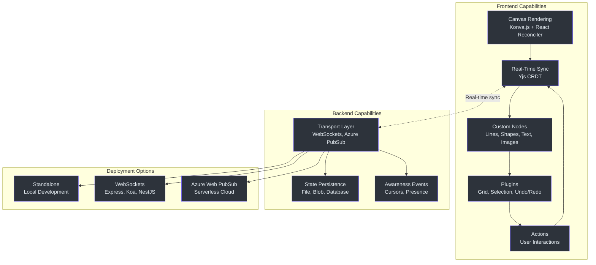
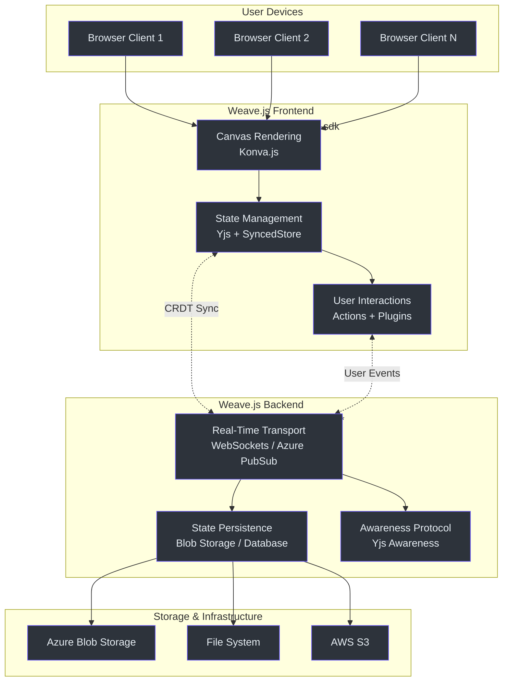
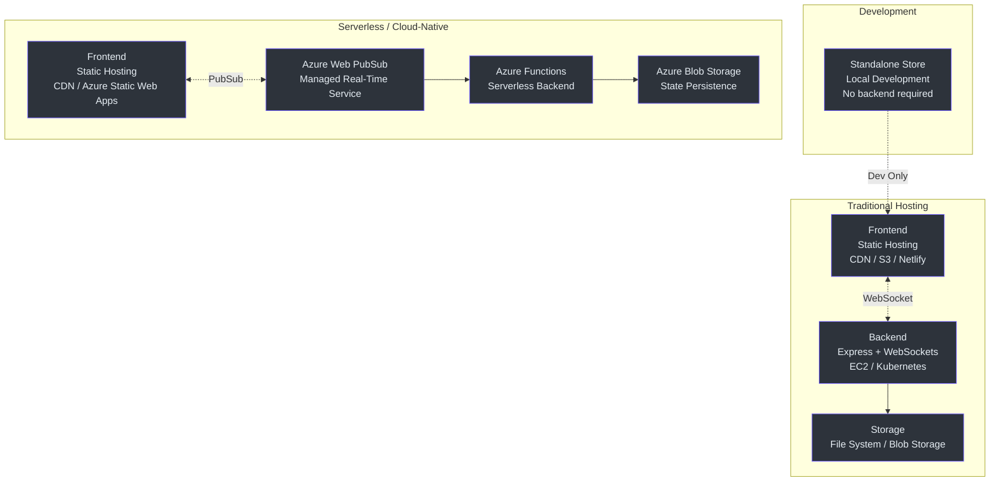

# Weave.js Executive Guide

## Overview

Weave.js is an **open-source TypeScript framework** for building **real-time collaborative canvas applications** — whiteboards, diagram editors, visual design tools, and flowchart builders. Developed by InditexTech and battle-tested in production at Inditex for the past four months, Weave.js provides a complete solution for organizations seeking to build collaborative visual experiences without vendor lock-in.

**License:** Apache-2.0 (fully open source)  
**Repository:** [github.com/InditexTech/weavejs](https://github.com/InditexTech/weavejs)  
**Status:** Production-ready (currently in use at Inditex internal applications)

### What Business Problems Does Weave.js Solve?

Organizations across industries need collaborative visual tools to enable distributed teams to work together in real time:

| Business Problem | Weave.js Solution |
|---|---|
| **High vendor costs** for SaaS collaboration tools (Miro, Lucidchart) | Self-hosted, open-source framework with no per-seat licensing fees |
| **Limited customization** in off-the-shelf whiteboard solutions | Fully extensible architecture — customize rendering, interactions, and state management |
| **Data sovereignty concerns** with cloud-only SaaS platforms | Complete control over data storage and transport — host anywhere (on-prem, AWS, Azure, GCP) |
| **Vendor lock-in** with proprietary APIs | Open-source codebase built on standards-compliant protocols (WebSockets, CRDT) |
| **Integration complexity** when embedding collaboration into existing products | Framework-agnostic design integrates with any tech stack (React, Vue, Angular, Svelte) |

Weave.js is ideal for:

- **Product teams** embedding collaborative whiteboards into existing SaaS platforms
- **Enterprises** building custom internal collaboration tools
- **Startups** creating visual collaboration products without infrastructure investment
- **Agencies** delivering bespoke collaboration solutions to clients

---

## Strategic Value Proposition

### For Organizations

| Benefit | Description |
|---|---|
| **Reduce TCO** | Eliminate per-seat SaaS costs; pay only for infrastructure |
| **Accelerate time-to-market** | Pre-built components for common use cases (drawing tools, selection, undo/redo) |
| **Retain control** | Own your data, customize every aspect, integrate deeply with existing systems |
| **De-risk vendor dependency** | Open-source under Apache-2.0 — no risk of vendor discontinuation or pricing changes |

### For Engineering Teams

| Benefit | Description |
|---|---|
| **Production-proven** | In use at Inditex (one of the world's largest fashion retailers) for 4+ months |
| **Modern stack** | TypeScript, React, Node.js — familiar technologies for most web teams |
| **Extensible architecture** | Plugin system for custom nodes, actions, and rendering behaviors |
| **Framework-agnostic** | Core SDK works with any frontend framework; React helpers included out-of-the-box |

---

## Capability Map

Weave.js provides a comprehensive set of capabilities for building collaborative canvas applications:

### Core Capabilities

| Capability | Description | Business Impact |
|---|---|---|
| **Canvas Rendering** | HTML5 Canvas-based rendering via Konva.js with React Reconciler for efficient updates | High-performance visual experiences comparable to native desktop applications |
| **Real-Time Collaboration** | Conflict-free replicated data types (CRDTs) via Yjs ensure consistency across distributed users | Users can collaborate simultaneously without conflicts or data loss |
| **Extensible Node System** | Create custom visual elements (shapes, connectors, text, images) with full lifecycle control | Tailor the visual vocabulary to your domain (e.g., UML diagrams, architecture diagrams, flowcharts) |
| **Plugin Architecture** | Extend framework behavior without modifying core (grid snapping, guides, rulers, minimap) | Add domain-specific features without forking the codebase |
| **Multiple Transport Options** | WebSockets (Express/Node.js), Azure Web PubSub (serverless), or custom implementations | Choose the right infrastructure for your scale and operational model |
| **State Persistence** | Pluggable storage backends (filesystem, Azure Blob, S3, databases) | Store collaboration data wherever your organization's policies require |
| **Awareness Events** | Share ephemeral data (cursor positions, user presence, selections) across clients | Improve user experience with social presence cues |

---

## System Context

Weave.js operates as a **full-stack framework** spanning frontend rendering, backend state management, and real-time transport:

---

## Technology Investment Thesis

### Why Weave.js is a Sound Technology Investment

| Factor | Assessment | Rationale |
|---|---|---|
| **Open Source (Apache-2.0)** | ✅ **Strong** | No vendor lock-in; full access to source code; permissive license allows commercial use |
| **Production-Proven** | ✅ **Strong** | Used in Inditex production applications for 4+ months; real-world validation |
| **Mature Foundations** | ✅ **Strong** | Built on battle-tested libraries (Yjs, Konva, React) with years of production use |
| **Active Maintenance** | ⚠️ **Moderate** | New open-source project (released Q1 2025); Inditex commitment demonstrated via roadmap |
| **Developer Experience** | ✅ **Strong** | TypeScript-first, comprehensive documentation, CLI scaffolding tools |
| **Extensibility** | ✅ **Strong** | Plugin architecture allows customization without core modifications |
| **Technology Stack** | ✅ **Strong** | Modern JavaScript/TypeScript stack familiar to most web developers |

### Key Dependencies

Weave.js relies on these core open-source libraries:

| Dependency | Role | Maturity | License |
|---|---|---|---|
| **Yjs** | Real-time state synchronization (CRDT) | Mature (5+ years, 13k+ GitHub stars) | MIT |
| **Konva.js** | HTML5 Canvas rendering | Mature (10+ years, 12k+ GitHub stars) | MIT |
| **React Reconciler** | Declarative canvas updates | Mature (part of React core) | MIT |
| **SyncedStore** | Developer-friendly Yjs API | Growing (3+ years, 2k+ GitHub stars) | MIT |

**Risk Assessment:** All core dependencies are well-established with permissive licenses and active communities.

---

## Deployment Architecture

Weave.js supports multiple deployment patterns to match your operational model:

### Deployment Options

| Pattern | Use Case | Pros | Cons |
|---|---|---|---|
| **Standalone** | Local development only | Zero infrastructure; fastest dev experience | Not suitable for production (no persistence) |
| **WebSockets + Express** | Traditional hosting (AWS, GCP, on-prem) | Full control; works anywhere Docker runs | Requires managing WebSocket connections at scale |
| **Azure Web PubSub** | Cloud-native / serverless | Auto-scaling; managed infrastructure; zero ops overhead | Azure-specific; higher per-message costs at scale |

**Recommended for Enterprises:** Start with WebSockets + Express for predictable costs and operational control; evaluate Azure Web PubSub for serverless benefits.

---

## Risk Assessment

### Identified Risks

| Risk | Severity | Likelihood | Mitigation |
|---|---|---|---|
| **Small Community** | Medium | High | Inditex backing provides stability; Apache-2.0 license allows forking if needed |
| **New Open Source Project** | Medium | Medium | Used in Inditex production; roadmap demonstrates commitment; active development |
| **Konva.js Dependency** | Low | Low | Konva is mature (10+ years) with active maintenance; can be replaced if needed (abstraction layer exists) |
| **Yjs Document Size Limits** | Low | Medium | Yjs handles millions of operations efficiently; archival strategies can be implemented for long-lived documents |
| **Learning Curve** | Medium | Medium | Comprehensive documentation; reference implementations; familiar tech stack (React, Node.js) |
| **Limited Cloud Providers** | Low | Low | WebSockets work universally; roadmap includes AWS/GCP support (Q2 2026) |

### Risk Mitigation Strategies

| Strategy | Description |
|---|---|
| **Fork Readiness** | Apache-2.0 license allows full forking if Inditex discontinues support |
| **Abstraction Layer** | Weave.js abstracts Konva rendering; switching to another canvas library (e.g., PixiJS) is technically feasible |
| **Document Archival** | Implement document snapshots/archival for long-lived collaboration sessions to manage Yjs document growth |
| **Incremental Adoption** | Start with a pilot project; validate scalability and developer experience before org-wide rollout |
| **Community Engagement** | Contribute back to Weave.js; join Inditex community channels; influence roadmap priorities |

---

## Competitive Landscape

### Comparison with Alternatives

| Feature | Weave.js | Excalidraw | tldraw | Miro SDK |
|---|---|---|---|---|
| **License** | Apache-2.0 (Open Source) | MIT (Open Source) | Apache-2.0 (Open Source) | Proprietary |
| **Business Model** | Free (self-hosted) | Free (self-hosted) | Free + Paid Cloud | Paid SaaS only |
| **Backend Included** | ✅ Yes (multiple stores) | ❌ No (frontend only) | ✅ Yes (tldraw sync) | ✅ Yes (managed) |
| **Real-Time Sync** | ✅ Yjs CRDT | ❌ Bring your own | ✅ Yjs CRDT | ✅ Proprietary |
| **Customization** | ✅ Full (plugin system) | ⚠️ Limited (fork required) | ✅ High (shape system) | ❌ SDK constraints |
| **Production Use** | ✅ Inditex (4+ months) | ✅ Excalidraw.com | ✅ tldraw.com | ✅ Enterprise SaaS |
| **Framework Support** | React (helpers) + agnostic | React only | React + agnostic | JavaScript SDK |
| **Deployment Control** | ✅ Full (self-hosted) | ✅ Full (self-hosted) | ⚠️ Self-hosted or SaaS | ❌ SaaS only |
| **Data Sovereignty** | ✅ Complete control | ✅ Complete control | ⚠️ SaaS option shares data | ❌ No control (SaaS) |

### When to Choose Weave.js Over Alternatives

| Scenario | Recommended Choice | Reason |
|---|---|---|
| Need full-stack solution (frontend + backend) | **Weave.js** | Includes backend stores; Excalidraw requires custom backend |
| Building a commercial product | **Weave.js** or **tldraw** | Apache-2.0 license allows commercial use; tldraw also strong |
| Need serverless/Azure integration | **Weave.js** | Native Azure Web PubSub support; tldraw focuses on own SaaS |
| Want simplest whiteboard UI out-of-the-box | **Excalidraw** | Best ready-made UI for sketching; less customizable |
| Enterprise SaaS with no ops | **Miro SDK** | Fully managed; no infrastructure; higher long-term costs |
| Need diagram-specific features (UML, flowcharts) | **Weave.js** | Extensible node system designed for custom diagram types |

### Positioning

**Weave.js occupies a unique position:**

- **More production-ready than Excalidraw** (includes backend)
- **More open than Miro SDK** (Apache-2.0, self-hosted)
- **More infrastructure-flexible than tldraw** (multiple transport options)
- **Backed by a major enterprise** (Inditex provides credibility and roadmap commitment)

---

## Related Projects & Ecosystem

### Official Repositories

| Repository | Purpose | Status |
|---|---|---|
| **[weavejs](https://github.com/InditexTech/weavejs)** | Core framework (monorepo) | Active |
| **[weavejs-frontend](https://github.com/InditexTech/weavejs-frontend)** | Reference frontend showcase (Next.js) | Active |
| **[weavejs-backend](https://github.com/InditexTech/weavejs-backend)** | Reference backend showcase (Express + Azure Blob) | Active |

### Packages in Monorepo

Weave.js is distributed as a monorepo with the following npm packages:

| Package | Description |
|---|---|
| `@inditextech/weave-sdk` | Core SDK (canvas rendering, nodes, plugins) |
| `@inditextech/weave-react` | React integration helpers |
| `@inditextech/weave-types` | TypeScript type definitions |
| `@inditextech/weave-store-websockets` | WebSockets store (client + server) |
| `@inditextech/weave-store-azure-web-pubsub` | Azure Web PubSub store (client + server) |
| `@inditextech/weave-store-standalone` | Standalone store (local development) |
| `create-weave-frontend-app` | CLI scaffolding for frontend projects |
| `create-weave-backend-app` | CLI scaffolding for backend projects |

### Community & Support

| Resource | URL |
|---|---|
| **Documentation** | [inditextech.github.io/weavejs](https://inditextech.github.io/weavejs) |
| **Live Demo** | [weavejs.cloud.inditex.com](https://weavejs.cloud.inditex.com) |
| **GitHub Issues** | [github.com/InditexTech/weavejs/issues](https://github.com/InditexTech/weavejs/issues) |
| **Contributing Guide** | [CONTRIBUTING.md](https://github.com/InditexTech/weavejs/blob/main/CONTRIBUTING.md) |

---

## Roadmap & Investment Timeline

Inditex has published a public roadmap demonstrating multi-year commitment:

| Quarter | Focus Area | Business Impact |
|---|---|---|
| **Q3 2025** | Mobile gesture support, Smart Guides plugin | Expand to mobile users; improve UX |
| **Q4 2025** | Connector Tool, Sticky Notes Tool | Richer diagramming capabilities |
| **Q1 2026** | Awareness enhancements, Comments plugin, Minimap | Improved collaboration experience |
| **Q2 2026** | AWS/GCP store support | Multi-cloud flexibility |
| **Q3 2026** | Koa, Fastify, NestJS server support | Broader framework compatibility |
| **Q4 2026** | Vue and Svelte bindings | Framework-agnostic vision realized |

**Strategic Implication:** Inditex is investing in long-term ecosystem growth, not a one-time open-source release.

---

## Decision Criteria

### When to Adopt Weave.js

| Criterion | Recommendation |
|---|---|
| **Need self-hosted collaboration** | ✅ Strong fit |
| **Data sovereignty requirements** | ✅ Strong fit |
| **Building a commercial product** | ✅ Strong fit (Apache-2.0) |
| **Tight integration with existing platform** | ✅ Strong fit (framework-agnostic) |
| **Need custom diagram types** | ✅ Strong fit (extensible node system) |
| **Want zero-ops SaaS** | ❌ Not a fit (consider Miro SDK) |
| **Need immediate mature ecosystem** | ⚠️ Moderate fit (new project; growing community) |

### Pilot Project Recommendations

For organizations evaluating Weave.js:

1. **Start with a pilot**: Build a non-critical internal tool (e.g., team brainstorming board, architecture diagram editor)
2. **Leverage reference implementations**: Clone `weavejs-frontend` and `weavejs-backend` as starting points
3. **Evaluate developer experience**: Measure time-to-first-feature and team feedback
4. **Test at scale**: Simulate realistic user loads (10-50 concurrent users per canvas)
5. **Assess extensibility**: Build 1-2 custom nodes/plugins to validate plugin API ergonomics

---

## Conclusion

**Weave.js represents a strategic opportunity** for organizations seeking to:

- **Reduce dependency on SaaS collaboration vendors** (cost savings + control)
- **Build differentiated collaborative experiences** (custom nodes + plugins)
- **Maintain data sovereignty** (self-hosted + flexible storage)
- **Leverage modern open-source infrastructure** (Apache-2.0 + mature dependencies)

**Key Takeaways:**

✅ **Production-proven** by a Fortune 500 company (Inditex)  
✅ **Full-stack solution** (frontend + backend + real-time transport)  
✅ **Extensible architecture** (plugin system + custom nodes)  
✅ **Permissive license** (Apache-2.0 allows commercial use)  
⚠️ **New open source** (released Q1 2025; growing community)  
⚠️ **Limited cloud providers** (currently Azure/WebSockets; AWS/GCP planned Q2 2026)

**Recommended Next Steps:**

1. Review [official documentation](https://inditextech.github.io/weavejs) and [architecture overview](../deep-dive/architecture.md)
2. Explore [live showcase](https://weavejs.cloud.inditex.com) to experience capabilities firsthand
3. Spin up a local development environment using `pnpm create weave-frontend-app` (5-minute setup)
4. Evaluate against your specific requirements using the decision criteria above
5. Engage with the Inditex team via GitHub issues or discussions

---

## Related Pages

| Page | Description |
|---|---|
| [Getting Started Overview](../getting-started/overview.md) | Developer quickstart guide |
| [Architecture Deep Dive](../deep-dive/architecture.md) | Technical architecture details |
| [Deployment Guide](../deployment/overview.md) | Production deployment strategies |
| [Store Comparison](../stores/comparison.md) | WebSockets vs Azure Web PubSub vs Standalone |
| [Competitive Analysis](../comparisons/alternatives.md) | Detailed feature comparison with alternatives |
