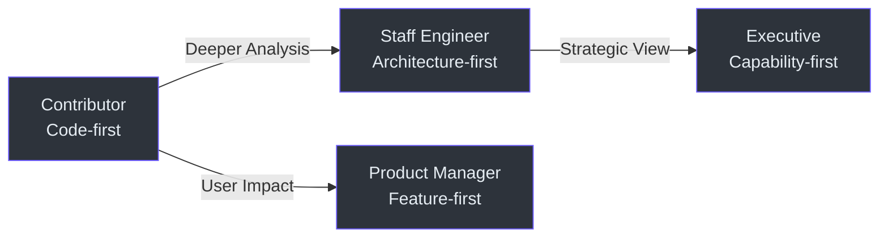

# Onboarding Guides

Welcome to Weave.js onboarding. This repository provides **four audience-specific guides** designed to meet you where you are — whether you're writing code, evaluating architecture, assessing investment, or planning features.

## Who This Is For

Each guide is tailored to a different role and depth of engagement:

- **Contributors** need hands-on setup, code patterns, and PR workflow
- **Staff Engineers** need architecture rationale, design tradeoffs, and technical debt assessment
- **Executives** need capability maps, risk profiles, and strategic alignment
- **Product Managers** need feature boundaries, user journeys, and integration points

## Audience Spectrum

<!-- Sources: Conceptual diagram — no specific source files -->

## Available Guides

| Guide | Audience | Focus | Technical Depth |
|-------|----------|-------|-----------------|
| **[Contributor Guide](./contributor-guide.md)** | Developers contributing code | Setup, architecture, patterns, first PR | High — code examples, file paths, commands |
| **[Staff Engineer Guide](./staff-engineer-guide.md)** | Senior engineers evaluating design | Architecture decisions, tradeoffs, technical debt | Very High — opinionated, dense, design-focused |
| **[Executive Guide](./executive-guide.md)** | Technical leadership | Capabilities, risks, investment thesis | None — strategic, no code |
| **[Product Manager Guide](./product-manager-guide.md)** | Product managers | Features, user journeys, limitations | None — zero jargon, user-centric |

## Quick Selection Guide

**Choose your guide based on what you need:**

### I want to...

- **Contribute code** → [Contributor Guide](./contributor-guide.md)
  - Learn TypeScript/JavaScript patterns used in Weave.js
  - Understand the module architecture and data flow
  - Set up the dev environment and run tests
  - Submit my first pull request

- **Evaluate architecture** → [Staff Engineer Guide](./staff-engineer-guide.md)
  - Understand design decisions and tradeoffs
  - Assess technical debt and complexity hotspots
  - Review extensibility and maintainability
  - Compare alternatives and technology choices

- **Assess strategic fit** → [Executive Guide](./executive-guide.md)
  - Map capabilities to business objectives
  - Understand risk profile and mitigation strategies
  - Evaluate technology investment and ROI
  - Plan integration with existing systems

- **Plan features** → [Product Manager Guide](./product-manager-guide.md)
  - Understand what Weave.js can and cannot do
  - Map user journeys to system capabilities
  - Identify integration points and dependencies
  - Define feature boundaries and limitations

## How These Guides Work

Each guide is **self-contained** — you don't need to read others first. They share the same codebase view but differ in:

- **Vocabulary**: Contributor uses code terms, Executive uses business terms
- **Depth**: Staff Engineer dives into every decision, Product Manager stays high-level
- **Structure**: Contributor follows workflow, Executive follows capability map
- **Artifacts**: Contributor shows code, Executive shows diagrams

## Next Steps

1. **Pick your guide** from the table above
2. **Bookmark related pages** — each guide links to relevant wiki sections
3. **Return here** when switching roles or perspectives

---

**Related Pages:**
- [Project Overview](../index.md) — High-level introduction to the Weave.js documentation
- [Architecture Overview](../02-architecture/overview.md) — Technical architecture deep-dive
- [Getting Started](../01-getting-started/overview.md) — Quick start guide for all users
