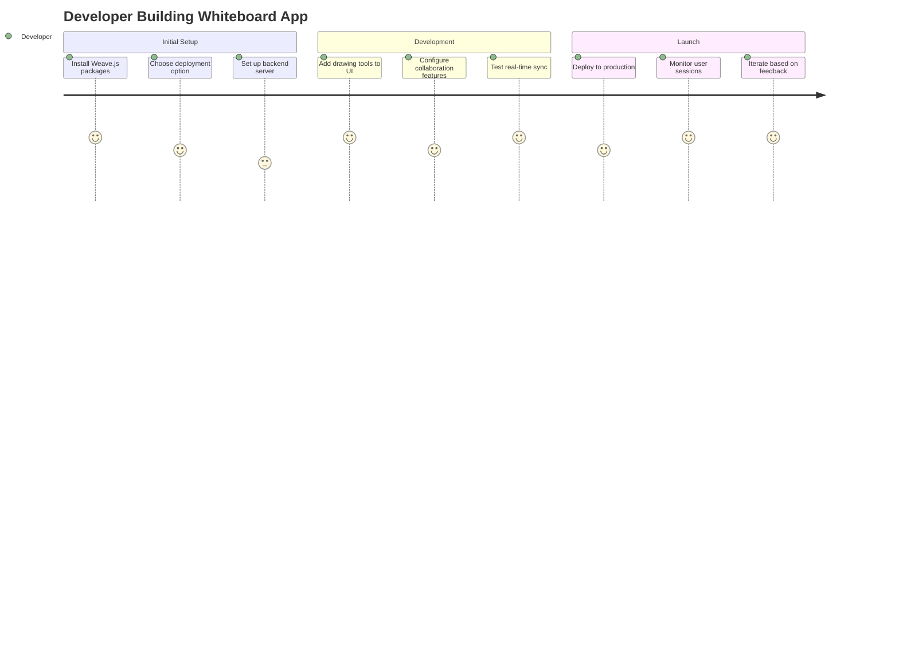
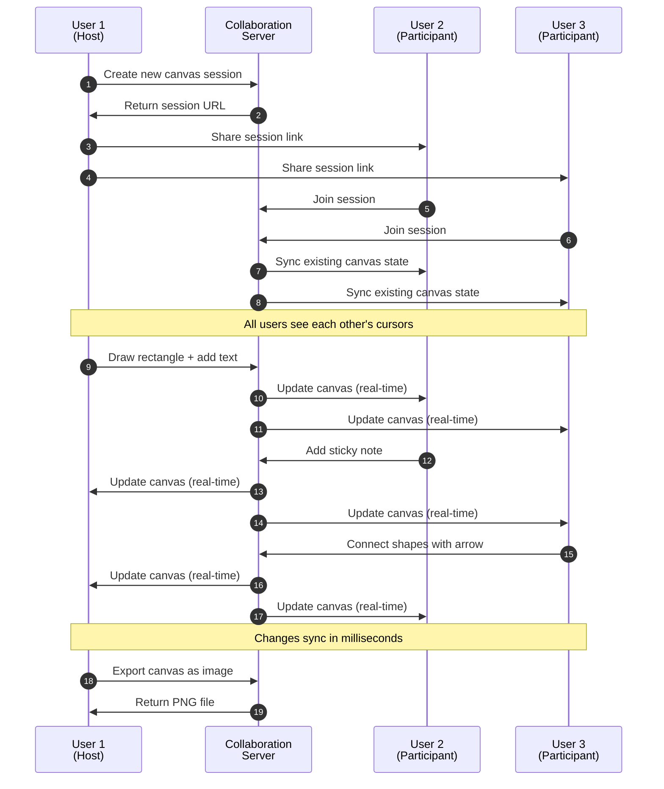
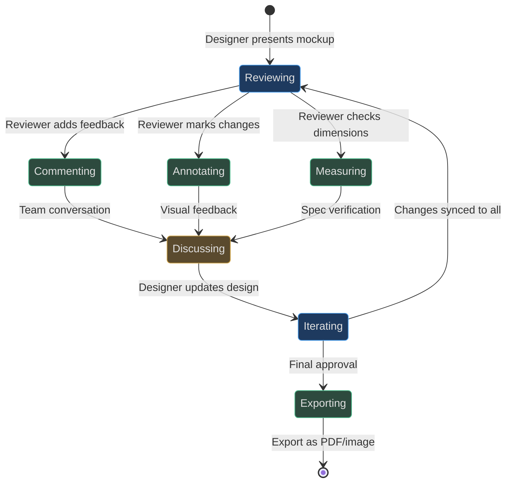
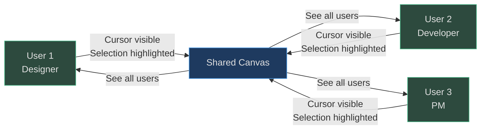
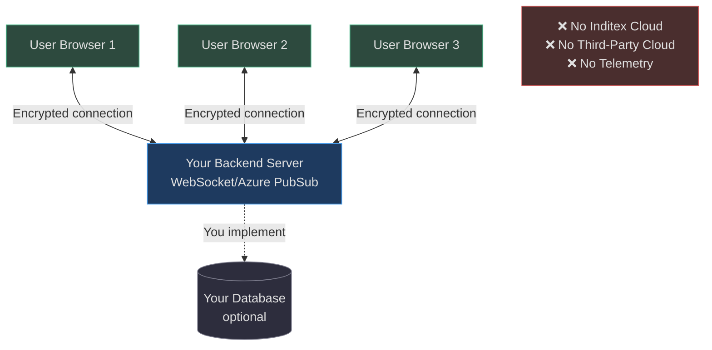
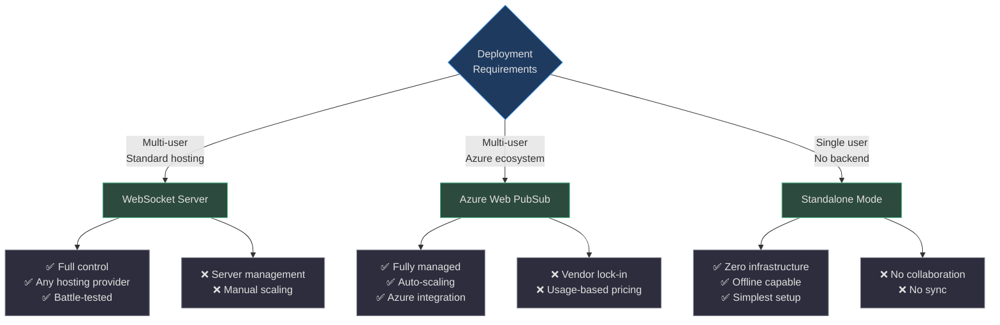

# Product Manager Guide to Weave.js

## What is Weave.js?

Weave.js is an open-source framework that enables developers to build **real-time collaborative whiteboard applications** similar to Miro, Figma, or Excalidraw. Think of it as the building blocks for creating visual collaboration tools where multiple users can draw, design, and interact on a shared canvas simultaneously.

**Key Value Propositions:**

- **Real-time collaboration**: Multiple users see each other's changes instantly
- **Rich visual tools**: Complete toolkit for drawing, annotations, and media
- **Self-hosted**: Full control over your data and infrastructure
- **Developer-friendly**: Pre-built components reduce time-to-market by months

## User Journeys

### Journey 1: Developer Building a Whiteboard Application

**Scenario**: A startup wants to add a collaborative design tool to their product offering.



<!-- Sources: README.md:63-91, code/packages/sdk/README.md:1-52, code/packages/react/README.md -->

**Timeline**: 1-2 weeks for basic implementation, 4-6 weeks for full-featured production app

**Outcome**: A working collaborative whiteboard with drawing tools, real-time sync, and multi-user support

---

### Journey 2: End-User Collaborating on a Canvas

**Scenario**: A distributed team brainstorming product ideas on a shared whiteboard.



<!-- Sources: code/packages/store-websockets/README.md, code/packages/sdk/src/plugins/users-presence, code/packages/sdk/src/plugins/users-pointers -->

**Key Experience Points**:
- Instant visibility of collaborators (cursors, selections)
- No manual refresh needed — changes appear automatically
- Conflict-free editing — multiple users can work simultaneously
- Export and save work at any time

---

### Journey 3: Team Using Real-Time Features

**Scenario**: A design team reviewing mockups with live feedback.



<!-- Sources: code/packages/sdk/src/nodes/comment, code/packages/sdk/src/nodes/measure, code/packages/sdk/src/managers/export -->

**Collaboration Features Used**:
- Comment threads for feedback
- Measurement tools for precision
- User presence indicators (who's viewing)
- Mutex locking (prevents edit conflicts)
- Undo/redo across all changes

## Feature Capability Map

### What Weave.js Enables

```mermaid
graph TB
    Weave[Weave.js Framework]
    
    Weave --> Drawing[Drawing & Shapes]
    Weave --> Collab[Collaboration]
    Weave --> Media[Media & Assets]
    Weave --> Tools[Canvas Tools]
    Weave --> Export[Export & Share]
    
    Drawing --> Shapes[Basic Shapes:<br>Rectangle, Ellipse,<br>Star, Polygon]
    Drawing --> Lines[Lines & Arrows]
    Drawing --> Freehand[Freehand Drawing:<br>Pen, Brush]
    Drawing --> Connect[Connectors:<br>Straight, Curved, Elbow]
    
    Collab --> Sync[Real-Time Sync]
    Collab --> Presence[User Awareness:<br>Cursors, Selections]
    Collab --> Lock[Mutex Locking]
    Collab --> History[Undo/Redo]
    
    Media --> Images[Images]
    Media --> Videos[Videos]
    Media --> Text[Text & Comments]
    
    Tools --> Selection[Select & Move]
    Tools --> Group[Grouping]
    Tools --> Frame[Frames<br>(organize content)]
    Tools --> Measure[Measure Distances]
    Tools --> Grid[Grid & Snapping]
    Tools --> Zoom[Pan & Zoom]
    
    Export --> PNG[Export to PNG]
    Export --> PDF[Export to PDF]
    Export --> Clipboard[Copy/Paste]
    
    style Weave fill:#1e3a5f,stroke:#4a9eed,color:#e0e0e0
    style Drawing fill:#2d4a3e,stroke:#4aba8a,color:#e0e0e0
    style Collab fill:#2d4a3e,stroke:#4aba8a,color:#e0e0e0
    style Media fill:#2d4a3e,stroke:#4aba8a,color:#e0e0e0
    style Tools fill:#2d4a3e,stroke:#4aba8a,color:#e0e0e0
    style Export fill:#2d4a3e,stroke:#4aba8a,color:#e0e0e0
    style Shapes fill:#2d2d3d,stroke:#7a7a8a,color:#e0e0e0
    style Lines fill:#2d2d3d,stroke:#7a7a8a,color:#e0e0e0
    style Freehand fill:#2d2d3d,stroke:#7a7a8a,color:#e0e0e0
    style Connect fill:#2d2d3d,stroke:#7a7a8a,color:#e0e0e0
    style Sync fill:#2d2d3d,stroke:#7a7a8a,color:#e0e0e0
    style Presence fill:#2d2d3d,stroke:#7a7a8a,color:#e0e0e0
    style Lock fill:#2d2d3d,stroke:#7a7a8a,color:#e0e0e0
    style History fill:#2d2d3d,stroke:#7a7a8a,color:#e0e0e0
    style Images fill:#2d2d3d,stroke:#7a7a8a,color:#e0e0e0
    style Videos fill:#2d2d3d,stroke:#7a7a8a,color:#e0e0e0
    style Text fill:#2d2d3d,stroke:#7a7a8a,color:#e0e0e0
    style Selection fill:#2d2d3d,stroke:#7a7a8a,color:#e0e0e0
    style Group fill:#2d2d3d,stroke:#7a7a8a,color:#e0e0e0
    style Frame fill:#2d2d3d,stroke:#7a7a8a,color:#e0e0e0
    style Measure fill:#2d2d3d,stroke:#7a7a8a,color:#e0e0e0
    style Grid fill:#2d2d3d,stroke:#7a7a8a,color:#e0e0e0
    style Zoom fill:#2d2d3d,stroke:#7a7a8a,color:#e0e0e0
    style PNG fill:#2d2d3d,stroke:#7a7a8a,color:#e0e0e0
    style PDF fill:#2d2d3d,stroke:#7a7a8a,color:#e0e0e0
    style Clipboard fill:#2d2d3d,stroke:#7a7a8a,color:#e0e0e0
```

<!-- Sources: code/packages/sdk/src/actions (all tool files), code/packages/sdk/src/nodes (all node types), code/packages/sdk/src/plugins (all plugin files) -->

### Feature Comparison Table

| Feature Category | Capabilities | Use Cases |
|---|---|---|
| **Drawing Tools** | Rectangles, ellipses, stars, polygons, lines, arrows, freehand strokes | Diagrams, sketches, wireframes, flowcharts |
| **Connectors** | Straight, curved, elbow lines with arrow decorations | System diagrams, flowcharts, process maps |
| **Media** | Images, videos embedded on canvas | Product mockups, presentations, mood boards |
| **Text & Comments** | Text annotations, threaded comments | Feedback, notes, labeling |
| **Organization** | Groups (combine shapes), frames (section canvas) | Complex diagrams, multi-page layouts |
| **Collaboration** | Real-time sync, user cursors, mutex locking, user presence | Team brainstorming, remote workshops |
| **Canvas Navigation** | Pan, zoom, grid snapping, distance guides | Precision work, large canvases |
| **History** | Undo/redo with full history tracking | Error recovery, experimentation |
| **Export** | PNG, PDF export of canvas or selected items | Documentation, presentations, handoffs |

## Built-In Shapes and Tools

### Visual Elements

| Shape/Tool | Description | Primary Use |
|---|---|---|
| **Rectangle** | Standard rectangular shapes with rounded corners | Boxes, buttons, containers |
| **Ellipse** | Circles and ovals | Diagrams, icons, emphasis |
| **Star** | Multi-point star shapes | Icons, decorations, ratings |
| **Polygon** | Regular polygons (triangle, hexagon, etc.) | Technical diagrams, custom shapes |
| **Arrow** | Directional arrows | Flow indicators, pointers |
| **Line** | Straight lines | Connections, underlines, dividers |
| **Stroke** | Freehand drawing (pen, brush) | Sketching, annotations, signatures |
| **Connector** | Smart lines that connect shapes | Flowcharts, org charts, diagrams |
| **Text** | Editable text labels | Annotations, titles, descriptions |
| **Comment** | Threaded comment markers | Feedback, reviews, questions |
| **Frame** | Container for grouping content | Sections, pages, artboards |
| **Image** | Raster images (PNG, JPG, SVG) | Photos, logos, mockups |
| **Video** | Embedded video players | Demos, tutorials, reference materials |
| **Measure** | Distance measurement tool | Precision design, specifications |

<!-- Sources: code/packages/sdk/src/nodes/rectangle, code/packages/sdk/src/nodes/ellipse, code/packages/sdk/src/nodes/star, code/packages/sdk/src/nodes/regular-polygon, code/packages/sdk/src/nodes/arrow, code/packages/sdk/src/nodes/line, code/packages/sdk/src/nodes/stroke, code/packages/sdk/src/nodes/connector, code/packages/sdk/src/nodes/text, code/packages/sdk/src/nodes/comment, code/packages/sdk/src/nodes/frame, code/packages/sdk/src/nodes/image, code/packages/sdk/src/nodes/video, code/packages/sdk/src/nodes/measure -->

### Interaction Tools

| Tool | Function | User Benefit |
|---|---|---|
| **Selection** | Click to select, drag to move | Basic manipulation |
| **Move** | Pan across canvas | Navigation on large boards |
| **Zoom** | Zoom in/out | Detail work or overview |
| **Brush** | Freehand drawing with variable width | Artistic expression, sketching |
| **Pen** | Precise freehand lines | Technical sketches, signatures |
| **Eraser** | Remove strokes | Correction, refinement |
| **Align** | Align multiple shapes (left, center, right) | Professional layouts |
| **Fit to Screen** | Auto-zoom to show all content | Quick overview |
| **Fit to Selection** | Zoom to selected items | Focus on specific area |

<!-- Sources: code/packages/sdk/src/actions/selection-tool, code/packages/sdk/src/actions/move-tool, code/packages/sdk/src/actions/pen-tool, code/packages/sdk/src/actions/brush-tool, code/packages/sdk/src/actions/eraser-tool, code/packages/sdk/src/actions/align-nodes-tool, code/packages/sdk/src/actions/fit-to-screen-tool, code/packages/sdk/src/actions/fit-to-selection-tool -->

## Collaboration Features

### Real-Time Synchronization

**How it works**: When User A draws a shape, User B sees it appear within milliseconds. All changes sync automatically across all connected users.

**Technology**: Powered by Yjs (a technology designed for real-time collaboration). Data changes are sent as small updates rather than full state transfers, making sync extremely fast.

**User Experience**:
- No "save" button needed — everything auto-saves
- Works even with dozens of simultaneous users
- Recovers gracefully if connection drops temporarily

<!-- Sources: code/packages/sdk/src/stores, code/packages/sdk/README.md:9, README.md:48 -->

---

### User Awareness (Presence)



<!-- Sources: code/packages/sdk/src/plugins/users-presence, code/packages/sdk/src/plugins/users-pointers, code/packages/sdk/src/plugins/users-selection -->

**Presence Features**:
- **User Cursors**: See where collaborators are pointing in real-time
- **Selections**: Highlighted outlines show what each user is working on
- **User List**: Panel showing all connected participants
- **Color Coding**: Each user has a unique color for their cursor and selections

**Business Value**: Reduces confusion, improves coordination, creates engaging collaborative experience

---

### Mutex Locking (Conflict Prevention)

**Problem Solved**: When two users try to edit the same object simultaneously, chaos ensues.

**Solution**: Weave.js uses "mutex locking" — when User A starts editing a shape, User B is temporarily blocked from editing that same shape. User B sees a visual indicator that the shape is "in use."

**User Impact**:
- Prevents overwriting each other's work
- Clear visual feedback (locked items show differently)
- Minimal disruption — locks release automatically when editing stops

<!-- Sources: code/packages/sdk/src/managers/mutex -->

---

### Room-Based Collaboration

**Concept**: Each whiteboard session is a "room" — a unique space where users collaborate.

**User Flow**:
1. User creates a new room (gets a unique URL or room ID)
2. User shares URL with collaborators
3. Collaborators join the room via URL
4. Everyone sees the same canvas in real-time

**Scalability**: Rooms are isolated — 10,000 users across 1,000 rooms is just 10 users per room (not 10,000 connections to manage)

<!-- Sources: code/packages/store-websockets/README.md, code/packages/store-azure-web-pubsub/README.md -->

## Limitations and Trade-offs

### Technical Requirements

| Requirement | Implication | Workaround |
|---|---|---|
| **Requires React 18** | Must use React framework (not Vue, Angular, etc.) | None currently — future: Vue/Svelte bindings planned for 2026 |
| **Canvas-only rendering** | Uses HTML5 Canvas (not SVG or DOM) | Excellent performance, but limited browser accessibility |
| **Backend server required** | Can't run multi-user mode purely in browser | Standalone mode available for single-user (no backend) |
| **No built-in persistence** | Weave.js doesn't save canvas data to disk/database | Developers must implement saving (examples provided) |

<!-- Sources: README.md:56-61, code/packages/store-standalone/README.md -->

---

### Known Constraints

**No Built-In Cloud Storage**:
- Weave.js focuses on real-time sync, not storage
- Developers must implement saving to their own database
- **Why**: Keeps framework lightweight, avoids vendor lock-in

**Canvas Rendering**:
- Not screen-reader friendly (accessibility limited)
- **Trade-off**: Canvas enables smooth 60fps performance for thousands of shapes

**Browser Performance**:
- Very large canvases (10,000+ objects) may slow down on older devices
- **Mitigation**: Frames and layers help organize content

**Mobile Support**:
- Touch gestures work, but optimizations in progress (Q3 2025 roadmap)
- **Current State**: Best experience on desktop, functional on mobile

<!-- Sources: README.md:42, README.md:101-112 -->

## Data, Privacy, and Security

### Data Flow

All canvas data synchronizes via **Yjs**, a technology that enables:
- **Peer-to-peer capable**: Users can connect directly (no central server required)
- **Encrypted transport**: Data travels over secure WebSocket connections
- **No cloud dependency**: You control where data lives

**Data Storage**:
- Canvas state exists in memory on the server
- Persistence (saving to database) is your responsibility
- No data leaves your infrastructure unless you configure it to

<!-- Sources: code/packages/sdk/README.md:9, README.md:48 -->

---

### Privacy Model



<!-- Sources: README.md:48, code/packages/store-websockets/README.md, code/packages/store-azure-web-pubsub/README.md -->

**Privacy Guarantees**:
- **Self-hosted**: You control the infrastructure
- **No telemetry**: Weave.js sends no usage data to InditexTech
- **Data ownership**: All data stays on your servers
- **Open source**: Full transparency (audit the code yourself)

**Compliance Considerations**:
- GDPR: You control data retention and deletion
- Data residency: Deploy in any region you choose
- Security audits: Audit the open-source code or hire third-party auditors

<!-- Sources: LICENSE, README.md:129-132 -->

## Deployment Options

### Option 1: WebSocket Server (Most Common)

**Best For**: Standard web apps, internal tools, production deployments

**How It Works**:
1. Backend server (Express.js or Koa) runs WebSocket endpoint
2. Frontend connects to WebSocket for real-time sync
3. Server coordinates all users in a room

**Pros**:
- Battle-tested, reliable
- Full control over server configuration
- Works with any hosting provider

**Cons**:
- Requires server management
- You handle scaling

**Example Tech Stack**:
- Frontend: React app (with Weave.js React package)
- Backend: Node.js + Express.js + Weave.js WebSocket store
- Hosting: AWS, Google Cloud, Azure, or any VPS

<!-- Sources: code/packages/store-websockets/README.md:1-71, README.md:67-91 -->

---

### Option 2: Azure Web PubSub (Serverless)

**Best For**: Azure customers, serverless deployments, scalability without ops overhead

**How It Works**:
1. Azure Web PubSub service handles all WebSocket connections
2. Your backend server just validates users and manages permissions
3. Azure auto-scales to handle traffic spikes

**Pros**:
- Fully managed — no WebSocket server to maintain
- Auto-scaling built-in
- Azure integration (authentication, monitoring)

**Cons**:
- Locked into Azure ecosystem
- Usage-based pricing (can get expensive at scale)

**Deployment Architecture**:
- Frontend: React app (hosted on Azure Static Web Apps or App Service)
- Backend: Minimal Express.js server (validates users, issues tokens)
- Collaboration: Azure Web PubSub service (fully managed)

<!-- Sources: code/packages/store-azure-web-pubsub/README.md:1-71 -->

---

### Option 3: Standalone (Single User)

**Best For**: Offline apps, local tools, single-player mode

**How It Works**:
- No backend server required
- All canvas state lives in browser memory
- No real-time collaboration (single user only)

**Pros**:
- Zero infrastructure costs
- Works completely offline
- Simplest possible setup

**Cons**:
- No multi-user support
- No cross-device sync

**Use Cases**:
- Prototyping/demos
- Offline design tools
- Desktop apps (Electron wrapper)

<!-- Sources: code/packages/store-standalone/README.md:1-50 -->

---

### Deployment Comparison



<!-- Sources: code/packages/store-websockets/README.md, code/packages/store-azure-web-pubsub/README.md, code/packages/store-standalone/README.md -->

| Decision Factor | WebSocket Server | Azure Web PubSub | Standalone |
|---|---|---|---|
| **Multi-user collaboration** | ✅ Yes | ✅ Yes | ❌ No |
| **Infrastructure complexity** | Medium | Low | None |
| **Hosting cost** | Fixed (server) | Variable (usage-based) | $0 |
| **Scalability** | Manual | Automatic | N/A |
| **Vendor lock-in** | None | Azure only | None |
| **Best for** | Production apps | Azure customers | Prototypes, offline tools |

## Getting Started Resources

### Quick Start (30 Minutes)

1. **Create Backend** (5 minutes)
   - Run setup command to generate WebSocket server
   - Start backend on local machine
   
2. **Create Frontend** (5 minutes)
   - Run setup command to generate React app
   - Install dependencies
   
3. **Test Collaboration** (10 minutes)
   - Open app in two browser windows
   - Draw in one window, see it appear in the other
   - Test cursors, selections, real-time sync
   
4. **Explore Tools** (10 minutes)
   - Try all drawing tools
   - Test comments, grouping, export features
   - Experiment with collaboration

<!-- Sources: README.md:63-91 -->

**Next Steps**:
- Customize UI to match your brand
- Add authentication and user management
- Implement canvas saving to your database
- Deploy to staging environment

---

### Documentation and Support

- **Full Documentation**: [Official Docs](https://inditextech.github.io/weavejs)
- **Live Demo**: [Try Weave.js](https://weavejs.cloud.inditex.com/)
- **Architecture Guide**: [Technical Overview](https://inditextech.github.io/weavejs/docs/main/architecture)
- **GitHub Repository**: [Source Code](https://github.com/InditexTech/weavejs)
- **Issue Tracker**: [Report Bugs / Request Features](https://github.com/InditexTech/weavejs/issues)

<!-- Sources: README.md:25-35, README.md:143-154 -->

---

### Roadmap Highlights (2025-2026)

| Quarter | Planned Features |
|---|---|
| **Q3 2025** | Mobile gesture improvements, Smart Guides plugin |
| **Q4 2025** | Connector tool enhancements, Sticky Notes tool |
| **Q1 2026** | Awareness improvements, Comment plugin v2, Minimap plugin |
| **Q2 2026** | Support for other cloud providers (AWS, GCP) |
| **Q3 2026** | Koa server, Fastify server, NestJS server support |
| **Q4 2026** | Vue.js bindings, Svelte bindings |

<!-- Sources: README.md:101-112 -->

**Why This Matters**: Weave.js is actively developed with a clear roadmap, not abandoned open-source.

---

## Related Pages

| Page | Description |
|---|---|
| [Overview](../getting-started/overview.md) | High-level introduction to Weave.js |

---

## License and Open Source

**License**: Apache 2.0 (permissive open source)

**What This Means**:
- ✅ Free to use commercially
- ✅ Modify the code as needed
- ✅ No royalties or licensing fees
- ✅ Can create proprietary products using Weave.js

**Maintained By**: InditexTech (the technology arm of Inditex, parent company of Zara)

**Community**: Active contributors, responsive maintainers, welcoming to new contributors

<!-- Sources: LICENSE, README.md:129-132, CONTRIBUTING.md -->

---

## Frequently Asked Questions

**Q: Can I use Weave.js for commercial products?**  
A: Yes. Apache 2.0 license permits commercial use without restrictions.

**Q: Do I need to be a React expert to use Weave.js?**  
A: Basic React knowledge helps, but the examples are beginner-friendly. Most complexity is abstracted away.

**Q: How many users can collaborate on one canvas?**  
A: Tested with dozens of simultaneous users. Performance depends on your backend infrastructure.

**Q: Can I save canvas history and enable versioning?**  
A: Yes, but you must implement it. Weave.js provides the real-time sync; you handle persistence.

**Q: Is there a hosted/SaaS version?**  
A: No. Weave.js is self-hosted only. This gives you full control but requires your own infrastructure.

**Q: What browsers are supported?**  
A: All modern browsers (Chrome, Firefox, Safari, Edge). Mobile browsers work but optimizations are in progress.

---

**Last Updated**: 2025-02-13  
**Framework Version**: Weave.js v1.x  
**Documentation Source**: [https://github.com/thegovind/weavejs](https://github.com/thegovind/weavejs)
